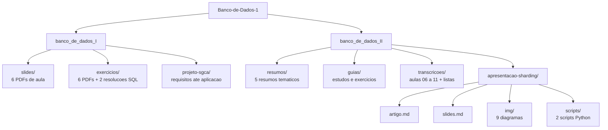
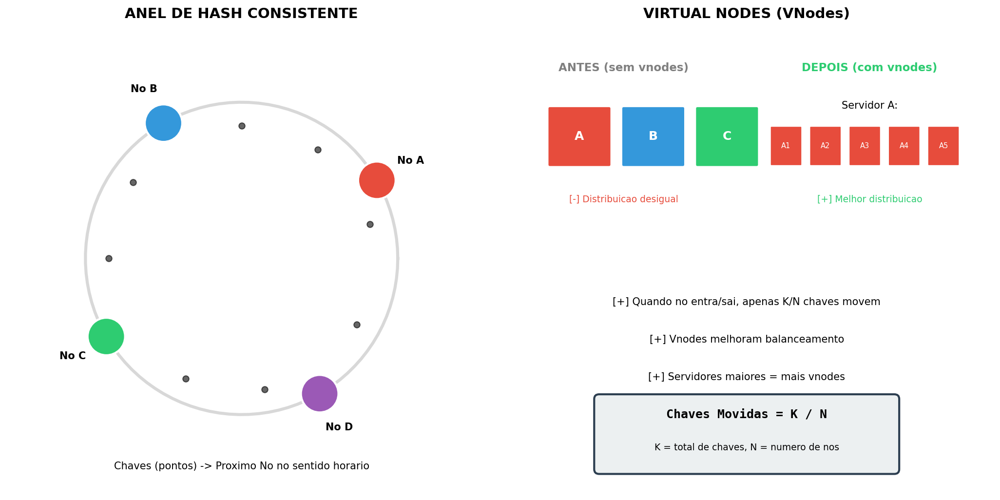

# Banco de Dados I e II

Anotações, resumos, listas resolvidas e trabalhos das disciplinas de Banco de Dados
I e II da graduação.

[](LICENSE)
[](https://github.com/RxSaturn/Banco-de-Dados-1/actions/workflows/lint.yml)
[](https://www.python.org/)
[](https://www.postgresql.org/)
[](https://github.com/RxSaturn/Banco-de-Dados-1/commits/main)

---

## Sumário

- [O que é](#o-que-é)
- [Estrutura](#estrutura)
- [Banco de Dados I](#banco-de-dados-i)
- [Banco de Dados II](#banco-de-dados-ii)
- [Trabalho de Sharding](#trabalho-de-sharding)
- [Como rodar os scripts](#como-rodar-os-scripts)
- [Tecnologias](#tecnologias)
- [Escopo e limites](#escopo-e-limites)
- [Licença e créditos](#licença-e-créditos)

---

## O que é

Este repositório guarda o material que produzi ao longo de duas disciplinas de banco
de dados. Ele cobre o caminho completo da área: da modelagem conceitual e da
normalização, em Banco de Dados I, até índices, avaliação de consultas, transações e
sistemas distribuídos, em Banco de Dados II.

O conteúdo é de estudo, não uma biblioteca de software. O valor está nos resumos, nas
listas resolvidas e no projeto de banco modelado do começo ao fim. Os dois scripts
Python existem para gerar os diagramas de um trabalho específico, e não formam uma
aplicação.

> [!NOTE]
> Todo o texto está em português. Código, comandos e nomes de arquivo usam apenas
> ASCII, para não quebrar ferramentas de linha de comando.

---

## Estrutura



---

## Banco de Dados I

Modelagem, do modelo entidade-relacionamento até a normalização.

| Pasta | Conteúdo |
|---|---|
| [`slides/`](banco_de_dados_I/slides/) | Slides de aula, da introdução à normalização |
| [`exercicios/`](banco_de_dados_I/exercicios/) | Listas 01 a 06 e duas resoluções minhas |
| [`projeto-sgca/`](banco_de_dados_I/projeto-sgca/) | Projeto do Sistema de Calendários Acadêmicos |

**Resoluções escritas por mim:**

- [Exercício 1 — 15 views a partir de consultas SQL](banco_de_dados_I/exercicios/exercicio-01-views-sql.md)
- [Exercício 2 — triggers e functions para automação](banco_de_dados_I/exercicios/exercicio-02-triggers-sql.md)

**Projeto SGCA**, um sistema de confecção de calendários acadêmicos, documentado em
quatro etapas na ordem em que foi construído:

1. [Requisitos](banco_de_dados_I/projeto-sgca/00-requisitos.md)
2. [Modelagem](banco_de_dados_I/projeto-sgca/01-modelagem.md)
3. [Criação do banco](banco_de_dados_I/projeto-sgca/02-criacao-do-banco.md)
4. [Aplicação conectada ao banco](banco_de_dados_I/projeto-sgca/03-aplicacao.md)

---

## Banco de Dados II

Estruturas internas do banco: como os dados ficam em disco, como o sistema acha um
registro, como executa uma consulta e como sobrevive a uma falha.

### Resumos

Leia nesta ordem. Cada um parte do anterior.

| # | Resumo | Assunto |
|---|---|---|
| 00 | [Introdução e conclusão](banco_de_dados_II/resumos/00-introducao-e-conclusao.md) | Visão geral da disciplina |
| 01 | [Introdução a índices](banco_de_dados_II/resumos/01-introducao-a-indices.md) | Organização de arquivos |
| 02 | [Armazenamento e memória](banco_de_dados_II/resumos/02-armazenamento-e-memoria.md) | Hierarquia de memória, disco |
| 03 | [Índices em árvore](banco_de_dados_II/resumos/03-indices-em-arvore.md) | B-Tree e B+Tree |
| 04 | [Índices hash](banco_de_dados_II/resumos/04-indices-hash.md) | Hash estático e dinâmico |

### Guias

- [Guia de estudos avançados](banco_de_dados_II/guias/guia-de-estudos-avancados.md)
- [Guia de exercícios](banco_de_dados_II/guias/guia-de-exercicios.md)

### Transcrições de aula

[`transcricoes/`](banco_de_dados_II/transcricoes/) cobre as aulas 06 a 11: álgebra
relacional, avaliação de consultas, ordenação externa, operadores relacionais,
gerenciamento de transações e recuperação de falhas. As listas resolvidas 6 a 11
ficam em [`transcricoes/exercicios/`](banco_de_dados_II/transcricoes/exercicios/).

> [!NOTE]
> As transcrições vieram de conversão automática de PDF. O texto é fiel ao conteúdo,
> mas a formatação é irregular em alguns trechos.

---

## Trabalho de Sharding

Trabalho em grupo sobre **Sharding e Particionamento em Bancos de Dados
Distribuídos**, em [`apresentacao-sharding/`](banco_de_dados_II/apresentacao-sharding/).

Autores: Henrique Augusto, Henrique Evangelista, Rayssa Mendes.

| Arquivo | O que é |
|---|---|
| [`artigo.md`](banco_de_dados_II/apresentacao-sharding/artigo.md) | Texto completo do trabalho |
| [`slides.md`](banco_de_dados_II/apresentacao-sharding/slides.md) | Roteiro da apresentação, com os 9 diagramas |
| [`img/`](banco_de_dados_II/apresentacao-sharding/img/) | Diagramas em PNG, gerados por script |
| [`scripts/`](banco_de_dados_II/apresentacao-sharding/scripts/) | Código que gera os diagramas e simula consistent hashing |

O trabalho cobre escala vertical contra horizontal, as estratégias de
particionamento, consistent hashing com virtual nodes, o teorema CAP, roteamento de
consultas e o caso real do Instagram.



---

## Como rodar os scripts

Os dois scripts precisam de `matplotlib` e `numpy`.

```bash
pip install matplotlib numpy
```

**Gerar os 9 diagramas da apresentação.** As imagens vão para `img/`, e o script
funciona a partir de qualquer diretório.

```bash
python3 banco_de_dados_II/apresentacao-sharding/scripts/generate_diagrams.py
```

**Simular consistent hashing** com 1000 chaves e 4 nós. O script imprime a
distribuição, remove um nó e mede quantas chaves precisaram mudar de lugar.

```bash
cd banco_de_dados_II/apresentacao-sharding/scripts/
python3 consistent_hashing_visualization.py
```

A simulação move cerca de 25% das chaves quando um nó de quatro cai, que é o valor
esperado de `1/N`. Com hashing tradicional por módulo, quase todas as chaves
mudariam de lugar.

**Verificar os links dos documentos**, o mesmo comando que o CI executa:

```bash
python3 .github/scripts/check_links.py
```

---

## Tecnologias

| Área | O que foi usado |
|---|---|
| Banco de dados | PostgreSQL, SQL, álgebra relacional |
| Modelagem | Modelo entidade-relacionamento, modelo relacional, normalização |
| Scripts | Python 3.11+, matplotlib, numpy |
| Automação | GitHub Actions, ruff, Dependabot |

---

## Escopo e limites

Este é um repositório de curso. Vale dizer o que ele não é:

- **Não é uma biblioteca.** Nada aqui é instalável ou importável.
- **Não tem testes.** Os dois scripts geram figuras e imprimem uma simulação. Não há
  suíte de testes, e o CI roda apenas lint e verificação de links.
- **O SQL não foi executado contra um banco nesta sessão.** As consultas, views e
  triggers foram escritas para PostgreSQL durante a disciplina.
- **As transcrições têm formatação irregular**, pelo motivo já explicado acima.

---

## Licença e créditos

O material próprio está sob [CC BY-NC-SA 4.0](LICENSE).

> [!IMPORTANT]
> A licença **não cobre o repositório inteiro**. Os PDFs de slides e de listas são
> material de aula do docente, e os direitos são dele. O trabalho de Sharding tem
> três autores. Leia [NOTICE.md](NOTICE.md) antes de reutilizar qualquer parte.

**Como citar:**

```
RxSaturn. Banco de Dados I e II — anotações de curso.
https://github.com/RxSaturn/Banco-de-Dados-1
Licenciado sob CC BY-NC-SA 4.0, exceto onde indicado em NOTICE.md.
```
