## 2. Armazenamento de Dados e Hierarquia de Memória

### 💾 Hierarquia de Memória em SGBD

**Metáfora do Escritório:**

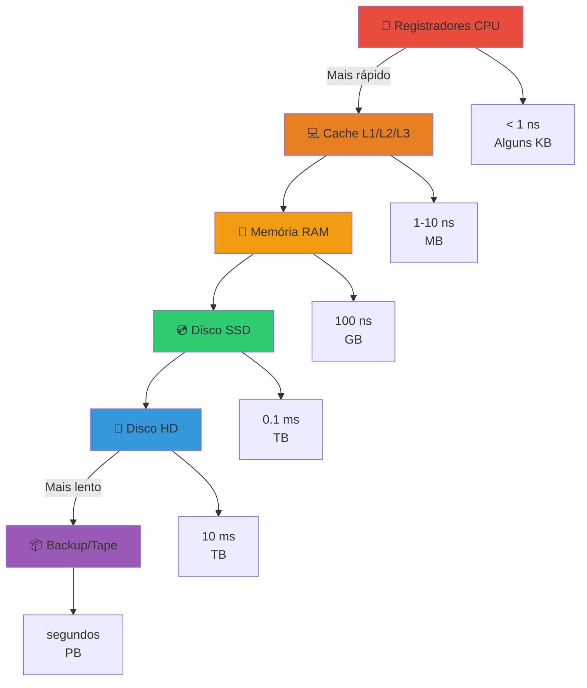

#### 2.1 Diferenças entre Tipos de Armazenamento

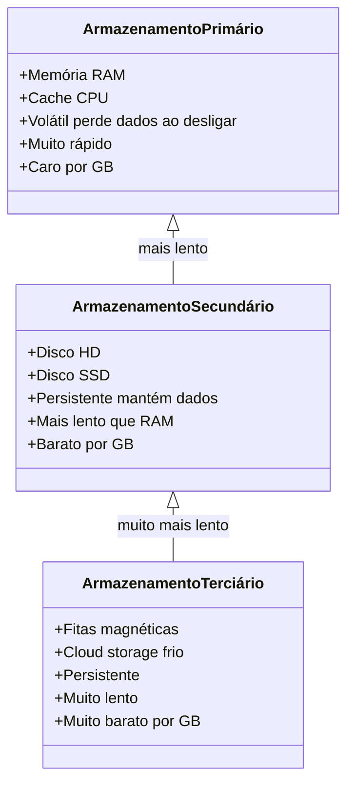

**Comparação Prática:**

| Tipo | Tecnologia | Velocidade | Capacidade | Custo/GB | Persistente? |
|------|------------|------------|------------|----------|--------------|
| **Primário** | RAM | 100 ns | 8-128 GB | $5-10 | ❌ Volátil |
| **Secundário** | SSD | 0.1 ms | 256GB-4TB | $0.10-0.20 | ✅ Persistente |
| **Secundário** | HD | 10 ms | 1-20 TB | $0.02-0.05 | ✅ Persistente |
| **Terciário** | Tape | 1-60 s | 1-50 TB | $0.001-0.01 | ✅ Persistente |

### 🗄️ Por que SGBD usa Disco Amplamente?

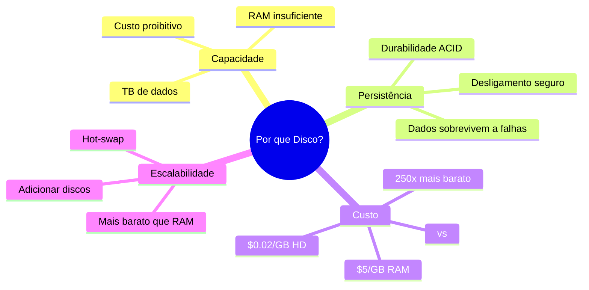

**Vantagens do Disco:**

1. **Persistência:** Dados não são perdidos ao desligar
2. **Capacidade:** Armazena TB a custo baixo
3. **Durabilidade:** Backups e recovery
4. **Econômico:** 100-250x mais barato que RAM

**Desvantagem:**

- ⚠️ **Muito mais lento:** 10.000-100.000x mais lento que RAM!

**Solução:** SGBD usa hierarquia:
- **RAM** = Buffer/Cache para dados quentes
- **Disco** = Armazenamento principal

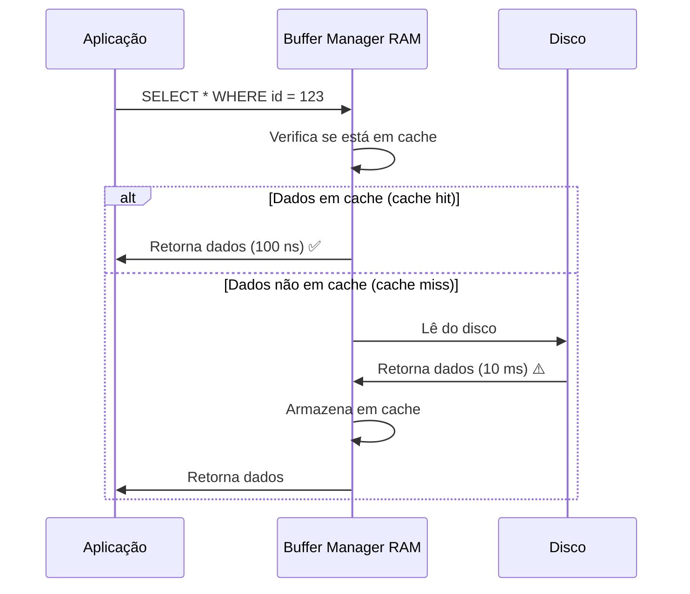

### 🔧 Gerenciador de Espaço em Disco (GED)

**O GED é como o "zelador" do banco de dados:**

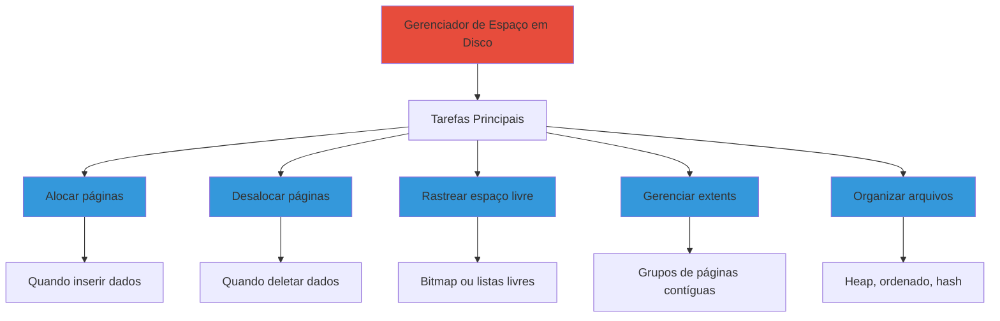

**Estruturas de Dados do GED:**

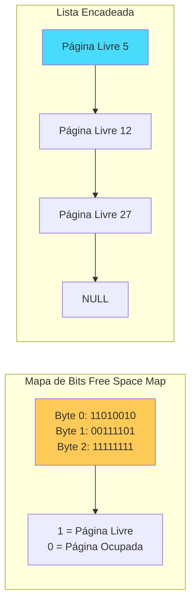

### 📦 Mapa de Bits vs Lista Encadeada

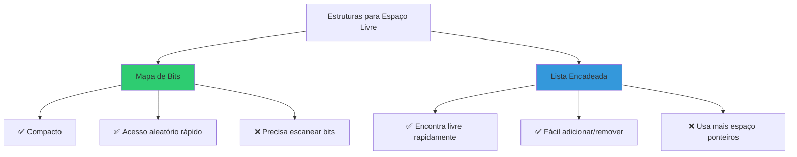

**Por que Mapa de Bits é melhor?**

1. **Compacto:** 1 bit por página
   - 1 milhão de páginas = 125 KB
2. **Persistência:** Fácil salvar em disco
3. **Busca:** Algoritmos eficientes para encontrar bits livres
4. **Espacialidade:** Páginas próximas têm bits próximos

**Exemplo:**

```
Bitmap (8 páginas):
11010010

Interpretação:
Página 0: Livre (1)
Página 1: Livre (1)
Página 2: Ocupada (0)
Página 3: Livre (1)
Página 4: Ocupada (0)
Página 5: Ocupada (0)
Página 6: Livre (1)
Página 7: Ocupada (0)
```

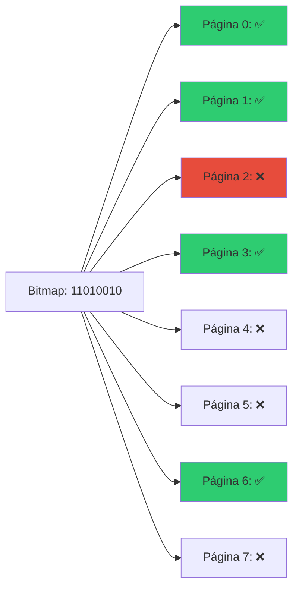

### 🔄 Gerenciador de Buffer

**Metáfora:** O Buffer Manager é como uma biblioteca com sala de leitura (RAM) e estoque (Disco).

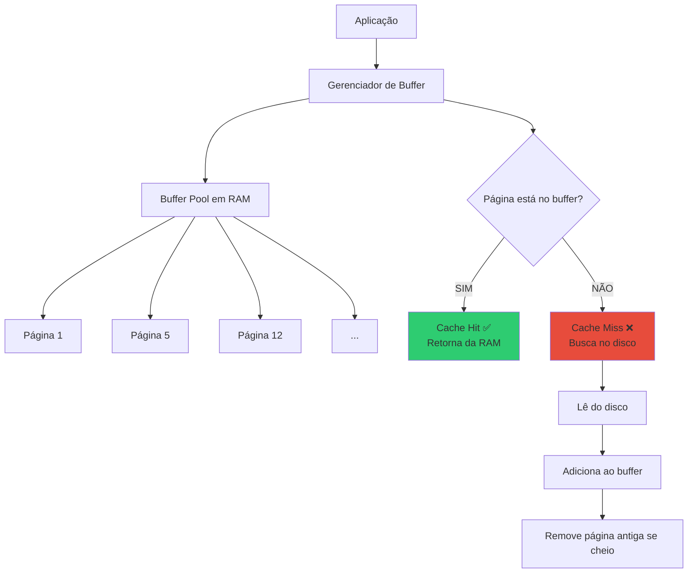

**Informações Mantidas por Página:**

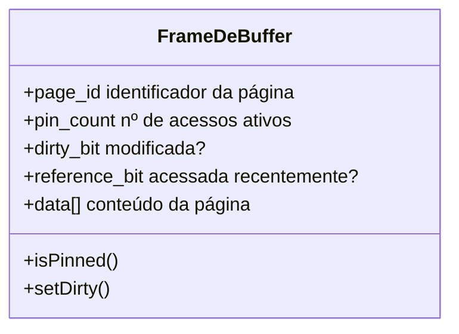

| Metadado | Função |
|----------|--------|
| **page_id** | Identifica qual página do disco está neste frame |
| **pin_count** | Quantos processos estão usando (não pode remover se > 0) |
| **dirty_bit** | Se modificada, precisa gravar no disco antes de remover |
| **reference_bit** | Usado por algoritmos de substituição (LRU, Clock) |

### 📝 Exercícios - Seção 2

#### **Exercício 1:**
**Considere a hierarquia de memória utilizada pelos SGBD.**

**(a) Quais as diferenças entre armazenamento primário, secundário e terciário? Dê exemplos.**

**Resposta:**

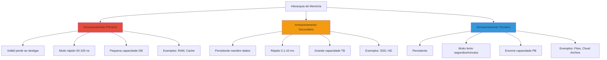

**Comparação Detalhada:**

| Característica | Primário | Secundário | Terciário |
|----------------|----------|------------|-----------|
| **Volatilidade** | Volátil | Persistente | Persistente |
| **Velocidade** | 100 ns | 0.1-10 ms | 1-60 s |
| **Capacidade** | 8-128 GB | 256GB-20TB | 1-50TB+ |
| **Custo/GB** | $5-10 | $0.02-0.20 | $0.001-0.01 |
| **Acesso** | Direto | Direto | Sequencial |
| **Exemplos** | RAM, Cache L1/L2/L3 | HDD, SSD, NVMe | Tape, Optical, Cloud Glacier |
| **Uso em BD** | Buffer pool, cache | Dados principais, índices | Backups, arquivamento |

**Exemplos Práticos:**

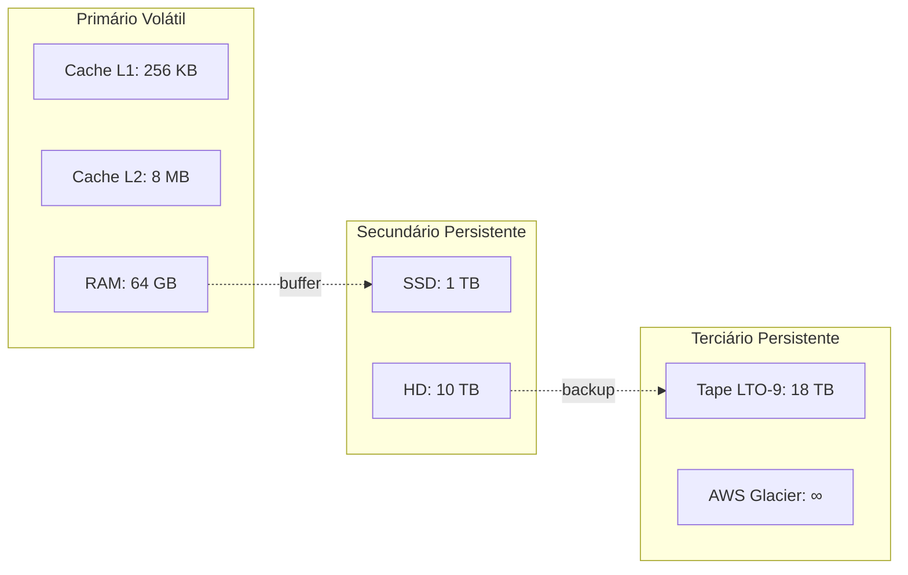

---

**(b) Quais são voláteis e quais são persistentes?**

**Resposta:**

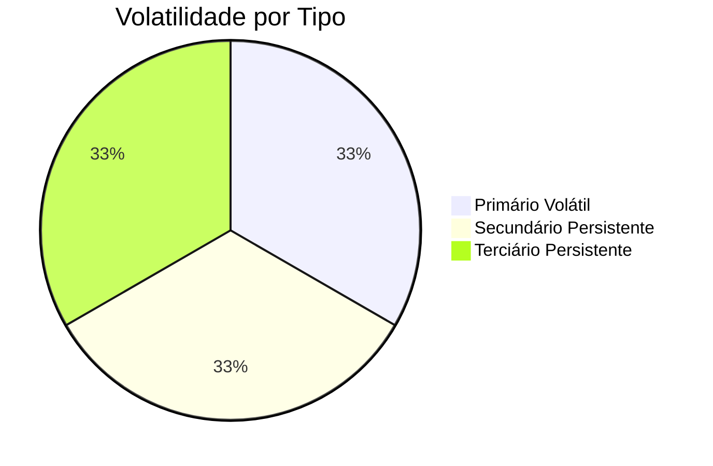

**VOLÁTEIS (perdem dados ao desligar):**
- ⚡ **Primário:**
  - Registradores da CPU
  - Cache L1, L2, L3
  - Memória RAM
  - Buffer pool do SGBD

**PERSISTENTES (mantêm dados ao desligar):**
- 💾 **Secundário:**
  - Hard Disk (HD)
  - Solid State Drive (SSD)
  - Flash storage
- 📦 **Terciário:**
  - Fitas magnéticas
  - Discos ópticos
  - Cloud storage (S3, Glacier)

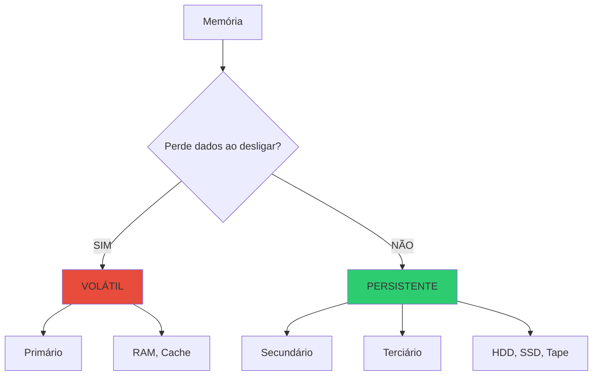

---

#### **Exercício 2:**
**Por que os discos são usados tão amplamente por SGBD? Quais suas vantagens em relação à memória principal e fitas?**

**Resposta:**

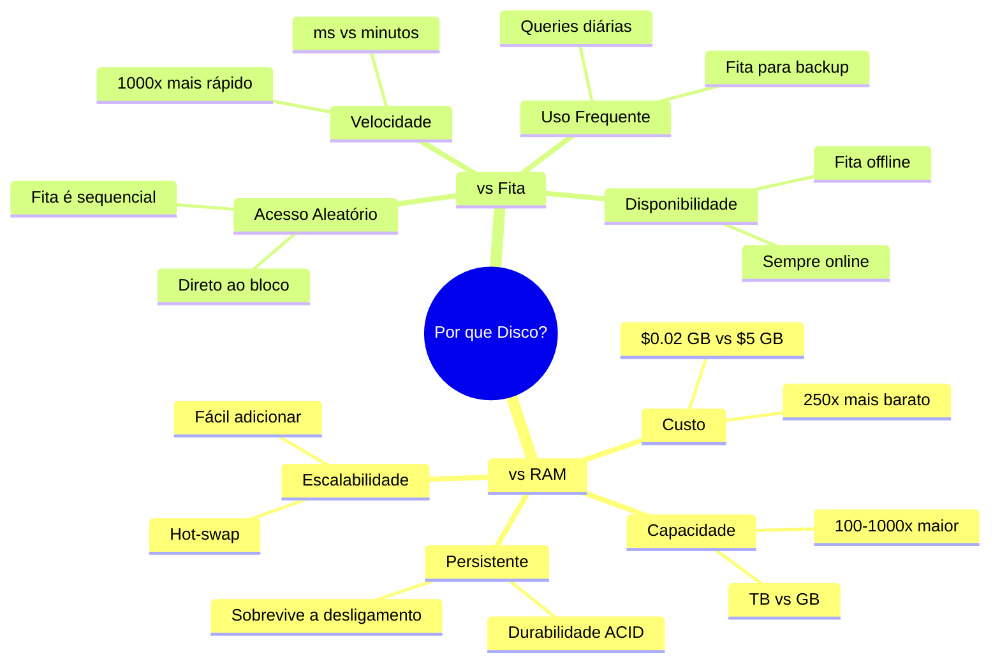

**Comparação Detalhada:**

| Aspecto | RAM | **DISCO (MELHOR)** | FITA |
|---------|-----|-------------------|------|
| **Persistência** | ❌ Volátil | ✅ Persistente | ✅ Persistente |
| **Custo/GB** | $5-10 | ✅ $0.02-0.20 | $0.001-0.01 |
| **Capacidade** | 8-128 GB | ✅ 256GB-20TB | 1-50TB+ |
| **Velocidade** | 100 ns | 0.1-10 ms | 1-60 s |
| **Acesso** | Aleatório | ✅ Aleatório | ⚠️ Sequencial |
| **Disponibilidade** | ✅ Online | ✅ Online | ❌ Offline |
| **Uso ideal** | Cache quente | ✅ **BD Principal** | Backups |

**Por que Disco é o Sweet Spot?**

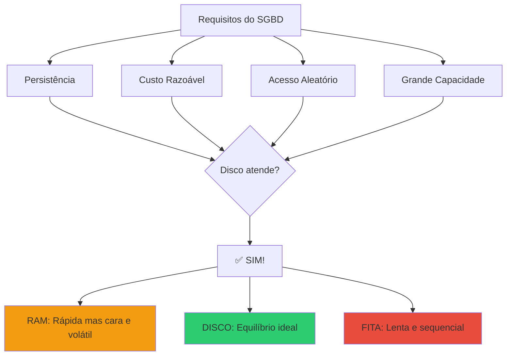

**Vantagens do Disco:**

1. **vs RAM:**
   - ✅ 250x mais barato
   - ✅ Persistente (não perde dados)
   - ✅ 100x maior capacidade
   - ❌ 100.000x mais lento (mas aceitável com cache)

2. **vs Fita:**
   - ✅ 1.000x mais rápido
   - ✅ Acesso aleatório direto
   - ✅ Sempre disponível (online)
   - ❌ 20-50x mais caro (mas vale a pena)

**Arquitetura Típica:**

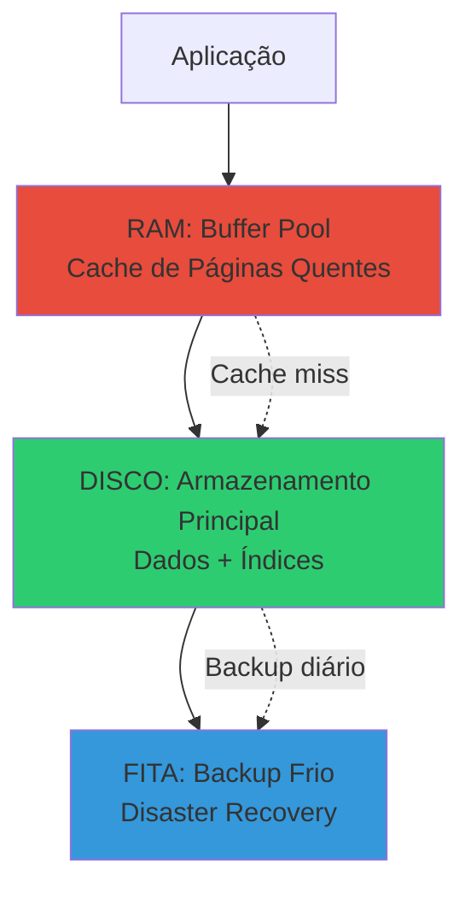

---

#### **Exercício 3:**
**Descreva o papel do gerenciador de espaço em disco (GED) nos SGBD.**

**Resposta:**

O **Gerenciador de Espaço em Disco (GED)** é o componente responsável pela gestão física do armazenamento. É como o "zelador" que organiza e mantém o espaço em disco.

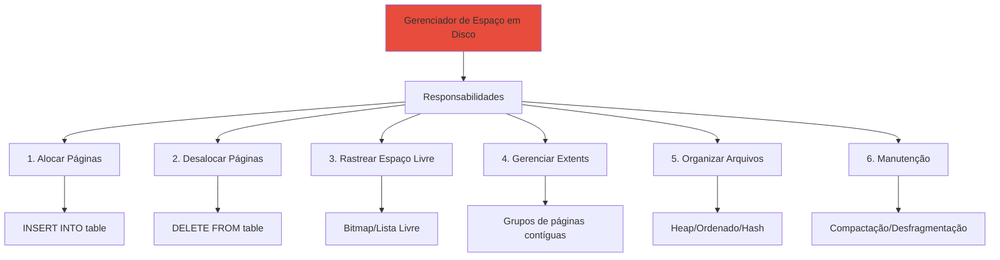

**Funções Detalhadas:**

1. **Alocação de Páginas:**
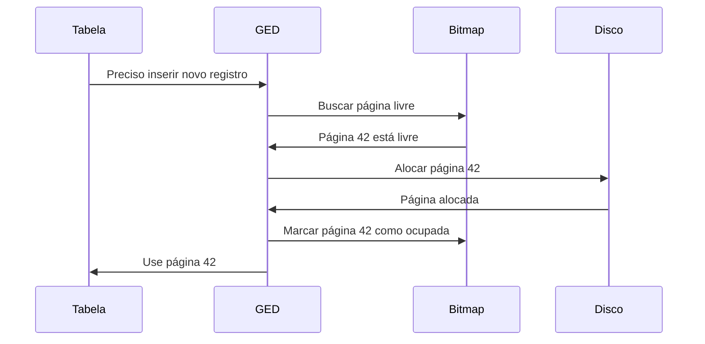

2. **Desalocação de Páginas:**
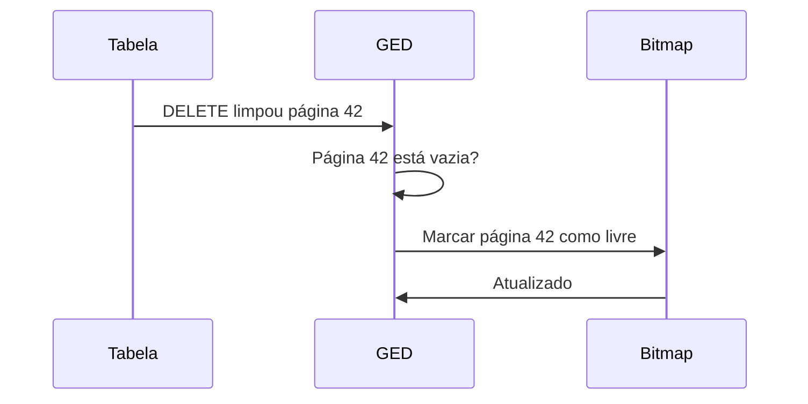

3. **Rastreamento de Espaço Livre:**

```mermaid
graph LR
    subgraph "Bitmap Estrutura Preferida"
        BM[Bit 0: Página 0<br/>Bit 1: Página 1<br/>...<br/>Bit N: Página N]
        BM --> BM1[1 = Livre<br/>0 = Ocupada]
    end
    
    subgraph "Lista Encadeada Alternativa"
        L1[Página 5] --> L2[Página 12]
        L2 --> L3[Página 27]
    end
    
    style BM fill:#2ecc71
    style L1 fill:#3498db
```

4. **Gerenciamento de Extents:**

**Extent:** Grupo de páginas contíguas (ex: 8 páginas = 1 extent)

```
Vantagem: Reduz fragmentação, melhora I/O sequencial

Exemplo:
- Páginas 0-7: Extent 0
- Páginas 8-15: Extent 1
- Páginas 16-23: Extent 2
```

```mermaid
graph LR
    E0[Extent 0<br/>Páginas 0-7] --> E1[Extent 1<br/>Páginas 8-15]
    E1 --> E2[Extent 2<br/>Páginas 16-23]
    
    E0 --> T1[Tabela A]
    E1 --> T1
    E2 --> T2[Índice sobre A]
    
    style E0 fill:#3498db
    style E1 fill:#3498db
    style E2 fill:#2ecc71
```

5. **Organização de Arquivos:**

```mermaid
graph TD
    GED --> A[Heap Desordenado]
    GED --> B[Sequencial Ordenado]
    GED --> C[Hash]
    GED --> D[Clustered Index]
    
    A --> A1[Inserção: O 1]
    A --> A2[Busca: O n]
    
    B --> B1[Busca: O log n]
    B --> B2[Manutenção custosa]
    
    C --> C1[Busca exata: O 1]
    C --> C2[Sem ordenação]
    
    D --> D1[Dados ordenados por índice]
```

**Estruturas de Dados Usadas pelo GED:**

```mermaid
classDiagram
    class FileHeader {
        +num_pages
        +num_records
        +free_space_pointer
        +first_free_page
        +metadata
    }
    
    class PageHeader {
        +page_id
        +num_records
        +free_space_offset
        +record_directory[]
        +checksum
    }
    
    class FreeSpaceMap {
        +bitmap[]
        +num_free_pages
        +getFreeadPage()
        +markFree()
        +markOccupied()
    }
    
    FileHeader *-- PageHeader
    FileHeader *-- FreeSpaceMap
```

---

#### **Exercício 4:**
**No que diz respeito à informação sobre blocos livres, informe por que mapa de bits é melhor do que lista.**

**Resposta:**

```mermaid
graph TD
    A[Estruturas para Espaço Livre] --> B[Mapa de Bits]
    A --> C[Lista Encadeada]
    
    B --> B1[✅ Compacto: 1 bit/página]
    B --> B2[✅ Acesso aleatório rápido]
    B --> B3[✅ Localidade espacial]
    B --> B4[✅ Fácil persistir em disco]
    B --> B5[✅ Busca paralela possível]
    B --> B6[❌ Precisa escanear bits]
    
    C --> C1[✅ Encontra livre em O 1]
    C --> C2[✅ Fácil inserir/remover]
    C --> C3[❌ Usa mais espaço ponteiros]
    C --> C4[❌ Fragmentado em disco]
    C --> C5[❌ Sem localidade espacial]
    
    style B fill:#2ecc71
    style C fill:#e74c3c
```

**Comparação Detalhada:**

| Aspecto | Mapa de Bits ✅ | Lista Encadeada |
|---------|----------------|-----------------|
| **Espaço** | 1 bit por página<br/>1M páginas = 125 KB | 8-16 bytes por página livre<br/>1M páginas = 8-16 MB |
| **Localidade** | Páginas próximas = bits próximos | Páginas espalhadas |
| **Persistência** | Contíguo, fácil salvar | Fragmentado, difícil salvar |
| **Busca** | O(n/64) com operações de bit | O(1) para primeira livre |
| **Paralelismo** | Possível (múltiplas palavras) | Difícil (acesso sequencial) |
| **Fragmentação** | Baixa | Alta |

**Exemplo Prático:**

**Mapa de Bits:**
```
1 milhão de páginas de 4KB cada = 4GB de dados

Bitmap necessário:
- 1 bit por página
- 1.000.000 bits ÷ 8 = 125.000 bytes = 125 KB

Overhead: 125KB / 4GB = 0.003% ✅ MÍNIMO!
```

**Lista Encadeada:**
```
1 milhão de páginas

Se 50% estão livres = 500.000 nós na lista
- Cada nó: 8 bytes (page_id) + 8 bytes (ponteiro) = 16 bytes
- Total: 500.000 × 16 = 8 MB

Overhead: 8MB / 4GB = 0.2% ❌ 64x maior!
```

```mermaid
graph TD
    A[1 milhão de páginas] --> B[Mapa de Bits]
    A --> C[Lista Encadeada]
    
    B --> B1[125 KB<br/>0.003% overhead ✅]
    C --> C1[8 MB se 50% livre<br/>0.2% overhead ❌]
    
    B1 --> D[64x menor!]
    
    style B1 fill:#2ecc71
    style C1 fill:#e74c3c
    style D fill:#feca57
```

**Vantagens Adicionais do Bitmap:**

1. **Localidade Espacial:**
```mermaid
graph LR
    BM[Bitmap: bits adjacentes] --> P1[Página 100]
    BM --> P2[Página 101]
    BM --> P3[Página 102]
    
    L[Lista: nós espalhados] --> LP1[Página 5]
    L --> LP2[Página 237]
    L --> LP3[Página 894]
    
    P1 -.melhor para I/O sequencial.-> P2
    
    style BM fill:#2ecc71
    style L fill:#e74c3c
```

```c
// Verificar 64 páginas de uma vez
uint64_t word = bitmap[i];
if (word != 0) {
    // Há páginas livres neste grupo
    int bit_position = __builtin_ctzll(word); // Count trailing zeros
    // Encontrou página livre em O(1)!
}
```

3. **Persistência Simples:**
```mermaid
sequenceDiagram
    participant GED
    participant Bitmap
    participant Disco
    
    GED->>Bitmap: Salvar estado
    Bitmap->>Disco: Escreve 125 KB contíguos
    Disco->>GED: OK (1 operação I/O) ✅
    
    Note over GED: Lista encadeada precisaria<br/>múltiplos I/Os para nós espalhados ❌
```

4. **Busca Paralela:**
```mermaid
graph TD
    BM[Bitmap dividido] --> T1[Thread 1: Bits 0-999]
    BM --> T2[Thread 2: Bits 1000-1999]
    BM --> T3[Thread 3: Bits 2000-2999]
    BM --> T4[Thread 4: Bits 3000-3999]
    
    T1 --> R[Merge resultados]
    T2 --> R
    T3 --> R
    T4 --> R
    
    style BM fill:#2ecc71
```

**Quando Lista pode ser melhor:**
- ⚠️ Se **muito poucas páginas livres** (< 0.1%)
- Mas SGBD normalmente mantém >= 10% livre

**Conclusão:**
```mermaid
graph LR
    A[Mapa de Bits] --> B[✅ MELHOR na maioria dos casos]
    B --> C[Compacto]
    B --> D[Rápido]
    B --> E[Eficiente]
    
    style A fill:#2ecc71
    style B fill:#2ecc71
```

---

#### **Exercício 5:**
**Explique resumidamente como o gerenciador de buffer gerencia a alocação de páginas. Quais informações sobre cada página são mantidas?**

**Resposta:**

O **Gerenciador de Buffer** é responsável por manter páginas do disco em memória RAM (buffer pool) e gerenciar sua substituição.

```mermaid
graph TD
    A[Gerenciador de Buffer] --> B[Buffer Pool em RAM]
    B --> C[Frames de Página]
    
    C --> D[Frame 1]
    C --> E[Frame 2]
    C --> F[Frame 3]
    C --> G[...]
    
    A --> H[Tabela de Páginas]
    H --> I[Mapeia page_id → frame]
    
    A --> J[Política de Substituição]
    J --> K[LRU, Clock, etc]
    
    style A fill:#e74c3c
    style B fill:#feca57
    style H fill:#3498db
```

**Como Funciona:**

```mermaid
sequenceDiagram
    participant App as Aplicação
    participant BM as Buffer Manager
    participant PT as Tabela de Páginas
    participant BP as Buffer Pool RAM
    participant D as Disco
    
    App->>BM: Solicita página 42
    BM->>PT: Página 42 está no buffer?
    
    alt Cache Hit (página em memória)
        PT->>BM: Sim, está no frame 5
        BM->>BP: Acessa frame 5
        BP->>BM: Retorna dados
        BM->>BM: Incrementa pin_count
        BM->>BM: Atualiza reference_bit
        BM->>App: Dados (100 ns) ✅
    else Cache Miss (página não em memória)
        PT->>BM: Não está no buffer
        BM->>BM: Encontra frame vítima
        
        alt Frame vítima está dirty
            BM->>D: Grava frame vítima (write-back)
        end
        
        BM->>D: Lê página 42 do disco
        D->>BM: Retorna dados (10 ms)
        BM->>BP: Carrega no frame escolhido
        BM->>PT: Atualiza mapeamento
        BM->>App: Dados ⚠️
    end
```

**Informações Mantidas por Página (Frame):**

```mermaid
classDiagram
    class FrameDeBuffer {
        +int page_id
        +int pin_count
        +bool dirty_bit
        +bool reference_bit
        +timestamp last_access
        +byte[] data
        +Lock lock
        +isPinned()
        +setDirty()
        +incrementPin()
        +decrementPin()
    }
```

| Campo | Descrição | Uso |
|-------|-----------|-----|
| **page_id** | ID da página do disco | Identifica qual página está neste frame |
| **pin_count** | Contador de uso ativo | Se > 0, não pode ser removida (em uso) |
| **dirty_bit** | Página modificada? | Se TRUE, precisa write-back antes de remover |
| **reference_bit** | Acessada recentemente? | Usado por algoritmos de substituição (Clock) |
| **last_access** | Timestamp do último acesso | Usado por LRU |
| **data[]** | Conteúdo da página (4KB-16KB) | Dados reais |
| **lock** | Controle de concorrência | Garante acesso seguro |

**Exemplo Visual:**

```mermaid
graph TD
    subgraph "Buffer Pool"
        F1[Frame 0<br/>page_id: 42<br/>pin_count: 2<br/>dirty: true<br/>ref: true]
        F2[Frame 1<br/>page_id: 17<br/>pin_count: 0<br/>dirty: false<br/>ref: true]
        F3[Frame 2<br/>page_id: 93<br/>pin_count: 1<br/>dirty: true<br/>ref: false]
        F4[Frame 3<br/>page_id: NULL<br/>pin_count: 0<br/>dirty: false<br/>ref: false]
    end
    
    F1 --> F1A[✅ Em uso pin > 0]
    F2 --> F2A[⚠️ Pode substituir]
    F3 --> F3A[✅ Em uso]
    F4 --> F4A[✅ Livre]
    
    style F1 fill:#e74c3c
    style F2 fill:#feca57
    style F3 fill:#e74c3c
    style F4 fill:#2ecc71
```

**Algoritmo de Alocação (Simplificado):**

```python
def alocar_pagina(page_id):
    # 1. Verifica se já está no buffer (cache hit)
    if page_id in buffer_pool:
        frame = buffer_pool[page_id]
        frame.pin_count += 1
        frame.reference_bit = True
        return frame
    
    # 2. Cache miss - precisa trazer do disco
    frame = encontrar_frame_livre()
    
    if frame is None:
        # 3. Buffer cheio - escolher vítima
        frame = escolher_vitima()
        
        # 4. Se vítima está dirty, gravar primeiro
        if frame.dirty_bit:
            escrever_no_disco(frame.page_id, frame.data)
        
        # 5. Remover vítima do buffer
        remover_do_buffer(frame.page_id)
    
    # 6. Ler nova página do disco
    frame.data = ler_do_disco(page_id)
    frame.page_id = page_id
    frame.pin_count = 1
    frame.dirty_bit = False
    frame.reference_bit = True
    
    # 7. Adicionar ao buffer
    buffer_pool[page_id] = frame
    
    return frame
```

**Políticas de Substituição:**

```mermaid
graph TD
    PS[Políticas de Substituição] --> LRU[LRU Least Recently Used]
    PS --> Clock[Clock Second Chance]
    PS --> MRU[MRU Most Recently Used]
    
    LRU --> LRU1[Remove a mais antiga]
    LRU --> LRU2[Requer ordenação por timestamp]
    LRU --> LRU3[Overhead de manutenção]
    
    Clock --> C1[Algoritmo circular]
    Clock --> C2[Usa reference_bit]
    Clock --> C3[Eficiente O 1]
    
    MRU --> M1[Remove a mais recente]
    MRU --> M2[Para scans sequenciais]
    
    style Clock fill:#2ecc71
    style LRU fill:#3498db
```

**Exemplo de Clock (Second Chance):**

```mermaid
graph LR
    A[Frame 0<br/>ref: 1] --> B[Frame 1<br/>ref: 0]
    B --> C[Frame 2<br/>ref: 1]
    C --> D[Frame 3<br/>ref: 1]
    D --> A
    
    P[Ponteiro Clock] -.-> B
    
    B --> E[✅ Escolhido<br/>ref=0, pin=0]
    
    style B fill:#e74c3c
    style E fill:#2ecc71
```

**Fluxo Completo:**

```mermaid
stateDiagram-v2
    [*] --> Solicita: App solicita página
    Solicita --> VerificaBuffer: Consulta tabela de páginas
    
    VerificaBuffer --> CacheHit: Página no buffer?
    VerificaBuffer --> CacheMiss: Página não no buffer
    
    CacheHit --> IncrementaPin: Incrementa pin_count
    IncrementaPin --> AtualizaRef: reference_bit = true
    AtualizaRef --> RetornaDados: Retorna frame
    
    CacheMiss --> VerificaFrameLivre: Busca frame livre
    VerificaFrameLivre --> TemLivre: Frame livre?
    VerificaFrameLivre --> NaoTemLivre: Buffer cheio
    
    NaoTemLivre --> EscolheVitima: Algoritmo de substituição
    EscolheVitima --> VerificaDirty: Vítima dirty?
    VerificaDirty --> WriteBack: dirty_bit = true
    VerificaDirty --> LeDiscoy: dirty_bit = false
    WriteBack --> EscreveVitima: Grava no disco
    EscreveVitima --> LeDiscoy
    
    TemLivre --> LeDisco
    LeDiscoy --> LeDisco: Lê página do disco
    LeDisco --> CarregaFrame: Carrega no frame
    CarregaFrame --> AtualizaMetadata: Atualiza metadados
    AtualizaMetadata --> RetornaDados
    
    RetornaDados --> [*]
```
---
