## 2. Armazenamento de Dados e Hierarquia de Memória

### 💾 Hierarquia de Memória em SGBD

**Metáfora do Escritório:**

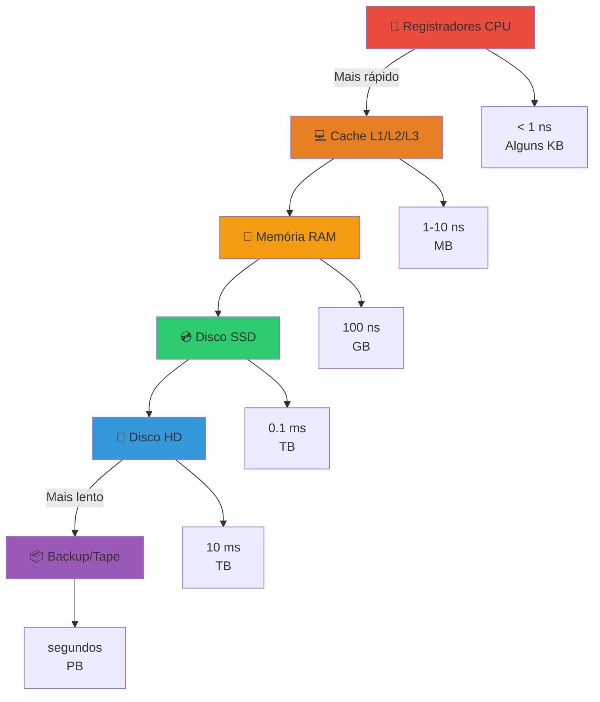

#### 2.1 Diferenças entre Tipos de Armazenamento

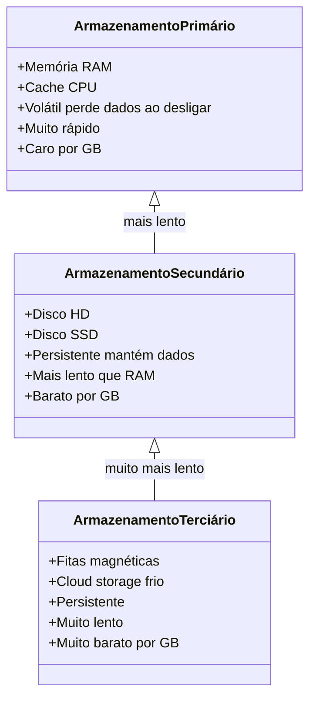

**Comparação Prática:**

| Tipo | Tecnologia | Velocidade | Capacidade | Custo/GB | Persistente? |
|------|------------|------------|------------|----------|--------------|
| **Primário** | RAM | 100 ns | 8-128 GB | $5-10 | ❌ Volátil |
| **Secundário** | SSD | 0.1 ms | 256GB-4TB | $0.10-0.20 | ✅ Persistente |
| **Secundário** | HD | 10 ms | 1-20 TB | $0.02-0.05 | ✅ Persistente |
| **Terciário** | Tape | 1-60 s | 1-50 TB | $0.001-0.01 | ✅ Persistente |

### 🗄️ Por que SGBD usa Disco Amplamente?

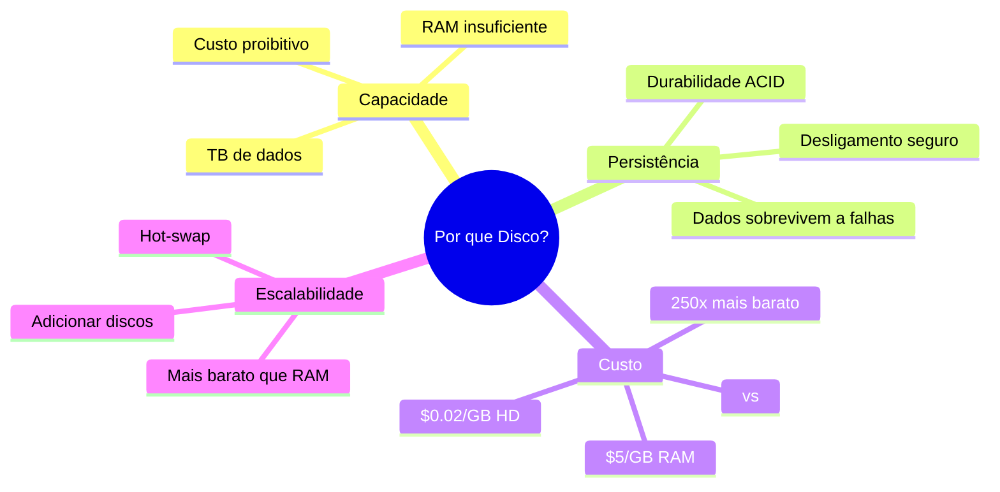

**Vantagens do Disco:**

1. **Persistência:** Dados não são perdidos ao desligar
2. **Capacidade:** Armazena TB a custo baixo
3. **Durabilidade:** Backups e recovery
4. **Econômico:** 100-250x mais barato que RAM

**Desvantagem:**

- ⚠️ **Muito mais lento:** 10.000-100.000x mais lento que RAM!

**Solução:** SGBD usa hierarquia:
- **RAM** = Buffer/Cache para dados quentes
- **Disco** = Armazenamento principal

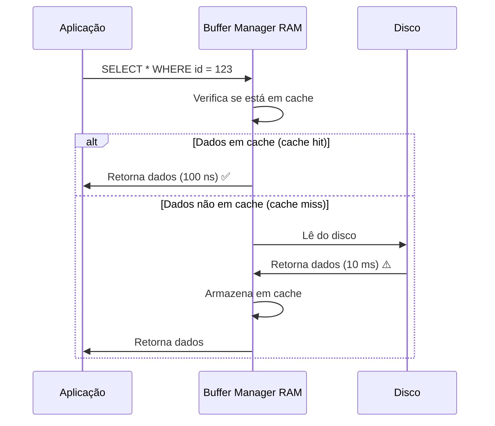

### 🔧 Gerenciador de Espaço em Disco (GED)

**O GED é como o "zelador" do banco de dados:**

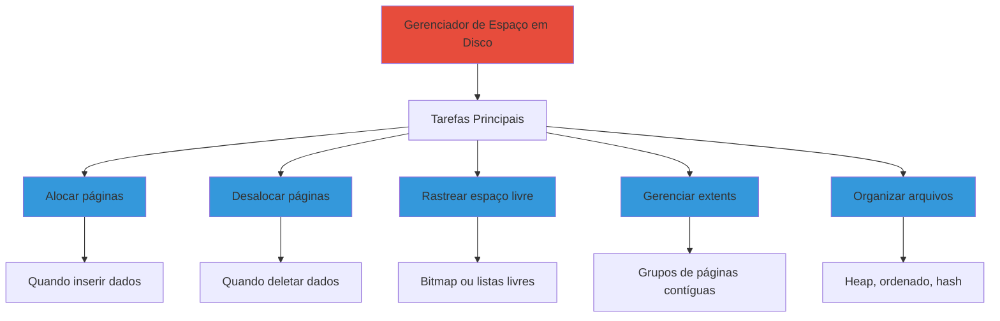

**Estruturas de Dados do GED:**

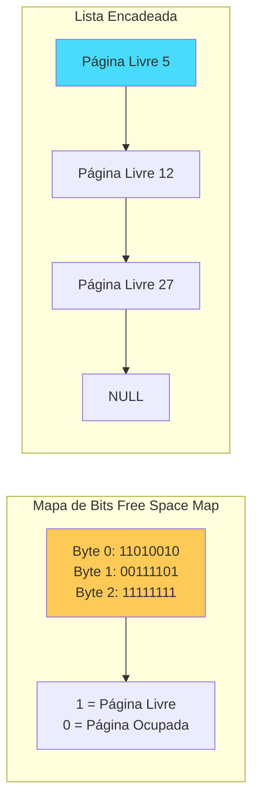

### 📦 Mapa de Bits vs Lista Encadeada

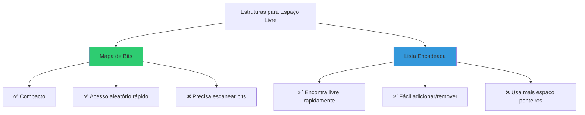

**Por que Mapa de Bits é melhor?**

1. **Compacto:** 1 bit por página
   - 1 milhão de páginas = 125 KB
2. **Persistência:** Fácil salvar em disco
3. **Busca:** Algoritmos eficientes para encontrar bits livres
4. **Espacialidade:** Páginas próximas têm bits próximos

**Exemplo:**

```
Bitmap (8 páginas):
11010010

Interpretação:
Página 0: Livre (1)
Página 1: Livre (1)
Página 2: Ocupada (0)
Página 3: Livre (1)
Página 4: Ocupada (0)
Página 5: Ocupada (0)
Página 6: Livre (1)
Página 7: Ocupada (0)
```

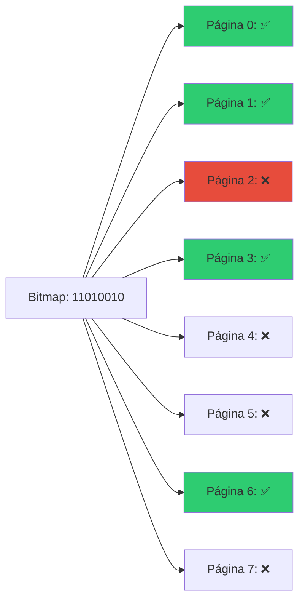

### 🔄 Gerenciador de Buffer

**Metáfora:** O Buffer Manager é como uma biblioteca com sala de leitura (RAM) e estoque (Disco).

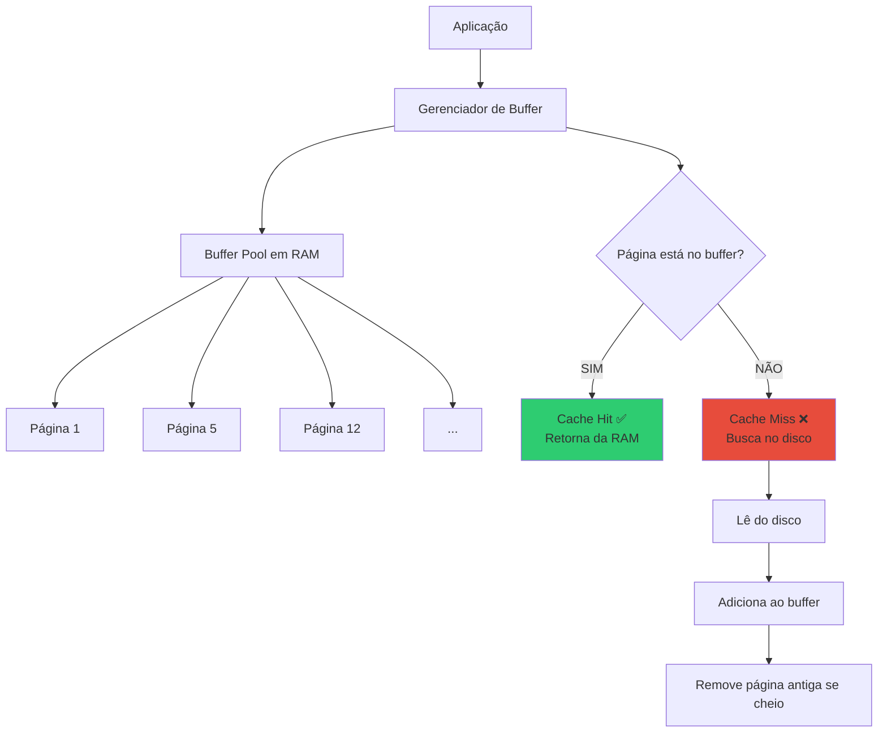

**Informações Mantidas por Página:**

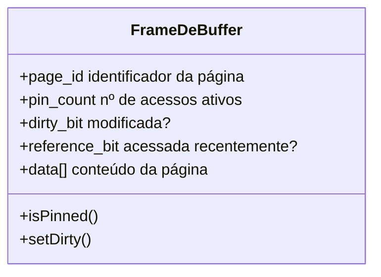

| Metadado | Função |
|----------|--------|
| **page_id** | Identifica qual página do disco está neste frame |
| **pin_count** | Quantos processos estão usando (não pode remover se > 0) |
| **dirty_bit** | Se modificada, precisa gravar no disco antes de remover |
| **reference_bit** | Usado por algoritmos de substituição (LRU, Clock) |

### 📝 Exercícios - Seção 2

#### **Exercício 1:**
**Considere a hierarquia de memória utilizada pelos SGBD.**

**(a) Quais as diferenças entre armazenamento primário, secundário e terciário? Dê exemplos.**

**Resposta:**

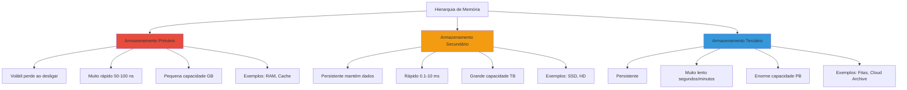

**Comparação Detalhada:**

| Característica | Primário | Secundário | Terciário |
|----------------|----------|------------|-----------|
| **Volatilidade** | Volátil | Persistente | Persistente |
| **Velocidade** | 100 ns | 0.1-10 ms | 1-60 s |
| **Capacidade** | 8-128 GB | 256GB-20TB | 1-50TB+ |
| **Custo/GB** | $5-10 | $0.02-0.20 | $0.001-0.01 |
| **Acesso** | Direto | Direto | Sequencial |
| **Exemplos** | RAM, Cache L1/L2/L3 | HDD, SSD, NVMe | Tape, Optical, Cloud Glacier |
| **Uso em BD** | Buffer pool, cache | Dados principais, índices | Backups, arquivamento |

**Exemplos Práticos:**

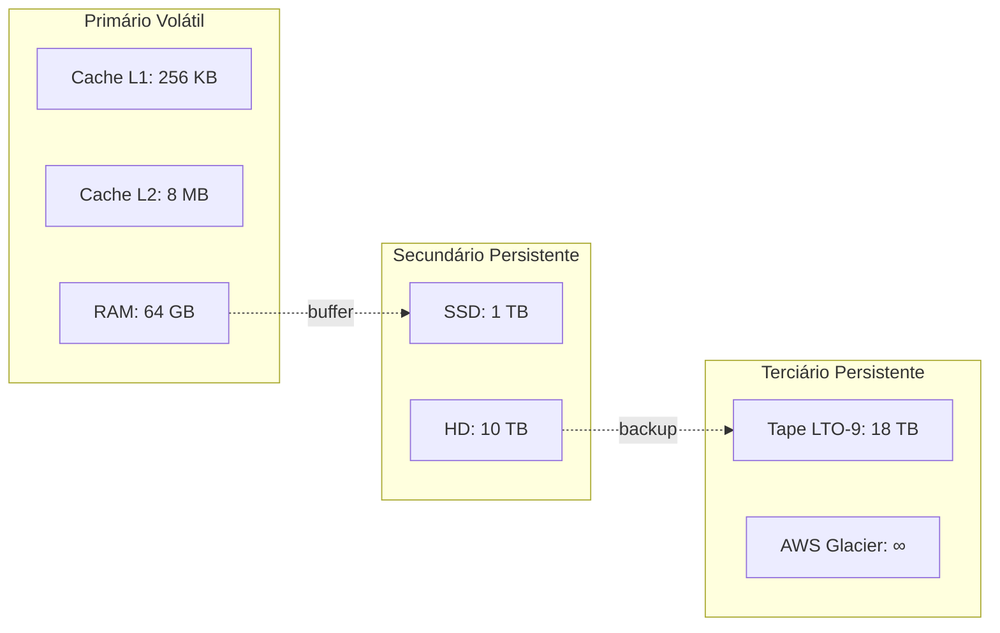

---

**(b) Quais são voláteis e quais são persistentes?**

**Resposta:**

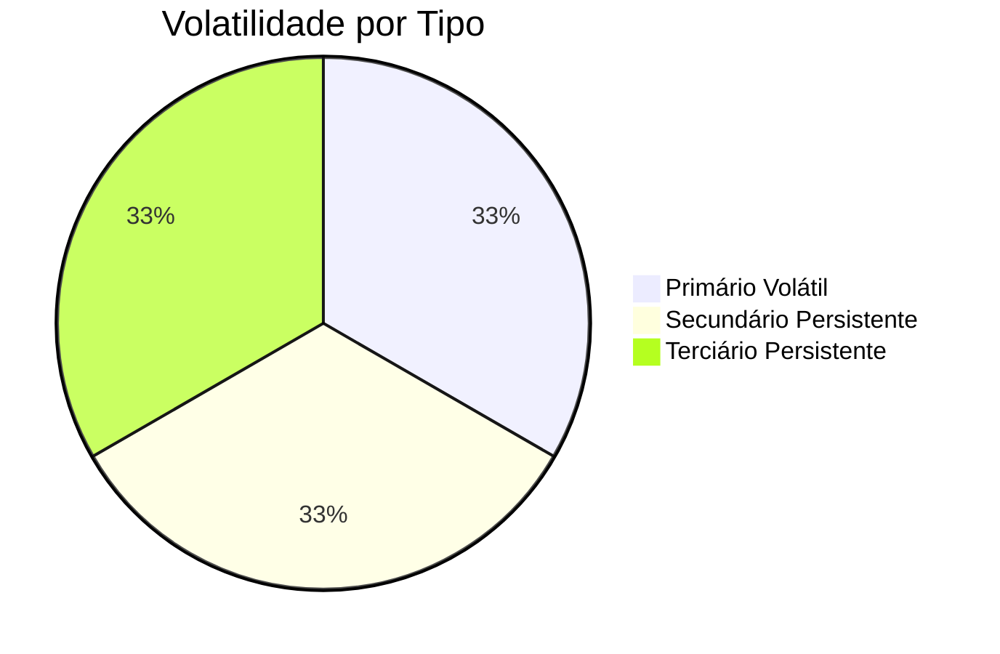

**VOLÁTEIS (perdem dados ao desligar):**
- ⚡ **Primário:**
  - Registradores da CPU
  - Cache L1, L2, L3
  - Memória RAM
  - Buffer pool do SGBD

**PERSISTENTES (mantêm dados ao desligar):**
- 💾 **Secundário:**
  - Hard Disk (HD)
  - Solid State Drive (SSD)
  - Flash storage
- 📦 **Terciário:**
  - Fitas magnéticas
  - Discos ópticos
  - Cloud storage (S3, Glacier)

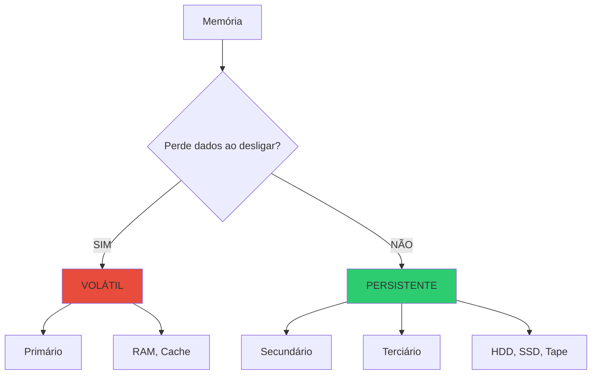

---

#### **Exercício 2:**
**Por que os discos são usados tão amplamente por SGBD? Quais suas vantagens em relação à memória principal e fitas?**

**Resposta:**

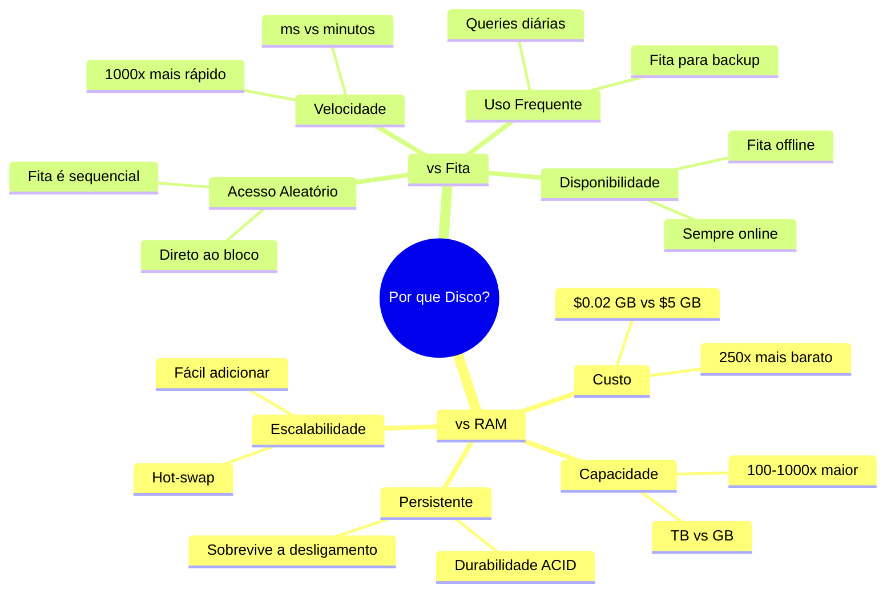

**Comparação Detalhada:**

| Aspecto | RAM | **DISCO (MELHOR)** | FITA |
|---------|-----|-------------------|------|
| **Persistência** | ❌ Volátil | ✅ Persistente | ✅ Persistente |
| **Custo/GB** | $5-10 | ✅ $0.02-0.20 | $0.001-0.01 |
| **Capacidade** | 8-128 GB | ✅ 256GB-20TB | 1-50TB+ |
| **Velocidade** | 100 ns | 0.1-10 ms | 1-60 s |
| **Acesso** | Aleatório | ✅ Aleatório | ⚠️ Sequencial |
| **Disponibilidade** | ✅ Online | ✅ Online | ❌ Offline |
| **Uso ideal** | Cache quente | ✅ **BD Principal** | Backups |

**Por que Disco é o Sweet Spot?**

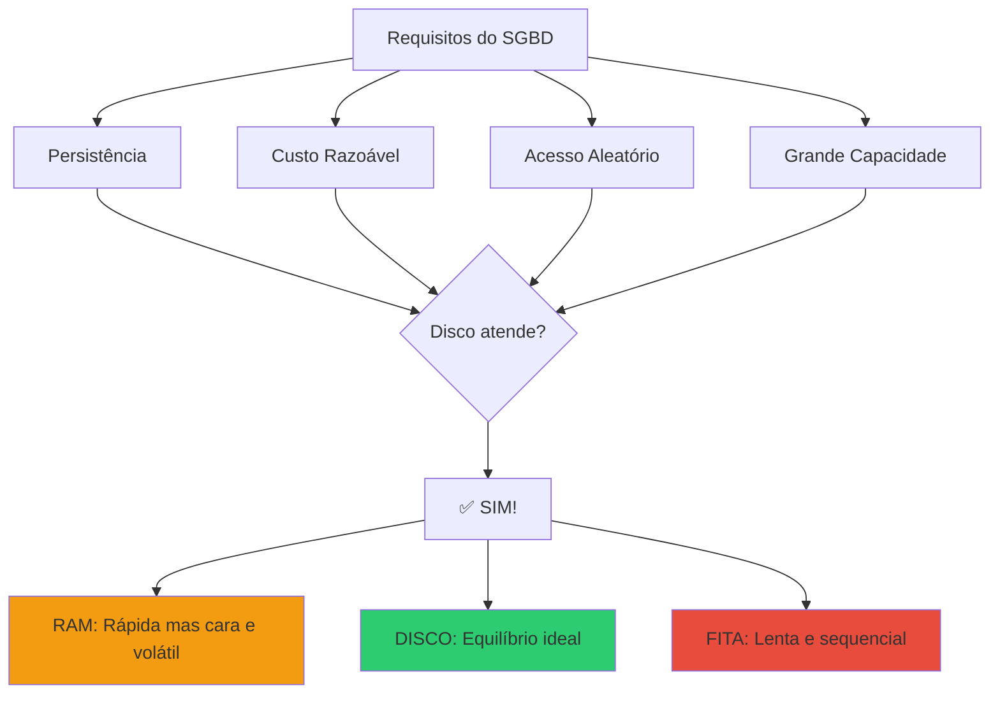

**Vantagens do Disco:**

1. **vs RAM:**
   - ✅ 250x mais barato
   - ✅ Persistente (não perde dados)
   - ✅ 100x maior capacidade
   - ❌ 100.000x mais lento (mas aceitável com cache)

2. **vs Fita:**
   - ✅ 1.000x mais rápido
   - ✅ Acesso aleatório direto
   - ✅ Sempre disponível (online)
   - ❌ 20-50x mais caro (mas vale a pena)

**Arquitetura Típica:**

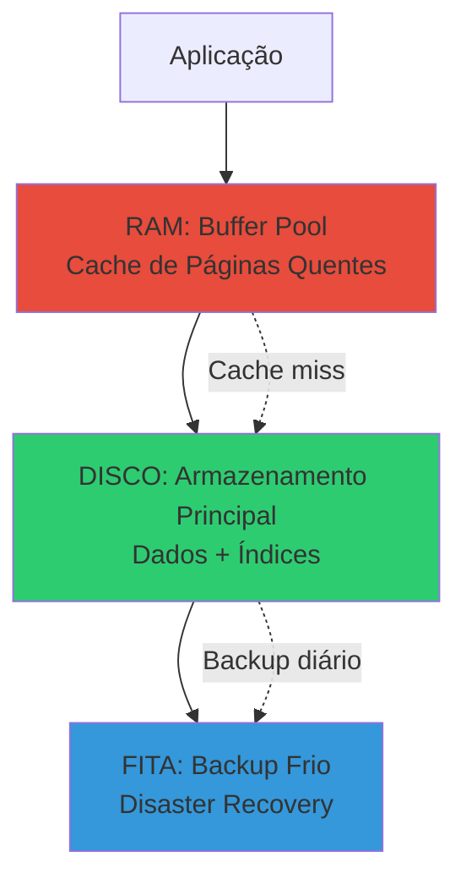

---

#### **Exercício 3:**
**Descreva o papel do gerenciador de espaço em disco (GED) nos SGBD.**

**Resposta:**

O **Gerenciador de Espaço em Disco (GED)** é o componente responsável pela gestão física do armazenamento. É como o "zelador" que organiza e mantém o espaço em disco.

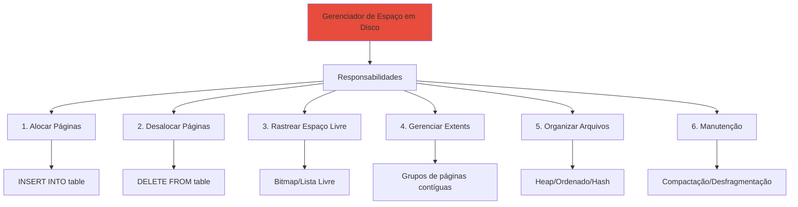

**Funções Detalhadas:**

1. **Alocação de Páginas:**
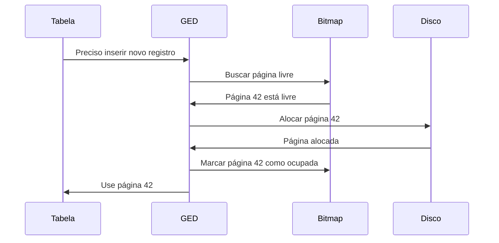

2. **Desalocação de Páginas:**
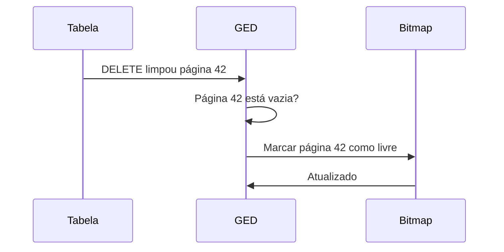

3. **Rastreamento de Espaço Livre:**

```mermaid
graph LR
    subgraph "Bitmap Estrutura Preferida"
        BM[Bit 0: Página 0<br/>Bit 1: Página 1<br/>...<br/>Bit N: Página N]
        BM --> BM1[1 = Livre<br/>0 = Ocupada]
    end
    
    subgraph "Lista Encadeada Alternativa"
        L1[Página 5] --> L2[Página 12]
        L2 --> L3[Página 27]
    end
    
    style BM fill:#2ecc71
    style L1 fill:#3498db
```

4. **Gerenciamento de Extents:**

**Extent:** Grupo de páginas contíguas (ex: 8 páginas = 1 extent)

```
Vantagem: Reduz fragmentação, melhora I/O sequencial

Exemplo:
- Páginas 0-7: Extent 0
- Páginas 8-15: Extent 1
- Páginas 16-23: Extent 2
```

```mermaid
graph LR
    E0[Extent 0<br/>Páginas 0-7] --> E1[Extent 1<br/>Páginas 8-15]
    E1 --> E2[Extent 2<br/>Páginas 16-23]
    
    E0 --> T1[Tabela A]
    E1 --> T1
    E2 --> T2[Índice sobre A]
    
    style E0 fill:#3498db
    style E1 fill:#3498db
    style E2 fill:#2ecc71
```

5. **Organização de Arquivos:**

```mermaid
graph TD
    GED --> A[Heap Desordenado]
    GED --> B[Sequencial Ordenado]
    GED --> C[Hash]
    GED --> D[Clustered Index]
    
    A --> A1[Inserção: O 1]
    A --> A2[Busca: O n]
    
    B --> B1[Busca: O log n]
    B --> B2[Manutenção custosa]
    
    C --> C1[Busca exata: O 1]
    C --> C2[Sem ordenação]
    
    D --> D1[Dados ordenados por índice]
```

**Estruturas de Dados Usadas pelo GED:**

```mermaid
classDiagram
    class FileHeader {
        +num_pages
        +num_records
        +free_space_pointer
        +first_free_page
        +metadata
    }
    
    class PageHeader {
        +page_id
        +num_records
        +free_space_offset
        +record_directory[]
        +checksum
    }
    
    class FreeSpaceMap {
        +bitmap[]
        +num_free_pages
        +getFreeadPage()
        +markFree()
        +markOccupied()
    }
    
    FileHeader *-- PageHeader
    FileHeader *-- FreeSpaceMap
```

---

#### **Exercício 4:**
**No que diz respeito à informação sobre blocos livres, informe por que mapa de bits é melhor do que lista.**

**Resposta:**

```mermaid
graph TD
    A[Estruturas para Espaço Livre] --> B[Mapa de Bits]
    A --> C[Lista Encadeada]
    
    B --> B1[✅ Compacto: 1 bit/página]
    B --> B2[✅ Acesso aleatório rápido]
    B --> B3[✅ Localidade espacial]
    B --> B4[✅ Fácil persistir em disco]
    B --> B5[✅ Busca paralela possível]
    B --> B6[❌ Precisa escanear bits]
    
    C --> C1[✅ Encontra livre em O 1]
    C --> C2[✅ Fácil inserir/remover]
    C --> C3[❌ Usa mais espaço ponteiros]
    C --> C4[❌ Fragmentado em disco]
    C --> C5[❌ Sem localidade espacial]
    
    style B fill:#2ecc71
    style C fill:#e74c3c
```

**Comparação Detalhada:**

| Aspecto | Mapa de Bits ✅ | Lista Encadeada |
|---------|----------------|-----------------|
| **Espaço** | 1 bit por página<br/>1M páginas = 125 KB | 8-16 bytes por página livre<br/>1M páginas = 8-16 MB |
| **Localidade** | Páginas próximas = bits próximos | Páginas espalhadas |
| **Persistência** | Contíguo, fácil salvar | Fragmentado, difícil salvar |
| **Busca** | O(n/64) com operações de bit | O(1) para primeira livre |
| **Paralelismo** | Possível (múltiplas palavras) | Difícil (acesso sequencial) |
| **Fragmentação** | Baixa | Alta |

**Exemplo Prático:**

**Mapa de Bits:**
```
1 milhão de páginas de 4KB cada = 4GB de dados

Bitmap necessário:
- 1 bit por página
- 1.000.000 bits ÷ 8 = 125.000 bytes = 125 KB

Overhead: 125KB / 4GB = 0.003% ✅ MÍNIMO!
```

**Lista Encadeada:**
```
1 milhão de páginas

Se 50% estão livres = 500.000 nós na lista
- Cada nó: 8 bytes (page_id) + 8 bytes (ponteiro) = 16 bytes
- Total: 500.000 × 16 = 8 MB

Overhead: 8MB / 4GB = 0.2% ❌ 64x maior!
```

```mermaid
graph TD
    A[1 milhão de páginas] --> B[Mapa de Bits]
    A --> C[Lista Encadeada]
    
    B --> B1[125 KB<br/>0.003% overhead ✅]
    C --> C1[8 MB se 50% livre<br/>0.2% overhead ❌]
    
    B1 --> D[64x menor!]
    
    style B1 fill:#2ecc71
    style C1 fill:#e74c3c
    style D fill:#feca57
```

**Vantagens Adicionais do Bitmap:**

1. **Localidade Espacial:**
```mermaid
graph LR
    BM[Bitmap: bits adjacentes] --> P1[Página 100]
    BM --> P2[Página 101]
    BM --> P3[Página 102]
    
    L[Lista: nós espalhados] --> LP1[Página 5]
    L --> LP2[Página 237]
    L --> LP3[Página 894]
    
    P1 -.melhor para I/O sequencial.-> P2
    
    style BM fill:#2ecc71
    style L fill:#e74c3c
```

```c
// Verificar 64 páginas de uma vez
uint64_t word = bitmap[i];
if (word != 0) {
    // Há páginas livres neste grupo
    int bit_position = __builtin_ctzll(word); // Count trailing zeros
    // Encontrou página livre em O(1)!
}
```

3. **Persistência Simples:**
```mermaid
sequenceDiagram
    participant GED
    participant Bitmap
    participant Disco
    
    GED->>Bitmap: Salvar estado
    Bitmap->>Disco: Escreve 125 KB contíguos
    Disco->>GED: OK (1 operação I/O) ✅
    
    Note over GED: Lista encadeada precisaria<br/>múltiplos I/Os para nós espalhados ❌
```

4. **Busca Paralela:**
```mermaid
graph TD
    BM[Bitmap dividido] --> T1[Thread 1: Bits 0-999]
    BM --> T2[Thread 2: Bits 1000-1999]
    BM --> T3[Thread 3: Bits 2000-2999]
    BM --> T4[Thread 4: Bits 3000-3999]
    
    T1 --> R[Merge resultados]
    T2 --> R
    T3 --> R
    T4 --> R
    
    style BM fill:#2ecc71
```

**Quando Lista pode ser melhor:**
- ⚠️ Se **muito poucas páginas livres** (< 0.1%)
- Mas SGBD normalmente mantém >= 10% livre

**Conclusão:**
```mermaid
graph LR
    A[Mapa de Bits] --> B[✅ MELHOR na maioria dos casos]
    B --> C[Compacto]
    B --> D[Rápido]
    B --> E[Eficiente]
    
    style A fill:#2ecc71
    style B fill:#2ecc71
```

---

#### **Exercício 5:**
**Explique resumidamente como o gerenciador de buffer gerencia a alocação de páginas. Quais informações sobre cada página são mantidas?**

**Resposta:**

O **Gerenciador de Buffer** é responsável por manter páginas do disco em memória RAM (buffer pool) e gerenciar sua substituição.

```mermaid
graph TD
    A[Gerenciador de Buffer] --> B[Buffer Pool em RAM]
    B --> C[Frames de Página]
    
    C --> D[Frame 1]
    C --> E[Frame 2]
    C --> F[Frame 3]
    C --> G[...]
    
    A --> H[Tabela de Páginas]
    H --> I[Mapeia page_id → frame]
    
    A --> J[Política de Substituição]
    J --> K[LRU, Clock, etc]
    
    style A fill:#e74c3c
    style B fill:#feca57
    style H fill:#3498db
```

**Como Funciona:**

```mermaid
sequenceDiagram
    participant App as Aplicação
    participant BM as Buffer Manager
    participant PT as Tabela de Páginas
    participant BP as Buffer Pool RAM
    participant D as Disco
    
    App->>BM: Solicita página 42
    BM->>PT: Página 42 está no buffer?
    
    alt Cache Hit (página em memória)
        PT->>BM: Sim, está no frame 5
        BM->>BP: Acessa frame 5
        BP->>BM: Retorna dados
        BM->>BM: Incrementa pin_count
        BM->>BM: Atualiza reference_bit
        BM->>App: Dados (100 ns) ✅
    else Cache Miss (página não em memória)
        PT->>BM: Não está no buffer
        BM->>BM: Encontra frame vítima
        
        alt Frame vítima está dirty
            BM->>D: Grava frame vítima (write-back)
        end
        
        BM->>D: Lê página 42 do disco
        D->>BM: Retorna dados (10 ms)
        BM->>BP: Carrega no frame escolhido
        BM->>PT: Atualiza mapeamento
        BM->>App: Dados ⚠️
    end
```

**Informações Mantidas por Página (Frame):**

```mermaid
classDiagram
    class FrameDeBuffer {
        +int page_id
        +int pin_count
        +bool dirty_bit
        +bool reference_bit
        +timestamp last_access
        +byte[] data
        +Lock lock
        +isPinned()
        +setDirty()
        +incrementPin()
        +decrementPin()
    }
```

| Campo | Descrição | Uso |
|-------|-----------|-----|
| **page_id** | ID da página do disco | Identifica qual página está neste frame |
| **pin_count** | Contador de uso ativo | Se > 0, não pode ser removida (em uso) |
| **dirty_bit** | Página modificada? | Se TRUE, precisa write-back antes de remover |
| **reference_bit** | Acessada recentemente? | Usado por algoritmos de substituição (Clock) |
| **last_access** | Timestamp do último acesso | Usado por LRU |
| **data[]** | Conteúdo da página (4KB-16KB) | Dados reais |
| **lock** | Controle de concorrência | Garante acesso seguro |

**Exemplo Visual:**

```mermaid
graph TD
    subgraph "Buffer Pool"
        F1[Frame 0<br/>page_id: 42<br/>pin_count: 2<br/>dirty: true<br/>ref: true]
        F2[Frame 1<br/>page_id: 17<br/>pin_count: 0<br/>dirty: false<br/>ref: true]
        F3[Frame 2<br/>page_id: 93<br/>pin_count: 1<br/>dirty: true<br/>ref: false]
        F4[Frame 3<br/>page_id: NULL<br/>pin_count: 0<br/>dirty: false<br/>ref: false]
    end
    
    F1 --> F1A[✅ Em uso pin > 0]
    F2 --> F2A[⚠️ Pode substituir]
    F3 --> F3A[✅ Em uso]
    F4 --> F4A[✅ Livre]
    
    style F1 fill:#e74c3c
    style F2 fill:#feca57
    style F3 fill:#e74c3c
    style F4 fill:#2ecc71
```

**Algoritmo de Alocação (Simplificado):**

```python
def alocar_pagina(page_id):
    # 1. Verifica se já está no buffer (cache hit)
    if page_id in buffer_pool:
        frame = buffer_pool[page_id]
        frame.pin_count += 1
        frame.reference_bit = True
        return frame
    
    # 2. Cache miss - precisa trazer do disco
    frame = encontrar_frame_livre()
    
    if frame is None:
        # 3. Buffer cheio - escolher vítima
        frame = escolher_vitima()
        
        # 4. Se vítima está dirty, gravar primeiro
        if frame.dirty_bit:
            escrever_no_disco(frame.page_id, frame.data)
        
        # 5. Remover vítima do buffer
        remover_do_buffer(frame.page_id)
    
    # 6. Ler nova página do disco
    frame.data = ler_do_disco(page_id)
    frame.page_id = page_id
    frame.pin_count = 1
    frame.dirty_bit = False
    frame.reference_bit = True
    
    # 7. Adicionar ao buffer
    buffer_pool[page_id] = frame
    
    return frame
```

**Políticas de Substituição:**

```mermaid
graph TD
    PS[Políticas de Substituição] --> LRU[LRU Least Recently Used]
    PS --> Clock[Clock Second Chance]
    PS --> MRU[MRU Most Recently Used]
    
    LRU --> LRU1[Remove a mais antiga]
    LRU --> LRU2[Requer ordenação por timestamp]
    LRU --> LRU3[Overhead de manutenção]
    
    Clock --> C1[Algoritmo circular]
    Clock --> C2[Usa reference_bit]
    Clock --> C3[Eficiente O 1]
    
    MRU --> M1[Remove a mais recente]
    MRU --> M2[Para scans sequenciais]
    
    style Clock fill:#2ecc71
    style LRU fill:#3498db
```

**Exemplo de Clock (Second Chance):**

```mermaid
graph LR
    A[Frame 0<br/>ref: 1] --> B[Frame 1<br/>ref: 0]
    B --> C[Frame 2<br/>ref: 1]
    C --> D[Frame 3<br/>ref: 1]
    D --> A
    
    P[Ponteiro Clock] -.-> B
    
    B --> E[✅ Escolhido<br/>ref=0, pin=0]
    
    style B fill:#e74c3c
    style E fill:#2ecc71
```

**Fluxo Completo:**

```mermaid
stateDiagram-v2
    [*] --> Solicita: App solicita página
    Solicita --> VerificaBuffer: Consulta tabela de páginas
    
    VerificaBuffer --> CacheHit: Página no buffer?
    VerificaBuffer --> CacheMiss: Página não no buffer
    
    CacheHit --> IncrementaPin: Incrementa pin_count
    IncrementaPin --> AtualizaRef: reference_bit = true
    AtualizaRef --> RetornaDados: Retorna frame
    
    CacheMiss --> VerificaFrameLivre: Busca frame livre
    VerificaFrameLivre --> TemLivre: Frame livre?
    VerificaFrameLivre --> NaoTemLivre: Buffer cheio
    
    NaoTemLivre --> EscolheVitima: Algoritmo de substituição
    EscolheVitima --> VerificaDirty: Vítima dirty?
    VerificaDirty --> WriteBack: dirty_bit = true
    VerificaDirty --> LeDiscoy: dirty_bit = false
    WriteBack --> EscreveVitima: Grava no disco
    EscreveVitima --> LeDiscoy
    
    TemLivre --> LeDisco
    LeDiscoy --> LeDisco: Lê página do disco
    LeDisco --> CarregaFrame: Carrega no frame
    CarregaFrame --> AtualizaMetadata: Atualiza metadados
    AtualizaMetadata --> RetornaDados
    
    RetornaDados --> [*]
```

---

#### **Exercício 6:**
**Descreva como funcionam as seguintes políticas de substituição:**

**(a) Last Recently Used (LRU)**

**Resposta:**

**LRU (Least Recently Used):** Remove a página que **não foi acessada há mais tempo**.

**Metáfora:** É como organizar livros em uma estante: os livros que você não lê há muito tempo vão para o fundo.

```mermaid
graph TD
    A[LRU - Least Recently Used] --> B[Conceito]
    B --> B1[Remove página há mais tempo sem uso]
    B --> B2[Baseado em timestamp de acesso]
    
    A --> C[Implementação]
    C --> C1[Lista duplamente encadeada]
    C --> C2[Mais recente na frente]
    C --> C3[Mais antiga no final]
    
    A --> D[Complexidade]
    D --> D1[Acesso: O 1]
    D --> D2[Atualização: O 1]
    D --> D3[Remoção: O 1]
    
    style A fill:#e74c3c
```

**Estrutura de Dados:**

```mermaid
graph LR
    Head[HEAD] --> P1[Página 42<br/>timestamp: 1000]
    P1 --> P2[Página 17<br/>timestamp: 950]
    P2 --> P3[Página 93<br/>timestamp: 800]
    P3 --> P4[Página 5<br/>timestamp: 600]
    P4 --> Tail[TAIL]
    
    P1 -.->|mais recente| Head
    P4 -.->|mais antiga, será removida| Tail
    
    style P1 fill:#2ecc71
    style P4 fill:#e74c3c
```

**Algoritmo:**

```python
class LRU:
    def __init__(self, capacity):
        self.capacity = capacity
        self.cache = {}  # page_id -> Node
        self.head = Node()  # Dummy head
        self.tail = Node()  # Dummy tail
        self.head.next = self.tail
        self.tail.prev = self.head
    
    def access_page(self, page_id):
        if page_id in self.cache:
            # Move para frente (mais recente)
            node = self.cache[page_id]
            self._remove(node)
            self._add_to_front(node)
            return node.data
        else:
            # Cache miss
            if len(self.cache) >= self.capacity:
                # Remove do final (menos recente)
                victim = self.tail.prev
                self._remove(victim)
                del self.cache[victim.page_id]
            
            # Adiciona novo na frente
            new_node = Node(page_id)
            self._add_to_front(new_node)
            self.cache[page_id] = new_node
            return new_node.data
    
    def _add_to_front(self, node):
        node.next = self.head.next
        node.prev = self.head
        self.head.next.prev = node
        self.head.next = node
    
    def _remove(self, node):
        node.prev.next = node.next
        node.next.prev = node.prev
```

**Exemplo de Execução:**

```mermaid
sequenceDiagram
    participant A as Acessos
    participant L as LRU (cap=3)
    
    A->>L: Acessa página 1
    Note over L: [1]
    
    A->>L: Acessa página 2
    Note over L: [2, 1]
    
    A->>L: Acessa página 3
    Note over L: [3, 2, 1]
    
    A->>L: Acessa página 2 (já existe)
    Note over L: [2, 3, 1] (2 vai pra frente)
    
    A->>L: Acessa página 4 (cache cheio!)
    Note over L: [4, 2, 3] (remove 1 - LRU)
    
    A->>L: Acessa página 5
    Note over L: [5, 4, 2] (remove 3 - LRU)
```

**Vantagens e Desvantagens:**

```mermaid
graph TD
    LRU[LRU] --> V[Vantagens]
    LRU --> D[Desvantagens]
    
    V --> V1[✅ Boa taxa de hit]
    V --> V2[✅ Intuitivo]
    V --> V3[✅ Funciona bem na prática]
    
    D --> D1[❌ Overhead de manutenção]
    D --> D2[❌ Precisa atualizar a cada acesso]
    D --> D3[❌ Ruim para scans sequenciais]
    
    style V1 fill:#2ecc71
    style D1 fill:#e74c3c
```

---

**(b) Relógio (Clock)**

**Resposta:**

**Clock (Second Chance):** Aproximação eficiente do LRU usando um ponteiro circular e bit de referência.

**Metáfora:** É como um relógio que gira dando "segunda chance" para páginas que foram usadas recentemente.

```mermaid
graph TD
    C[Clock Algorithm] --> P[Princípio]
    P --> P1[Ponteiro circular]
    P --> P2[Bit de referência por página]
    P --> P3[Segunda chance]
    
    C --> A[Algoritmo]
    A --> A1[Gira ponteiro no sentido horário]
    A --> A2[Se ref=1: muda para 0, continua]
    A --> A3[Se ref=0: escolhe como vítima]
    
    style C fill:#9b59b6
```

**Estrutura Visual:**

```mermaid
graph TD
    subgraph "Buffer Pool Circular"
        F0[Frame 0<br/>page: 10<br/>ref: 1<br/>pin: 0]
        F1[Frame 1<br/>page: 20<br/>ref: 0<br/>pin: 0]
        F2[Frame 2<br/>page: 30<br/>ref: 1<br/>pin: 2]
        F3[Frame 3<br/>page: 40<br/>ref: 1<br/>pin: 0]
    end
    
    F0 --> F1
    F1 --> F2
    F2 --> F3
    F3 --> F0
    
    P[Ponteiro Clock] -.-> F1
    
    style F1 fill:#e74c3c
    style P fill:#feca57
```

**Algoritmo Detalhado:**

```python
class ClockAlgorithm:
    def __init__(self, num_frames):
        self.frames = [Frame() for _ in range(num_frames)]
        self.clock_hand = 0
    
    def encontrar_vitima(self):
        while True:
            frame = self.frames[self.clock_hand]
            
            # Não pode remover se está pinned
            if frame.pin_count > 0:
                self.clock_hand = (self.clock_hand + 1) % len(self.frames)
                continue
            
            # Verifica bit de referência
            if frame.reference_bit == 1:
                # Segunda chance: limpa bit e continua
                frame.reference_bit = 0
                self.clock_hand = (self.clock_hand + 1) % len(self.frames)
            else:
                # reference_bit == 0: VÍTIMA ENCONTRADA!
                victim = self.clock_hand
                self.clock_hand = (self.clock_hand + 1) % len(self.frames)
                return victim
    
    def access_page(self, page_id):
        # Ao acessar, marca reference_bit = 1
        frame = self.find_frame(page_id)
        frame.reference_bit = 1
```

**Exemplo de Execução (Passo a Passo):**

```mermaid
sequenceDiagram
    participant P as Ponteiro
    participant F0 as Frame 0 ref=1
    participant F1 as Frame 1 ref=0
    participant F2 as Frame 2 ref=1
    participant F3 as Frame 3 ref=1
    
    Note over P: Procura vítima
    P->>F0: Verifica Frame 0
    F0->>P: ref=1, pin=0
    P->>F0: Dá segunda chance: ref=0
    
    P->>F1: Verifica Frame 1
    F1->>P: ref=0, pin=0
    P->>F1: VÍTIMA! ✅
    
    Note over F1: Frame 1 será substituído
```

**Visualização Completa:**

```mermaid
stateDiagram-v2
    [*] --> Inicio: Buscar vítima
    Inicio --> VerificaFrame: Aponta para frame atual
    
    VerificaFrame --> Pinned: pin_count > 0?
    Pinned --> ProximoFrame: SIM, pula
    Pinned --> VerificaRef: NÃO
    
    VerificaRef --> SegundaChance: ref = 1?
    VerificaRef --> Vitima: ref = 0
    
    SegundaChance --> LimpaBit: ref = 0
    LimpaBit --> ProximoFrame
    
    ProximoFrame --> VerificaFrame: Avança ponteiro
    
    Vitima --> [*]: Retorna frame
```

**Comparação Clock vs LRU:**

| Aspecto | Clock | LRU |
|---------|-------|-----|
| **Complexidade** | O(n) pior caso | O(1) |
| **Overhead** | Muito baixo | Alto (atualiza lista) |
| **Precisão** | Aproximação | Exato |
| **Performance** | ✅ Melhor | Bom |
| **Memória Extra** | 1 bit por frame | Ponteiros + timestamps |
| **Uso em SGBD** | ✅ Preferido | Menos comum |

**Variação: Enhanced Clock (4 classes):**

```mermaid
graph TD
    EC[Enhanced Clock] --> C0[Classe 0: ref=0, dirty=0]
    EC --> C1[Classe 1: ref=0, dirty=1]
    EC --> C2[Classe 2: ref=1, dirty=0]
    EC --> C3[Classe 3: ref=1, dirty=1]
    
    C0 --> P0[Melhor vítima ✅]
    C1 --> P1[Segunda melhor]
    C2 --> P2[Terceira melhor]
    C3 --> P3[Pior vítima]
    
    style C0 fill:#2ecc71
    style C3 fill:#e74c3c
```

**Prioridade de Substituição:**
1. **ref=0, dirty=0:** Não usada e não modificada (ideal!)
2. **ref=0, dirty=1:** Não usada mas modificada (requer write-back)
3. **ref=1, dirty=0:** Usada mas não modificada
4. **ref=1, dirty=1:** Usada e modificada (pior opção)

---

#### **Exercício 7:**
**Sobre os arquivos de registros, faça um comparativo entre a implementação de lista encadeada e a implementação de diretório de páginas.**

**Resposta:**

```mermaid
graph TD
    A[Organização de Registros] --> B[Lista Encadeada]
    A --> C[Diretório de Páginas]
    
    B --> B1[Páginas linkadas]
    B --> B2[Cada página aponta próxima]
    B --> B3[Acesso sequencial]
    
    C --> C1[Índice central]
    C --> C2[Array de ponteiros]
    C --> C3[Acesso direto]
    
    style B fill:#3498db
    style C fill:#2ecc71
```

**Lista Encadeada:**

```mermaid
graph LR
    H[Header] --> P1[Página 1<br/>Dados<br/>Next: P2]
    P1 --> P2[Página 2<br/>Dados<br/>Next: P3]
    P2 --> P3[Página 3<br/>Dados<br/>Next: NULL]
    
    style H fill:#e74c3c
    style P1 fill:#3498db
    style P2 fill:#3498db
    style P3 fill:#3498db
```

**Diretório de Páginas:**

```mermaid
graph TD
    D[Diretório Central] --> D1[Slot 0: → Página 5]
    D --> D2[Slot 1: → Página 12]
    D --> D3[Slot 2: → Página 3]
    D --> D4[Slot 3: → Página 18]
    
    D1 --> P5[Página 5<br/>Dados]
    D2 --> P12[Página 12<br/>Dados]
    D3 --> P3[Página 3<br/>Dados]
    D4 --> P18[Página 18<br/>Dados]
    
    style D fill:#e74c3c
    style P5 fill:#2ecc71
    style P12 fill:#2ecc71
    style P3 fill:#2ecc71
    style P18 fill:#2ecc71
```

**Comparação Detalhada:**

| Aspecto | Lista Encadeada | Diretório de Páginas ✅ |
|---------|----------------|------------------------|
| **Acesso à página N** | O(N) sequencial 😱 | O(1) direto ✅ |
| **Inserir página** | O(1) no final | O(1) atualiza slot |
| **Remover página** | O(N) buscar anterior | O(1) limpa slot |
| **Espaço overhead** | 8 bytes por página | Array pequeno |
| **Fragmentação** | Páginas podem estar espalhadas | Controlada |
| **Scan sequencial** | Segue ponteiros | Itera diretório |
| **Acesso aleatório** | ❌ Muito lento | ✅ Rápido |
| **Manutenção** | Simples | Requer resize |

**Exemplo Prático:**

**Cenário:** Arquivo com 10.000 páginas

**Lista Encadeada:**
```
Buscar página 5.000:
- Precisa seguir 5.000 ponteiros
- Tempo: 5.000 × 10ms = 50 segundos ❌

Inserir no final:
- Segue até última página
- Tempo: 10.000 × 10ms = 100 segundos ❌
```

**Diretório:**
```
Buscar página 5.000:
- Acessa diretório[5000]
- Tempo: 1 × 10ms = 10ms ✅

Inserir no final:
- diretório[10000] = nova_página
- Tempo: 0ms (memória) ✅
```

**Estruturas de Dados:**

```mermaid
classDiagram
    class ListaEncadeada {
        +Page* first_page
        +Page* last_page
        +int num_pages
        +getPage(n) O n
        +insertPage() O n
        +deletePage() O n
    }
    
    class PageLinked {
        +page_id
        +data[]
        +Page* next
    }
    
    class DiretorioPaginas {
        +PagePointer[] directory
        +int capacity
        +int num_pages
        +getPage(n) O 1
        +insertPage() O 1
        +deletePage() O 1
        +resize()
    }
    
    class PageDirect {
        +page_id
        +data[]
    }
    
    ListaEncadeada *-- PageLinked
    DiretorioPaginas *-- PageDirect
```

**Operações Visuais:**

**1. Buscar Página 3:**

```mermaid
sequenceDiagram
    participant A as Aplicação
    participant L as Lista Encadeada
    participant D as Diretório
    
    A->>L: getPage(3)
    L->>L: Segue: P0→P1→P2→P3
    L->>A: Retorna P3 (4 acessos) ❌
    
    A->>D: getPage(3)
    D->>D: Acessa directory[3]
    D->>A: Retorna P3 (1 acesso) ✅
```

**2. Inserir Nova Página:**

```mermaid
graph TD
    subgraph "Lista: Inserir no Final"
        L1[Percorre até o final] --> L2[O N ]
        L2 --> L3[Atualiza ponteiro]
    end
    
    subgraph "Diretório: Inserir"
        D1[Verifica capacidade] --> D2[directory.append]
        D2 --> D3[O 1 ]
    end
    
    style L2 fill:#e74c3c
    style D3 fill:#2ecc71
```

**3. Remover Página do Meio:**

```mermaid
sequenceDiagram
    participant L as Lista
    participant D as Diretório
    
    Note over L: Remover Página 5
    L->>L: Busca página 4 (O n)
    L->>L: Busca página 6
    L->>L: page4.next = page6
    Note over L: Total: O n ❌
    
    Note over D: Remover Página 5
    D->>D: directory[5] = NULL
    Note over D: Total: O 1 ✅
```

**Vantagens e Desvantagens:**

```mermaid
mindmap
  root((Lista Encadeada))
    Vantagens
      Simples implementar
      Sem limite tamanho
      Crescimento dinâmico
    Desvantagens
      Acesso sequencial O n
      Ineficiente para grandes arquivos
      Sem acesso aleatório
      
  root2((Diretório))
    Vantagens
      Acesso direto O 1
      Eficiente acesso aleatório
      Melhor para grandes arquivos
      Operações rápidas
    Desvantagens
      Precisa resize
      Overhead de array
      Mais complexo
```

**Uso Recomendado:**

```mermaid
flowchart TD
    Start{Tamanho do Arquivo?}
    
    Start -->|< 100 páginas| Small[Pequeno]
    Start -->|> 100 páginas| Large[Grande]
    
    Small --> Q1{Acesso aleatório?}
    Q1 -->|NÃO| UseList[Lista Encadeada OK]
    Q1 -->|SIM| UseDir1[Diretório Melhor]
    
    Large --> UseDir2[✅ Diretório OBRIGATÓRIO]
    
    style UseDir1 fill:#2ecc71
    style UseDir2 fill:#2ecc71
    style UseList fill:#3498db
```

**Implementação Híbrida (PostgreSQL):**

Alguns SGBD usam **diretório com blocos de páginas encadeadas:**

```mermaid
graph TD
    D[Diretório] --> E1[Extent 1: P0→P1→P2→P3]
    D --> E2[Extent 2: P4→P5→P6→P7]
    D --> E3[Extent 3: P8→P9→P10→P11]
    
    style D fill:#e74c3c
    style E1 fill:#3498db
    style E2 fill:#3498db
    style E3 fill:#3498db
```

**Benefícios:**
- ✅ Acesso direto a extents (O(1))
- ✅ Scan sequencial rápido dentro do extent
- ✅ Melhor localidade de dados

**Conclusão:**

```mermaid
graph LR
    A[SGBD Modernos] --> B[✅ Usam Diretório]
    B --> C[Acesso O 1 ]
    B --> D[Melhor performance]
    B --> E[Escalável]
    
    style A fill:#2ecc71
    style B fill:#2ecc71
```

---

#### **Exercício 8:**
**Resolva as seguintes questões sobre RAID.**

**Antes de responder, vamos expandir o conteúdo sobre RAID:**

### 💽 RAID (Redundant Array of Independent Disks)

**Metáfora:** Imagine que você tem vários HD's trabalhando em equipe como músicos em uma orquestra:
- **RAID 0:** Cada músico toca uma nota diferente (rápido, mas se um falhar, a música para)
- **RAID 1:** Dois músicos tocam a mesma nota (redundante, seguro)
- **RAID 5:** Músicos compartilham responsabilidades (equilíbrio)

```mermaid
mindmap
  root((RAID))
    Objetivos
      Performance
        Paralelismo
        Striping
      Confiabilidade
        Redundância
        Recuperação
      Capacidade
        Agregar discos
    Níveis
      RAID 0
      RAID 1
      RAID 5
      RAID 6
      RAID 10
```

#### **RAID 0 (Striping)**

**Conceito:** Divide dados em blocos e distribui entre discos.

```mermaid
graph LR
    D[Dados: ABCDEFGH] --> S[Striping]
    S --> D1[Disco 1: A, C, E, G]
    S --> D2[Disco 2: B, D, F, H]
    
    style D fill:#e74c3c
    style D1 fill:#3498db
    style D2 fill:#3498db
```

**Características:**
- ✅ **Performance:** 2x mais rápido (leitura e escrita paralelas)
- ❌ **Confiabilidade:** 0% (se 1 disco falhar, perde tudo)
- 📊 **Capacidade:** 100% (todos os discos)

```mermaid
graph TD
    R0[RAID 0] --> P[Performance]
    P --> P1[Leitura: 2x]
    P --> P2[Escrita: 2x]
    
    R0 --> C[Confiabilidade]
    C --> C1[❌ ZERO]
    C --> C2[1 falha = perda total]
    
    R0 --> Cap[Capacidade]
    Cap --> Cap1[N × tamanho_disco]
    
    style C1 fill:#e74c3c
    style P1 fill:#2ecc71
```

---

**(a) Como o RAID 0 (striping) melhora o desempenho do sistema? E quanto à confiabilidade?**

**Resposta:**

**Desempenho:**

```mermaid
sequenceDiagram
    participant A as Aplicação
    participant R as RAID 0 Controller
    participant D1 as Disco 1
    participant D2 as Disco 2
    
    A->>R: Escrever arquivo 2MB
    
    par Escrita Paralela
        R->>D1: Escreve blocos ímpares 1MB
        R->>D2: Escreve blocos pares 1MB
    end
    
    D1->>R: OK (10ms)
    D2->>R: OK (10ms)
    R->>A: Concluído 10ms total
    
    Note over A: SEM RAID: 20ms<br/>COM RAID 0: 10ms<br/>✅ 2x mais rápido!
```

**Melhoria de Desempenho:**

1. **Escrita Paralela:**
```
SEM RAID:
- Arquivo 100 MB
- 1 disco a 100 MB/s
- Tempo: 1 segundo

COM RAID 0 (2 discos):
- Arquivo 100 MB
- 50 MB por disco, paralelo
- Tempo: 0.5 segundos ✅ 2x
```

2. **Leitura Paralela:**
```
SEM RAID:
- Ler 100 MB sequencialmente
- Tempo: 1 segundo

COM RAID 0 (2 discos):
- Ler 50 MB de cada disco paralelo
- Tempo: 0.5 segundos ✅ 2x
```

**Confiabilidade:**

```mermaid
graph TD
    A[RAID 0 com 2 discos] --> B{Um disco falha?}
    
    B -->|SIM| C[❌ PERDA TOTAL]
    B -->|NÃO| D[Sistema funciona]
    
    C --> E[Nenhuma redundância]
    C --> F[Não pode recuperar]
    
    style C fill:#e74c3c
    style E fill:#e74c3c
    style F fill:#e74c3c
```

**Cálculo de Confiabilidade:**

```
Se 1 disco tem 1% chance de falha por ano:

1 disco: 1% chance de perda
2 discos RAID 0: 1.99% chance de perda
  (falha se QUALQUER um falhar)

➡️ RAID 0 é MENOS confiável que 1 disco!
```

```mermaid
graph LR
    A[1 Disco] --> A1[Falha: 1%]
    B[RAID 0 2 discos] --> B1[Falha: ~2%]
    
    style B1 fill:#e74c3c
```

**Quando usar RAID 0:**
- 🎬 Edição de vídeo (performance crítica)
- 🎮 Gaming (dados não críticos)
- 💾 Cache/Temp (dados temporários)
- ❌ **NUNCA para dados críticos!**

---

**(b) Como o RAID 1 melhora a confiabilidade? Isto impacta o desempenho?**

**Resposta:**

#### **RAID 1 (Mirroring)**

**Conceito:** Duplica dados em 2+ discos (espelhamento).

```mermaid
graph LR
    D[Dados: ABCD] --> M[Mirroring]
    M --> D1[Disco 1: ABCD]
    M --> D2[Disco 2: ABCD cópia]
    
    D1 -.idêntico.-> D2
    
    style D fill:#e74c3c
    style D1 fill:#2ecc71
    style D2 fill:#2ecc71
```

**Confiabilidade:**

```mermaid
graph TD
    R1[RAID 1] --> Conf[Confiabilidade]
    
    Conf --> C1[✅ Suporta falha de 1 disco]
    Conf --> C2[Dados espelhados]
    Conf --> C3[Recuperação automática]
    
    R1 --> Desemp[Desempenho]
    
    Desemp --> D1[Leitura: 2x melhor]
    Desemp --> D2[Escrita: mesmo ou pior]
    
    style C1 fill:#2ecc71
    style C2 fill:#2ecc71
```

**Como Melhora Confiabilidade:**

```mermaid
sequenceDiagram
    participant A as Aplicação
    participant R as RAID 1 Controller
    participant D1 as Disco 1
    participant D2 as Disco 2 MIRROR
    
    A->>R: Escrever dados
    
    par Espelhamento
        R->>D1: Escreve
        R->>D2: Escreve cópia
    end
    
    Note over D1: ❌ Disco 1 FALHA!
    
    A->>R: Ler dados
    R->>D2: Lê do espelho
    D2->>R: Dados íntegros ✅
    R->>A: Dados recuperados!
    
    Note over R: Sistema continua funcionando!
```

**Cálculo de Confiabilidade:**

```
Se 1 disco tem 1% chance de falha por ano:

1 disco: 1% chance de perda

RAID 1 (2 discos): 0.01% chance
  (perde apenas se AMBOS falharem)
  = 1% × 1% = 0.0001 = 0.01%

➡️ RAID 1 é 100x MAIS confiável!
```

```mermaid
graph TD
    A[Confiabilidade] --> B[1 Disco: 99%]
    A --> C[RAID 1: 99.99%]
    
    C --> D[100x mais confiável ✅]
    
    style C fill:#2ecc71
    style D fill:#2ecc71
```

**Impacto no Desempenho:**

**Leitura:**
```mermaid
sequenceDiagram
    participant A as Aplicação
    participant R as RAID 1
    participant D1 as Disco 1
    participant D2 as Disco 2
    
    A->>R: Ler blocos A, B, C, D
    
    par Leitura Paralela
        R->>D1: Lê A, C
        R->>D2: Lê B, D
    end
    
    D1->>R: Retorna A, C
    D2->>R: Retorna B, D
    R->>A: A, B, C, D completo
    
    Note over A: ✅ 2x mais rápido!
```

**Escrita:**
```mermaid
sequenceDiagram
    participant A as Aplicação
    participant R as RAID 1
    participant D1 as Disco 1
    participant D2 as Disco 2
    
    A->>R: Escrever dados
    
    par Escrita Duplicada
        R->>D1: Escreve
        R->>D2: Escreve cópia
    end
    
    D1->>R: OK (10ms)
    D2->>R: OK (10ms)
    R->>A: Concluído
    
    Note over A: Tempo = max(D1, D2)<br/>≈ mesmo que 1 disco
```

| Operação | RAID 1 vs 1 Disco |
|----------|-------------------|
| **Leitura** | ✅ 2x mais rápido | 
| **Escrita** | ≈ Mesma velocidade |
| **Confiabilidade** | ✅ 100x melhor |
| **Capacidade** | ❌ 50% (metade perdida) |

**Quando usar RAID 1:**
- 💼 Dados críticos de negócio
- 🏥 Sistemas de saúde
- 🏦 Bancos de dados financeiros
- 📧 Servidores de email

---

**(c) Faça um comparativo entre níveis de RAID de 3 a 6.**

**Resposta:**

```mermaid
graph TD
    RAID[Níveis RAID] --> R3[RAID 3]
    RAID --> R4[RAID 4]
    RAID --> R5[RAID 5]
    RAID --> R6[RAID 6]
    
    R3 --> R3A[Byte-level striping<br/>Paridade dedicada]
    R4 --> R4A[Block-level striping<br/>Paridade dedicada]
    R5 --> R5A[Block-level striping<br/>Paridade distribuída]
    R6 --> R6A[Block-level striping<br/>Dupla paridade]
    
    style R5 fill:#2ecc71
    style R6 fill:#3498db
```

#### **RAID 3 (Byte-Level Striping + Paridade Dedicada)**

```mermaid
graph LR
    D[Dados: ABCD] --> S[Striping por Byte]
    S --> D1[Disco 1: A]
    S --> D2[Disco 2: B]
    S --> D3[Disco 3: C]
    S --> D4[Disco 4: D]
    S --> DP[Disco Paridade: P A,B,C,D]
    
    style DP fill:#e74c3c
```

**Características:**
- Striping em nível de byte
- Disco dedicado para paridade
- Mín: 3 discos
- ⚠️ Gargalo no disco de paridade

#### **RAID 4 (Block-Level Striping + Paridade Dedicada)**

```mermaid
graph LR
    D[Dados: Blocos 1-4] --> S[Striping por Bloco]
    S --> D1[Disco 1: Bloco 1]
    S --> D2[Disco 2: Bloco 2]
    S --> D3[Disco 3: Bloco 3]
    S --> DP[Disco Paridade: P 1,2,3]
    
    style DP fill:#f39c12
```

**Características:**
- Striping em nível de bloco
- Disco dedicado para paridade
- ⚠️ Escrita: gargalo no disco de paridade
- Leitura: paralela e rápida

#### **RAID 5 (Block-Level Striping + Paridade Distribuída)** ⭐

```mermaid
graph TD
    subgraph "RAID 5 - Paridade Distribuída"
        D1[Disco 1: A1, B2, C3, Dp]
        D2[Disco 2: A2, Bp, C4, D2]
        D3[Disco 3: Ap, B3, C5, D3]
        D4[Disco 4: A3, B4, Cp, D4]
    end
    
    Note[p = paridade]
    
    style D1 fill:#3498db
    style D2 fill:#3498db
    style D3 fill:#3498db
    style D4 fill:#3498db
```

**Vantagens:**
- ✅ Paridade distribuída (sem gargalo)
- ✅ Bom desempenho leitura e escrita
- ✅ Tolera falha de 1 disco
- ✅ Capacidade: (N-1) discos

**Cálculo de Paridade (XOR):**
```
Dados: A = 1010, B = 1100, C = 0110
Paridade P = A ⊕ B ⊕ C = 0000

Se B falhar:
B = A ⊕ C ⊕ P = 1010 ⊕ 0110 ⊕ 0000 = 1100 ✅
```

#### **RAID 6 (Dupla Paridade)**

```mermaid
graph TD
    subgraph "RAID 6 - Dupla Paridade"
        D1[Disco 1: A1, B2, Dp, Dq]
        D2[Disco 2: A2, Bp, C2, D3]
        D3[Disco 3: Ap, B3, Cq, D4]
        D4[Disco 4: Aq, Bq, C3, Dp]
    end
    
    Note[p, q = duas paridades independentes]
    
    style D1 fill:#9b59b6
    style D2 fill:#9b59b6
    style D3 fill:#9b59b6
    style D4 fill:#9b59b6
```

**Vantagens:**
- ✅ Tolera falha de 2 discos simultâneos
- ✅ Muito mais confiável
- ❌ Overhead de escrita maior
- 📊 Capacidade: (N-2) discos

**Tabela Comparativa:**

| Característica | RAID 3 | RAID 4 | RAID 5 ⭐ | RAID 6 |
|----------------|--------|--------|----------|---------|
| **Striping** | Byte | Bloco | Bloco | Bloco |
| **Paridade** | Dedicada | Dedicada | Distribuída | Dupla distribuída |
| **Mín. Discos** | 3 | 3 | 3 | 4 |
| **Falhas toleradas** | 1 | 1 | 1 | 2 |
| **Capacidade** | N-1 | N-1 | N-1 | N-2 |
| **Leitura** | Boa | Boa | ✅ Ótima | ✅ Ótima |
| **Escrita** | Média | ❌ Ruim | Boa | Média |
| **Gargalo** | Disco paridade | Disco paridade | Nenhum | Cálculo paridade |
| **Uso** | Raro | Raro | ✅ Comum | Crítico |

**Performance Relativa (4 discos):**

```mermaid
graph TD
    subgraph "Leitura Sequencial"
        R3L[RAID 3: 3x]
        R4L[RAID 4: 4x]
        R5L[RAID 5: 4x]
        R6L[RAID 6: 4x]
    end
    
    subgraph "Escrita"
        R3E[RAID 3: 1.5x]
        R4E[RAID 4: 1x gargalo]
        R5E[RAID 5: 2-3x]
        R6E[RAID 6: 1.5-2x]
    end
    
    style R5L fill:#2ecc71
    style R5E fill:#2ecc71
```

**Confiabilidade (4 discos, 1% falha/ano):**

```
RAID 3/4/5 (1 falha tolerada):
- Probabilidade de perda: ~0.0001% ao ano

RAID 6 (2 falhas toleradas):
- Probabilidade de perda: ~0.000001% ao ano
- 10x mais confiável que RAID 5!
```

**Reconstrução após Falha:**

```mermaid
sequenceDiagram
    participant D1 as Disco 1 OK
    participant D2 as Disco 2 FALHOU
    participant D3 as Disco 3 OK
    participant NEW as Disco Novo
    
    Note over D2: ❌ Falha detectada
    
    par Reconstrução RAID 5
        D1->>NEW: Lê dados
        D3->>NEW: Lê dados + paridade
    end
    
    NEW->>NEW: Calcula dados faltantes (XOR)
    NEW->>NEW: Disco reconstruído ✅
    
    Note over D1, NEW: Sistema operacional durante reconstrução
```

**Quando usar cada um:**

```mermaid
flowchart TD
    Start{Requisitos?}
    
    Start -->|Alta confiabilidade| Q1{Tolerar 2 falhas?}
    Start -->|Performance escrita| R5[RAID 5]
    Start -->|Legado| R3[RAID 3/4]
    
    Q1 -->|SIM| R6[RAID 6]
    Q1 -->|NÃO| R5
    
    style R5 fill:#2ecc71
    style R6 fill:#3498db
    style R3 fill:#95a5a6
```

**Casos de Uso:**

| RAID | Uso Ideal |
|------|-----------|
| **RAID 3** | ❌ Obsoleto (streaming contínuo legado) |
| **RAID 4** | ❌ Obsoleto (substituído por RAID 5) |
| **RAID 5** | ✅ Servidores de arquivo, BD médio porte |
| **RAID 6** | ✅ Grandes arrays, dados críticos, backup |

---
