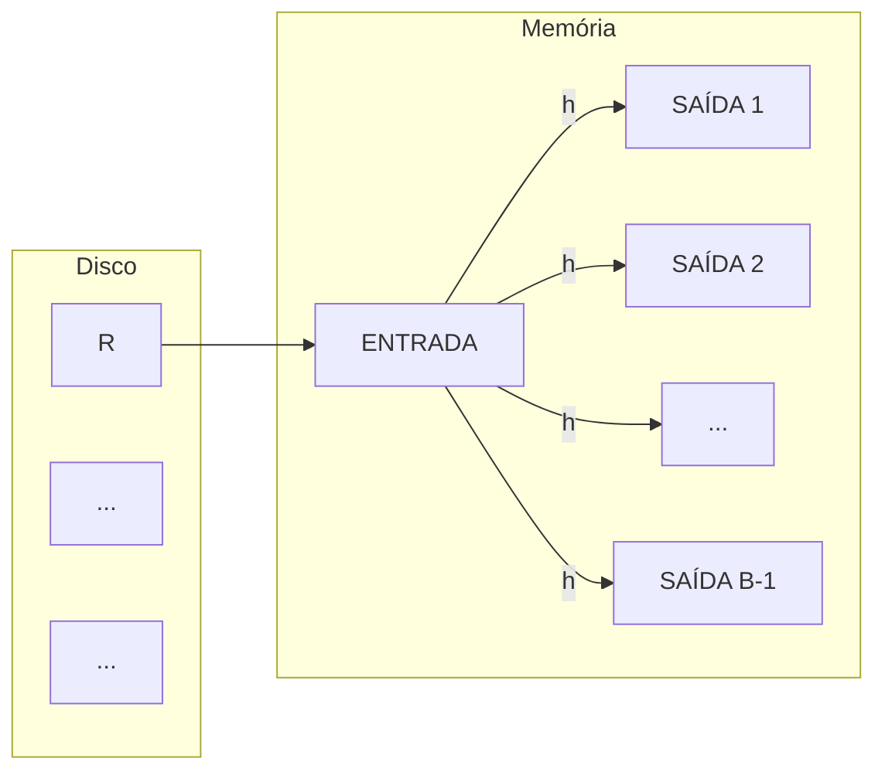

## Page 1

# Banco de dados II

## 9 – Avaliação de Operadores Relacionais

Marcos Roberto Ribeiro

Departamento de Engenharia e Computação (DEC)
Curso de Engenharia de Computação
2024

&lt;img&gt;Logo with white squares and dots&lt;/img&gt;
INSTITUTO FEDERAL
Minas Gerais
---
Bambuí

---


## Page 2

# Seleção

*   Esquema considerado:
    ```sql
    marinheiros(id_marin: integer, nome_marin: string,
                avaliacao: integer, idade: integer)
    reservas(id_marin: integer, id_barco: integer,
             dia: date, nome_resp: string)
    ```

## Exemplo

```sql
SELECT *
FROM reservas
WHERE nome_resp = 'Joe';
```
*   Se não houver índice sobre nome_resp, é preciso varrer a toda tabela
*   E se houver índice?

---


## Page 3

# Seleção e índices

## Índices de árvore B+

*   Considerando uma seleção σ(A op v)
*   Se o índice for agrupado, é melhor usá-lo
*   Senão, é preciso considerar o número de tuplas qualificadas
*   No caso de seleções de intervalos, muitas vezes, será melhor varrer toda a tabela do que usar o índice

## Índices de hash

*   Como estes índices suportam apenas seleção por igualdade, sempre devemos usá-los para este tipo de operação

---


## Page 4

# Condições da seleção

*   As seleções podem ter condições mais complexas do que simples comparações
*   Tais condições são, inicialmente, convertidas para a *forma normal conjuntiva*
*   Exemplo (Condição original)

```sql
(dia < '08/09/2017' AND nome_resp = 'Joe')
OR id_barco = 5 OR id_marin = 3
```

*   Exemplo (Condição em FNC)

```sql
(dia < '08/09/2017' OR id_barco = 5 OR id_marin = 3)
AND
(nome_resp = 'Joe' OR id_barco = 5 OR id_marin = 3)
```
---


## Page 5


# Avaliando seleções sem disjunção

*   Primeira opção:
    1.  Calcular o caminho mais seletivo (de acordo com parte da condição)
    2.  Obter as tuplas por esse caminho e aplicar os demais componentes da condição para obter o resultado final
*   Segunda opção (usar vários índices):
    1.  Obter os *rids* de todos os índices que satisfazem a condição
    2.  Fazer uma interseção entre esses *rids*
    3.  Aplicar o restante da condição de seleção

---


## Page 6

# Exemplo de avaliação de seleção sem disjunção

*   Condição: dia < '08/09/2017' AND id_barco = 5 AND id_marin = 3
*   Índice de Árvore B+ sobre dia
*   Índice de hash sobre id_marin
    *   1 rids(dia < '08/09/2017') ∩ rids(id_marin = 3)
*   2 Filtragem das tuplas com id_barco = 5

---


## Page 7


# Seleções com disjunções

*   Um único termo da disjunção pode provocar uma varredura de arquivo
*   Exemplo, supondo que existam somente os índices:
    *   hash sobre nome_resp
    *   hash sobre id_margin

**Condição:** (dia < '08/09/2017')
OR (nome_resp = 'Joe')

*   A condição (dia < '08/09/2017') causa uma varredura
*   Uma alternativa é realizar a varredura e testar se o registro que satisfaz uma das duas condições

**Condição:** (dia < '08/09/2017')
OR (nome_resp = 'Joe') AND
id_marin = 3

*   Nesse caso, o índice sobre id_marin pode ser usado para selecionar as tuplas qualificadas
*   Em seguida, as demais condições podem ser verificadas

---


## Page 8

# Projeção

```sql
SELECT DISTINCT id_marin, id_barco
FROM reservas;
```

## Avaliação de projeções

1. Remoção dos atributos indesejados
2. Eliminação das tuplas duplicadas

* O segundo passo é o mais difícil
* Duas técnicas principais podem ser usadas:
    * Projeção baseada em ordenação
    * Projeção baseada em hash

---


## Page 9

# Projeção baseada em ordenação

*   A projeção baseada em ordenação é feita da seguinte maneira:
    1.  Percorrer R e produzir um conjunto de tuplas com os atributos desejados (Custo: $M + T \text{ E/S}$, onde $M$ é o número de páginas de R e $T$ é o número de páginas do conjunto produzido)
    2.  Ordenar esse conjunto de tuplas (Custo: $O(T \log T \text{ E/S})$, como $T = O(M)$, temos $M \log M \text{ E/S}$)
    3.  Percorrer o resultado ordenado, comparando tuplas adjacentes, e descartar as duplicatas (Custo: $O(T) = M \text{ E/S}$)
*   Custo total: $2M + M \log M \text{ E/S}$
*   Uma otimização interessante é eliminar as duplicatas na fase de intercalação da ordenação

---


## Page 10

# Projeção baseada em hash - particionamento



Disco
Memória

Fase 1: Particionamento

Fase 2: Eliminação de duplicatas

---


## Page 11

# Projeção baseada em hash - particionamento

*   Lemos uma página de R por vez
*   Para cada tupla da página
    *   Aplicamos uma função hash $h$ sobre os atributos projetados
    *   Gravamos a tupla na partição correspondente a $h$
*   Páginas de saída cheias são gravadas em disco (uma partição pode ter várias páginas)
*   É garantido que tuplas de partições diferentes não são duplicatas

---


## Page 12

# Projeção baseada em hash - eliminação de duplicatas

*   Crie uma tabela hash em memória
*   Leia cada partição da face anterior (uma página por vez)
*   Para cada tupla da partição
    *   Aplique a função h' (diferente de h) e armazene a tupla na tabela hash
    *   Elimine duplicatas para tuplas com mesmo valor de h'
    *   Após a leitura completa da partição, grave o resultado em arquivo
*   Se a tabela hash não couber em memória, podemos aplicar o particionamento recursivamente

---


## Page 13

# Projeção baseada em hash - custo

*   Supondo uma relação R armazenada em M páginas e a projeção de R (sem eliminar duplicatas) armazenada em T páginas
*   Cada partição contém $O(\frac{T}{B-1}) = \frac{M}{B-1}$ páginas
*   Particionamento: $M + T$ E/S
*   Eliminação de duplicatas: $T$ E/S
*   Custo Total: $O(M + 2T) = 3M$ E/S

---


## Page 14

# Projeção – Ordenação x hash

*   Em geral, a ordenação é superior
    *   Principalmente quando há muitas duplicatas
*   A ordenação retorna um resultado ordenado
*   Os SGBDs já possuem a ordenação externa implementada

---


## Page 15

# Uso de índice para projeções

*   Um índice pode ser útil se a chave de pesquisa contém todos os atributos da projeção
*   Podemos recuperar os valores das chaves e aplicar uma das técnicas de projeção
*   Não acessamos a relação, apenas o índice que é bem menor
*   No caso dos atributos da projeção serem o prefixo da chave de pesquisa de uma árvore B+, a projeção pode ser mais eficiente ainda. Por quê?

---


## Page 16

# Junção

* A junção é uma operação muito importante e largamente usada no processamento de consultas

## Exemplo

```sql
SELECT *
FROM reservas r, marinheiros m
WHERE r.id_marin = m.id_marin
```

* As junções podem ser representadas por operações com produtos cartesianos, seleções e projeções
* Entretanto, o uso de algoritmos específicos para o processamento de junções é mais eficiente do que o processamento destas operações equivalentes
* A consulta anterior pode ser representada em álgebra relacional pela expressão $r \bowtie m$

---


## Page 17

# Junção de loops aninhados

## Algoritmo para processar a junção S ⋈_A S

```
[1] foreach tupla t ∈ R do
    [2]     foreach tupla t' ∈ S do
        [3]         if t.A = t'.A then
            [4]             Adiciona (t, t') ao resultado;
```

*   Supondo $R$ com $M$ páginas e $p_R$ tuplas / página, $S$ com $N$ páginas
*   O custo do algoritmo é $M + M \times p_R \times N E/S$
*   Podemos melhorar o algoritmo, se leremos uma página de cada tabela e fizermos a junção das tuplas destas páginas
*   Nesse caso, o custo cai para $M \times N E/S$

---


## Page 18

# Junção de loops aninhados de bloco

* O algoritmo de junção de loops aninhados simples não utiliza o buffer de memória de forma eficiente (Supondo B páginas de memória livres)
    * Lemos B – 2 páginas da relação externa
    * Percorremos a relação interna usando uma página
    * Usamos a última página para gravar o resultado
    * O custo será de M + N × M/B-2 E/S

## Algoritmo

```
[1] foreach bloco br de B - 2 páginas de R do
[2]     foreach página ps de S do
[3]         foreach tupla t ∈ br do
[4]             foreach tupla t' ∈ ps do
[5]                 if t.A = t'.A then
[6]                     Adiciona (t, t') ao resultado;
```

---


## Page 19

# Junção de loops aninhados indexados

*   Se houver um índice em uma das relações sobre o(s) atributo(s) da junção, podemos tirar proveito do índice e tornar esta relação a “interna”
*   O algoritmo lê as tuplas da relação externa e compara apenas com o índice da relação interna
*   Como o índice ocupa menos espaço, podemos ler mais tuplas da relação interna de uma vez
*   Custo: $M \times N E/S$ (este é o pior caso, se houverem poucas correspondências o custo será bem menor)

---


## Page 20

# Junção sort-merge

*   As duas relações são ordenadas sobre o atributo de junção
*   A ordenação agrupa as tuplas com o mesmo valor com o mesmo valor no atributo de junção em partições
*   Explorando esse particionamento, comparamos as tuplas de R apenas com as tuplas de S que estão na mesma partição
*   Após a ordenação, começamos na primeira tupla de cada relação e avançamos quando o valor for menor do que da outra relação

---


## Page 21

# Exemplo de junção sort-merge

<table>
  <thead>
    <tr>
      <th>id_marin</th>
      <th>nome_marin</th>
      <th>avaliacao</th>
      <th>idade</th>
    </tr>
  </thead>
  <tbody>
    <tr>
      <td>22</td>
      <td>dustin</td>
      <td>7</td>
      <td>45,0</td>
    </tr>
    <tr>
      <td>28</td>
      <td>yuppy</td>
      <td>9</td>
      <td>35,0</td>
    </tr>
    <tr>
      <td>31</td>
      <td>lubber</td>
      <td>8</td>
      <td>55,5</td>
    </tr>
    <tr>
      <td>36</td>
      <td>lubber</td>
      <td>6</td>
      <td>36,0</td>
    </tr>
    <tr>
      <td>44</td>
      <td>guppy</td>
      <td>5</td>
      <td>35,0</td>
    </tr>
    <tr>
      <td>58</td>
      <td>rusty</td>
      <td>10</td>
      <td>35,0</td>
    </tr>
  </tbody>
</table>

**Marinheiros**

<table>
  <thead>
    <tr>
      <th>id_marin</th>
      <th>id_barco</th>
      <th>dia</th>
      <th>nome_resp</th>
    </tr>
  </thead>
  <tbody>
    <tr>
      <td>28</td>
      <td>103</td>
      <td>12/04/1996</td>
      <td>guppy</td>
    </tr>
    <tr>
      <td>28</td>
      <td>103</td>
      <td>11/03/1996</td>
      <td>yuppy</td>
    </tr>
    <tr>
      <td>31</td>
      <td>101</td>
      <td>10/10/1996</td>
      <td>dustin</td>
    </tr>
    <tr>
      <td>31</td>
      <td>102</td>
      <td>10/12/1996</td>
      <td>lubber</td>
    </tr>
    <tr>
      <td>31</td>
      <td>101</td>
      <td>10/11/1996</td>
      <td>lubber</td>
    </tr>
    <tr>
      <td>58</td>
      <td>103</td>
      <td>11/12/1996</td>
      <td>dustin</td>
    </tr>
  </tbody>
</table>

**Reservas**

## Custo

*   Normalmente é próximo de M log M + N log N + M + N E/S
*   Porém, se houverem correspondências em todas as tuplas, será de M log M + N log N + M × N E/S
*   Isso ocorre apenas em casos raros, quando o atributo de junção possui valores iguais na maioria das linhas das duas tabelas

---


## Page 22

# Exemplo de junção sort-merge

<table>
  <thead>
    <tr>
      <th>id_marin</th>
      <th>nome_marin</th>
      <th>avaliacao</th>
      <th>idade</th>
    </tr>
  </thead>
  <tbody>
    <tr>
      <td>22</td>
      <td>dustin</td>
      <td>7</td>
      <td>45,0</td>
    </tr>
    <tr>
      <td>28</td>
      <td>yuppy</td>
      <td>9</td>
      <td>35,0</td>
    </tr>
    <tr>
      <td>31</td>
      <td>lubber</td>
      <td>8</td>
      <td>55,5</td>
    </tr>
    <tr>
      <td>36</td>
      <td>lubber</td>
      <td>6</td>
      <td>36,0</td>
    </tr>
    <tr>
      <td>44</td>
      <td>guppy</td>
      <td>5</td>
      <td>35,0</td>
    </tr>
    <tr>
      <td>58</td>
      <td>rusty</td>
      <td>10</td>
      <td>35,0</td>
    </tr>
  </tbody>
</table>

**Marinheiros**

<table>
  <thead>
    <tr>
      <th>id_marin</th>
      <th>id_barco</th>
      <th>dia</th>
      <th>nome_resp</th>
    </tr>
  </thead>
  <tbody>
    <tr>
      <td>28</td>
      <td>103</td>
      <td>12/04/1996</td>
      <td>guppy</td>
    </tr>
    <tr>
      <td>28</td>
      <td>103</td>
      <td>11/03/1996</td>
      <td>yuppy</td>
    </tr>
    <tr>
      <td>31</td>
      <td>101</td>
      <td>10/10/1996</td>
      <td>dustin</td>
    </tr>
    <tr>
      <td>31</td>
      <td>102</td>
      <td>10/12/1996</td>
      <td>lubber</td>
    </tr>
    <tr>
      <td>31</td>
      <td>101</td>
      <td>10/11/1996</td>
      <td>lubber</td>
    </tr>
    <tr>
      <td>58</td>
      <td>103</td>
      <td>11/12/1996</td>
      <td>dustin</td>
    </tr>
  </tbody>
</table>

**Reservas**

## Custo

*   Normalmente é próximo de M log M + N log N + M + N E/S
*   Porém, se houverem correspondências em todas as tuplas, será de M log M + N log N + M × N E/S
*   Isso ocorre apenas em casos raros, quando o atributo de junção possui valores iguais na maioria das linhas das duas tabelas

---


## Page 23

# Exemplo de junção sort-merge

<table>
  <thead>
    <tr>
      <th>id_marin</th>
      <th>nome_marin</th>
      <th>avaliacao</th>
      <th>idade</th>
    </tr>
  </thead>
  <tbody>
    <tr>
      <td>22</td>
      <td>dustin</td>
      <td>7</td>
      <td>45,0</td>
    </tr>
    <tr>
      <td>28</td>
      <td>yuppy</td>
      <td>9</td>
      <td>35,0</td>
    </tr>
    <tr>
      <td>31</td>
      <td>lubber</td>
      <td>8</td>
      <td>55,5</td>
    </tr>
    <tr>
      <td>36</td>
      <td>lubber</td>
      <td>6</td>
      <td>36,0</td>
    </tr>
    <tr>
      <td>44</td>
      <td>guppy</td>
      <td>5</td>
      <td>35,0</td>
    </tr>
    <tr>
      <td>58</td>
      <td>rusty</td>
      <td>10</td>
      <td>35,0</td>
    </tr>
  </tbody>
</table>

**Marinheiros**

<table>
  <thead>
    <tr>
      <th>id_marin</th>
      <th>id_barco</th>
      <th>dia</th>
      <th>nome_resp</th>
    </tr>
  </thead>
  <tbody>
    <tr>
      <td>28</td>
      <td>103</td>
      <td>12/04/1996</td>
      <td>guppy</td>
    </tr>
    <tr>
      <td>28</td>
      <td>103</td>
      <td>11/03/1996</td>
      <td>yuppy</td>
    </tr>
    <tr>
      <td>31</td>
      <td>101</td>
      <td>10/10/1996</td>
      <td>dustin</td>
    </tr>
    <tr>
      <td>31</td>
      <td>102</td>
      <td>10/12/1996</td>
      <td>lubber</td>
    </tr>
    <tr>
      <td>31</td>
      <td>101</td>
      <td>10/11/1996</td>
      <td>lubber</td>
    </tr>
    <tr>
      <td>58</td>
      <td>103</td>
      <td>11/12/1996</td>
      <td>dustin</td>
    </tr>
  </tbody>
</table>

**Reservas**

## Custo

*   Normalmente é próximo de M log M + N log N + M + N E/S
*   Porém, se houverem correspondências em todas as tuplas, será de M log M + N log N + M × N E/S
*   Isso ocorre apenas em casos raros, quando o atributo de junção possui valores iguais na maioria das linhas das duas tabelas

---


## Page 24

# Exemplo de junção sort-merge

<table>
  <thead>
    <tr>
      <th>id_marin</th>
      <th>nome_marin</th>
      <th>avaliacao</th>
      <th>idade</th>
    </tr>
  </thead>
  <tbody>
    <tr>
      <td>22</td>
      <td>dustin</td>
      <td>7</td>
      <td>45,0</td>
    </tr>
    <tr>
      <td>28</td>
      <td>yuppy</td>
      <td>9</td>
      <td>35,0</td>
    </tr>
    <tr>
      <td>31</td>
      <td>lubber</td>
      <td>8</td>
      <td>55,5</td>
    </tr>
    <tr>
      <td>36</td>
      <td>lubber</td>
      <td>6</td>
      <td>36,0</td>
    </tr>
    <tr>
      <td>44</td>
      <td>guppy</td>
      <td>5</td>
      <td>35,0</td>
    </tr>
    <tr>
      <td>58</td>
      <td>rusty</td>
      <td>10</td>
      <td>35,0</td>
    </tr>
  </tbody>
</table>

**Marinheiros**

<table>
  <thead>
    <tr>
      <th>id_marin</th>
      <th>id_barco</th>
      <th>dia</th>
      <th>nome_resp</th>
    </tr>
  </thead>
  <tbody>
    <tr>
      <td>28</td>
      <td>103</td>
      <td>12/04/1996</td>
      <td>guppy</td>
    </tr>
    <tr>
      <td>28</td>
      <td>103</td>
      <td>11/03/1996</td>
      <td>yuppy</td>
    </tr>
    <tr>
      <td>31</td>
      <td>101</td>
      <td>10/10/1996</td>
      <td>dustin</td>
    </tr>
    <tr>
      <td>31</td>
      <td>102</td>
      <td>10/12/1996</td>
      <td>lubber</td>
    </tr>
    <tr>
      <td>31</td>
      <td>101</td>
      <td>10/11/1996</td>
      <td>lubber</td>
    </tr>
    <tr>
      <td>58</td>
      <td>103</td>
      <td>11/12/1996</td>
      <td>dustin</td>
    </tr>
  </tbody>
</table>

**Reservas**

## Custo

*   Normalmente é próximo de M log M + N log N + M + N E/S
*   Porém, se houverem correspondências em todas as tuplas, será de M log M + N log N + M × N E/S
*   Isso ocorre apenas em casos raros, quando o atributo de junção possui valores iguais na maioria das linhas das duas tabelas

---


## Page 25

# Exemplo de junção sort-merge

<table>
  <thead>
    <tr>
      <th>id_marin</th>
      <th>nome_marin</th>
      <th>avaliacao</th>
      <th>idade</th>
    </tr>
  </thead>
  <tbody>
    <tr>
      <td>22</td>
      <td>dustin</td>
      <td>7</td>
      <td>45,0</td>
    </tr>
    <tr>
      <td>28</td>
      <td>yuppy</td>
      <td>9</td>
      <td>35,0</td>
    </tr>
    <tr>
      <td>31</td>
      <td>lubber</td>
      <td>8</td>
      <td>55,5</td>
    </tr>
    <tr>
      <td>36</td>
      <td>lubber</td>
      <td>6</td>
      <td>36,0</td>
    </tr>
    <tr>
      <td>44</td>
      <td>guppy</td>
      <td>5</td>
      <td>35,0</td>
    </tr>
    <tr>
      <td>58</td>
      <td>rusty</td>
      <td>10</td>
      <td>35,0</td>
    </tr>
  </tbody>
</table>

**Marinheiros**

<table>
  <thead>
    <tr>
      <th>id_marin</th>
      <th>id_barco</th>
      <th>dia</th>
      <th>nome_resp</th>
    </tr>
  </thead>
  <tbody>
    <tr>
      <td>28</td>
      <td>103</td>
      <td>12/04/1996</td>
      <td>guppy</td>
    </tr>
    <tr>
      <td>28</td>
      <td>103</td>
      <td>11/03/1996</td>
      <td>yuppy</td>
    </tr>
    <tr>
      <td>31</td>
      <td>101</td>
      <td>10/10/1996</td>
      <td>dustin</td>
    </tr>
    <tr>
      <td>31</td>
      <td>102</td>
      <td>10/12/1996</td>
      <td>lubber</td>
    </tr>
    <tr>
      <td>31</td>
      <td>101</td>
      <td>10/11/1996</td>
      <td>lubber</td>
    </tr>
    <tr>
      <td>58</td>
      <td>103</td>
      <td>11/12/1996</td>
      <td>dustin</td>
    </tr>
  </tbody>
</table>

**Reservas**

Custo

*   Normalmente é próximo de M log M + N log N + M + N E/S
*   Porém, se houverem correspondências em todas as tuplas, será de M log M + N log N + M × N E/S
*   Isso ocorre apenas em casos raros, quando o atributo de junção possui valores iguais na maioria das linhas das duas tabelas

---


## Page 26

# Exemplo de junção sort-merge

<table>
  <thead>
    <tr>
      <th>id_marin</th>
      <th>nome_marin</th>
      <th>avaliacao</th>
      <th>idade</th>
    </tr>
  </thead>
  <tbody>
    <tr>
      <td>22</td>
      <td>dustin</td>
      <td>7</td>
      <td>45,0</td>
    </tr>
    <tr>
      <td>28</td>
      <td>yuppy</td>
      <td>9</td>
      <td>35,0</td>
    </tr>
    <tr>
      <td>31</td>
      <td>lubber</td>
      <td>8</td>
      <td>55,5</td>
    </tr>
    <tr>
      <td>36</td>
      <td>lubber</td>
      <td>6</td>
      <td>36,0</td>
    </tr>
    <tr>
      <td>44</td>
      <td>guppy</td>
      <td>5</td>
      <td>35,0</td>
    </tr>
    <tr>
      <td>58</td>
      <td>rusty</td>
      <td>10</td>
      <td>35,0</td>
    </tr>
  </tbody>
</table>

**Marinheiros**

<table>
  <thead>
    <tr>
      <th>id_marin</th>
      <th>id_barco</th>
      <th>dia</th>
      <th>nome_resp</th>
    </tr>
  </thead>
  <tbody>
    <tr>
      <td>28</td>
      <td>103</td>
      <td>12/04/1996</td>
      <td>guppy</td>
    </tr>
    <tr>
      <td>28</td>
      <td>103</td>
      <td>11/03/1996</td>
      <td>yuppy</td>
    </tr>
    <tr>
      <td>31</td>
      <td>101</td>
      <td>10/10/1996</td>
      <td>dustin</td>
    </tr>
    <tr>
      <td>31</td>
      <td>102</td>
      <td>10/12/1996</td>
      <td>lubber</td>
    </tr>
    <tr>
      <td>31</td>
      <td>101</td>
      <td>10/11/1996</td>
      <td>lubber</td>
    </tr>
    <tr>
      <td>58</td>
      <td>103</td>
      <td>11/12/1996</td>
      <td>dustin</td>
    </tr>
  </tbody>
</table>

**Reservas**

Custo

*   Normalmente é próximo de M log M + N log N + M + N E/S
*   Porém, se houverem correspondências em todas as tuplas, será de M log M + N log N + M × N E/S
*   Isso ocorre apenas em casos raros, quando o atributo de junção possui valores iguais na maioria das linhas das duas tabelas

---


## Page 27

# Exemplo de junção sort-merge

<table>
  <thead>
    <tr>
      <th>id_marin</th>
      <th>nome_marin</th>
      <th>avaliacao</th>
      <th>idade</th>
    </tr>
  </thead>
  <tbody>
    <tr>
      <td>22</td>
      <td>dustin</td>
      <td>7</td>
      <td>45,0</td>
    </tr>
    <tr>
      <td>28</td>
      <td>yuppy</td>
      <td>9</td>
      <td>35,0</td>
    </tr>
    <tr>
      <td>31</td>
      <td>lubber</td>
      <td>8</td>
      <td>55,5</td>
    </tr>
    <tr>
      <td>36</td>
      <td>lubber</td>
      <td>6</td>
      <td>36,0</td>
    </tr>
    <tr>
      <td>44</td>
      <td>guppy</td>
      <td>5</td>
      <td>35,0</td>
    </tr>
    <tr>
      <td>58</td>
      <td>rusty</td>
      <td>10</td>
      <td>35,0</td>
    </tr>
  </tbody>
</table>

**Marinheiros**

<table>
  <thead>
    <tr>
      <th>id_marin</th>
      <th>id_barco</th>
      <th>dia</th>
      <th>nome_resp</th>
    </tr>
  </thead>
  <tbody>
    <tr>
      <td>28</td>
      <td>103</td>
      <td>12/04/1996</td>
      <td>guppy</td>
    </tr>
    <tr>
      <td>28</td>
      <td>103</td>
      <td>11/03/1996</td>
      <td>yuppy</td>
    </tr>
    <tr>
      <td>31</td>
      <td>101</td>
      <td>10/10/1996</td>
      <td>dustin</td>
    </tr>
    <tr>
      <td>31</td>
      <td>102</td>
      <td>10/12/1996</td>
      <td>lubber</td>
    </tr>
    <tr>
      <td>31</td>
      <td>101</td>
      <td>10/11/1996</td>
      <td>lubber</td>
    </tr>
    <tr>
      <td>58</td>
      <td>103</td>
      <td>11/12/1996</td>
      <td>dustin</td>
    </tr>
  </tbody>
</table>

**Reservas**

## Custo

*   Normalmente é próximo de M log M + N log N + M + N E/S
*   Porém, se houverem correspondências em todas as tuplas, será de M log M + N log N + M × N E/S
*   Isso ocorre apenas em casos raros, quando o atributo de junção possui valores iguais na maioria das linhas das duas tabelas

---


## Page 28

# Exemplo de junção sort-merge

<table>
  <thead>
    <tr>
      <th>id_marin</th>
      <th>nome_marin</th>
      <th>avaliacao</th>
      <th>idade</th>
    </tr>
  </thead>
  <tbody>
    <tr>
      <td>22</td>
      <td>dustin</td>
      <td>7</td>
      <td>45,0</td>
    </tr>
    <tr>
      <td>28</td>
      <td>yuppy</td>
      <td>9</td>
      <td>35,0</td>
    </tr>
    <tr>
      <td>31</td>
      <td>lubber</td>
      <td>8</td>
      <td>55,5</td>
    </tr>
    <tr>
      <td>36</td>
      <td>lubber</td>
      <td>6</td>
      <td>36,0</td>
    </tr>
    <tr>
      <td>44</td>
      <td>guppy</td>
      <td>5</td>
      <td>35,0</td>
    </tr>
    <tr>
      <td>58</td>
      <td>rusty</td>
      <td>10</td>
      <td>35,0</td>
    </tr>
  </tbody>
</table>

**Marinheiros**

<table>
  <thead>
    <tr>
      <th>id_marin</th>
      <th>id_barco</th>
      <th>dia</th>
      <th>nome_resp</th>
    </tr>
  </thead>
  <tbody>
    <tr>
      <td>28</td>
      <td>103</td>
      <td>12/04/1996</td>
      <td>guppy</td>
    </tr>
    <tr>
      <td>28</td>
      <td>103</td>
      <td>11/03/1996</td>
      <td>yuppy</td>
    </tr>
    <tr>
      <td>31</td>
      <td>101</td>
      <td>10/10/1996</td>
      <td>dustin</td>
    </tr>
    <tr>
      <td>31</td>
      <td>102</td>
      <td>10/12/1996</td>
      <td>lubber</td>
    </tr>
    <tr>
      <td>31</td>
      <td>101</td>
      <td>10/11/1996</td>
      <td>lubber</td>
    </tr>
    <tr>
      <td>58</td>
      <td>103</td>
      <td>11/12/1996</td>
      <td>dustin</td>
    </tr>
  </tbody>
</table>

**Reservas**

## Custo

*   Normalmente é próximo de M log M + N log N + M + N E/S
*   Porém, se houverem correspondências em todas as tuplas, será de M log M + N log N + M × N E/S
*   Isso ocorre apenas em casos raros, quando o atributo de junção possui valores iguais na maioria das linhas das duas tabelas

---


## Page 29

# Exemplo de junção sort-merge

<table>
  <thead>
    <tr>
      <th>id_marin</th>
      <th>nome_marin</th>
      <th>avaliacao</th>
      <th>idade</th>
    </tr>
  </thead>
  <tbody>
    <tr>
      <td>22</td>
      <td>dustin</td>
      <td>7</td>
      <td>45,0</td>
    </tr>
    <tr>
      <td>28</td>
      <td>yuppy</td>
      <td>9</td>
      <td>35,0</td>
    </tr>
    <tr>
      <td>31</td>
      <td>lubber</td>
      <td>8</td>
      <td>55,5</td>
    </tr>
    <tr>
      <td>36</td>
      <td>lubber</td>
      <td>6</td>
      <td>36,0</td>
    </tr>
    <tr>
      <td>44</td>
      <td>guppy</td>
      <td>5</td>
      <td>35,0</td>
    </tr>
    <tr>
      <td>58</td>
      <td>rusty</td>
      <td>10</td>
      <td>35,0</td>
    </tr>
  </tbody>
</table>

Marinheiros

<table>
  <thead>
    <tr>
      <th>id_marin</th>
      <th>id_barco</th>
      <th>dia</th>
      <th>nome_resp</th>
    </tr>
  </thead>
  <tbody>
    <tr>
      <td>28</td>
      <td>103</td>
      <td>12/04/1996</td>
      <td>guppy</td>
    </tr>
    <tr>
      <td>28</td>
      <td>103</td>
      <td>11/03/1996</td>
      <td>yuppy</td>
    </tr>
    <tr>
      <td>31</td>
      <td>101</td>
      <td>10/10/1996</td>
      <td>dustin</td>
    </tr>
    <tr>
      <td>31</td>
      <td>102</td>
      <td>10/12/1996</td>
      <td>lubber</td>
    </tr>
    <tr>
      <td>31</td>
      <td>101</td>
      <td>10/11/1996</td>
      <td>lubber</td>
    </tr>
    <tr>
      <td>58</td>
      <td>103</td>
      <td>11/12/1996</td>
      <td>dustin</td>
    </tr>
  </tbody>
</table>

Reservas

## Custo

*   Normalmente é próximo de M log M + N log N + M + N E/S
*   Porém, se houverem correspondências em todas as tuplas, será de M log M + N log N + M × N E/S
*   Isso ocorre apenas em casos raros, quando o atributo de junção possui valores iguais na maioria das linhas das duas tabelas

---


## Page 30

# Junção por hash

*   Possui duas fases:
    1) Particionamento: Fazemos hash das duas relações no atributo de junção, usando a mesma função de hash *h*
    2) Correspondência: Comparamos as tuplas em uma partição de R somente com as tuplas na partição correspondente de S
*   Na fase de correspondência, para cada partição de R, construímos uma tabela hash em memória usando uma função *h'* (diferente de *h*)
*   Lemos então, a partição de S correspondente e comparamos apenas as tuplas com mesmo valor de *h'*.
*   Custo: $3(M + N)$ E/S (este custo pode ser maior se não houver memória para conter uma partição)

---


## Page 31

# Operações de conjunto

*   A operação $R \cap S$ pode ser vista como um caso especial de junção
    *   Junção com igualdade em todos os atributos $R \bowtie_{A_1=A'_1 \wedge ... \wedge A_n=A'_n} S$
*   União e diferença (com eliminação de duplicatas)
    *   Ordenação
*   hash

---


## Page 32

# União e diferença usando ordenação

1.  Ordene R e S considerando todos os atributos
2.  Percorra R e S ordenadas em paralelo e intercale, eliminando as duplicatas
    União (R ∪ S): pegue cada tupla t presente em R e S
    Diferença (R – S): pegue t ∈ R tal que t ∈ S

---


## Page 33

# União e diferença usando hash

1 Particione R e S usando uma função de hash h

2 Para cada partição I
    1 Construa uma tabela de hash H em memória para RI (usando uma função h' ≠ h)
    2 Para cada tupla t ∈ SI
        União (R ∪ S): Se t ∉ H, insira t em H
        Diferença (R – S): Se t ∈ H, remova t de H

3 Adicione as tuplas de H ao resultado

---


## Page 34


IFMG

# Operações agregadas

*   Algoritmo básico
    *   Varre a relação
    *   Mantém informações em memória

<table>
  <thead>
    <tr>
      <th>Operação</th>
      <th>Informação</th>
    </tr>
  </thead>
  <tbody>
    <tr>
      <td>SUM</td>
      <td>total</td>
    </tr>
    <tr>
      <td>AVG</td>
      <td>total, contagem</td>
    </tr>
    <tr>
      <td>COUNT</td>
      <td>contagem</td>
    </tr>
    <tr>
      <td>MIN</td>
      <td>menor valor</td>
    </tr>
    <tr>
      <td>MAX</td>
      <td>maior valor</td>
    </tr>
  </tbody>
</table>

*   Cláusula GROUP BY
    *   Agrupa o resultado da função

---


## Page 35

# Operações agregadas - estratégias

## Estratégia de ordenação

*   Ordena a relação pelos atributos de agrupamento
*   Percorre a relação novamente para calcular a operação agregada
*   Possui o mesmo custo da ordenação: O(M log M)

## Estratégia de hash

*   Constrói uma tabela hash
    *   valor-agrupamento → informação
*   Percorremos a relação e atualizamos a tabela hash
*   Custo: O(M)
*   O custo pode ser pior se a tabela hash não couber em memória

## Usando Índices

*   Pode ser feita uma avaliação somente de índice se houver um índice adequado

---


## Page 36

# Referências

DATE, C. J. Introdução a sistemas de bancos de dados. Rio de Janeiro: Elsevier, 2004.

ELMASRI, R.; NAVATHE, S. B. Sistemas de banco de dados. 7. ed. São Paulo: Pearson Addison Wesley, 2018.

RAMAKRISHNAN, R.; GEHRKE, J. Sistemas de gerenciamento de banco de dados. 3. ed. São Paulo: McGrawHill, 2008.

SILBERSCHATZ, A.; KORTH, H. F.; SUDARSHAN, S. Sistema de bancos de dados. 3. ed. São Paulo: Campus, 2007.
