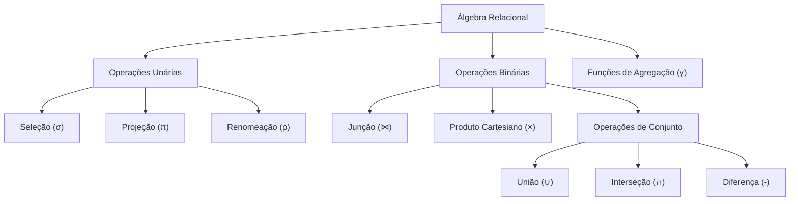
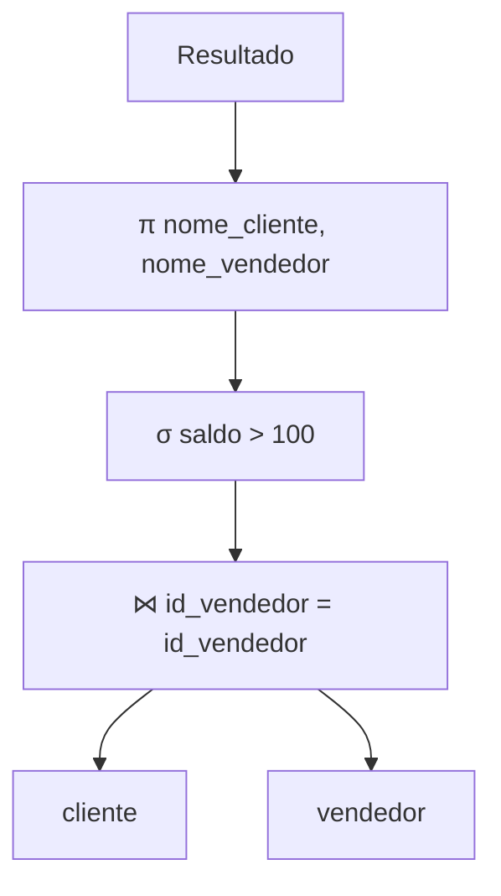
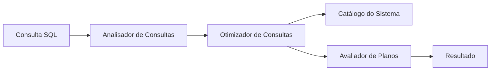
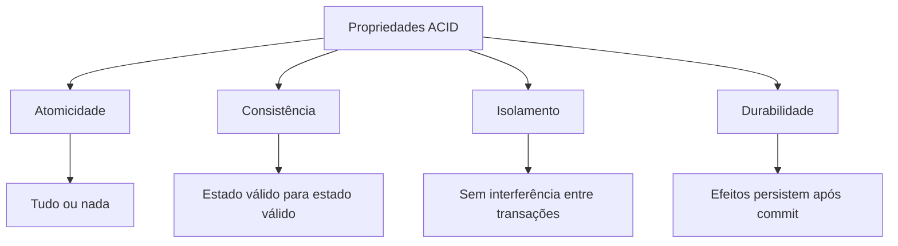
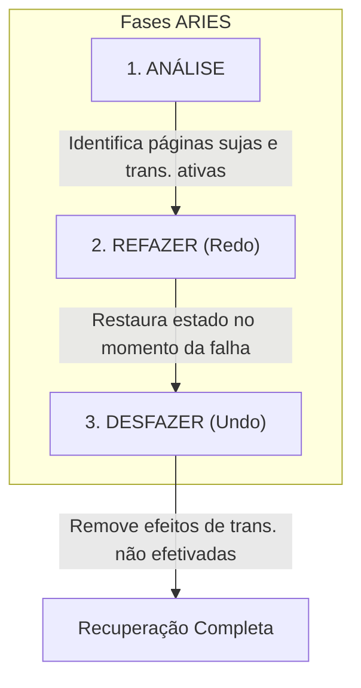

# Guia de Estudos Avançados em Banco de Dados II

**Autor:** Baseado nos materiais do Prof. Marcos Roberto Ribeiro  
**Instituição:** Instituto Federal Minas Gerais (IFMG) - Campus Bambuí  
**Curso:** Engenharia de Computação  

---

## Sumário

1. [Módulo 1: Álgebra Relacional](#módulo-1-álgebra-relacional)
2. [Módulo 2: Visão Geral da Avaliação de Consultas](#módulo-2-visão-geral-da-avaliação-de-consultas)
3. [Módulo 3: Ordenação Externa](#módulo-3-ordenação-externa)
4. [Módulo 4: Avaliação de Operadores Relacionais](#módulo-4-avaliação-de-operadores-relacionais)
5. [Módulo 5: Gerenciamento de Transações](#módulo-5-gerenciamento-de-transações)
6. [Módulo 6: Recuperação após Falhas](#módulo-6-recuperação-após-falhas)

---

# Módulo 1: Álgebra Relacional

## 1.1 Introdução à Álgebra Relacional

### Definição
A **Álgebra Relacional** é uma linguagem formal utilizada no modelo relacional composta por um conjunto de operadores que, quando combinados, permitem realizar diversos tipos de operações sobre relações (tabelas).

### Problema Resolvido
Fornece uma base teórica e matemática para manipulação de dados relacionais. Os SGBDs traduzem consultas SQL para expressões de álgebra relacional para realizar o processamento de consultas.

### Característica Fundamental
Toda operação da Álgebra Relacional possui **uma ou mais relações como entrada** e **uma relação como saída** (propriedade de fechamento).

### Principais Operações



---

## 1.2 Operação de Seleção (σ)

### Definição
A operação de **seleção** permite filtrar tuplas de uma relação que atendam certas condições (seleção horizontal).

### Sintaxe
```
σ<condição>(<relação>)
```

### Uso/Aplicação
- A condição pode conter comparações usando: `=`, `≠`, `<`, `≤`, `>`, `≥`
- As comparações podem ser combinadas com conectivos: `∧` (AND), `∨` (OR), `¬` (NOT)

### Exemplo
**Consulta:** "Informe os clientes com saldo maior ou igual a 100"

| SQL | Álgebra Relacional |
|-----|-------------------|
| `SELECT * FROM cliente WHERE saldo >= 100;` | σ<sub>saldo≥100</sub>(cliente) |

---

## 1.3 Operação de Projeção (π)

### Definição
A operação de **projeção** extrai colunas específicas de uma relação (seleção vertical), eliminando duplicatas.

### Sintaxe
```
π<atributos>(<relação>)
```

### Exemplo
**Consulta:** "Informe o nome e endereço dos clientes"

| SQL | Álgebra Relacional |
|-----|-------------------|
| `SELECT nome_cliente, endereco FROM cliente;` | π<sub>nome_cliente,endereco</sub>(cliente) |

### Combinação Seleção + Projeção
**Consulta:** "Informe o nome e endereço dos clientes com saldo ≥ 100"

```
π_{nome_cliente,endereco}(σ_{saldo≥100}(cliente))
```

---

## 1.4 Produto Cartesiano (×)

### Definição
Combina **todas** as tuplas de duas relações, gerando todas as combinações possíveis.

### Sintaxe
```
<relação1> × <relação2>
```

### Especificidades
- Se *relação1* possui **n** tuplas e *relação2* possui **m** tuplas, o resultado terá **n × m** tuplas
- A relação resultante possui os atributos de ambas as relações

---

## 1.5 Renomeação (ρ)

### Definição
Permite renomear relações e/ou atributos.

### Sintaxes
```
ρ_{<nova_relação>}(<relação>)           -- Renomear relação
ρ(<A'₁>,...,<A'ₙ>)(<relação>)           -- Renomear atributos
ρ(<A>/<A'>)(<relação>)                   -- Renomear atributo específico
```

### Uso/Aplicação
Especialmente útil quando uma tabela precisa ser usada mais de uma vez em uma expressão (auto-junção).

---

## 1.6 Operações de Conjunto

### Definição
Operações que tratam relações como conjuntos matemáticos.

### Requisito
As relações devem ter o **mesmo número de atributos** e **domínios correspondentes idênticos**.

| Operação | Símbolo | SQL |
|----------|---------|-----|
| União | ∪ | UNION |
| Interseção | ∩ | INTERSECT |
| Diferença | - | EXCEPT |

### Exemplo
```sql
-- SQL
SELECT nome_cliente FROM cliente
UNION
SELECT nome_vend FROM vendedor;

-- Álgebra Relacional
π_{nome_cliente}(cliente) ∪ π_{nome_vend}(vendedor)
```

---

## 1.7 Junção (⋈)

### Definição
Combina tuplas de duas relações baseando-se em condições de comparação entre atributos.

### Sintaxe
```
<relação1> ⋈<condição> <relação2>
```

### Tipos de Junção

| Tipo | Símbolo | Descrição |
|------|---------|-----------|
| Junção Natural | ⋈ | Igualdade em atributos homônimos |
| Left Join | ⟕ | Mantém todas as tuplas da esquerda |
| Right Join | ⟖ | Mantém todas as tuplas da direita |
| Full Outer Join | ⟗ | Mantém todas as tuplas de ambas |

### Exemplo
**Consulta:** "Informe os clientes e seus vendedores"

```sql
-- SQL
SELECT nome_cliente, nome_vendedor
FROM cliente, vendedor
WHERE cliente.id_vendedor = vendedor.id_vendedor;

-- Álgebra Relacional
π_{nome_cliente,nome_vendedor}(cliente ⋈_{id_vendedor=id_vendedor} vendedor)
```

---

## 1.8 Funções de Agregação (γ)

### Definição
Agrupa tuplas e sumariza dados de atributos.

### Sintaxe
```
<A₁>,...,<Aₙ> γ <F₁(A'₁)>,...,<Fₘ(A'ₘ)> (<relação>)
```

### Funções Disponíveis
- **SUM**: Soma dos valores
- **AVG**: Média dos valores
- **MAX**: Valor máximo
- **MIN**: Valor mínimo
- **COUNT**: Contagem de tuplas

### Exemplo
**Consulta:** "Informe o total de vendas de cada mês"

```sql
-- SQL
SELECT mes, SUM(valor) FROM venda GROUP BY mes;

-- Álgebra Relacional
_{mes} γ _{SUM(valor)} (venda)
```

---

## 1.9 Planos de Execução de Consultas

### Definição
Os SGBDs traduzem consultas SQL para **expressões algébricas** e depois para **planos de execução** representados por árvores.

### Exemplo de Plano



---

## Exercícios - Módulo 1

**Questão 1:** Considere uma relação `cliente(id, nome, cidade, saldo)`. Escreva a expressão de álgebra relacional para: "Obter o nome dos clientes de 'Bambuí' com saldo maior que 500".

<details>
<summary>💡 Dica</summary>
Combine os operadores de seleção (σ) para as duas condições e projeção (π) para extrair apenas o nome.
</details>

<details>
<summary>✅ Resolução</summary>

```
π_{nome}(σ_{cidade='Bambuí' ∧ saldo>500}(cliente))
```

Ou de forma equivalente:
```
π_{nome}(σ_{cidade='Bambuí'}(σ_{saldo>500}(cliente)))
```
</details>

---

**Questão 2:** Qual a diferença entre produto cartesiano e junção? Por que não é recomendável usar produto cartesiano com seleção para simular uma junção?

<details>
<summary>💡 Dica</summary>
Pense no número de tuplas geradas pelo produto cartesiano e como isso afeta a performance.
</details>

<details>
<summary>✅ Resolução</summary>

- O **produto cartesiano** gera todas as combinações possíveis entre tuplas (n × m tuplas)
- A **junção** combina apenas as tuplas que satisfazem a condição de junção
- **Não é recomendável** usar produto cartesiano + seleção porque:
  - Gera um volume de dados intermediário muito grande (n × m)
  - Os algoritmos de junção nativos são otimizados para combinar e filtrar simultaneamente
  - Maior consumo de memória e operações de E/S
</details>

---

# Módulo 2: Visão Geral da Avaliação de Consultas

## 2.1 Introdução

### Definição
A **avaliação de consultas** é o processo pelo qual os SGBDs traduzem código SQL para planos de execução e os executam de forma eficiente.

### Problema Resolvido
Encontrar um bom plano de execução (não necessariamente o ótimo) que minimize o custo de processamento de consultas.

### Fluxo de Avaliação



---

## 2.2 Catálogo do Sistema

### Definição
Tabelas especiais que armazenam **metadados** (dados sobre os dados) do banco de dados. Também conhecido como **dicionário de dados**.

### Informações Armazenadas

| Categoria | Metadados |
|-----------|-----------|
| **Tabelas** | Nome, arquivo, estrutura, atributos (nome e tipo), índices, restrições |
| **Índices** | Nome, estrutura, atributos da chave |
| **Estatísticas** | Cardinalidade, tamanho, altura de índices |

### Estatísticas Importantes

| Estatística | Símbolo | Descrição |
|-------------|---------|-----------|
| Cardinalidade | NTuplas | Número de tuplas da tabela |
| Tamanho | NPaginas | Número de páginas da tabela |
| Chaves Distintas | NChaves | Número de valores únicos no índice |
| Altura do Índice | IAltura | Níveis não-folha do índice árvore |
| Faixa do Índice | IBaixo/IAlto | Valores mínimo e máximo da chave |

---

## 2.3 Técnicas de Processamento de Operadores

### Três Técnicas Principais

1. **Indexação:** Uso de índice para obter apenas tuplas qualificadas (eficiente para seleções seletivas)
2. **Iteração:** Varrer todas as tuplas/entradas (necessário quando não há índice)
3. **Particionamento:** Decompõe operação em partes menores (usado em ordenação e hash)

---

## 2.4 Caminhos de Acesso e Seletividade

### Definição
Um **caminho de acesso** é uma forma de recuperar tuplas de uma tabela (varredura, índice hash, índice B+, etc.).

### Seletividade
A **seletividade** de um caminho de acesso é o número de páginas recuperadas usando tal caminho.

### Regra Fundamental
> É melhor usar o caminho **mais seletivo** (que recupera o menor número de páginas).

---

## 2.5 Algoritmos para Seleção

### Sem Índice
Varredura completa da tabela (table scan)

### Com Índice B+
- **Índice agrupado**: Geralmente vantajoso usar
- **Índice não agrupado**: Considerar seletividade - se retornar muitas tuplas, varredura pode ser melhor

### Com Índice Hash
Ideal para seleções por **igualdade** (custo ~1.2 E/S)

---

## 2.6 Algoritmos para Projeção

### Desafio Principal
Eliminação de duplicatas (cláusula DISTINCT)

### Estratégias

| Estratégia | Descrição | Custo |
|------------|-----------|-------|
| **Ordenação** | Ordena dados para identificar duplicatas adjacentes | O(M log M) |
| **Hash** | Usa partições hash para agrupar possíveis duplicatas | O(3M) |
| **Índice** | Se índice cobrir todos os campos projetados | Depende do índice |

---

## 2.7 Algoritmos para Junção

### Tabelas de Exemplo
- **marinheiros**: 500 páginas, 80 registros/página
- **reservas**: 1.000 páginas, 100 registros/página

### Comparação de Algoritmos

| Algoritmo | Descrição | Custo Exemplo |
|-----------|-----------|---------------|
| **Loops Aninhados Indexados** | Usa índice na relação interna | ~221.000 E/S |
| **Sort-Merge** | Ordena ambas as tabelas e intercala | ~7.500 E/S |

---

## 2.8 Avaliação Pipeline

### Definição
O resultado de um operador é encaminhado diretamente para o próximo operador, **sem materialização** em tabelas temporárias.

### Vantagens
- Economia de gravação e leitura de dados intermediários
- Redução de operações de E/S
- Menor uso de espaço em disco

### Interface Iteradora
Implementação padrão dos operadores com funções uniformes:
- `open()`: Inicializa o operador
- `get_next()`: Processa e retorna a próxima tupla
- `close()`: Finaliza e desaloca recursos

---

## 2.9 Planos de Profundidade à Esquerda

### Definição
Árvores onde o **filho direito** de cada junção é sempre uma tabela base (não uma junção).

### Vantagens
- Facilita avaliação **totalmente encadeada** (pipeline)
- Permite uso eficiente de **programação dinâmica** na otimização
- Reduz o espaço de busca de planos alternativos

---

## Exercícios - Módulo 2

**Questão 1:** O que é um metadado? Quais os metadados armazenados no catálogo do sistema?

<details>
<summary>💡 Dica</summary>
Metadado é informação sobre a estrutura e características dos dados, não os dados em si.
</details>

<details>
<summary>✅ Resolução</summary>

**Metadado** é um dado sobre os dados.

O catálogo do sistema armazena:
- **Sobre Tabelas:** Nome, arquivo, estrutura, nomes e tipos dos atributos, índices, restrições
- **Sobre Índices:** Nome, estrutura, atributos da chave
- **Estatísticas:** Cardinalidade (NTuplas), tamanho (NPaginas), chaves distintas (NChaves), altura do índice (IAltura), faixa de valores (IBaixo/IAlto)
</details>

---

**Questão 2:** Explique as três técnicas mais comumente usadas para avaliação de operadores relacionais.

<details>
<summary>💡 Dica</summary>
Pense em como acessar dados: diretamente por índice, varrendo tudo, ou dividindo em partes.
</details>

<details>
<summary>✅ Resolução</summary>

1. **Indexação:** Uso de índices para recuperar apenas as tuplas que satisfazem uma condição específica (evita varredura completa)

2. **Iteração:** Varredura sequencial de todas as tuplas de uma tabela ou entradas de um índice

3. **Particionamento:** Decomposição das operações em partes menores, operando sobre subconjuntos de dados (comum em ordenação e hashing)
</details>

---

**Questão 3:** Quais os benefícios das avaliações encadeadas (pipeline)?

<details>
<summary>💡 Dica</summary>
Compare com a alternativa de gravar resultados intermediários em disco.
</details>

<details>
<summary>✅ Resolução</summary>

A avaliação pipeline permite que o resultado de um operador seja passado diretamente para o próximo operador assim que é processado, sem materialização. Benefícios:

- **Economia de E/S:** Evita gravar e ler dados intermediários do disco
- **Menor uso de espaço:** Não precisa de tabelas temporárias
- **Menor latência:** O próximo operador começa a processar antes do anterior terminar completamente
</details>

---

# Módulo 3: Ordenação Externa

## 3.1 Introdução

### Definição
**Ordenação externa** é o processo de ordenar dados que **não cabem** na memória principal, utilizando armazenamento secundário (disco).

### Problema Resolvido
Ordenar grandes volumes de dados de forma eficiente, minimizando operações de E/S.

### Quando Ordenar Dados?
- Resultado requerido em ordem específica (`ORDER BY`)
- Carregamento em massa para criação de índices
- Eliminação de duplicatas (`DISTINCT`)
- Algoritmos de junção Sort-Merge

---

## 3.2 Merge-Sort de Duas Vias Simples

### Funcionamento
Utiliza apenas **3 páginas** de memória (duas para entrada, uma para saída).

### Análise de Complexidade
- Para arquivo com **N** páginas: ⌈log₂N⌉ + 1 passagens
- Cada passagem: 2 E/S por página (leitura + gravação)
- **Custo total:** 2N × (⌈log₂N⌉ + 1) E/S

---

## 3.3 Merge-Sort Externo (B páginas)

### Definição
Versão otimizada que utiliza **B páginas** disponíveis em memória, permitindo intercalação de B-1 vias.

### Fases
1. **Passagem 0:** Leia B páginas, ordene internamente, grave ⌈N/B⌉ séries de B páginas
2. **Demais Passagens:** Use B-1 páginas de entrada, intercale e grave na saída

### Análise de Complexidade
- Número de passagens: ⌈log<sub>B-1</sub>(⌈N/B⌉)⌉ + 1
- **Custo total:** 2N × (número de passagens) E/S

---

## 3.4 Exemplo Prático

**Arquivo:** 108 páginas, 5 páginas em memória

| Passagem | Séries Produzidas | Tamanho das Séries |
|----------|-------------------|-------------------|
| 0 | ⌈108/5⌉ = 22 | 5 páginas |
| 1 | ⌈22/4⌉ = 6 | 20 páginas |
| 2 | ⌈6/4⌉ = 2 | 80 páginas |
| 3 | 1 | 108 páginas (ordenado!) |

---

## 3.5 Impacto do Tamanho do Buffer

| N (páginas) | B=3 | B=5 | B=17 | B=129 | B=257 |
|-------------|-----|-----|------|-------|-------|
| 100 | 7 | 4 | 2 | 1 | 1 |
| 10.000 | 13 | 7 | 4 | 2 | 2 |
| 1.000.000 | 20 | 10 | 5 | 3 | 3 |

> **Observação:** Aumentar B reduz significativamente o número de passagens!

---

## 3.6 Otimizações

### E/S Bloqueada
- Ler/gravar grupos de **b** páginas de uma vez (b < B)
- Reduz custo de seeks em disco
- Trade-off: aumenta passagens, mas melhora throughput de E/S

### Bufferização Dupla
Mantém buffers alternativos para permitir E/S assíncrona enquanto CPU processa.

---

## 3.7 Ordenação com Índices B+

### Índice Agrupado (Clustered)
- **Muito eficiente**: dados já ordenados nas folhas
- Basta varrer as folhas sequencialmente

### Índice Não Agrupado (Unclustered)
- Pode ser **menos eficiente** que varrer dados diretamente
- Cada entrada de folha aponta para localização diferente no disco
- Causa muitos acessos aleatórios

---

## Exercícios - Módulo 3

**Questão 1:** Quais operações de banco de dados utilizam ordenação?

<details>
<summary>💡 Dica</summary>
Pense além de ORDER BY - onde mais dados ordenados são úteis?
</details>

<details>
<summary>✅ Resolução</summary>

- Cláusulas `ORDER BY`
- Operações `GROUP BY`
- Eliminação de duplicatas (`DISTINCT`)
- Algoritmos de junção Sort-Merge
- Criação de índices (Bulk Loading)
</details>

---

**Questão 2:** Como o merge-sort externo melhora o algoritmo de duas vias simples?

<details>
<summary>💡 Dica</summary>
Compare o número de vias de intercalação em cada abordagem.
</details>

<details>
<summary>✅ Resolução</summary>

O merge-sort externo utiliza **B páginas** de memória (em vez de apenas 3), permitindo:
- Criar séries ordenadas iniciais **maiores** (B páginas cada)
- Realizar intercalação de **B-1 vias** em cada passagem
- Reduzir drasticamente o número de passagens de ⌈log₂N⌉+1 para ⌈log<sub>B-1</sub>(⌈N/B⌉)⌉+1
</details>

---

**Questão 3:** Explique quando usar e quando NÃO usar um índice B+ para ordenação.

<details>
<summary>💡 Dica</summary>
A diferença está em como os dados estão organizados fisicamente no disco.
</details>

<details>
<summary>✅ Resolução</summary>

**Usar (Índice Agrupado):**
- Os dados estão fisicamente ordenados conforme o índice
- Basta varrer as folhas sequencialmente
- Custo muito baixo

**NÃO Usar (Índice Não Agrupado):**
- Seguir os ponteiros das folhas causa acessos aleatórios ao disco
- Cada registro pode estar em uma página diferente
- Pode ser mais lento que ordenar o arquivo do zero
</details>

---

# Módulo 4: Avaliação de Operadores Relacionais

## 4.1 Seleção com Índices

### Índices de Árvore B+
Para seleção σ(A op v):
- **Índice agrupado**: Sempre vantajoso usar
- **Índice não agrupado**: Considerar número de tuplas qualificadas
- **Seleções de intervalo**: Varrer tabela pode ser melhor se baixa seletividade

### Índices de Hash
- Suportam apenas **seleção por igualdade**
- Sempre usar para este tipo de operação (custo ~1.2 E/S)

---

## 4.2 Seleções Complexas

### Forma Normal Conjuntiva (FNC)
Condições são convertidas para FNC antes do processamento.

**Exemplo:**
```sql
-- Original
(dia < '08/09/2017' AND nome_resp = 'Joe') OR id_barco = 5

-- FNC
(dia < '08/09/2017' OR id_barco = 5) AND (nome_resp = 'Joe' OR id_barco = 5)
```

### Seleções sem Disjunção (AND)

**Opção 1: Caminho mais seletivo**
1. Usar o índice mais seletivo
2. Aplicar demais condições nos resultados

**Opção 2: Interseção de RIDs**
1. Obter RIDs de todos os índices aplicáveis
2. Fazer interseção dos conjuntos
3. Buscar tuplas finais

### Seleções com Disjunção (OR)
- Se um termo não tem índice → **varredura obrigatória**
- Se todos têm índices → união dos RIDs

---

## 4.3 Projeção com Eliminação de Duplicatas

### Projeção Baseada em Ordenação

**Custo:** 2M + M log M E/S

### Projeção Baseada em Hash

**Fase 1 - Particionamento:** Aplicar hash h nos atributos projetados

**Fase 2 - Eliminação:** Para cada partição, criar tabela hash (função h') e eliminar duplicatas

**Custo:** O(M + 2T) = 3M E/S

### Comparação
> A **ordenação** é geralmente superior: lida melhor com muitas duplicatas e retorna resultado ordenado.

---

## 4.4 Algoritmos de Junção

### 4.4.1 Junção de Loops Aninhados Simples

```
for cada tupla t ∈ R do
    for cada tupla t' ∈ S do
        if t.A = t'.A then
            Adiciona (t, t') ao resultado
```

**Custo:** M + M × p<sub>R</sub> × N E/S (muito caro!)

### 4.4.2 Junção de Loops Aninhados de Bloco

```
for cada bloco br de (B-2) páginas de R do
    for cada página ps de S do
        for cada tupla t ∈ br, t' ∈ ps do
            if t.A = t'.A then Adiciona (t,t')
```

**Custo:** M + N × ⌈M/(B-2)⌉ E/S

### 4.4.3 Junção de Loops Aninhados Indexados
- Usa índice na relação interna
- **Custo:** M + (tuplas em R) × (custo de busca no índice)

### 4.4.4 Junção Sort-Merge

**Custo típico:** M log M + N log N + M + N E/S

### 4.4.5 Junção por Hash

**Fase 1 - Particionamento:** Hash de R e S pelo atributo de junção

**Fase 2 - Correspondência:** Comparar tuplas de partições correspondentes

**Custo:** 3(M + N) E/S

---

## 4.5 Operações de Conjunto

### Interseção (R ∩ S)
Caso especial de junção com igualdade em todos os atributos.

### União e Diferença

**Via Ordenação:**
1. Ordenar R e S por todos atributos
2. Percorrer em paralelo, intercalando

**Via Hash:**
1. Particionar R e S com mesma função hash
2. Para cada partição i:
   - **União:** Se t ∉ H, inserir em H
   - **Diferença:** Se t ∈ H, remover de H

---

## 4.6 Operações Agregadas

### Algoritmo Básico
Varrer relação mantendo informações em memória:

| Operação | Informação Mantida |
|----------|-------------------|
| SUM | total |
| AVG | total, contagem |
| COUNT | contagem |
| MIN | menor valor |
| MAX | maior valor |

### Estratégias com GROUP BY

| Estratégia | Descrição | Custo |
|------------|-----------|-------|
| **Ordenação** | Ordenar pelos atributos de agrupamento | O(M log M) |
| **Hash** | Tabela hash valor-grupo → informação | O(M) |
| **Índice** | Se índice cobrir atributos de agrupamento | Depende |

---

## Exercícios - Módulo 4

**Questão 1:** Considere uma seleção simples. Como é avaliada sem índice? E com índice, devemos sempre usá-lo?

<details>
<summary>💡 Dica</summary>
A decisão de usar índice depende do tipo (B+, Hash) e da seletividade.
</details>

<details>
<summary>✅ Resolução</summary>

**Sem índices:** Varredura completa (table scan), lendo todas as páginas.

**Com índices:** Depende:
- **Hash + igualdade:** Sempre usar (custo ~1.2 E/S)
- **B+ agrupado:** Geralmente vantajoso
- **B+ não agrupado com baixa seletividade:** Varredura pode ser melhor (evita acessos aleatórios)
</details>

---

**Questão 2:** Explique e compare os custos dos algoritmos de junção.

<details>
<summary>💡 Dica</summary>
Considere as variáveis M (páginas de R), N (páginas de S) e B (buffers).
</details>

<details>
<summary>✅ Resolução</summary>

| Algoritmo | Custo |
|-----------|-------|
| **Loops Aninhados Simples** | M + (tuplas_R × N) |
| **Loops Aninhados de Bloco** | M + N × ⌈M/(B-2)⌉ |
| **Loops Indexados** | M + (tuplas_R × custo_índice) |
| **Sort-Merge** | M log M + N log N + M + N |
| **Hash Join** | 3(M + N) |

O **Hash Join** é geralmente mais eficiente para junções de igualdade em tabelas grandes não ordenadas.
</details>

---

**Questão 3:** Explique os métodos para avaliar operações de agregação.

<details>
<summary>💡 Dica</summary>
São as mesmas estratégias usadas em outras operações: ordenação, hash e índices.
</details>

<details>
<summary>✅ Resolução</summary>

1. **Ordenação:** Ordenar por atributos de GROUP BY, varrer acumulando valores e emitir quando chave muda

2. **Hashing:** Criar tabela hash (chave = GROUP BY, valor = acumulador), varrer atualizando entradas

3. **Índices:** Se houver índice na chave de agrupamento (para ordenação) ou na coluna agregada (para MIN/MAX em B+), processar apenas o índice
</details>

---

# Módulo 5: Gerenciamento de Transações

## 5.1 Introdução

### Definição
Uma **transação** é uma execução de comandos de leitura e escrita realizada como se fosse uma **única operação** indivisível.

### Problema Resolvido
- Evitar conflitos em acessos concorrentes
- Proteger dados de falhas
- Garantir consistência do banco de dados

---

## 5.2 Propriedades ACID

### Diagrama das Propriedades



### Detalhamento

| Propriedade | Descrição | Garantida por |
|-------------|-----------|---------------|
| **Atomicidade** | Todas as ações executadas ou nenhuma | Gerenciador de Recuperação |
| **Consistência** | BD vai de estado válido para estado válido | Usuário/Aplicação |
| **Isolamento** | Transação não afeta outras concorrentes | Controle de Concorrência |
| **Durabilidade** | Efeitos persistem após commit | Sistema de Log |

---

## 5.3 Planos de Execução

### Notação

| Símbolo | Significado |
|---------|-------------|
| R<sub>T</sub>(O) | Leitura do objeto O pela transação T |
| W<sub>T</sub>(O) | Gravação no objeto O pela transação T |
| ROLL<sub>T</sub> | Cancelamento (rollback) de T |
| COMM<sub>T</sub> | Efetivação (commit) de T |

### Tipos de Plano

| Tipo | Descrição |
|------|-----------|
| **Completo** | Todas as transações têm commit ou rollback |
| **Serial** | Ações não intercalam entre transações |
| **Serializável** | Equivalente a algum plano serial |

---

## 5.4 Anomalias de Concorrência

### Conflitos Possíveis

| Conflito | Descrição | Problema |
|----------|-----------|----------|
| **WR (Leitura Suja)** | T2 lê dado não efetivado de T1 | T1 pode abortar |
| **RW (Leitura Não Repetível)** | T2 altera dado já lido por T1 | Leituras diferentes |
| **WW (Sobrescrita)** | T2 sobrescreve dado de T1 | Perda de atualização |

### 5.4.1 Leitura Suja (WR)
**Cenário:** T2 lê valor gravado por T1 antes de T1 fazer commit.
**Problema:** Se T1 fizer rollback, T2 usou valor inválido.

### 5.4.2 Leitura Não Repetível (RW)
**Cenário:** T1 lê X, T2 modifica X, T1 lê X novamente e encontra valor diferente.

### 5.4.3 Gravação Cega (WW)
**Cenário:** Transações escrevem sem ler, podendo sobrescrever atualizações concorrentes.

### 5.4.4 Leituras Fantasmas
**Cenário:** T1 lê conjunto de linhas, T2 insere/remove linhas, T1 repete e obtém resultado diferente.

---

## 5.5 Controle de Concorrência: Strict 2PL

### Definição
**Strict Two-Phase Locking** - protocolo de bloqueio mais usado pelos SGBDs.

### Regras
1. **Solicitar bloqueio antes de acessar:** Compartilhado (S) para leitura, Exclusivo (X) para escrita
2. **Liberar apenas no término:** Após COMMIT ou ROLLBACK

### Compatibilidade de Bloqueios

|  | S | X |
|--|---|---|
| **S** | ✅ | ❌ |
| **X** | ❌ | ❌ |

---

## 5.6 Impasses (Deadlocks)

### Definição
Situação onde duas ou mais transações esperam indefinidamente por recursos bloqueados umas pelas outras.

### Resolução
O SGBD detecta o impasse e **aborta uma das transações** para liberar recursos.

---

## 5.7 Níveis de Isolamento SQL

### Sintaxe
```sql
SET TRANSACTION ISOLATION LEVEL <nível> <modo>;
```

### Tabela de Níveis

| Nível | Leitura Suja | Leitura Não Repetível | Fantasma |
|-------|:------------:|:--------------------:|:--------:|
| **READ UNCOMMITTED** | Possível | Possível | Possível |
| **READ COMMITTED** | Evita | Possível | Possível |
| **REPEATABLE READ** | Evita | Evita | Possível |
| **SERIALIZABLE** | Evita | Evita | Evita |

> **Padrão PostgreSQL:** READ COMMITTED

---

## 5.8 Transações no PostgreSQL

### Comandos Básicos

```sql
BEGIN;                    -- Inicia transação
-- comandos SQL...
COMMIT;                   -- Efetiva alterações
-- ou
ROLLBACK;                 -- Cancela alterações
```

### Pontos de Salvamento (Savepoints)

```sql
BEGIN;
INSERT INTO conta(saldo) VALUES (2000);
SAVEPOINT a;              -- Cria ponto de salvamento
INSERT INTO conta(saldo) VALUES (3000);
ROLLBACK TO a;            -- Volta ao savepoint
COMMIT;                   -- Efetiva apenas primeiro INSERT
```

---

## Exercícios - Módulo 5

**Questão 1:** Cite e explique as propriedades ACID.

<details>
<summary>💡 Dica</summary>
Cada letra representa uma garantia fundamental das transações.
</details>

<details>
<summary>✅ Resolução</summary>

- **Atomicidade:** "Tudo ou nada" - transação é indivisível; se falhar, nada é gravado
- **Consistência:** Transação leva o BD de um estado válido para outro estado válido
- **Isolamento:** Execução de uma transação não sofre interferência de outras concorrentes
- **Durabilidade:** Após commit, alterações são permanentes e sobrevivem a falhas
</details>

---

**Questão 2:** Quais os possíveis conflitos entre operações de transações?

<details>
<summary>💡 Dica</summary>
Conflitos ocorrem quando há pelo menos uma operação de escrita no mesmo objeto.
</details>

<details>
<summary>✅ Resolução</summary>

- **WR (Leitura Suja):** Ler dado escrito por transação não finalizada
- **RW (Leitura Não Repetível):** Ler dado, outra transação alterá-lo antes do término
- **WW (Sobrescrita):** Duas transações escrevem no mesmo dado (perda de atualização)
</details>

---

**Questão 3:** Descreva como funciona o protocolo Strict 2PL.

<details>
<summary>💡 Dica</summary>
Foco nas duas regras principais: solicitação de bloqueio e liberação.
</details>

<details>
<summary>✅ Resolução</summary>

1. **Solicitar bloqueio antes de acessar:**
   - Bloqueio Compartilhado (S) para leitura
   - Bloqueio Exclusivo (X) para escrita

2. **Manter bloqueios até o término:**
   - Todos os bloqueios são liberados apenas após COMMIT ou ROLLBACK
   - Isso evita leitura suja e garante recuperabilidade
</details>

---

# Módulo 6: Recuperação após Falhas

## 6.1 Introdução

### Definição
O **Gerenciador de Recuperação** é o componente do SGBD responsável por garantir atomicidade e durabilidade, mesmo diante de falhas.

### Responsabilidades
- **Atomicidade:** Desfazer ações de transações não efetivadas
- **Durabilidade:** Garantir que ações efetivadas sobrevivam a falhas

---

## 6.2 Algoritmo ARIES

### Definição
**ARIES** (Algorithms for Recovery and Isolation Exploiting Semantics) é o algoritmo padrão de recuperação usado pela maioria dos SGBDs modernos.

### Três Fases de Reinício



### Descrição das Fases

| Fase | Objetivo | Direção |
|------|----------|---------|
| **Análise** | Identificar páginas sujas e transações ativas | → (para frente) |
| **Refazer** | Restaurar estado do BD no momento da falha | → (para frente) |
| **Desfazer** | Remover efeitos de transações não efetivadas | ← (para trás) |

---

## 6.3 Princípios Fundamentais do ARIES

### 1. Write-Ahead Logging (WAL)
> Qualquer alteração no BD deve ser gravada **primeiro no log** antes de ir para o disco de dados.

### 2. Repetição do Histórico (Redo)
> ARIES refaz **todas** as ações antes da falha, incluindo as de transações não efetivadas, para restaurar o estado exato.

### 3. Registro de Alterações da Fase Desfazer
> Alterações desfeitas são registradas (CLR) para evitar repetição em caso de nova falha durante reinício.

---

## 6.4 Estrutura do Log

### Tipos de Registros

| Tipo | Descrição |
|------|-----------|
| **Atualização** | Modificação de página (imagem antes/depois) |
| **Commit** | Transação efetivada |
| **Abort** | Transação cancelada |
| **End** | Término definitivo da transação |
| **CLR** | Registro de Compensação (ação desfeita) |
| **Checkpoint** | Ponto de verificação |

### Campos de Registro de Atualização

| Campo | Descrição |
|-------|-----------|
| NSL | Número de Sequência do Log |
| NSLant | NSL anterior da mesma transação |
| idTrans | Identificador da transação |
| idPágina | Página modificada |
| deslocamento | Posição da alteração |
| imagem-antes | Valor antes da alteração |
| imagem-depois | Valor após a alteração |

---

## 6.5 Tabelas de Recuperação

### Tabela de Transações
Rastreia transações ativas:
- idTrans: Identificador
- status: Estado da transação
- últimoNSL: Registro mais recente

### Tabela de Páginas Sujas
Rastreia páginas modificadas em memória:
- idPágina: Identificador
- NSLreg: NSL do primeiro registro que "sujou" a página

---

## 6.6 Protocolo WAL (Write-Ahead Log)

### Regra Fundamental
> Antes de uma página ser gravada em disco, **todo o log de atualização** desta página precisa estar em armazenamento estável.

### Importância
- Garante que todas as alterações estejam disponíveis para recuperação
- Define corretamente uma transação efetivada: aquela cujos registros de log foram todos gravados

---

## 6.7 Pontos de Verificação (Checkpoints)

### Definição
"Fotografias" periódicas do banco de dados que reduzem o trabalho de recuperação.

### Funcionamento
1. Gravar registro de **início-ponto-verificação**
2. Construir registro de **fim-ponto-verificação** com:
   - Conteúdo da tabela de transações
   - Conteúdo da tabela de páginas sujas
3. Gravar em disco

### Benefício
> Recuperação começa do checkpoint mais recente, não do início do log.

---

## 6.8 Fase de Análise

### Objetivos
1. Determinar onde a fase Refazer deve começar
2. Identificar páginas sujas no momento da falha
3. Identificar transações ativas (perdedoras)

### Algoritmo
1. Restaurar tabelas do último checkpoint
2. Percorrer log do checkpoint até a falha:
   - Registro **End**: Remover transação da tabela
   - Outros registros: Atualizar últimoNSL
   - Atualização em página nova: Adicionar à tabela de páginas sujas

---

## 6.9 Fase Refazer (Redo)

### Objetivo
Replicar atualizações de **todas** as transações para restaurar estado exato da falha.

### Ponto de Início
Menor NSLreg entre todas as páginas na tabela de páginas sujas.

### Exceções (NÃO refaz se):
- Página não está na tabela de páginas sujas
- NSLreg da página > NSL do registro verificado

---

## 6.10 Fase Desfazer (Undo)

### Objetivo
Remover efeitos das transações "perdedoras" (ativas na falha).

### Algoritmo
1. Iniciar **ADesfazer** com últimoNSL das perdedoras
2. Enquanto ADesfazer não vazio:
   - Processar maior NSL
   - Se CLR: adicionar desfazerPróximoNSL
   - Se Atualização: desfazer, gravar CLR, adicionar NSLant
3. Quando ADesfazer esvaziar → recuperação completa

---

## 6.11 Exemplo de Recuperação

### Log Original
```
10: T1 grava P5
20: T2 grava P3
30: T2 commit
40: T2 end
50: T3 grava P1
60: T3 grava P3
** FALHA **
```

### Análise
- **Perdedoras:** T1, T3 (não finalizaram)
- **Efetivada:** T2
- **Páginas sujas:** P1, P3, P5

### Refazer
Refaz todas as ações (10, 20, 50, 60)

### Desfazer
1. ADesfazer = {10, 60}
2. Desfaz 60 → grava CLR → ADesfazer = {10, 50}
3. Desfaz 50 → grava CLR → ADesfazer = {10}
4. Desfaz 10 → grava CLR → ADesfazer = {}
5. Fim

---

## Exercícios - Módulo 6

**Questão 1:** Como o SGBD garante atomicidade e durabilidade?

<details>
<summary>💡 Dica</summary>
Ambas dependem do sistema de log e das fases de recuperação.
</details>

<details>
<summary>✅ Resolução</summary>

- **Atomicidade:** Usa o log para **desfazer (UNDO)** operações de transações não completadas
- **Durabilidade:** Usa o log e protocolo **WAL** para **refazer (REDO)** operações de transações commitadas que podem não ter sido persistidas
</details>

---

**Questão 2:** Explique as três fases de reinício do ARIES.

<details>
<summary>💡 Dica</summary>
Cada fase tem um objetivo específico: identificar, restaurar, limpar.
</details>

<details>
<summary>✅ Resolução</summary>

1. **Análise:** Identifica transações ativas e páginas sujas no momento da falha, percorrendo o log do checkpoint até o fim

2. **Refazer (Redo):** Percorre o log para frente, reaplicando todas as atualizações para restaurar o estado exato do momento da falha

3. **Desfazer (Undo):** Percorre o log para trás, desfazendo alterações das transações perdedoras (não commitadas)
</details>

---

**Questão 3:** O que são e para que servem os pontos de verificação (checkpoints)?

<details>
<summary>💡 Dica</summary>
Pense em como reduzir o tempo de recuperação.
</details>

<details>
<summary>✅ Resolução</summary>

**O que são:** "Snapshots" periódicos onde o SGBD grava o estado das tabelas de transação e páginas sujas no log.

**Para que servem:**
- Reduzir tempo de recuperação
- Evitar processar todo o log desde o início
- A análise começa do checkpoint mais recente
</details>

---

**Questão 4:** Explique o funcionamento do algoritmo da fase Desfazer.

<details>
<summary>💡 Dica</summary>
O algoritmo processa os registros do maior para o menor NSL.
</details>

<details>
<summary>✅ Resolução</summary>

1. Inicializa conjunto **ADesfazer** com os últimoNSL das transações perdedoras
2. Enquanto ADesfazer não vazio:
   - Pega o maior NSL
   - Se for **CLR:** adiciona desfazerPróximoNSL ao conjunto
   - Se for **Atualização:** desfaz a ação, grava CLR, adiciona NSLant ao conjunto
3. Quando ADesfazer esvaziar, recuperação está completa
</details>

---

# Referências Bibliográficas

DATE, C. J. **Introdução a sistemas de bancos de dados**. Rio de Janeiro: Elsevier, 2004.

ELMASRI, R.; NAVATHE, S. B. **Sistemas de banco de dados**. 7. ed. São Paulo: Pearson Addison Wesley, 2018.

RAMAKRISHNAN, R.; GEHRKE, J. **Sistemas de gerenciamento de banco de dados**. 3. ed. São Paulo: McGrawHill, 2008.

SILBERSCHATZ, A.; KORTH, H. F.; SUDARSHAN, S. **Sistema de bancos de dados**. 3. ed. São Paulo: Campus, 2007.

---

*Documento gerado como material de estudo para a disciplina de Banco de Dados II.*
