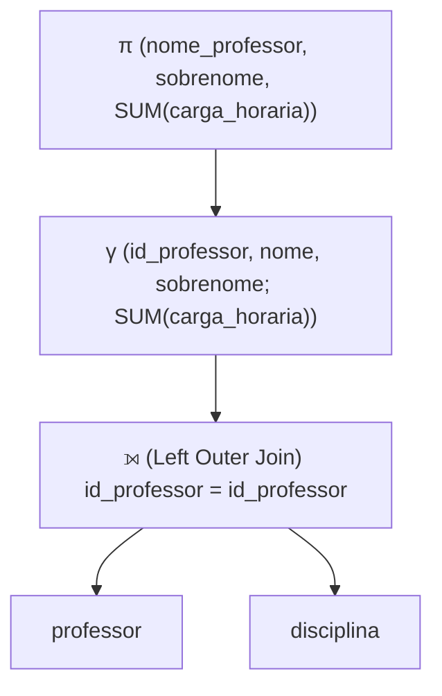
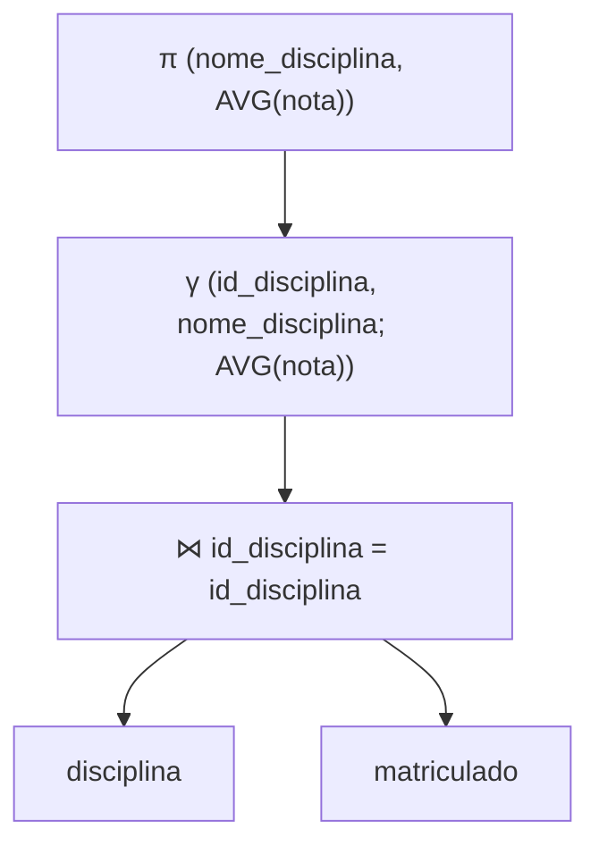
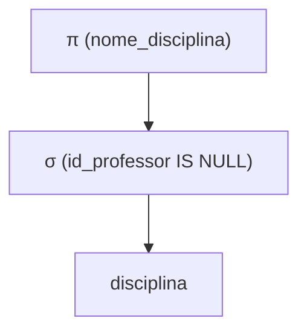
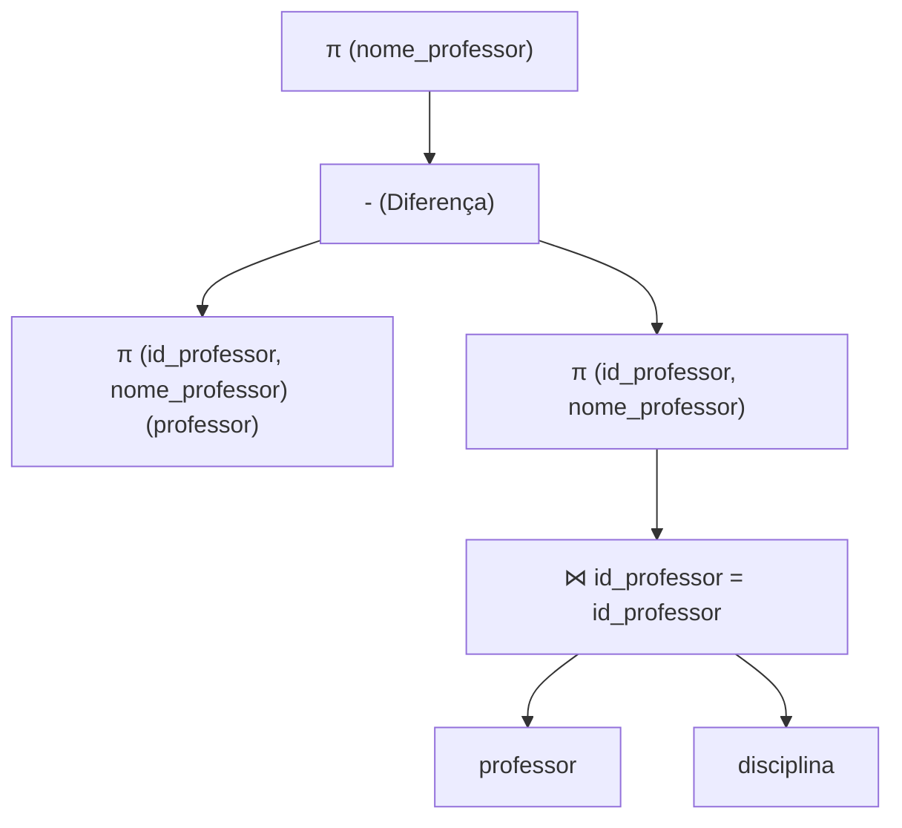
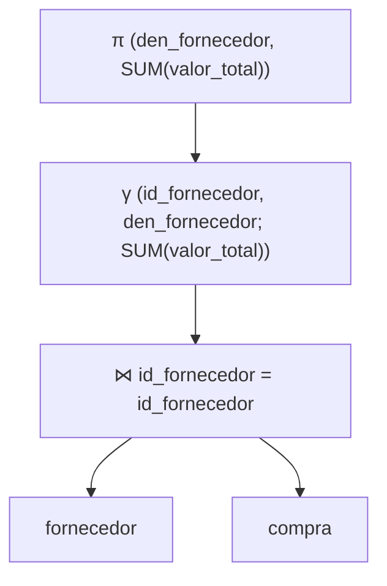
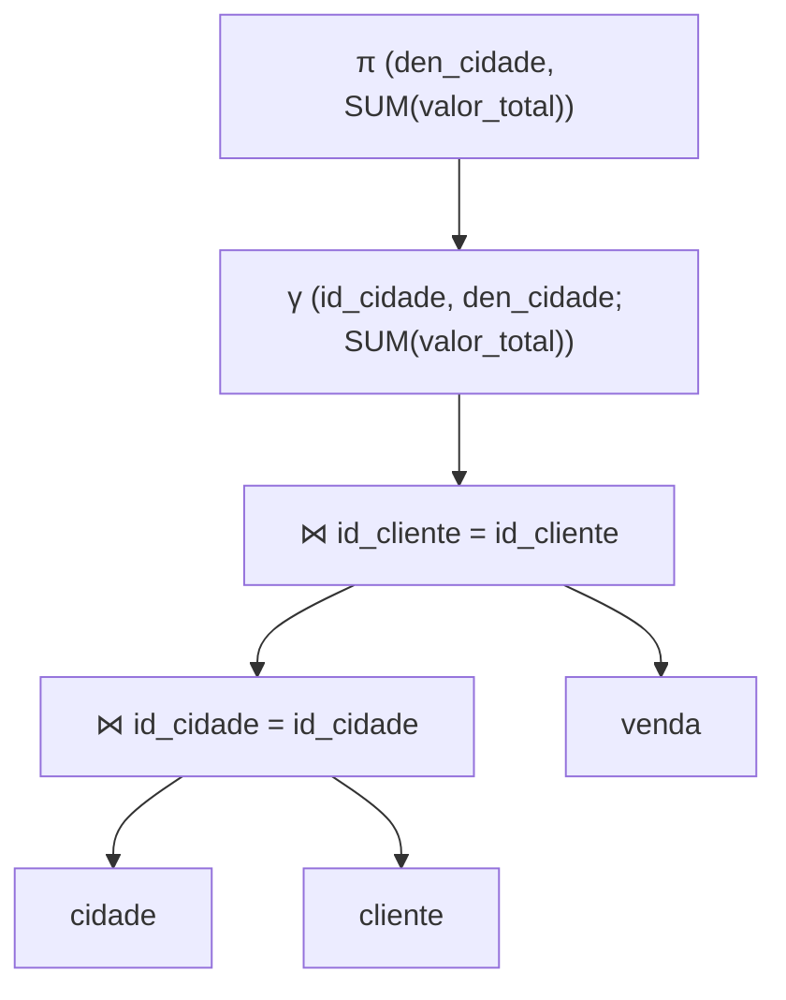
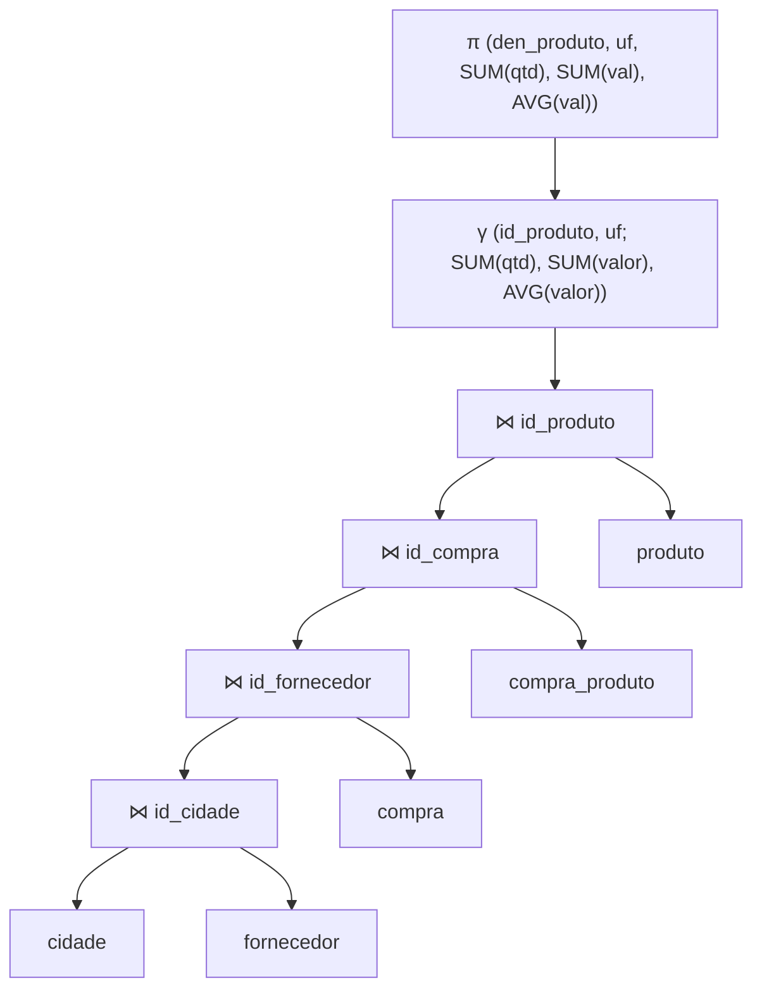
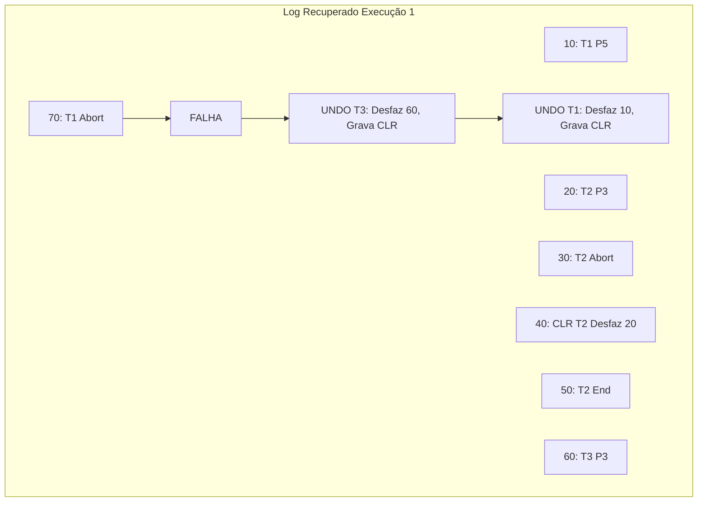
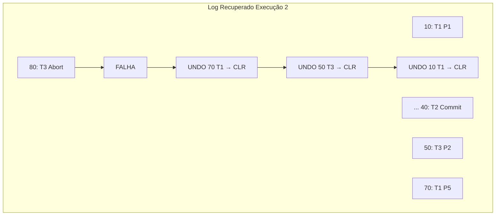

# Guia de Exercícios de Banco de Dados II

**Autor:** Baseado nos materiais do Prof. Marcos Roberto Ribeiro  
**Instituição:** Instituto Federal Minas Gerais (IFMG) - Campus Bambuí  
**Curso:** Engenharia de Computação  

---

## Sumário

1. [Lista 6: SQL para Álgebra Relacional](#lista-6-sql-para-álgebra-relacional)
2. [Lista 7: Visão Geral da Avaliação de Consultas](#lista-7-visão-geral-da-avaliação-de-consultas)
3. [Lista 8: Ordenação Externa](#lista-8-ordenação-externa)
4. [Lista 9: Avaliação de Operadores Relacionais](#lista-9-avaliação-de-operadores-relacionais)
5. [Lista 10: Gerenciamento de Transações](#lista-10-gerenciamento-de-transações)
6. [Lista 11: Recuperação de Falhas](#lista-11-recuperação-de-falhas)

---

# Lista 6: SQL para Álgebra Relacional

Esta lista foca na tradução de consultas SQL para a notação de **Árvore de Álgebra Relacional**.

---

## Exercício 1(a)

**Nomes completos de todos os professores com carga horária total**

Escreva a árvore de álgebra relacional para obter os nomes completos dos professores junto com sua carga horária total.

💡 Dica

Utilize junção externa (Left Join) entre professor e disciplina, seguida de agregação com `SUM` para calcular a carga horária total. Lembre-se que precisamos manter professores mesmo sem disciplinas.

✅ Resolução

**Explicação:** 
- Usamos Left Outer Join (⟕) para manter todos os professores, mesmo aqueles sem disciplinas
- A agregação γ agrupa por professor e soma as cargas horárias
- A projeção π seleciona os campos finais desejados

---

## Exercício 1(b)

**Obter a nota média para cada disciplina**

Escreva a árvore de álgebra relacional para calcular a nota média de cada disciplina.

💡 Dica

Você precisará juntar a tabela de disciplinas com a tabela de matriculados para acessar as notas, e então usar uma função de agregação para calcular a média.

✅ Resolução

**Explicação:**
- A junção natural (⋈) combina disciplinas com matrículas pelo id da disciplina
- A agregação calcula AVG(nota) agrupando por disciplina
- A projeção retorna nome da disciplina e a média calculada

---

## Exercício 1(c)

**Obter as disciplinas sem professor**

Escreva a árvore de álgebra relacional para encontrar disciplinas que não têm professor atribuído.

💡 Dica

Busque disciplinas onde o atributo de chave estrangeira para professor é nulo.

✅ Resolução

**Explicação:**
- A seleção σ filtra apenas as disciplinas onde id_professor é nulo
- A projeção retorna apenas o nome das disciplinas encontradas

---

## Exercício 1(d)

**Obter os professores sem disciplina**

Escreva a árvore de álgebra relacional para encontrar professores que não ministram nenhuma disciplina.

💡 Dica

Você pode usar a operação de diferença de conjuntos ou um Left Join filtrando por valores nulos.

✅ Resolução

**Explicação:**
- Obtemos todos os professores (P1)
- Obtemos os professores que têm disciplina (junção professor ⋈ disciplina)
- A diferença (-) retorna os professores que não estão no segundo conjunto

---

## Exercício 2(a)

**Valor total comprado de cada fornecedor**

Escreva a árvore de álgebra relacional para obter o valor total das compras de cada fornecedor.

💡 Dica

Junte as tabelas de fornecedor e compra, depois agrupe pelo fornecedor somando os valores.

✅ Resolução

**Explicação:**
- A junção combina fornecedores com suas compras
- A agregação soma o valor total por fornecedor
- A projeção retorna o nome do fornecedor e o total calculado

---

## Exercício 2(b)

**Valor total vendido para cada cidade**

Escreva a árvore de álgebra relacional para obter o valor total das vendas por cidade.

💡 Dica

Você precisará encadear junções: cidade → cliente → venda.

✅ Resolução

**Explicação:**
- Primeira junção combina cidade com cliente
- Segunda junção combina o resultado com vendas
- Agregação soma por cidade

---

## Exercício 2(c)

**Quantidade, valor total e médio de produto comprado por estado (UF)**

Escreva a árvore de álgebra relacional para obter estatísticas de compras por estado.

💡 Dica

Este exercício requer uma cadeia longa de junções: estado (cidade) → fornecedor → compra → compra_produto → produto.

✅ Resolução

**Explicação:**
- Cadeia de junções conecta todas as tabelas necessárias
- A agregação calcula SUM e AVG agrupando por produto e UF
- Retorna estatísticas completas de quantidade e valores

---

# Lista 7: Visão Geral da Avaliação de Consultas

Esta lista foca no funcionamento interno dos SGBDs para avaliação de consultas.

---

## Exercício 1

**O que é um metadado? Quais os metadados armazenados no catálogo do sistema e quais informações eles representam?**

💡 Dica

Metadado é informação sobre a estrutura e características dos dados, não os dados em si. Pense no catálogo como um "dicionário" do banco de dados.

✅ Resolução

**Metadado** é um dado sobre os dados.

O catálogo do sistema (ou dicionário de dados) armazena informações sobre a estrutura e estatísticas do banco:

**Informações Armazenadas:**
- **Sobre Tabelas:** Nome da tabela, nome do arquivo, estrutura do arquivo, nomes e tipos dos atributos, índices e restrições de integridade.
- **Sobre Índices:** Nome do índice, estrutura e atributos da chave de pesquisa.
- **Estatísticas (para o otimizador):**
  - *Cardinalidade:* Número de tuplas.
  - *Tamanho:* Número de páginas.
  - *Índices:* Número de chaves distintas, altura da árvore e faixas de valores (mínimo/máximo).

---

## Exercício 2

**Por quê a grande maioria dos SGBD armazenam o catálogo no formato de tabelas?**

💡 Dica

Pense na uniformidade de acesso e nas ferramentas já disponíveis no SGBD.

✅ Resolução

Porque isso permite que o próprio SGBD utilize as mesmas ferramentas e linguagens de consulta (como SQL) usadas para dados comuns para consultar e gerenciar os metadados do sistema.

Isso proporciona:
- Uniformidade no acesso aos dados
- Reutilização das mesmas ferramentas de consulta
- Facilidade de administração

---

## Exercício 3

**Explique as três técnicas mais comumente usadas para avaliação dos operadores relacionais.**

💡 Dica

Pense em como acessar dados: diretamente por índice, varrendo tudo, ou dividindo em partes.

✅ Resolução

1. **Indexação:** Uso de índices para recuperar apenas as tuplas que satisfazem uma condição específica (evitando varredura completa).

2. **Iteração:** Varredura sequencial de todas as tuplas de uma tabela ou de todas as entradas de um índice.

3. **Particionamento:** Decomposição das operações em partes menores e mais simples, operando sobre subconjuntos de dados (comum em ordenação e hashing).

---

## Exercício 4

**O quê é um caminho de acesso? Explique como a seletividade pode afetar o desempenho da avaliação de consultas.**

💡 Dica

Compare o custo de usar índice versus varrer a tabela inteira considerando a quantidade de dados retornados.

✅ Resolução

**Caminho de acesso** é o método utilizado para recuperar tuplas (ex: varredura de arquivo, índice hash, índice árvore B+).

**Seletividade:** Refere-se à porcentagem de páginas/tuplas recuperadas. Um caminho altamente seletivo recupera poucas páginas.

**Impacto no desempenho:**
- Se a seletividade for **alta** (poucos registros retornados), o uso de índices é muito eficiente.
- Se a seletividade for **baixa** (muitos registros retornados), o custo de acessar o índice mais o custo de buscar os dados pode superar o custo de simplesmente varrer a tabela inteira (Table Scan).

---

## Exercício 5

**Descreva quais as principais estratégias para avaliação de seleções e projeções.**

💡 Dica

Para seleção, considere a existência de índices. Para projeção, o principal desafio é a eliminação de duplicatas.

✅ Resolução

**Seleção:**
- Se houver índice e for seletivo, usa-se o índice
- Caso contrário, varre-se a tabela inteira

**Projeção:** O desafio é eliminar duplicatas (`DISTINCT`). As estratégias principais são:
- *Ordenação:* Ordenar os dados para identificar duplicatas adjacentes
- *Hashing:* Criar partições hash para identificar duplicatas
- *Indexação:* Se o índice cobrir todos os campos da projeção, usa-se apenas o índice (Index Only Scan)

---

## Exercício 6

**Como funciona o otimizador de consultas de um SGBD?**

💡 Dica

Pense no processo de tradução de SQL para plano de execução e como o sistema escolhe o melhor plano.

✅ Resolução

1. O **analisador** recebe a consulta SQL
2. O **otimizador** gera planos de execução alternativos (árvores de operadores)
3. Utiliza **estatísticas do catálogo** para estimar o custo de cada plano (E/S, CPU)
4. Escolhe o plano com o **menor custo estimado** para ser executado pelo avaliador

---

## Exercício 7

**Quais os benefícios das avaliações encadeadas (pipeline)?**

💡 Dica

Compare com a alternativa de gravar resultados intermediários em disco.

✅ Resolução

A avaliação *pipeline* permite que o resultado de um operador seja passado diretamente para o próximo operador assim que é processado, sem a necessidade de gravar o resultado intermediário em disco (materialização).

**Benefícios:**
- Economiza operações de E/S
- Reduz tempo de armazenamento temporário
- Menor uso de espaço em disco
- Menor latência no processamento

---

## Exercício 8

**Análise de Custo e Estratégias**

*Dados: 5.000.000 registros, 10 reg/pág = 500.000 páginas. Arquivo ordenado por `a`.*

Considere as seguintes opções de acesso:
1. Acesso ao arquivo (ordenado por a)
2. Índice Árvore B+ agrupado por a
3. Índice Hash Linear por a

Qual a melhor estratégia para cada consulta?

### Parte (a): σ_{a<50000}(R)

💡 Dica

Busca por intervalo em arquivo ordenado. Hash suporta intervalos?

✅ Resolução

**Melhor:** (2) Índice Árvore B+ agrupado ou (1) Acesso direto ao arquivo.

*Motivo:* Como é uma busca por intervalo em um arquivo ordenado, o índice B+ encontra o início rapidamente e varre sequencialmente. O **hash não serve para intervalos**.

---

### Parte (b): σ_{a=50000}(R)

💡 Dica

Busca por igualdade. Qual índice é O(1)?

✅ Resolução

**Melhor:** (3) Índice Hash Linear.

*Motivo:* Hash é O(1) para igualdades (custo ~1.2 E/S), sendo mais rápido que buscar na árvore B+ (custo logarítmico).

---

### Parte (c): σ_{50000 ≤ a ≤ 50010}(R)

💡 Dica

Intervalo pequeno (11 valores possíveis).

✅ Resolução

**Melhor:** (2) Índice Árvore B+ agrupado.

*Motivo:* Buscas por intervalo pequeno são ideais para Árvore B+. Hash não suporta intervalos.

---

### Parte (d): σ_{a ≠ 50000}(R)

💡 Dica

Quantos registros essa condição retorna?

✅ Resolução

**Melhor:** (1) Acesso ao arquivo ordenado (Varredura).

*Motivo:* A condição "diferente de" implica ler quase todo o banco de dados. Índices seriam ineficientes pois teriam que acessar quase todos os ponteiros.

---

## Exercício 9

**Atributos examinados**

Quais atributos são examinados em cada consulta?

### Parte (a): SELECT * FROM funcionarios

💡 Dica

O * seleciona todos os atributos.

✅ Resolução

Todos os atributos de `funcionarios`.

---

### Parte (b): SELECT * FROM funcionarios, departamentos

💡 Dica

Produto cartesiano de duas tabelas.

✅ Resolução

Todos os atributos de ambas as tabelas (Produto Cartesiano).

---

### Parte (c): ... WHERE f.departamento_id = d.id

💡 Dica

Quais atributos são usados na condição de junção?

✅ Resolução

Todos os atributos de ambas as tabelas, mas `f.departamento_id` e `d.id` são usados especificamente para a junção.

---

### Parte (d): SELECT f.id, f.departamento_id, d.nome ...

💡 Dica

Diferencie atributos retornados dos atributos necessários para processar a consulta.

✅ Resolução

Apenas `f.id`, `f.departamento_id` e `d.nome` precisam ser retornados, mas `d.id` também precisa ser lido para processar a junção.

---

# Lista 8: Ordenação Externa

Esta lista foca nos algoritmos de ordenação para grandes volumes de dados que não cabem na memória.

---

## Exercício 1

**Quais operações de bancos de dados que utilizam ordenação?**

💡 Dica

Pense além de ORDER BY - onde mais dados ordenados são úteis internamente para o SGBD?

✅ Resolução

- Cláusulas `ORDER BY`
- Operações `GROUP BY`
- Eliminação de duplicatas (`DISTINCT`)
- Algoritmos de junção *Sort-Merge*
- Criação de índices (Bulk Loading)

---

## Exercício 2

**Como o algoritmo merge-sort externo melhora o algoritmo merge-sort de duas vias?**

💡 Dica

Compare o número de vias de intercalação e como isso afeta o número de passagens.

✅ Resolução

O merge-sort externo utiliza **B páginas** de memória (buffer), permitindo criar séries ordenadas iniciais maiores e realizar uma intercalação (*merge*) de **B-1 vias** em cada passagem.

Isso reduz drasticamente a altura da árvore de merge e, consequentemente, o número total de passagens (leituras/escritas) necessárias em comparação com a intercalação de apenas 2 vias.

- Duas vias: ⌈log₂N⌉ + 1 passagens
- B páginas: ⌈log_{B-1}(⌈N/B⌉)⌉ + 1 passagens

---

## Exercício 3

**Explique como melhorar o merge-sort externo para lidar com a E/S bloqueada.**

💡 Dica

Pense em ler blocos de páginas ao invés de páginas individuais.

✅ Resolução

Em vez de ler uma página por vez de cada série durante a intercalação, o algoritmo pode ler blocos de **b** páginas consecutivas.

Isso reduz o tempo de busca (*seek time*) do disco, tornando a E/S mais eficiente, embora reduza o número de vias de intercalação (fan-in) possível, podendo aumentar levemente o número de passagens.

**Trade-off:** Menos seeks, porém mais passagens.

---

## Exercício 4

**Como funciona a bufferização dupla? Qual a motivação para usá-la?**

💡 Dica

Pense em paralelismo entre CPU e disco.

✅ Resolução

**Funcionamento:** Divide-se a memória disponível em dois conjuntos de buffers. Enquanto a CPU processa os dados de um conjunto (ordenando ou intercalando), o sistema de E/S carrega os dados para o segundo conjunto em segundo plano.

**Motivação:** Mascarar a latência de disco, permitindo que CPU e E/S trabalhem em paralelo, reduzindo o tempo total de execução.

---

## Exercício 5

**Explique quando usar e quando não usar um índice de árvore B+ na ordenação.**

💡 Dica

A diferença está na organização física dos dados no disco em relação ao índice.

✅ Resolução

**Usar (Índice Agrupado/Clustered):**
- Os dados estão fisicamente ordenados conforme o índice
- As folhas já estão na ordem física correta
- Basta varrer as folhas sequencialmente
- Custo muito baixo

**Não usar (Índice Não Agrupado/Unclustered):**
- Seguir os ponteiros das folhas para os dados causará um acesso aleatório ao disco para quase cada registro
- Isso é muito mais lento do que ordenar o arquivo do zero

---

# Lista 9: Avaliação de Operadores Relacionais

Esta lista foca nas estratégias e algoritmos utilizados pelo SGBD para executar consultas de forma eficiente.

---

## Exercício 1

**Considere uma seleção com apenas uma condição simples. Como tal operação é avaliada se a condição não envolve índices? E se a condição envolver índices, devemos sempre usá-los?**

💡 Dica

Pense no tipo de índice (hash vs. B+) e na seletividade da consulta.

✅ Resolução

**Sem índices:** Se não há índices na condição, o SGBD deve realizar uma **varredura completa (table scan)** na tabela, lendo todas as páginas e verificando a condição registro a registro.

**Com índices:** Se houver índice, **não necessariamente** devemos usá-lo sempre. A decisão depende do tipo de índice e da seletividade:
- Se for um **índice hash** e a busca for por igualdade, deve-se usá-lo (custo muito baixo)
- Se for um **índice B+ agrupado (clustered)**, geralmente é vantajoso usá-lo
- Se for um **índice B+ não agrupado** e a consulta retornar muitas tuplas (baixa seletividade, ex: > 10% da tabela), pode ser mais custoso acessar o índice e depois fazer saltos aleatórios no disco do que varrer a tabela inteira sequencialmente

---

## Exercício 2

**Explique os dois métodos de seleção sem disjunção (apenas AND). E no caso das seleções com disjunção (OR), o que pode acontecer?**

💡 Dica

Pense em como combinar resultados de múltiplos índices: interseção para AND, união para OR.

✅ Resolução

**Seleção sem disjunção (Conjunção/AND):**
1. **Caminho mais seletivo:** O otimizador escolhe o índice que filtra mais linhas (o mais seletivo). Recupera as tuplas usando esse índice e aplica as demais condições nos resultados recuperados.
2. **Interseção de RIDs:** Se houver índices para várias condições, o SGBD obtém os identificadores (RIDs) de cada índice separadamente e faz a interseção desses conjuntos de RIDs em memória. Só depois busca os dados finais no disco.

**Seleção com disjunção (OR):**
- Se uma das condições do `OR` **não tiver índice**, o SGBD geralmente é forçado a fazer uma **varredura completa** na tabela (pois não há como garantir que encontrou tudo apenas olhando o índice da outra condição)
- Se todas as condições tiverem índices, o SGBD pode recuperar os RIDs de cada índice e fazer a **união** dos resultados

---

## Exercício 3

**Explique as duas técnicas de avaliação de projeção (com eliminação de duplicatas) existentes. Qual das duas se sobressai? Podemos usar índices para avaliar tal operação?**

💡 Dica

Compare ordenação vs. hash para identificar duplicatas. Pense também em índices que cobrem todos os atributos projetados.

✅ Resolução

**Técnicas:**

1. **Baseada em Ordenação:** O SGBD cria uma tabela temporária apenas com as colunas desejadas, ordena essa tabela (custo M log M) e depois varre linearmente removendo linhas adjacentes duplicadas.

2. **Baseada em Hash:** O SGBD particiona a tabela usando uma função hash h. Duplicatas cairão na mesma partição. Depois, lê cada partição, constrói uma tabela hash em memória (com h') para eliminar duplicatas. Custo aproximado de 3M.

**Qual se sobressai:** A **Ordenação** geralmente é preferida pelos SGBDs, pois lida melhor com muitas duplicatas (reduzindo o tamanho durante a ordenação) e entrega o resultado já ordenado, o que é útil se houver um `ORDER BY` ou outra operação subsequente.

**Uso de Índices:** Sim. Se existir um índice que contenha **todos** os atributos projetados (índice *covering*), o SGBD pode executar a projeção lendo apenas o arquivo de índice (que é muito menor que a tabela), sem acessar os dados principais.

---

## Exercício 4

**É possível avaliar uma operação de junção usando uma equivalência com os operadores de produto cartesiano, seleção e projeção? Isso é recomendável?**

💡 Dica

Pense no volume de dados gerado pelo produto cartesiano.

✅ Resolução

**Possível:** Sim, a junção (R ⋈ S) é logicamente equivalente a fazer o produto cartesiano (R × S) seguido de uma seleção (σ) para filtrar as linhas correspondentes.

**Recomendável:** **Não**. O produto cartesiano gera um volume de dados gigantesco (N × M tuplas). Processar isso para depois filtrar é extremamente ineficiente. Os algoritmos de junção nativos (Hash, Merge, Nested Loops) são projetados para combinar e filtrar simultaneamente, evitando a explosão de dados intermediários.

---

## Exercício 5

**Explique como funcionam e compare o custo dos seguintes algoritmos de avaliação de junção:**

*(Legenda: M = páginas de R, N = páginas de S, B = buffers)*

### Parte (a): Junção de loops aninhados (Simple Nested Loops)

💡 Dica

Para cada tupla da relação externa, varra toda a relação interna.

✅ Resolução

Para cada tupla de R, varre todas as páginas de S. Muito custoso e ineficiente se as tabelas não couberem na memória.

**Custo:** M + (Tuplas_em_R × N)

---

### Parte (b): Junção de loops aninhados de bloco (Block Nested Loops)

💡 Dica

Maximize o uso do buffer carregando blocos ao invés de tuplas individuais.

✅ Resolução

Lê um bloco de páginas de R para a memória, depois varre S uma vez comparando com todo esse bloco. Maximiza o uso do buffer.

**Custo:** M + N × ⌈M / (B-2)⌉

---

### Parte (c): Junção de loops aninhados indexados

💡 Dica

Use um índice existente na relação interna para encontrar correspondências rapidamente.

✅ Resolução

Usa R como tabela externa e, para cada tupla, usa um índice existente em S para buscar a correspondência. Ótimo se S for grande e R pequeno.

**Custo:** M + (Tuplas_em_R × Custo_Busca_Indice)

---

### Parte (d): Junção Sort-Merge

💡 Dica

Ordene ambas as tabelas e depois intercale como um zipper.

✅ Resolução

Ordena ambas as tabelas pelo atributo de junção e depois varre as duas simultaneamente (estilo "zipper"), encontrando as correspondências. Excelente para igualdades.

**Custo:** Custo de ordenar R + Custo de ordenar S + (M + N)

---

### Parte (e): Junção por Hashing

💡 Dica

Particione ambas as tabelas com a mesma função hash.

✅ Resolução

Particiona R e S usando a mesma função hash. Tuplas que casam estarão na mesma partição. Depois, faz a junção de cada par de partições em memória.

**Custo:** 3(M + N). Geralmente muito eficiente para junções de igualdade em tabelas grandes não ordenadas.

---

## Exercício 6

**Descreva como as operações de conjunto podem ser avaliadas.**

💡 Dica

Use as mesmas técnicas de ordenação ou hash para identificar elementos comuns ou diferentes.

✅ Resolução

As operações de União (R ∪ S), Interseção (R ∩ S) e Diferença (R - S) requerem que as duplicatas sejam tratadas (a menos que seja `UNION ALL`).

1. **Via Ordenação:** Ordena-se ambas as relações. Percorre-se ambas em paralelo:
   - Para união, mesclam-se os resultados
   - Para interseção, mantêm-se apenas os iguais
   - Para diferença, mantêm-se os de R que não aparecem em S

2. **Via Hash:** Particiona-se ambas as relações com a mesma função hash. Processa-se partição por partição (ex: para interseção, verifica-se se tuplas da partição Ri existem na tabela hash da partição Si).

---

## Exercício 7

**Explique os métodos para avaliar as operações de agregação.**

💡 Dica

Pense em como agrupar dados (ordenação ou hash) e depois aplicar as funções de agregação.

✅ Resolução

Operações como `SUM`, `AVG`, `COUNT`, `MIN`, `MAX` com `GROUP BY`:

1. **Ordenação:** Ordena a tabela pelo atributo do `GROUP BY`. Varre o resultado ordenado acumulando os valores (soma, contagem, etc.) e emitindo o resultado quando a chave do grupo muda.

2. **Hashing:** Cria uma tabela hash em memória onde a chave é o atributo do `GROUP BY` e o valor é o acumulador (ex: soma atual). Varre a tabela original, atualizando a entrada correspondente na tabela hash.

3. **Índices:** Se houver índice na chave de agrupamento (para ordenação) ou na coluna agregada (ex: `MIN/MAX` em árvore B+), o SGBD pode responder olhando apenas o índice, sem varrer a tabela (agregação "Index Only").

---

# Lista 10: Gerenciamento de Transações

Esta lista foca nas propriedades ACID e conceitos de controle de concorrência.

---

## Exercício 1

**Cite e explique as propriedades ACID.**

💡 Dica

ACID são as quatro propriedades fundamentais que garantem a confiabilidade das transações.

✅ Resolução

- **Atomicidade:** "Tudo ou nada". A transação é indivisível; se falhar, nada é gravado.

- **Consistência:** A transação deve levar o banco de um estado válido para outro estado válido, respeitando regras de integridade.

- **Isolamento:** A execução de uma transação não deve sofrer interferência de outras transações concorrentes.

- **Durabilidade:** Após o *commit*, as alterações são permanentes e sobrevivem a falhas do sistema.

---

## Exercício 2

**Defina os seguintes conceitos de planos de execução:**

### Parte (a): Plano Completo

💡 Dica

Pense em um plano que inclui todas as operações, incluindo o término.

✅ Resolução

Contém todas as operações das transações listadas, incluindo o término (Commit ou Abort).

---

### Parte (b): Plano Serial

💡 Dica

Sem intercalação de operações entre transações.

✅ Resolução

As transações são executadas uma após a outra, sem intercalação de operações.

---

### Parte (c): Plano Serializável

💡 Dica

Resultado equivalente a alguma execução serial.

✅ Resolução

Um plano que, mesmo intercalado, produz o mesmo resultado final que algum plano serial das mesmas transações.

---

## Exercício 3

**Quais os possíveis conflitos entre as operações de transações?**

💡 Dica

Pense nas combinações de operações de leitura (R) e escrita (W) entre duas transações.

✅ Resolução

- **WR (Leitura Suja):** Ler um dado escrito por uma transação não finalizada.

- **RW (Leitura Não Repetível):** Ler um dado, e depois outra transação alterá-lo antes que a primeira termine.

- **WW (Sobrescrita):** Duas transações escrevem no mesmo dado simultaneamente (perda de atualização).

---

## Exercício 4

**Explique quando ocorrem os seguintes problemas:**

### Parte (a): Leitura suja (Dirty Read)

💡 Dica

O que acontece se T2 lê dados que T1 ainda não confirmou?

✅ Resolução

T2 lê um dado alterado por T1 antes de T1 fazer commit. Se T1 fizer rollback, T2 leu algo inválido.

---

### Parte (b): Leitura não repetível (Non-Repeatable Read)

💡 Dica

O que acontece se T1 lê o mesmo dado duas vezes e outra transação modifica entre as leituras?

✅ Resolução

T1 lê X. T2 altera X e commita. T1 lê X novamente e encontra valor diferente.

---

### Parte (c): Gravações cegas (Blind Writes)

💡 Dica

Escrever sem ler primeiro pode causar problemas de concorrência.

✅ Resolução

Uma transação escreve em um dado sem lê-lo antes. Pode sobrescrever atualizações de transações concorrentes de forma perigosa.

---

### Parte (d): Leituras fantasmas (Phantom Reads)

💡 Dica

O que acontece quando uma consulta retorna números diferentes de linhas em execuções sucessivas?

✅ Resolução

T1 lê um conjunto de linhas que satisfazem uma condição. T2 insere/remove uma linha que satisfaz essa condição. T1 executa a mesma consulta e obtém um número diferente de linhas.

---

## Exercício 5

**Defina plano de execução recuperável e sua importância.**

💡 Dica

Pense na ordem dos commits quando uma transação lê dados de outra.

✅ Resolução

É um plano onde, se T2 lê dados escritos por T1, T1 deve fazer commit *antes* de T2 fazer commit.

**Importância:** Garante que, se T1 falhar (abortar), T2 também possa ser abortada (evita que T2 faça commit baseada em dados inválidos de T1).

---

## Exercício 6

**Descreva como funciona o protocolo de bloqueio Strict 2PL.**

💡 Dica

Pense nos tipos de bloqueio (Compartilhado e Exclusivo) e quando eles são liberados.

✅ Resolução

1. Se uma transação quer ler um objeto, solicita bloqueio **Compartilhado (S)**
2. Se quer escrever, solicita bloqueio **Exclusivo (X)**
3. **Regra Strict:** Todos os bloqueios (S e X) são mantidos até o fim da transação (Commit ou Abort)

Isso evita leitura suja e garante recuperabilidade.

---

## Exercício 7

**Níveis de isolamento e problemas evitados:**

Explique a tabela de níveis de isolamento.

💡 Dica

Cada nível oferece proteção adicional contra problemas de concorrência.

✅ Resolução

| Nível | Leitura Suja | Leitura Não Repetível | Fantasma |
| :--- | :---: | :---: | :---: |
| **Read Uncommitted** | Possível | Possível | Possível |
| **Read Committed** | Evita | Possível | Possível |
| **Repeatable Read** | Evita | Evita | Possível |
| **Serializable** | Evita | Evita | Evita |

**Explicação:**
- **Read Uncommitted:** Nenhuma proteção - permite ler dados não confirmados
- **Read Committed:** Só lê dados confirmados - evita leitura suja
- **Repeatable Read:** Mantém bloqueios de leitura - evita leituras não repetíveis
- **Serializable:** Proteção completa - evita todos os problemas, incluindo fantasmas

---

# Lista 11: Recuperação de Falhas

Esta lista foca nos mecanismos de recuperação utilizados pelos SGBDs para garantir durabilidade e atomicidade.

---

## Exercício 1

**Como o SGBD garante atomicidade e durabilidade?**

💡 Dica

Pense no papel do Log e nas operações de UNDO e REDO.

✅ Resolução

- **Atomicidade:** O SGBD usa o **Log** para desfazer (UNDO) operações de transações que não completaram.

- **Durabilidade:** O SGBD usa o **Log** e o protocolo **WAL** (Write-Ahead Logging) para refazer (REDO) operações de transações commitadas que podem não ter sido persistidas no disco de dados antes da falha.

---

## Exercício 2

**Explique as três fases de reinício do ARIES.**

💡 Dica

Análise → Redo → Undo. Cada fase tem um propósito específico.

✅ Resolução

1. **Análise:** Identifica quais transações estavam ativas e quais páginas estavam sujas (na memória) no momento da falha.

2. **Refazer (Redo):** Repassa o log para frente, reaplicando todas as atualizações para deixar o estado do banco exatamente como estava no instante da falha (incluindo transações não commitadas).

3. **Desfazer (Undo):** Percorre o log para trás, desfazendo as alterações das transações que não comitaram ("perdedoras").

---

## Exercício 3

**Quais são os princípios fundamentais do ARIES?**

💡 Dica

WAL, Repeating History, e logging durante o Undo.

✅ Resolução

1. **WAL (Write-Ahead Logging):** Nenhuma página de dados vai para o disco antes do registro de log correspondente.

2. **Repeating History (Repetição do Histórico):** No restart, refaz tudo (inclusive as que falharam) para restaurar o estado exato.

3. **Logging Updates During Undo:** Quando desfaz uma operação (Undo), gera um novo log (CLR - Compensation Log Record) para garantir que o desfazimento não precise ser desfeito em falhas repetidas.

---

## Exercício 4

**O que é o Log e quais os tipos de registros?**

💡 Dica

O Log é um histórico sequencial. Pense nos diferentes eventos que precisam ser registrados.

✅ Resolução

**Log:** Histórico sequencial de operações em disco.

**Tipos de registros:**
- *Atualização:* Modificação de dados (contém imagem antes/depois)
- *Commit/Abort:* Fim de transação
- *Checkpoint:* Ponto de verificação do sistema
- *CLR (Compensation Log Record):* Registro indicando que uma operação foi desfeita
- *End:* Fim definitivo do processo de transação

---

## Exercício 5

**Explique as Tabelas de Transações e Páginas Sujas.**

💡 Dica

Essas tabelas são essenciais para saber o que precisa ser feito durante a recuperação.

✅ Resolução

- **Tabela de Transações:** Rastreia transações ativas e seu estado (`últimoLSN`).

- **Tabela de Páginas Sujas:** Rastreia quais páginas na memória foram modificadas mas ainda não gravadas no disco (`recLSN`). Essencial para saber onde começar o REDO.

---

## Exercício 6

**Como funciona o protocolo WAL?**

💡 Dica

A ordem de escrita entre log e dados é crucial.

✅ Resolução

O WAL exige que os registros de log (descrevendo as mudanças) sejam gravados em armazenamento estável *antes* que a página de dados modificada seja escrita no disco.

Isso garante que, se houver falha durante a escrita de dados, o log tem a informação necessária para recuperar.

---

## Exercício 7

**O que são e para que servem os pontos de verificação (checkpoints)?**

💡 Dica

Pense em reduzir o tempo de recuperação limitando quanto do log precisa ser processado.

✅ Resolução

São "snapshots" periódicos onde o SGBD grava o estado das tabelas de transação e páginas sujas no log e força a escrita do log em disco.

**Servem para:** Reduzir o tempo de recuperação, pois o SGBD não precisa ler o log desde o início, apenas a partir do último checkpoint.

---

## Exercício 8

**Explique o funcionamento do algoritmo da fase desfazer (Undo).**

💡 Dica

Percorra o log de trás para frente, desfazendo operações das transações perdedoras.

✅ Resolução

1. Identifica as transações "perdedoras" (ativas na falha)
2. Pega o maior `LSN` (Número de Sequência de Log) dentre as perdedoras
3. Se for uma atualização, desfaz a mudança, grava um CLR e volta para o registro anterior (`prevLSN`)
4. Se for um CLR, pula para o `UndoNextLSN` (evitando desfazer o que já foi desfeito)
5. Repete até desfazer todas as ações das perdedoras

---

## Exercício 9

**Execução ARIES - Exemplos Práticos**

### Execução 1

**Log Original:**
- 10: T1 grava P5
- 20: T2 grava P3
- 30: T2 cancelada (Abort)
- 40: CLR (desfaz 20)
- 50: T2 End
- 60: T3 grava P3
- 70: T1 cancelada (Abort)
- **X FALHA**

💡 Dica

Identifique quais transações estavam ativas no momento da falha e o que precisa ser desfeito.

✅ Resolução

**Recuperação:**

1. **Análise:** Identifica T1 e T3 como perdedoras (ativas). T2 já terminou.

2. **Redo:** Refaz histórico (10, 20, 40, 60). Estado reconstruído.

3. **Undo:** Precisa desfazer T1 e T3.
   - Maior LSN ativo: 70 (Abort T1). Próximo passo de T1 é desfazer 10.
   - Maior LSN ativo: 60 (T3 grava P3). Desfaz 60 → Grava CLR para T3.
   - Próximo LSN a desfazer: 10 (T1 grava P5). Desfaz 10 → Grava CLR para T1.

---

### Execução 2

**Log Original:**
- 10: T1 grava P1
- 20: T2 grava P2
- 30: T2 grava P3
- 40: T2 Commit
- 50: T3 grava P2
- 60: T2 End
- 70: T1 grava P5
- 80: T3 Abort
- **X FALHA**

💡 Dica

T2 já fez commit antes da falha. Quais transações são as perdedoras?

✅ Resolução

**Recuperação:**

1. **Análise:** T1 e T3 ativas (perdedoras). T2 comitada.

2. **Redo:** Refaz 10, 20, 30, 50, 70. (Garante durabilidade de T2 e estado para undo).

3. **Undo:** Desfazer T1 e T3.
   - Pilha de Undo: {70 (T1), 80 (T3)}.
   - Processa 80 (Abort T3). T3 tem que desfazer 50.
   - Processa 70 (T1 grava P5). Desfaz 70, grava CLR. T1 tem que desfazer 10.
   - Processa 50 (T3 grava P2). Desfaz 50, grava CLR. T3 fim.
   - Processa 10 (T1 grava P1). Desfaz 10, grava CLR. T1 fim.

---

## Referências

Este guia de exercícios foi elaborado com base nos materiais didáticos do curso de Banco de Dados II do IFMG - Campus Bambuí, sob orientação do Prof. Marcos Roberto Ribeiro.

Para aprofundamento teórico, consulte o [Guia de Estudos Avançados em Banco de Dados II](./Guia_de_Estudos_Avancados_BD2.md).
