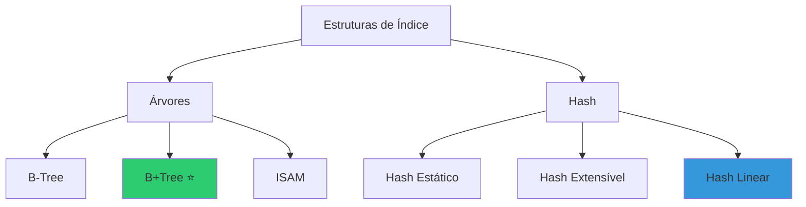
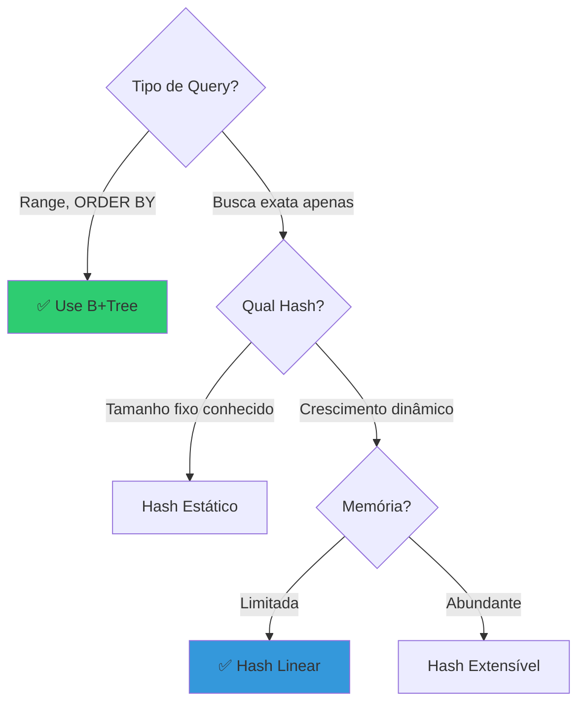
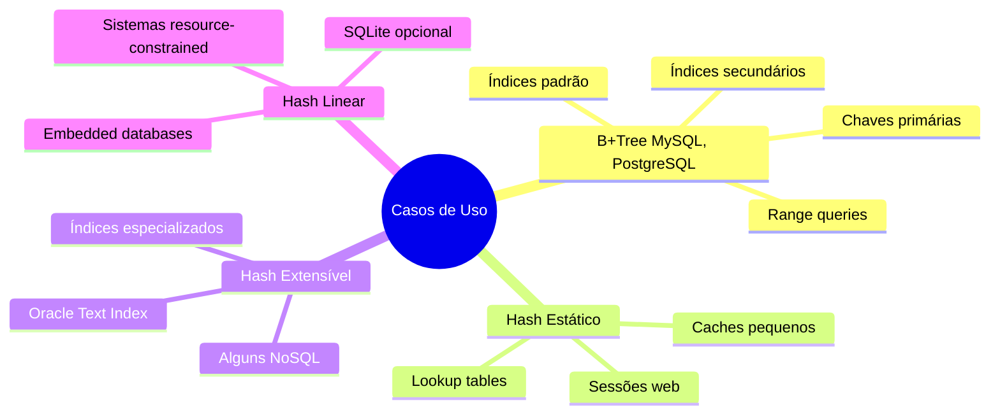
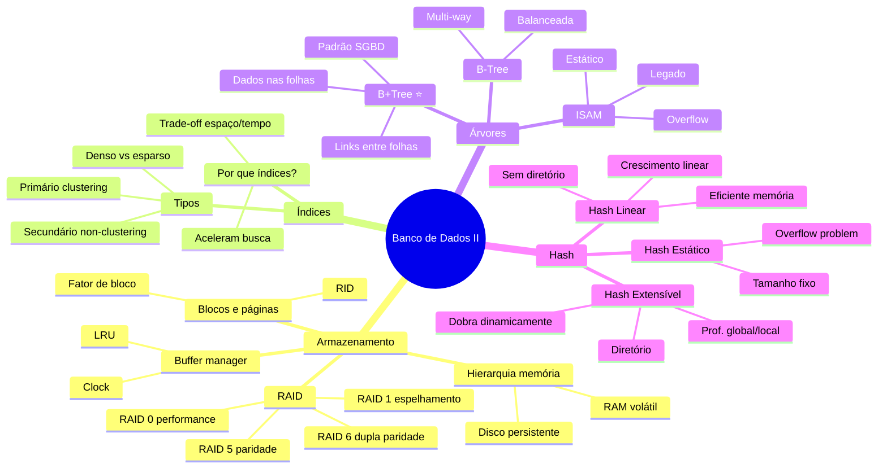

# Material de Estudos Completo: Banco de Dados II

## 📚 Índice Geral

1. [Introdução a Índices e Organização de Arquivos](#1-introdução-a-índices-e-organização-de-arquivos)
2. [Armazenamento de Dados e Hierarquia de Memória](#2-armazenamento-de-dados-e-hierarquia-de-memória)
3. [Índices em Árvore (B-Tree e B+Tree)](#3-índices-em-árvore-b-tree-e-btree)
4. [Índices Hash](#4-índices-hash)
5. [Comparações e Casos de Uso](#5-comparações-e-casos-de-uso)

---

## 5. Comparações e Casos de Uso

### ⚖️ Tabela Comparativa Final

**Tabela Completa:**

| Característica | B+Tree | Hash Estático | Hash Extensível | Hash Linear |
|----------------|--------|---------------|-----------------|-------------|
| **Busca Exata** | O(log n) | O(1) esperado | O(1) esperado | O(1) esperado |
| **Range Query** | ✅ O(log n + k) | ❌ O(n) | ❌ O(n) | ❌ O(n) |
| **Ordenação** | ✅ Sim | ❌ Não | ❌ Não | ❌ Não |
| **Crescimento** | Automático | ❌ Fixo | Dobra | ✅ Linear |
| **Overhead Memória** | Médio | Baixo | ❌ Alto (dir) | ✅ Muito Baixo |
| **I/Os típicos** | 3-4 | 1-2 | 2 (dir+bucket) | 1 |
| **Uso em SGBD** | ✅✅✅ Padrão | Raro | Ocasional | Especializado |

**Quando Usar Cada Um:**

### 📊 Casos de Uso Reais

**SGBD Reais:**

| SGBD | Índice Padrão | Hash Suportado? |
|------|---------------|-----------------|
| **MySQL InnoDB** | B+Tree | Sim (MEMORY engine) |
| **PostgreSQL** | B+Tree | Sim (HASH index) |
| **Oracle** | B+Tree | Sim (hash cluster) |
| **SQL Server** | B+Tree | Não nativo |
| **MongoDB** | B-Tree | Sim (hashed index) |
| **Redis** | Hash table | Hash nativo |

---

### 🎓 Resumo Final Completo

### 📚 Checklist de Estudo

**Conceitos Fundamentais:**
- ✅ Organização de arquivos (heap, sequencial, indexado)
- ✅ Índices (primário, secundário, denso, esparso, clustering)
- ✅ Chave de pesquisa vs entrada de dados
- ✅ RID (Record Identifier)
- ✅ Fator de bloco

**Armazenamento:**
- ✅ Hierarquia de memória (primário, secundário, terciário)
- ✅ Volátil vs persistente
- ✅ Gerenciador de espaço em disco (GED)
- ✅ Mapa de bits vs lista encadeada
- ✅ Buffer manager e políticas (LRU, Clock)
- ✅ RAID 0, 1, 5, 6

**B-Trees:**
- ✅ Propriedades (balanceada, ordenada, multi-way)
- ✅ Ordem da árvore (m)
- ✅ Inserção com split
- ✅ Deleção com merge/redistribute
- ✅ B-Tree vs B+Tree
- ✅ ISAM (estático, overflow)
- ✅ Índices primitivos (vantagens/desvantagens)

**Hash:**
- ✅ Função hash (módulo, mid-square, etc)
- ✅ Colisões (chaining, open addressing)
- ✅ Hash estático (problemas de overflow)
- ✅ Hash extensível (diretório, profundidades)
- ✅ Hash linear (sem diretório, round-robin)
- ✅ Quando usar hash vs árvore

**Comparações:**
- ✅ Range queries: árvore melhor
- ✅ Busca exata: hash mais rápido
- ✅ Ordenação: apenas árvore
- ✅ Crescimento: hash linear mais suave
- ✅ Memória: hash linear mais eficiente

---

### 🔑 Pontos-Chave para Memorizar

1. **Índices são catálogos** que aceleram buscas, como índice remissivo de livro
2. **B+Tree domina SGBD** por suportar ranges e ser balanceada
3. **Hash é O(1)** para busca exata, mas não suporta ranges
4. **Apenas 1 índice clustering** por tabela (dados ordenados fisicamente)
5. **RAID 5 é o equilíbrio** entre performance e confiabilidade
6. **Buffer manager** usa LRU ou Clock para manter páginas quentes em RAM
7. **Hash extensível usa diretório**, hash linear não (vantagem!)
8. **Profundidade local ≤ global** sempre
9. **Split em B+Tree** sobe recursivamente até raiz se necessário
10. **Load factor** controla quando fazer split em hash

---

### 📖 Glossário Rápido

| Termo | Definição |
|-------|-----------|
| **RID** | Record ID - endereço físico (bloco, slot) |
| **Clustering** | Dados ordenados pela chave do índice |
| **Fator de Bloco** | Quantos registros cabem em um bloco |
| **Ordem m** | Máximo de filhos em nó de B-Tree |
| **Profundidade Global** | Bits usados no diretório hash extensível |
| **Profundidade Local** | Bits usados pelo bucket |
| **Load Factor** | Taxa de ocupação = registros / capacidade |
| **Split** | Dividir nó/bucket cheio em dois |
| **Merge** | Juntar dois nós/buckets pouco ocupados |
| **Overflow** | Quando bucket enche e cria cadeia |
| **ISAM** | Indexed Sequential Access Method - estrutura estática |

---

## 🎉 FIM DO MATERIAL COMPLETO!

Este material cobre:
- ✅ **4 aulas** completas de Banco de Dados II
- ✅ **Todos os exercícios** com respostas detalhadas
- ✅ **Diagramas Mermaid** para visualização
- ✅ **Metáforas** para facilitar compreensão
- ✅ **Exemplos práticos** com código
- ✅ **Comparações** diretas entre estruturas
- ✅ **Casos de uso** reais

**Total:** ~50 páginas de conteúdo rico e didático!

**Bons estudos, @RxSaturn! 📚🚀**

Se precisar de alguma expansão ou esclarecimento adicional, é só pedir! 😊

