## 1. Introdução a Índices e Organização de Arquivos

### 🎯 O que é Organização de Arquivo?

**Metáfora da Biblioteca:** Imagine uma biblioteca com milhares de livros. A **organização de arquivo** é como você decide arrumar esses livros nas estantes:

- **Por ordem alfabética de autor** (arquivo ordenado)
- **Sem ordem específica, conforme chegam** (arquivo heap/pilha)
- **Por categorias com sub-divisões** (arquivo indexado)
- **Por código numérico calculado** (arquivo hash)

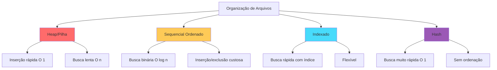

### 📊 Relacionamento entre Arquivos e Índices

**Metáfora do Catálogo:** O **arquivo de dados** é a estante com os livros. O **índice** é o catálogo de fichas que te diz onde encontrar cada livro.

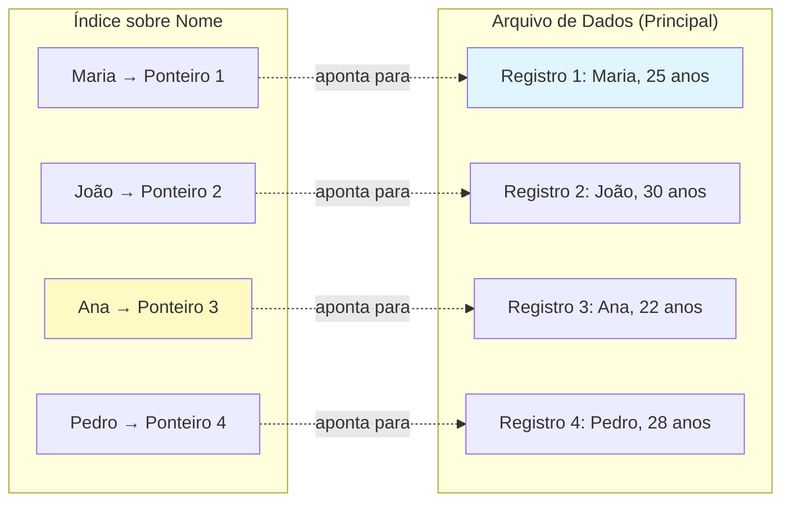

**Múltiplos Índices no Mesmo Arquivo:**

SIM! Podemos ter vários índices sobre o mesmo arquivo:

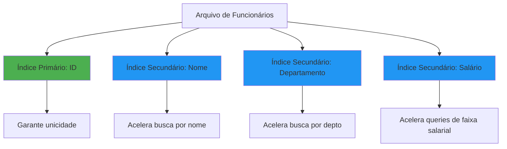

### 🔑 Conceitos Fundamentais

#### 1.1 Chave de Pesquisa vs Entrada de Dados

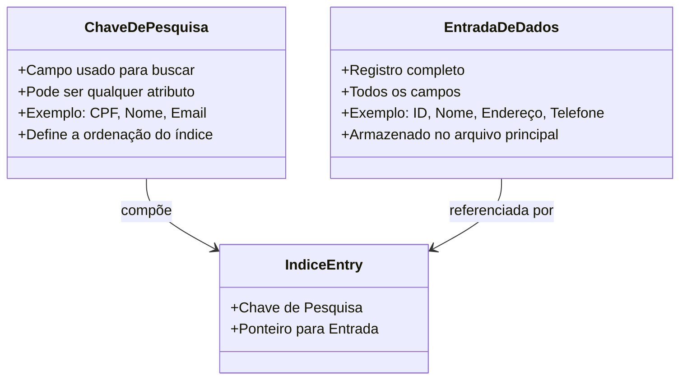

**Exemplo Prático:**

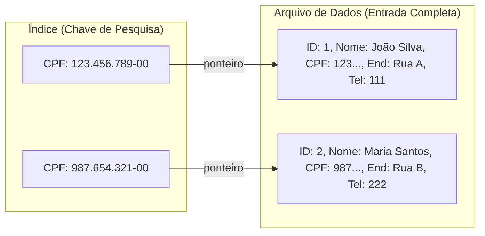

#### 1.2 RID (Record Identifier)

**O que é RID?**

O **RID** (Record ID ou Row ID) é como o "endereço físico" de um registro no disco. É composto por:

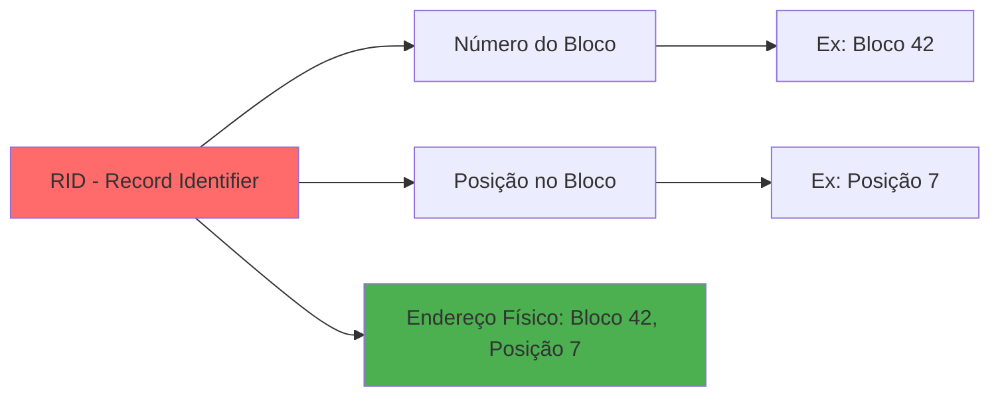

**Exemplo Visual:**

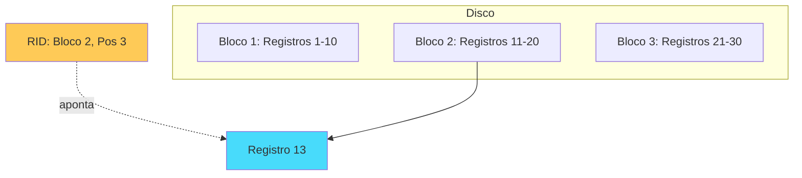

### 🏗️ Índice Agrupado (Clustered) vs Não Agrupado

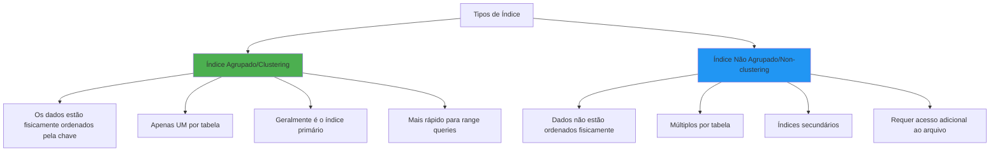

**Exemplo Visual - Índice Agrupado:**

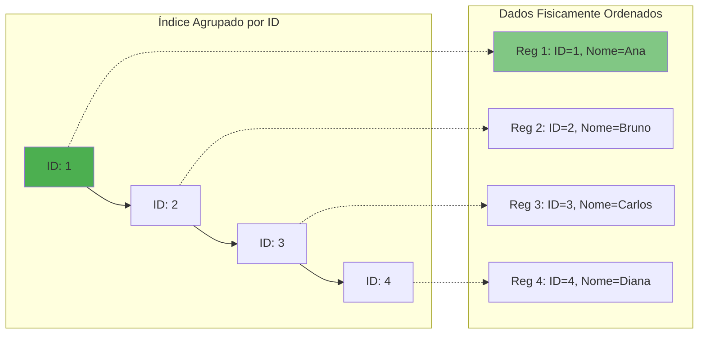

**Quantos Índices Agrupados?** Apenas **UM** por tabela! Por quê? Os dados só podem estar fisicamente ordenados de UMA forma.

**Quantos Índices Não Agrupados?** **VÁRIOS!** Não há limite teórico, mas cada índice adicional:
- Consome espaço em disco
- Aumenta tempo de INSERT/UPDATE/DELETE

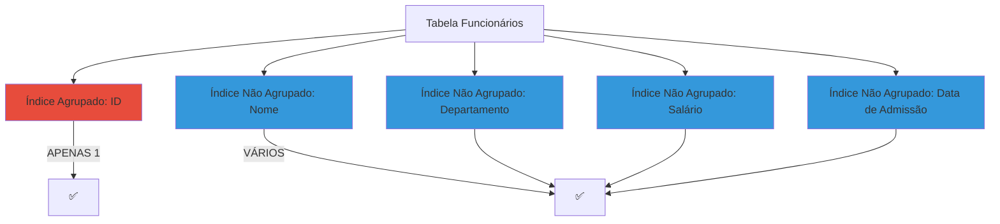

---

### 📝 Exercícios - Seção 1

#### **Exercício 1:**
**O que é uma organização de arquivo? O que é um índice? Qual o relacionamento entre arquivos e índices? Podemos ter diversos índices sobre um mesmo arquivo de registros?**

**Resposta:**

- **Organização de arquivo:** É a forma como os registros são estruturados e armazenados fisicamente no disco (heap, sequencial, hash, etc.)
- **Índice:** É uma estrutura de dados auxiliar que contém chaves de pesquisa e ponteiros para os registros, acelerando buscas
- **Relacionamento:** O arquivo contém os dados completos, enquanto os índices apontam para esses dados, funcionando como catálogos
- **Múltiplos índices:** SIM! Podemos ter:
  - 1 índice agrupado (clustering)
  - N índices não agrupados (non-clustering) sobre diferentes campos

---

#### **Exercício 2:**
**No que diz respeito a índices, o que é uma chave de pesquisa e o que é uma entrada de dados?**

**Resposta:**

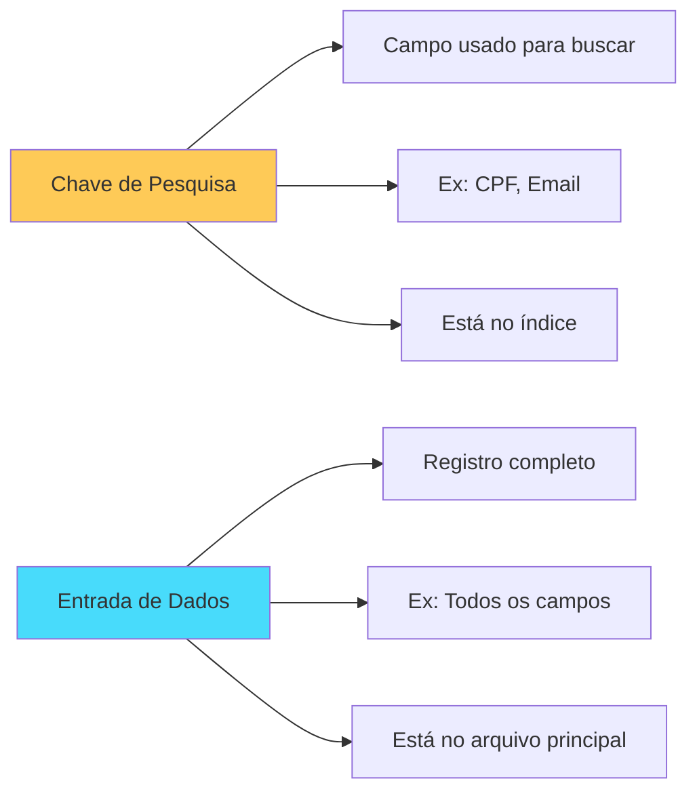

- **Chave de pesquisa:** O campo específico usado para indexar e buscar (ex: CPF, ID)
- **Entrada de dados:** O registro completo com todos os campos armazenados no arquivo de dados

---

#### **Exercício 3:**
**O que é um índice agrupado (ou integrado)? Quantos índices agrupados e quantos índices não agrupados podem ser criados em um arquivo de registros?**

**Resposta:**

- **Índice Agrupado:** Índice onde os dados estão fisicamente ordenados pela chave de indexação
- **Quantidades:**
  - **Índice Agrupado:** Apenas **1** por tabela (dados só podem estar ordenados de uma forma)
  - **Índice Não Agrupado:** **N** índices (múltiplos permitidos)

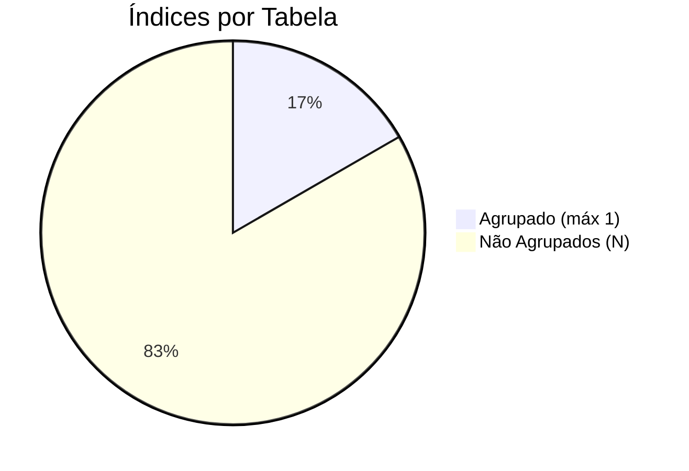

---

#### **Exercício 4:**
**Indique quando é adequado usar índices baseados em hash ou de árvore.**

**Resposta:**

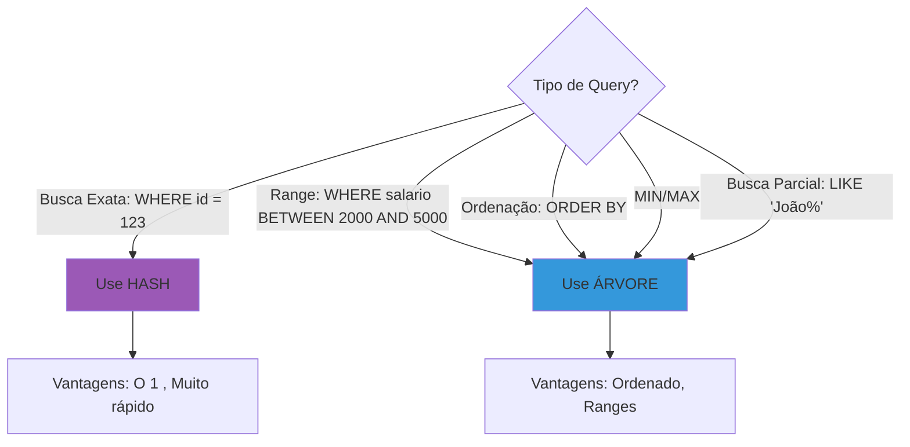

| Situação | Use Hash | Use Árvore |
|----------|----------|------------|
| WHERE id = 123 | ✅ | ✅ |
| WHERE salario > 2000 | ❌ | ✅ |
| ORDER BY nome | ❌ | ✅ |
| JOIN em chave única | ✅ | ✅ |
| LIKE 'João%' | ❌ | ✅ |

---

#### **Exercício 5:**
**O que é um método de avaliação somente de índice? Dê um exemplo. Qual a sua principal vantagem?**

**Resposta:**

**Método de Avaliação Somente de Índice (Index-Only Scan):** Quando a query pode ser respondida APENAS consultando o índice, sem acessar o arquivo de dados principal.

**Exemplo:**

```sql
-- Tabela: funcionario(id, nome, salario, nascimento)
-- Índice sobre: salario

-- Query que usa APENAS o índice:
SELECT COUNT(*) 
FROM funcionario 
WHERE salario > 2000;

-- O SGBD não precisa acessar o arquivo principal!
```

```mermaid
sequenceDiagram
    participant Q as Query
    participant I as Índice (salario)
    participant D as Arquivo de Dados
    
    Q->>I: COUNT(*) WHERE salario > 2000
    I->>I: Conta entradas com salario > 2000
    I->>Q: Retorna: 150
    
    Note over D: ✅ NÃO FOI ACESSADO!
    
    style I fill:#4caf50
```

**Vantagem Principal:**
- 🚀 **Muito mais rápido** - evita I/O no arquivo de dados
- 📉 **Menos blocos lidos** - índices são menores que arquivos de dados
- 💾 **Economia de cache** - mantém mais índice em memória

---

#### **Exercício 6:**
**Por que os custos de E/S são tão importantes para um SGBD?**

**Resposta:**

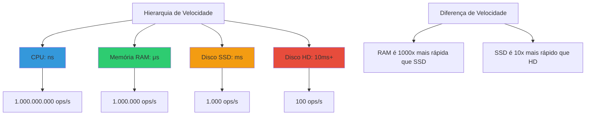

**Razões:**

1. **Gargalo de Performance:** Acesso a disco é **milhões de vezes** mais lento que RAM
2. **Impacto Direto:** 90% do tempo de execução de queries pode ser I/O
3. **Escalabilidade:** Sistemas com muitos usuários = muitas requisições de disco
4. **Custo:** Discos rápidos são caros, otimizar I/O economiza dinheiro

**Exemplo Prático:**

```
Operação: Buscar 1 registro

SEM Índice:
- Ler 1.000 blocos sequencialmente
- Tempo: 1.000 × 10ms = 10 segundos 😱

COM Índice:
- Ler 4 blocos (altura da árvore)
- Tempo: 4 × 10ms = 40ms 😊

Melhoria: 250x mais rápido!
```

---

#### **Exercício 7:**
**O que é um rid (id de registro)?**

**Resposta:**

**RID (Record ID)** é o identificador único e endereço físico de um registro no disco.

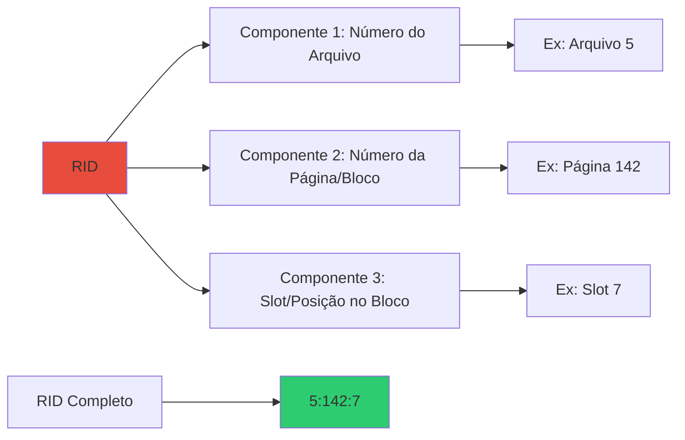

**Estrutura Típica:**

```
RID = (FileID, PageID, SlotNumber)

Exemplo: RID = (1, 42, 7)
- Arquivo 1
- Página/Bloco 42
- 7º registro naquela página
```

**Uso do RID:**

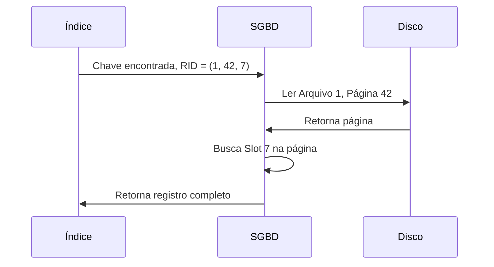

---

#### **Exercício 8:**
**Considere uma relação com registros armazenados em ordem aleatória. Tal relação possui um índice não-agrupado sobre o campo salario. Considere uma consulta buscando os registros com salario > 2000. Usar o índice é sempre a melhor alternativa? Explique.**

**Resposta:**

❌ **NÃO, nem sempre é a melhor alternativa!**

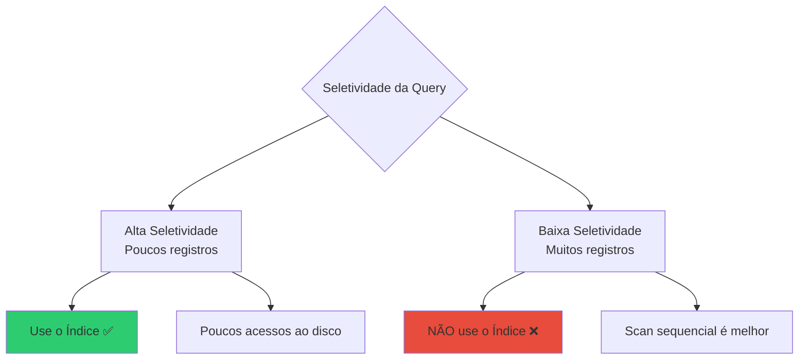

**Cenário 1: Poucos registros (salario > 10000)**

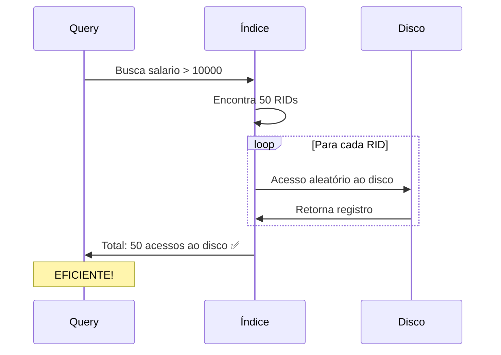

**Cenário 2: Muitos registros (salario > 2000)**

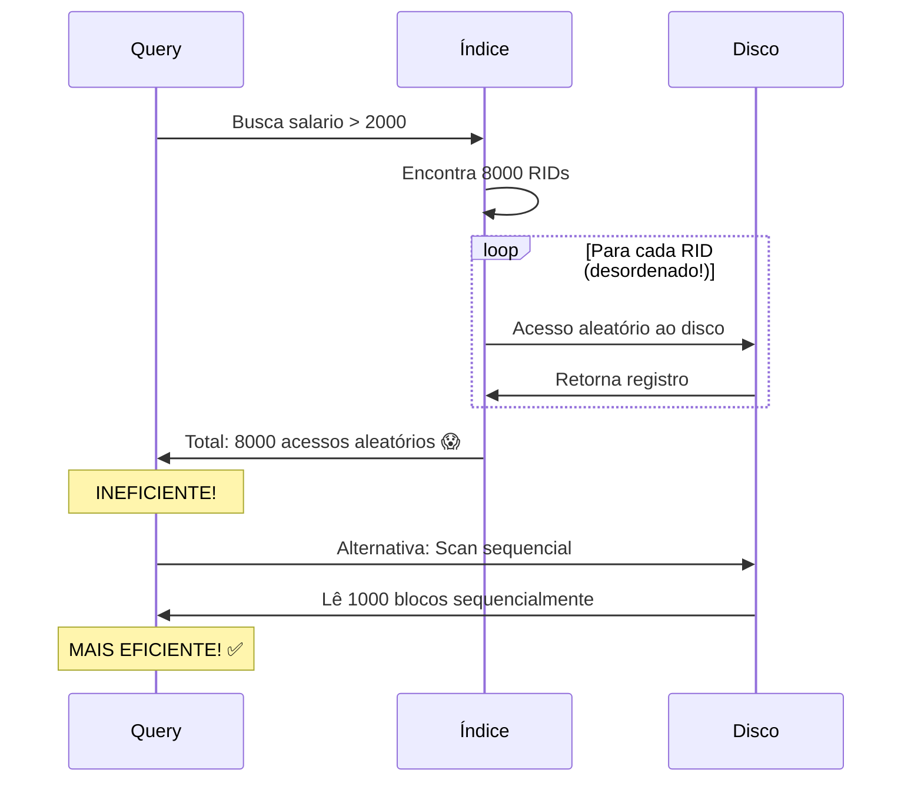

**Explicação:**

| Fator | Usar Índice | Scan Sequencial |
|-------|-------------|-----------------|
| **Seletividade** | Alta (< 10% registros) | Baixa (> 15% registros) |
| **Tipo de Acesso** | Aleatório (lento) | Sequencial (rápido) |
| **Nº de I/Os** | 1 por registro | 1 por bloco (vários registros) |

**Regra Geral:**
- Se a query retorna **< 10-15%** dos registros → Use índice
- Se a query retorna **> 15-20%** dos registros → Scan sequencial

---

#### **Exercício 9:**
**Considere a seguinte relação: `funcionario(id, nome, salario, nascimento)`. Há um índice agrupado sobre `id` e um índice não agrupado sobre `nascimento`.**

**(a) Dê um exemplo de operação que seja beneficiada por causa dos índices.**

**Resposta:**

```sql
-- Operação 1: Busca exata por ID (usa índice agrupado)
SELECT * FROM funcionario WHERE id = 1234;
-- ✅ MUITO RÁPIDO: 3-4 acessos ao disco (altura da árvore)
-- Como os dados estão ordenados por ID, acesso é direto

-- Operação 2: Range query em nascimento (usa índice não agrupado)
SELECT nome, salario 
FROM funcionario 
WHERE nascimento BETWEEN '1990-01-01' AND '1995-12-31';
-- ✅ RÁPIDO: Usa índice para localizar registros

-- Operação 3: Ordenação por ID (usa índice agrupado)
SELECT * FROM funcionario ORDER BY id LIMIT 100;
-- ✅ MUITO RÁPIDO: Dados já estão fisicamente ordenados!
```

```mermaid
sequenceDiagram
    participant Q as Query: WHERE id = 1234
    participant IC as Índice Agrupado (ID)
    participant D as Dados (Ordenados por ID)
    
    Q->>IC: Busca id = 1234
    IC->>IC: Busca binária na árvore
    IC->>D: Acesso direto ao registro
    D->>Q: Retorna registro (3-4 I/Os)
    
    Note over Q: ✅ EFICIENTE!
```

---

**(b) Dê um exemplo de operação que pode ficar mais lenta com o uso do índice.**

**Resposta:**

```sql
-- Operação LENTA: Busca muitos registros via índice não agrupado
SELECT * FROM funcionario 
WHERE nascimento > '1980-01-01';
-- ❌ LENTO: Retorna 80% dos registros
-- Índice não agrupado requer acesso aleatório para cada registro!

-- Melhor alternativa: Scan sequencial
-- SGBD ignora o índice e lê a tabela inteira sequencialmente
```

```mermaid
graph TD
    A[Query retorna 80% dos registros] --> B{Usa índice não agrupado?}
    
    B -->|SIM| C[8000 acessos ALEATÓRIOS]
    B -->|NÃO| D[1000 blocos SEQUENCIAIS]
    
    C --> C1[Custo: 8000 × 10ms = 80s 😱]
    D --> D1[Custo: 1000 × 10ms = 10s ✅]
    
    style C fill:#e74c3c
    style D fill:#2ecc71
```

**Outro Exemplo:**

```sql
-- Operação de Inserção em massa
INSERT INTO funcionario 
SELECT * FROM funcionario_temp;
-- ❌ LENTO: Para cada inserção, precisa atualizar:
--   1. Índice agrupado (ID)
--   2. Índice não agrupado (nascimento)
-- Solução: Dropar índices, inserir, recriar índices
```

---

**(c) Há operações que podem não ser afetadas pelos índices? Quais?**

**Resposta:**

✅ **SIM!** Operações que **não filtram nem ordenam por campos indexados:**

```sql
-- Operação 1: Full table scan sem filtro
SELECT * FROM funcionario;
-- Índices NÃO são usados: precisa ler toda a tabela

-- Operação 2: Filtro em campo não indexado
SELECT * FROM funcionario WHERE salario > 5000;
-- Índice em 'nascimento' NÃO ajuda!
-- Índice em 'id' NÃO ajuda!
-- SGBD faz scan sequencial

-- Operação 3: Funções que invalidam índice
SELECT * FROM funcionario WHERE YEAR(nascimento) = 1990;
-- Função YEAR() impede uso do índice
-- Melhor: WHERE nascimento BETWEEN '1990-01-01' AND '1990-12-31'

-- Operação 4: Agregação sem GROUP BY indexado
SELECT AVG(salario) FROM funcionario;
-- Precisa ler todos os registros

-- Operação 5: UPDATE sem WHERE
UPDATE funcionario SET salario = salario * 1.1;
-- Atualiza TODA a tabela, índices são mantidos mas não aceleram
```

```mermaid
graph TD
    A[Operação] --> B{Usa campo indexado?}
    
    B -->|NÃO| C[Índice NÃO afeta]
    B -->|SIM| D{Tipo de operação?}
    
    D --> D1[SELECT com WHERE/ORDER BY → Ajuda ✅]
    D --> D2[INSERT/UPDATE/DELETE → Atrasa ❌]
    D --> D3[Full scan → Não afeta]
    
    C --> E[Exemplos:<br/>- SELECT *<br/>- WHERE em campo não indexado<br/>- Funções que invalidam índice]
    
    style C fill:#95a5a6
    style D1 fill:#2ecc71
    style D2 fill:#e74c3c
```

---

#### **Exercício 10:**
**Discuta os prós e contras das chaves de pesquisa compostas.**

**Resposta:**

**Chave Composta:** Índice sobre múltiplos campos (ex: índice sobre `(estado, cidade, bairro)`)

```mermaid
mindmap
  root((Chave Composta))
    PRÓS
      Queries específicas
        WHERE estado='SP' AND cidade='Campinas'
      Ordenação múltipla
        ORDER BY estado, cidade
      Cobertura
        Index-only scan
      Unicidade
        UNIQUE estado, placa
    CONTRAS
      Tamanho maior
        Mais espaço em disco
      Ordem importa
        indice estado, cidade não ajuda em cidade='X'
      Manutenção custosa
        UPDATEs mais lentos
      Uso limitado
        Deve seguir ordem dos campos
```

**Exemplo Prático:**

```sql
-- Índice composto: (estado, cidade, bairro)
CREATE INDEX idx_localizacao ON endereco(estado, cidade, bairro);
```

**✅ FUNCIONA (usa o índice):**

```sql
-- 1. Usa todas as colunas
SELECT * FROM endereco 
WHERE estado = 'SP' AND cidade = 'Campinas' AND bairro = 'Centro';

-- 2. Usa prefixo da esquerda
SELECT * FROM endereco 
WHERE estado = 'SP' AND cidade = 'Campinas';

-- 3. Usa apenas primeiro campo
SELECT * FROM endereco 
WHERE estado = 'SP';

-- 4. Ordenação compatível
SELECT * FROM endereco 
ORDER BY estado, cidade, bairro;
```

**❌ NÃO FUNCIONA (não usa o índice):**

```sql
-- 1. Pula primeiro campo
SELECT * FROM endereco 
WHERE cidade = 'Campinas';  -- ❌ índice não é usado

-- 2. Usa apenas último campo
SELECT * FROM endereco 
WHERE bairro = 'Centro';  -- ❌ índice não é usado

-- 3. Ordem diferente
SELECT * FROM endereco 
ORDER BY cidade, estado;  -- ❌ índice não ajuda na ordenação
```

```mermaid
graph TD
    A[Índice: estado, cidade, bairro] --> B{Ordem da Query}
    
    B -->|estado, cidade, bairro| C[✅ USA índice completo]
    B -->|estado, cidade| D[✅ USA prefixo]
    B -->|estado| E[✅ USA primeiro campo]
    B -->|cidade| F[❌ NÃO USA pula estado]
    B -->|bairro| G[❌ NÃO USA pula estado e cidade]
    
    style C fill:#2ecc71
    style D fill:#2ecc71
    style E fill:#2ecc71
    style F fill:#e74c3c
    style G fill:#e74c3c
```

**Tabela Resumo:**

| Aspecto | Vantagem | Desvantagem |
|---------|----------|-------------|
| **Seletividade** | Muito alta em queries específicas | Baixa se usar apenas últimas colunas |
| **Espaço** | - | Ocupa mais espaço que índice simples |
| **Manutenção** | - | INSERT/UPDATE mais lentos |
| **Flexibilidade** | Cobre múltiplas queries | Ordem fixa, não reorganizável |
| **Performance** | Excelente para padrões específicos | Péssima para padrões diferentes |

---
