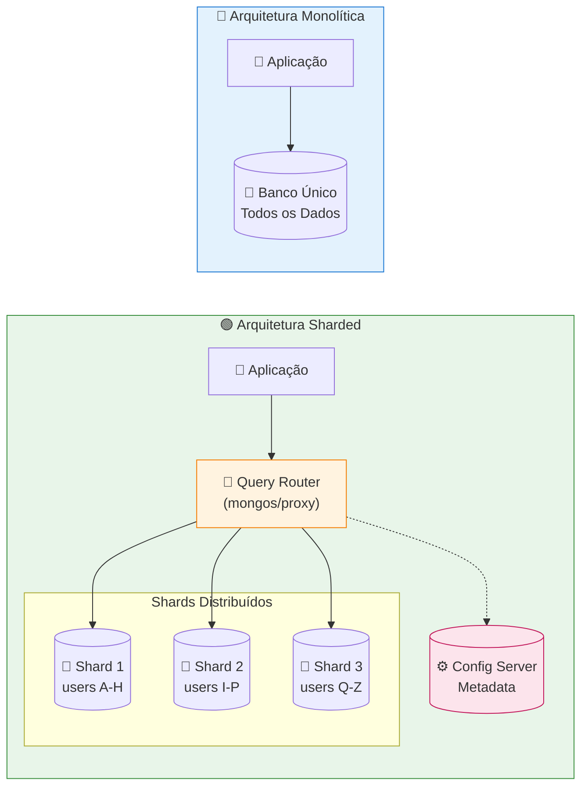
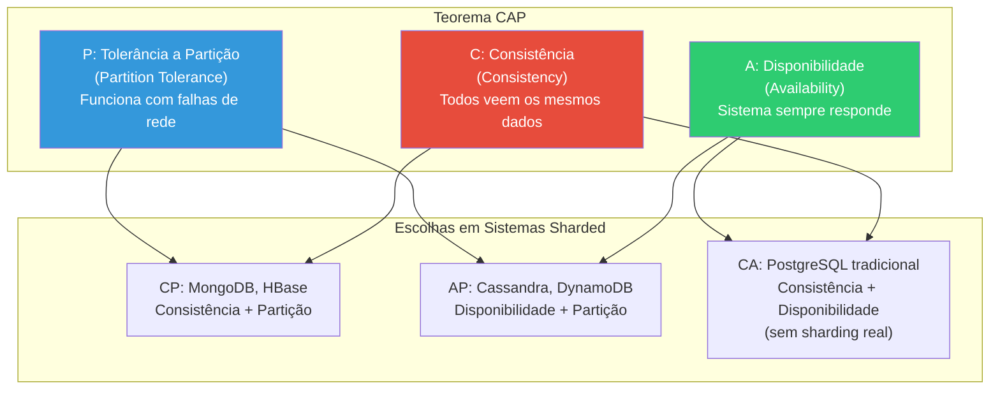
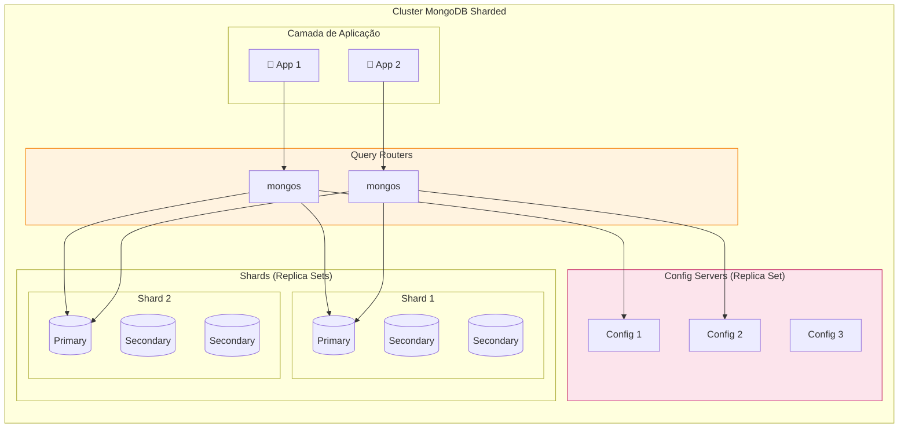
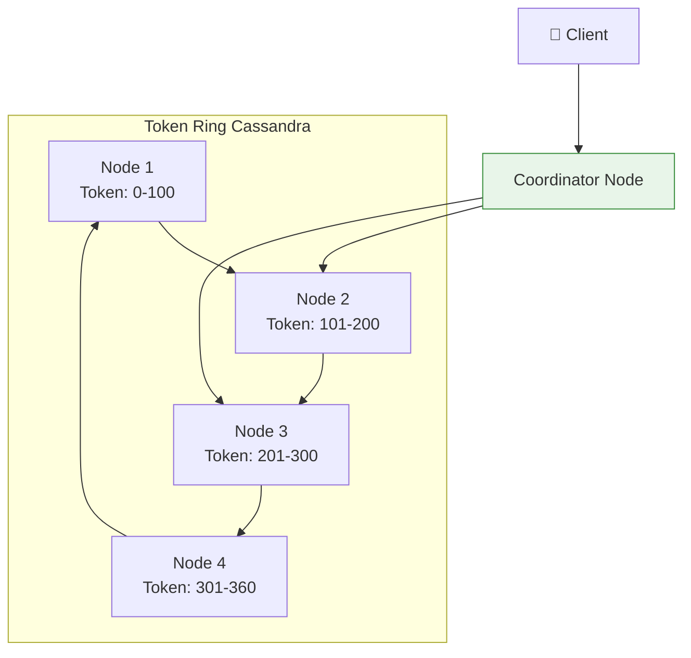
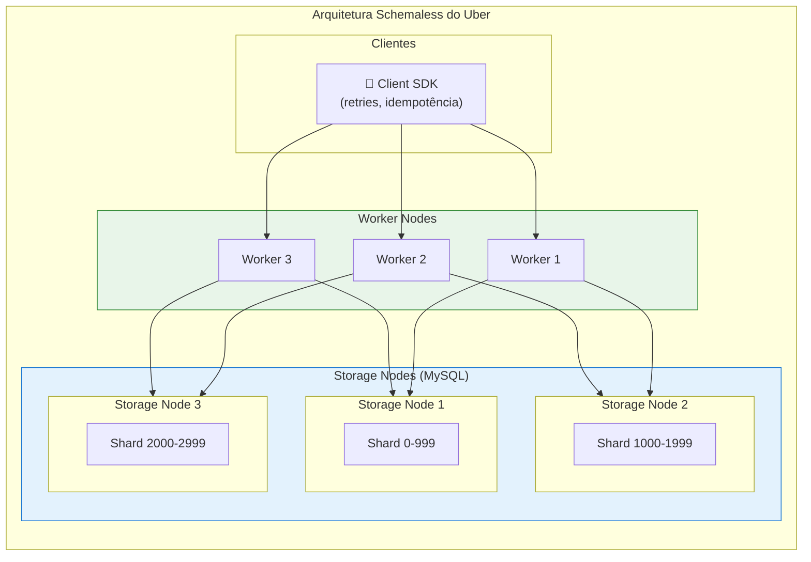
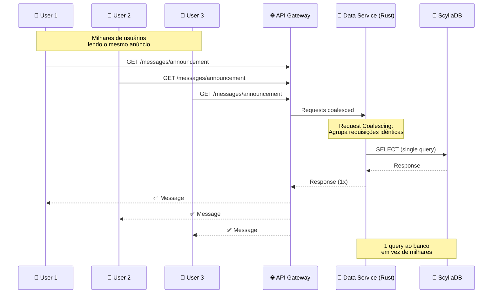
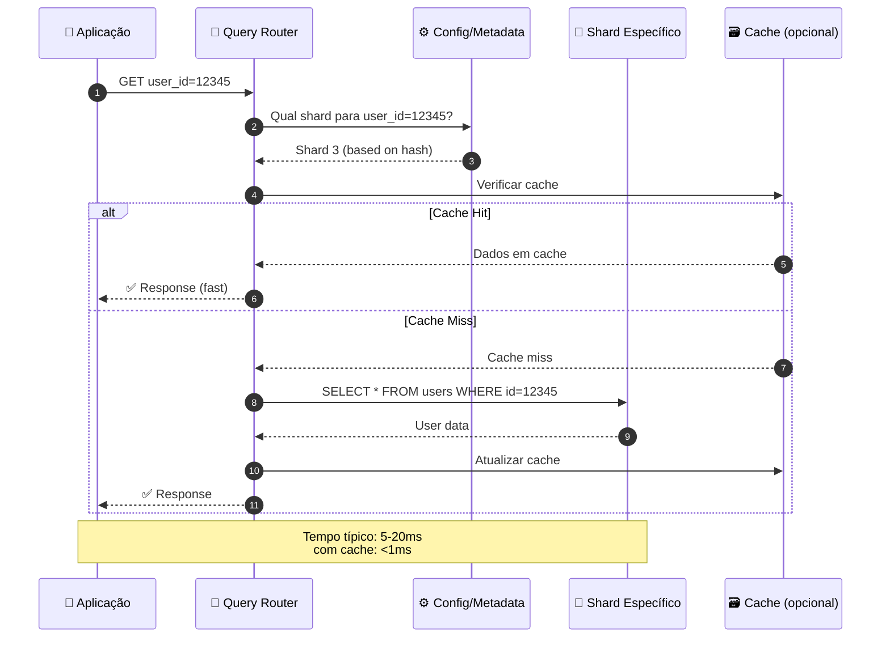

# 🗄️ Sharding e Particionamento em Bancos de Dados Distribuídos

> **Trabalho Técnico-Acadêmico de Alto Nível**  
> **Disciplina:** Banco de Dados II  
> **Integrantes do Grupo:** Henrique Augusto, Henrique Evangelista, Rayssa Mendes

---

## 📋 Sumário

1. [Conceitos Fundamentais de Sharding](#1-conceitos-fundamentais-de-sharding)
2. [Estratégias de Particionamento e Algoritmos](#2-estratégias-de-particionamento-e-algoritmos)
3. [Desafios de Engenharia](#3-desafios-de-engenharia)
4. [Implementação Prática e Comparativa](#4-implementação-prática-e-comparativa)
5. [Casos de Sucesso Empresariais](#5-casos-de-sucesso-empresariais)
6. [Referências](#6-referências)

---

## 1. Conceitos Fundamentais de Sharding

### 1.1 O Que é Sharding?

**Sharding** é uma técnica de escalabilidade horizontal que consiste em dividir um banco de dados em fragmentos menores, chamados **shards**, onde cada shard é armazenado em um **servidor ou nó independente**. Cada shard contém um subconjunto único dos dados totais, e coletivamente todos os shards representam o dataset completo.

> 💡 **Conceito-chave:** Sharding é fundamentalmente diferente de escalar verticalmente (adicionar mais CPU/RAM a um único servidor). Com sharding, você distribui a carga entre múltiplos servidores.

### 1.2 Sharding vs. Particionamento: Diferenças Críticas

É essencial distinguir entre **Sharding**, **Particionamento** e **Replicação**, pois são conceitos frequentemente confundidos:

| Característica | **Particionamento** | **Sharding** | **Replicação** |
|----------------|---------------------|--------------|----------------|
| **Como funciona** | Divide dados dentro de um único servidor/banco | Divide dados entre múltiplos servidores | Duplica dados entre servidores |
| **Objetivo** | Performance e manutenibilidade local | Escalabilidade horizontal e throughput | Disponibilidade e tolerância a falhas |
| **Onde os dados residem** | Mesmo servidor | Servidores diferentes | Cópias idênticas em múltiplos servidores |
| **Uso primário** | Gerenciamento de tabelas grandes | Aplicações de larga escala | Leitura escalável, failover, DR |
| **Complexidade** | Moderada | Alta (roteamento necessário) | Moderada (sincronização) |
| **Consistência** | Fácil de manter | Difícil (entre shards) | Pode ser desafiadora |

#### Tipos de Particionamento

1. **Particionamento Horizontal:** Divide tabelas em linhas (subconjuntos de registros) baseado em uma chave.
2. **Particionamento Vertical:** Divide tabelas por colunas, útil para isolar dados frequentemente acessados.

### 1.3 Arquitetura Shared-Nothing

O Sharding geralmente implementa a arquitetura **Shared-Nothing** (SN), onde:

- Cada nó é **autossuficiente** e opera independentemente
- Não há compartilhamento de memória, disco ou CPU entre nós
- A comunicação entre nós ocorre apenas via rede
- **Escalabilidade linear:** adicionar nós = adicionar capacidade proporcional

**Benefícios do Shared-Nothing:**
- ✅ Eliminação de gargalos de recursos compartilhados
- ✅ Escalabilidade quase linear
- ✅ Isolamento de falhas (um nó com problema não afeta outros)
- ✅ Facilidade de manutenção (nós podem ser atualizados individualmente)

### 1.4 Diagrama: Banco Monolítico vs. Banco Sharded



**Explicação do Diagrama:**
- Na arquitetura **monolítica**, toda aplicação se conecta a um único banco de dados que contém todos os dados
- Na arquitetura **sharded**, um **Query Router** direciona as requisições para o shard correto baseado na chave de shard
- O **Config Server** armazena metadados sobre qual dado está em qual shard

---

## 2. Estratégias de Particionamento e Algoritmos

### 2.1 Hash-Based Partitioning (Particionamento por Hash)

Utiliza uma **função hash** aplicada à chave de shard para determinar em qual partição o dado será armazenado.

```
shard_id = hash(shard_key) % número_de_shards
```

**✅ Vantagens:**
- Distribuição uniforme dos dados (quando a função hash é boa)
- Previsibilidade: dado a chave, sabe-se exatamente onde o dado está
- Bom para cargas de trabalho com escritas aleatórias

**❌ Desvantagens:**
- **Consultas de range são ineficientes** (dados ordenados ficam espalhados)
- Reorganização massiva quando se adiciona/remove shards
- Perda da localidade temporal dos dados

### 2.2 Range-Based Partitioning (Particionamento por Faixa)

Divide dados em **faixas contíguas** baseadas no valor da chave de shard.

| Faixa de IDs | Shard |
|--------------|-------|
| 1 - 1.000.000 | Shard 1 |
| 1.000.001 - 2.000.000 | Shard 2 |
| 2.000.001 - 3.000.000 | Shard 3 |

**✅ Vantagens:**
- **Consultas de range são eficientes** (dados contíguos no mesmo shard)
- Bom para dados ordenados cronologicamente
- Facilita backup e arquivamento por período

**❌ Desvantagens:**
- **Risco de hotspots:** se muitas inserções ocorrem na mesma faixa (ex: dados recentes)
- Desbalanceamento natural conforme os dados crescem
- Requer rebalanceamento manual frequente

### 2.3 List-Based Partitioning (Particionamento por Lista)

Mapeia **valores específicos** para shards determinados.

```sql
-- Exemplo conceitual
Shard 1: região IN ('Norte', 'Nordeste')
Shard 2: região IN ('Sul', 'Sudeste')
Shard 3: região IN ('Centro-Oeste')
```

**✅ Vantagens:**
- Controle explícito sobre distribuição
- Útil para multi-tenancy (cada cliente em um shard)
- Facilita compliance de dados regionais (LGPD, GDPR)

**❌ Desvantagens:**
- Pode causar desbalanceamento se categorias têm volumes muito diferentes
- Gerenciamento manual das listas
- Baixa cardinalidade pode limitar escalabilidade

### 2.4 Directory-Based Partitioning

Mantém uma **tabela de lookup centralizada** que mapeia cada chave para seu respectivo shard.

**✅ Vantagens:**
- Máxima flexibilidade
- Fácil realocação de dados específicos
- Suporta qualquer estratégia de distribuição

**❌ Desvantagens:**
- **Ponto único de falha:** a tabela de lookup é crítica
- Latência adicional por consulta ao diretório
- Complexidade de manutenção

### 2.5 Consistent Hashing (Hashing Consistente)

O **Consistent Hashing** é um algoritmo revolucionário que resolve o problema de reorganização massiva quando nós são adicionados ou removidos.

#### Como Funciona:

1. **Hash Ring:** Tanto os nós quanto as chaves são mapeados para um espaço circular (anel)
2. **Atribuição:** Cada chave é atribuída ao primeiro nó encontrado no sentido horário
3. **Movimentação mínima:** Quando um nó entra/sai, apenas chaves entre ele e seu predecessor são afetadas

#### Virtual Nodes (Vnodes)

Para melhorar a distribuição, cada nó físico representa **múltiplos nós virtuais** no anel:

```
Servidor A → A1, A2, A3 (3 vnodes)
Servidor B → B1, B2, B3 (3 vnodes)
Servidor C → C1, C2, C3 (3 vnodes)
```

**Benefícios dos Vnodes:**
- ✅ Distribuição mais uniforme
- ✅ Servidores com maior capacidade podem ter mais vnodes
- ✅ Quando um nó falha, a carga é distribuída entre TODOS os sobreviventes

### 2.6 O Problema de Hotspots

**Hotspots** ocorrem quando um shard recebe desproporcionalmente mais tráfego que outros.

**Causas comuns:**
- Chaves com baixa cardinalidade (ex: sharding por país em app global)
- Padrões de acesso não uniformes (ex: celebridade no Twitter)
- Chaves monotônicas crescentes (ex: timestamp como shard key)

**Soluções:**
1. **Salting:** Adicionar prefixo aleatório à chave
2. **Compound keys:** Combinar múltiplos campos
3. **Hashed shard keys:** Usar hash da chave original
4. **Request coalescing:** Agrupar múltiplas requisições idênticas

### 2.7 Visualização: Simulação de Consistent Hashing com Python

O script Python abaixo demonstra visualmente como o Consistent Hashing distribui chaves entre nós, incluindo o conceito de Virtual Nodes para melhor balanceamento.

```python
"""
Simulação Visual de Consistent Hashing com Virtual Nodes
Demonstra a distribuição de 1000 chaves entre nós usando Consistent Hashing

Uso: python consistent_hashing_visualization.py
Requer: matplotlib, numpy (pip install matplotlib numpy)
"""

import hashlib
import matplotlib.pyplot as plt
import numpy as np
from collections import defaultdict

class ConsistentHashRing:
    """Implementação de Consistent Hashing com Virtual Nodes."""
    
    def __init__(self, nodes=None, virtual_nodes=100):
        """
        Inicializa o hash ring.
        
        Args:
            nodes: Lista de nomes dos nós físicos
            virtual_nodes: Número de virtual nodes por nó físico
        """
        self.virtual_nodes = virtual_nodes
        self.ring = {}  # hash -> node_name
        self.sorted_keys = []
        self.node_positions = defaultdict(list)  # node -> [positions]
        
        if nodes:
            for node in nodes:
                self.add_node(node)
    
    def _hash(self, key):
        """Gera hash MD5 normalizado para o espaço [0, 360)."""
        md5 = hashlib.md5(str(key).encode()).hexdigest()
        return int(md5, 16) % 360
    
    def add_node(self, node):
        """Adiciona um nó com seus virtual nodes ao ring."""
        for i in range(self.virtual_nodes):
            virtual_key = f"{node}:vnode{i}"
            hash_val = self._hash(virtual_key)
            self.ring[hash_val] = node
            self.node_positions[node].append(hash_val)
        self.sorted_keys = sorted(self.ring.keys())
    
    def remove_node(self, node):
        """Remove um nó e seus virtual nodes do ring."""
        for i in range(self.virtual_nodes):
            virtual_key = f"{node}:vnode{i}"
            hash_val = self._hash(virtual_key)
            if hash_val in self.ring:
                del self.ring[hash_val]
        self.sorted_keys = sorted(self.ring.keys())
        del self.node_positions[node]
    
    def get_node(self, key):
        """Retorna o nó responsável pela chave dada."""
        if not self.ring:
            return None
        
        hash_val = self._hash(key)
        
        # Busca binária pelo primeiro nó no sentido horário
        for ring_key in self.sorted_keys:
            if ring_key >= hash_val:
                return self.ring[ring_key]
        
        # Se não encontrou, volta ao início do anel
        return self.ring[self.sorted_keys[0]]


def simulate_key_distribution(num_keys=1000, nodes=None, virtual_nodes=100):
    """
    Simula a distribuição de chaves entre nós.
    
    Returns:
        tuple: (hash_ring, key_distribution, key_positions)
    """
    if nodes is None:
        nodes = ['Shard-A', 'Shard-B', 'Shard-C', 'Shard-D']
    
    ring = ConsistentHashRing(nodes, virtual_nodes)
    distribution = defaultdict(int)
    key_positions = []
    
    for i in range(num_keys):
        key = f"user_{i}"
        assigned_node = ring.get_node(key)
        distribution[assigned_node] += 1
        key_positions.append((ring._hash(key), assigned_node))
    
    return ring, dict(distribution), key_positions


def visualize_hash_ring(ring, key_positions, title="Consistent Hashing Ring"):
    """
    Cria visualização do hash ring com nós e distribuição de chaves.
    """
    fig, axes = plt.subplots(1, 2, figsize=(14, 6))
    
    # Cores para cada nó
    colors = {
        'Shard-A': '#e74c3c',  # Vermelho
        'Shard-B': '#3498db',  # Azul
        'Shard-C': '#2ecc71',  # Verde
        'Shard-D': '#9b59b6',  # Roxo
    }
    
    # === Gráfico 1: Hash Ring Visual ===
    ax1 = axes[0]
    ax1.set_aspect('equal')
    
    # Desenha o anel
    theta = np.linspace(0, 2*np.pi, 100)
    ax1.plot(np.cos(theta), np.sin(theta), 'k-', linewidth=2, alpha=0.3)
    
    # Plota os virtual nodes
    for node, positions in ring.node_positions.items():
        for pos in positions[:10]:  # Mostra apenas primeiros 10 vnodes para clareza
            angle = np.radians(pos)
            x, y = np.cos(angle), np.sin(angle)
            ax1.plot(x, y, 'o', color=colors.get(node, 'gray'), 
                    markersize=8, alpha=0.7)
    
    # Plota algumas chaves como exemplo
    for pos, node in key_positions[:50]:  # Primeiras 50 chaves
        angle = np.radians(pos)
        x, y = 0.85 * np.cos(angle), 0.85 * np.sin(angle)
        ax1.plot(x, y, '.', color=colors.get(node, 'gray'), 
                markersize=3, alpha=0.5)
    
    # Legenda
    for node, color in colors.items():
        ax1.plot([], [], 'o', color=color, label=node, markersize=10)
    ax1.legend(loc='upper right', fontsize=9)
    
    ax1.set_xlim(-1.3, 1.3)
    ax1.set_ylim(-1.3, 1.3)
    ax1.set_title('Hash Ring com Virtual Nodes\n(pontos externos: vnodes, internos: chaves)', 
                  fontsize=11)
    ax1.axis('off')
    
    # === Gráfico 2: Distribuição de Chaves ===
    ax2 = axes[1]
    
    distribution = defaultdict(int)
    for _, node in key_positions:
        distribution[node] += 1
    
    nodes_list = list(colors.keys())
    counts = [distribution.get(n, 0) for n in nodes_list]
    bars = ax2.bar(nodes_list, counts, color=[colors[n] for n in nodes_list], 
                   edgecolor='black', linewidth=1.2)
    
    # Adiciona valores sobre as barras
    for bar, count in zip(bars, counts):
        ax2.text(bar.get_x() + bar.get_width()/2, bar.get_height() + 5,
                f'{count}', ha='center', va='bottom', fontsize=11, fontweight='bold')
    
    # Linha de distribuição ideal
    ideal = len(key_positions) / len(nodes_list)
    ax2.axhline(y=ideal, color='red', linestyle='--', linewidth=2, 
                label=f'Distribuição Ideal ({ideal:.0f})')
    
    ax2.set_xlabel('Shards', fontsize=11)
    ax2.set_ylabel('Número de Chaves', fontsize=11)
    ax2.set_title(f'Distribuição de {len(key_positions)} Chaves entre Shards', fontsize=11)
    ax2.legend(loc='upper right')
    ax2.set_ylim(0, max(counts) * 1.15)
    
    # Estatísticas
    std_dev = np.std(counts)
    cv = (std_dev / np.mean(counts)) * 100  # Coeficiente de variação
    
    stats_text = f'Desvio Padrão: {std_dev:.1f}\nCoef. Variação: {cv:.1f}%'
    ax2.text(0.02, 0.98, stats_text, transform=ax2.transAxes, fontsize=9,
             verticalalignment='top', bbox=dict(boxstyle='round', facecolor='wheat', alpha=0.5))
    
    plt.suptitle(title, fontsize=14, fontweight='bold', y=1.02)
    plt.tight_layout()
    
    return fig


def compare_vnode_impact():
    """
    Compara distribuição com diferentes números de virtual nodes.
    """
    fig, axes = plt.subplots(2, 2, figsize=(12, 10))
    
    vnode_configs = [1, 10, 50, 150]
    nodes = ['Shard-A', 'Shard-B', 'Shard-C', 'Shard-D']
    colors = ['#e74c3c', '#3498db', '#2ecc71', '#9b59b6']
    
    for ax, vnodes in zip(axes.flatten(), vnode_configs):
        ring, distribution, _ = simulate_key_distribution(
            num_keys=1000, 
            nodes=nodes, 
            virtual_nodes=vnodes
        )
        
        counts = [distribution.get(n, 0) for n in nodes]
        bars = ax.bar(nodes, counts, color=colors, edgecolor='black')
        
        # Adiciona valores
        for bar, count in zip(bars, counts):
            ax.text(bar.get_x() + bar.get_width()/2, bar.get_height() + 5,
                   f'{count}', ha='center', va='bottom', fontsize=10, fontweight='bold')
        
        # Linha ideal
        ideal = 1000 / len(nodes)
        ax.axhline(y=ideal, color='red', linestyle='--', linewidth=2)
        
        # Estatísticas
        std_dev = np.std(counts)
        cv = (std_dev / np.mean(counts)) * 100
        
        ax.set_title(f'Virtual Nodes = {vnodes}\n(CV: {cv:.1f}%)', fontsize=11)
        ax.set_ylabel('Chaves')
        ax.set_ylim(0, max(counts) * 1.2)
    
    plt.suptitle('Impacto do Número de Virtual Nodes na Distribuição', 
                 fontsize=14, fontweight='bold')
    plt.tight_layout()
    
    return fig


if __name__ == "__main__":
    print("=" * 60)
    print("SIMULAÇÃO DE CONSISTENT HASHING")
    print("=" * 60)
    
    # Simulação principal
    ring, distribution, key_positions = simulate_key_distribution(
        num_keys=1000,
        virtual_nodes=100
    )
    
    print("\n📊 Distribuição de 1000 chaves com 100 Virtual Nodes:")
    print("-" * 40)
    for node, count in sorted(distribution.items()):
        percent = (count / 1000) * 100
        bar = "█" * int(percent / 2)
        print(f"  {node}: {count:4d} chaves ({percent:5.1f}%) {bar}")
    
    # Salva visualização
    fig1 = visualize_hash_ring(ring, key_positions)
    fig1.savefig('consistent_hashing_visualization.png', dpi=150, bbox_inches='tight')
    print("\n✅ Gráfico salvo: consistent_hashing_visualization.png")
    
    # Comparação de vnodes
    fig2 = compare_vnode_impact()
    fig2.savefig('vnode_comparison.png', dpi=150, bbox_inches='tight')
    print("✅ Gráfico salvo: vnode_comparison.png")
    
    plt.show()
    
    print("\n" + "=" * 60)
    print("CONCLUSÃO:")
    print("  - Consistent Hashing distribui chaves de forma equilibrada")
    print("  - Virtual Nodes melhoram significativamente o balanceamento")
    print("  - Quanto mais vnodes, menor o coeficiente de variação")
    print("=" * 60)
```

---

## 3. Desafios de Engenharia

### 3.1 Roteamento de Queries (Query Routing)

Em um sistema sharded, a aplicação precisa saber **qual shard contém os dados** solicitados. Existem duas abordagens principais:

#### 3.1.1 Camada de Aplicação (Client-Side Routing)

A aplicação conhece a lógica de sharding e roteia diretamente.

```python
# Exemplo conceitual
def get_user_shard(user_id):
    shard_id = hash(user_id) % NUM_SHARDS
    return shard_connections[shard_id]

# Uso
shard = get_user_shard(user_id=12345)
result = shard.query("SELECT * FROM users WHERE id = 12345")
```

**✅ Vantagens:**
- Menor latência (sem hop adicional)
- Menos componentes de infraestrutura

**❌ Desvantagens:**
- Lógica duplicada em todas as aplicações
- Mudanças de sharding exigem deploy de todas as apps
- Dificuldade com múltiplas linguagens de programação

#### 3.1.2 Middleware/Proxy (Server-Side Routing)

Um proxy intermediário (mongos, Vitess, ProxySQL) gerencia o roteamento.

```
App → Proxy (query router) → Shard correto
```

**✅ Vantagens:**
- Lógica centralizada
- Transparente para aplicações
- Facilita mudanças na topologia

**❌ Desvantagens:**
- Hop adicional = latência extra
- Proxy pode ser gargalo ou ponto único de falha
- Complexidade operacional

### 3.2 Cross-Shard Transactions (Transações Distribuídas)

Um dos maiores desafios do sharding é manter a **atomicidade de transações** que envolvem múltiplos shards.

#### 3.2.1 Two-Phase Commit (2PC)

Protocolo clássico para garantir atomicidade:

1. **Fase 1 - Prepare:** Coordenador pergunta a todos os participantes se podem commitar
2. **Fase 2 - Commit/Abort:** Se todos responderam "sim", coordenador envia commit; caso contrário, abort

**Problemas do 2PC:**
- ⚠️ **Bloqueante:** Se o coordenador falha após prepare, participantes ficam em estado indefinido
- ⚠️ **Latência alta:** Requer múltiplos round-trips de rede
- ⚠️ **Não tolerante a partições de rede**

#### 3.2.2 Three-Phase Commit (3PC)

Adiciona uma fase intermediária para reduzir bloqueio:

1. **CanCommit:** Verifica se participantes podem se preparar
2. **PreCommit:** Participantes se preparam e confirmam
3. **DoCommit:** Commit final

**Melhoria:** Reduz janela de bloqueio, mas ainda não é totalmente tolerante a partições.

#### 3.2.3 Saga Pattern

Abordagem moderna baseada em **compensação**:

```
T1 → T2 → T3 → ... → Tn
Se Tk falha:
  Ck-1 → Ck-2 → ... → C1 (compensações)
```

**Exemplo: Reserva de Viagem**
```
1. Reservar Voo ✓
2. Reservar Hotel ✓
3. Cobrar Cartão ✗ (falha)
4. Compensação: Cancelar Hotel
5. Compensação: Cancelar Voo
```

**✅ Vantagens:**
- Não bloqueante
- Escalável
- Adequado para microserviços

**❌ Desvantagens:**
- Complexidade de implementar compensações
- Consistência eventual (não ACID imediato)

### 3.3 Consistência Eventual vs. Consistência Forte

| Aspecto | Consistência Forte | Consistência Eventual |
|---------|-------------------|-----------------------|
| **Definição** | Toda leitura retorna o valor mais recente | Leituras podem retornar valores desatualizados |
| **Garantia** | Linearizabilidade | Convergência eventual |
| **Latência** | Alta (requer coordenação) | Baixa |
| **Disponibilidade** | Pode sacrificar durante partições | Alta disponibilidade |
| **Uso típico** | Sistemas financeiros, inventário | Redes sociais, feeds, analytics |

### 3.4 Cross-Shard Joins

**Problema:** Como fazer JOINs quando os dados estão em shards diferentes?

**Estratégias:**

1. **Broadcast Join:** Enviar tabela menor para todos os shards
   ```
   Custo: O(n × tamanho_tabela_pequena)
   ```

2. **Co-locação:** Garantir que dados relacionados fiquem no mesmo shard
   ```
   user_id como shard key para users, orders, payments
   ```

3. **Desnormalização:** Duplicar dados para evitar JOINs
   ```
   Armazenar user_name junto com cada order
   ```

4. **Processamento em lote:** Realizar JOINs assincronamente

### 3.5 Teorema CAP Aplicado ao Sharding

O **Teorema CAP** afirma que um sistema distribuído pode garantir, no máximo, **duas das três propriedades:**



**Implicações para Sharding:**

- Durante uma **partição de rede**, você DEVE escolher entre C ou A
- Sistemas **CP** (MongoDB, HBase): Preferem consistência, podem recusar escritas
- Sistemas **AP** (Cassandra, DynamoDB): Preferem disponibilidade, aceitam inconsistência temporária

---

## 4. Implementação Prática e Comparativa

### 4.1 Tabela Comparativa: MongoDB vs. Cassandra vs. PostgreSQL (Citus)

| Característica | **MongoDB** | **Cassandra** | **PostgreSQL + Citus** |
|----------------|-------------|---------------|------------------------|
| **Modelo de Dados** | Documentos (JSON/BSON) | Wide-column | Relacional (SQL) |
| **Sharding** | Automático (balancer) | Nativo (partitioner) | Extensão (Citus) |
| **Shard Key** | Campo(s) do documento | Partition Key | Coluna de distribuição |
| **Replicação** | Replica Sets | Nativa (fator configurável) | Streaming replication |
| **Consistência** | Configurável (Read/Write Concern) | Tunável (por query) | Forte (ACID) |
| **CAP** | CP (por padrão) | AP (por padrão) | CP |
| **Transações Distribuídas** | Multi-document (v4.0+) | Leves (Lightweight Trans.) | Full ACID |
| **Query Language** | MQL (MongoDB Query) | CQL (similar SQL) | SQL padrão |
| **Caso de Uso** | Apps modernas, prototipagem | IoT, time-series, alta escrita | Analytics, OLTP sharded |

### 4.2 Arquiteturas em Detalhe

#### 4.2.1 MongoDB Auto-Sharding



**Componentes:**
- **mongos:** Roteador de queries (stateless, pode ter múltiplos)
- **Config Servers:** Armazenam metadados (chunks, ranges)
- **Shards:** Replica sets que armazenam os dados

**Balancer:**
- Processo em background que monitora distribuição de chunks
- Migra chunks entre shards para balancear carga
- Executado no config server primário

#### 4.2.2 Cassandra Token Ring



**Características:**
- Cada nó é igual (peer-to-peer, sem master)
- Consistent Hashing com vnodes (256 por padrão)
- Qualquer nó pode coordenar requisições

### 4.3 Exemplos Práticos de Configuração

#### 4.3.1 MongoDB: Definindo Shard Key

```javascript
// Conectar ao mongos
mongosh --host mongos-server:27017

// Habilitar sharding para o database
sh.enableSharding("ecommerce")

// Criar índice na shard key (obrigatório antes de shardar)
db.orders.createIndex({ "customer_id": 1 })

// Shardar a collection usando hash-based partitioning
// Hash distribui mais uniformemente que range
sh.shardCollection("ecommerce.orders", { "customer_id": "hashed" })

// OU usar range-based para queries de range eficientes
sh.shardCollection("ecommerce.orders", { "order_date": 1 })

// Verificar status do sharding
sh.status()

// Exemplo de inserção (roteada automaticamente)
db.orders.insertOne({
    customer_id: "cust_12345",
    order_date: ISODate("2024-01-15"),
    items: [
        { product: "Laptop", price: 2500, qty: 1 },
        { product: "Mouse", price: 150, qty: 2 }
    ],
    total: 2800
})

// Query direcionada (usa shard key)
db.orders.find({ customer_id: "cust_12345" })  // → vai para 1 shard

// Query broadcast (não usa shard key)
db.orders.find({ total: { $gt: 1000 } })  // → vai para TODOS os shards
```

**Impacto da Escolha da Shard Key:**

| Shard Key | Tipo | Prós | Contras |
|-----------|------|------|---------|
| `{ customer_id: "hashed" }` | Hash | Boa distribuição de escritas | Range queries ineficientes |
| `{ order_date: 1 }` | Range | Range queries eficientes | Hotspot em datas recentes |
| `{ customer_id: 1, order_date: 1 }` | Compound | Balanço entre distribuição e range | Maior complexidade |

#### 4.3.2 PostgreSQL + Citus: Particionamento Distribuído

```sql
-- Instalar extensão Citus
CREATE EXTENSION citus;

-- Adicionar worker nodes ao cluster
SELECT citus_add_node('worker1', 5432);
SELECT citus_add_node('worker2', 5432);
SELECT citus_add_node('worker3', 5432);

-- Criar tabela distribuída
CREATE TABLE orders (
    order_id        BIGSERIAL,
    customer_id     BIGINT NOT NULL,
    order_date      TIMESTAMP NOT NULL,
    total_amount    DECIMAL(10, 2),
    status          VARCHAR(20),
    PRIMARY KEY (customer_id, order_id)
);

-- Distribuir a tabela por customer_id (32 shards por padrão)
SELECT create_distributed_table('orders', 'customer_id');

-- Verificar distribuição
SELECT * FROM citus_shards 
WHERE table_name = 'orders'::regclass;

-- Inserções são automaticamente roteadas
INSERT INTO orders (customer_id, order_date, total_amount, status)
VALUES (12345, NOW(), 299.99, 'confirmed');

-- Query com filtro na distribution column (roteada para 1 shard)
SELECT * FROM orders WHERE customer_id = 12345;

-- Query sem filtro (execução paralela em todos os shards)
SELECT status, COUNT(*), AVG(total_amount)
FROM orders
GROUP BY status;

-- Co-localizar tabelas relacionadas (para JOINs eficientes)
CREATE TABLE order_items (
    item_id         BIGSERIAL,
    order_id        BIGINT NOT NULL,
    customer_id     BIGINT NOT NULL,  -- Mesma coluna de distribuição!
    product_id      BIGINT,
    quantity        INT,
    price           DECIMAL(10, 2),
    PRIMARY KEY (customer_id, item_id)
);

SELECT create_distributed_table('order_items', 'customer_id');

-- Agora JOINs são eficientes (dados co-localizados)
SELECT o.order_id, o.total_amount, SUM(i.price * i.quantity) as calculated
FROM orders o
JOIN order_items i ON o.order_id = i.order_id 
                   AND o.customer_id = i.customer_id
WHERE o.customer_id = 12345
GROUP BY o.order_id, o.total_amount;
```

#### 4.3.3 Cassandra: Partition Key e Clustering

```cql
-- Criar keyspace com replicação
CREATE KEYSPACE ecommerce
WITH replication = {
    'class': 'NetworkTopologyStrategy',
    'dc1': 3,      -- 3 réplicas no datacenter 1
    'dc2': 2       -- 2 réplicas no datacenter 2
};

USE ecommerce;

-- Criar tabela com partition key e clustering key
CREATE TABLE orders (
    customer_id     UUID,           -- Partition Key (determina shard)
    order_date      TIMESTAMP,      -- Clustering Key (ordena dentro da partição)
    order_id        UUID,
    total_amount    DECIMAL,
    status          TEXT,
    items           LIST<FROZEN<map<text, text>>>,
    PRIMARY KEY ((customer_id), order_date, order_id)
) WITH CLUSTERING ORDER BY (order_date DESC, order_id ASC);

-- Partition key composta (para evitar hotspots)
CREATE TABLE messages (
    channel_id      BIGINT,
    bucket          INT,            -- Bucket temporal para limitar tamanho da partição
    message_id      BIGINT,
    author_id       BIGINT,
    content         TEXT,
    PRIMARY KEY ((channel_id, bucket), message_id)
) WITH CLUSTERING ORDER BY (message_id DESC);

-- Inserção
INSERT INTO orders (customer_id, order_date, order_id, total_amount, status)
VALUES (
    uuid(), 
    toTimestamp(now()), 
    uuid(), 
    299.99, 
    'confirmed'
);

-- Query eficiente (usa partition key completa)
SELECT * FROM orders 
WHERE customer_id = a1b2c3d4-e5f6-7890-abcd-ef1234567890;

-- Query com range na clustering key
SELECT * FROM orders 
WHERE customer_id = a1b2c3d4-e5f6-7890-abcd-ef1234567890
  AND order_date > '2024-01-01'
  AND order_date < '2024-02-01';

-- AVOID: Queries sem partition key (full table scan!)
-- SELECT * FROM orders WHERE status = 'pending';  -- EVITAR!
```

---

## 5. Casos de Sucesso Empresariais

### 5.1 Instagram: Sharding PostgreSQL com IDs Únicos

#### Contexto
O Instagram precisava escalar seu armazenamento de fotos, likes e comentários para centenas de milhões de usuários, mantendo a confiabilidade do PostgreSQL.

#### Solução Arquitetural

**1. Estrutura de Shards:**
- **Shards Físicos:** Servidores PostgreSQL separados
- **Shards Lógicos:** Schemas dentro de cada servidor físico
- Mapeamento: `user_id → logical_shard → physical_server`

**2. Geração de IDs (Snowflake-like):**

O Instagram criou um sistema de geração de IDs únicos globais, ordenáveis por tempo, sem coordenação central:

```sql
-- Função para gerar IDs únicos no PostgreSQL
CREATE OR REPLACE FUNCTION insta_next_id(OUT result BIGINT) AS $$
DECLARE
    -- Epoch customizado do Instagram (em milissegundos)
    our_epoch BIGINT := 1314220021721;
    seq_id BIGINT;
    now_millis BIGINT;
    shard_id INT := 5;  -- ID deste shard específico
BEGIN
    -- Obtém próximo valor da sequência (mod 1024 para caber em 10 bits)
    SELECT nextval('table_id_seq') % 1024 INTO seq_id;
    
    -- Timestamp atual em milissegundos
    SELECT FLOOR(EXTRACT(EPOCH FROM clock_timestamp()) * 1000) INTO now_millis;
    
    -- Estrutura do ID (64 bits total):
    -- [41 bits: timestamp] [13 bits: shard_id] [10 bits: sequence]
    
    result := (now_millis - our_epoch) << 23;  -- Shift timestamp 23 bits à esquerda
    result := result | (shard_id << 10);        -- Adiciona shard_id
    result := result | (seq_id);                 -- Adiciona sequence
END;
$$ LANGUAGE plpgsql;

-- Uso em tabela
CREATE TABLE photos (
    id BIGINT DEFAULT insta_next_id() PRIMARY KEY,
    user_id BIGINT NOT NULL,
    caption TEXT,
    image_url TEXT,
    created_at TIMESTAMP DEFAULT NOW()
);
```

**Estrutura do ID Instagram (64 bits):**

```
┌─────────────────────────────────────────────────────────────────┐
│ 41 bits: Timestamp (ms)  │ 13 bits: Shard │ 10 bits: Sequence  │
│    desde epoch           │      ID        │    (0-1023)        │
└─────────────────────────────────────────────────────────────────┘
```

**Benefícios:**
- ✅ IDs ordenáveis por tempo (útil para feeds)
- ✅ Sem coordenação central (cada shard gera independentemente)
- ✅ Até 8192 shards possíveis
- ✅ 1024 IDs por milissegundo por shard

### 5.2 Uber: Schemaless sobre MySQL

#### Contexto
O Uber precisava de um sistema que suportasse trilhões de registros de viagens com:
- Alta disponibilidade para escritas
- Flexibilidade de schema
- Escalabilidade linear

#### Arquitetura Schemaless



**Modelo de Dados (Cell-based):**

```python
# Conceitual: estrutura de uma Cell
cell = {
    "row_key": "trip_uuid_12345",
    "column_name": "trip_details",
    "ref_key": 3,  # Versão (imutável, só adiciona)
    "body": {
        "driver_id": "driver_789",
        "rider_id": "rider_456",
        "fare": 25.50,
        "status": "completed",
        "route": [...]
    }
}
```

**Características:**
- **Imutabilidade:** Cells nunca são atualizadas, apenas novas versões são adicionadas
- **Schemaless:** Corpo é JSON sem schema fixo
- **4096 shards fixos:** Mapeamento por consistent hashing do row_key
- **Replicação:** Cada shard replicado 3x (1 master + 2 minions)

### 5.3 Discord: De Cassandra para ScyllaDB

#### Contexto
O Discord armazena **trilhões de mensagens** e enfrentava problemas com Cassandra:
- Latência imprevisível (spikes de GC do JVM)
- 177 nós para suportar a carga
- Operações de manutenção complexas

#### Schema de Mensagens

```cql
-- Schema original no Cassandra (mantido no ScyllaDB)
CREATE TABLE messages (
    channel_id  BIGINT,
    bucket      INT,            -- Bucket temporal (evita partições gigantes)
    message_id  BIGINT,
    author_id   BIGINT,
    content     TEXT,
    PRIMARY KEY ((channel_id, bucket), message_id)
) WITH CLUSTERING ORDER BY (message_id DESC);
```

**Por que `bucket`?**
- Canais muito ativos (milhões de mensagens) criariam partições enormes
- Bucket divide por período temporal (ex: por semana)
- Mantém partições em tamanho gerenciável

#### Inovações no Discord

**1. Data Service Layer (Rust):**



**2. Request Coalescing:**
- Múltiplas requisições para a mesma mensagem são agrupadas
- Uma única query ao banco serve milhares de usuários
- Reduz carga dramáticamente em anúncios virais

**3. Resultados da Migração:**

| Métrica | Cassandra | ScyllaDB |
|---------|-----------|----------|
| P99 Latência Leitura | 40-125ms | 15ms |
| Número de Nós | 177 | 72 |
| Manutenção | Complexa (GC tuning) | Simples |
| Custo | Alto | Menor |

### 5.4 Diagrama: Fluxo de Leitura em Sistema Sharded



---

## 6. Referências

### Documentação Oficial

1. **MongoDB Sharding**
   - [Sharded Cluster Documentation](https://www.mongodb.com/docs/manual/sharding/)
   - [Choose a Shard Key](https://www.mongodb.com/docs/manual/core/sharding-choose-a-shard-key/)

2. **Apache Cassandra**
   - [Cassandra Architecture](https://cassandra.apache.org/doc/latest/cassandra/architecture/)
   - [Data Modeling Best Practices](https://cassandra.apache.org/doc/latest/cassandra/data_modeling/)

3. **PostgreSQL + Citus**
   - [Citus Documentation](https://docs.citusdata.com/)
   - [Distributed Tables](https://docs.citusdata.com/en/stable/develop/migration_mt_ror.html)

### Artigos de Engenharia

4. **Instagram Engineering**
   - [Sharding & IDs at Instagram](https://instagram-engineering.tumblr.com/post/10853187575/sharding-ids-at-instagram)

5. **Uber Engineering**
   - [Designing Schemaless, Part 1-3](https://www.uber.com/blog/schemaless-part-one-mysql-datastore/)
   - [The Architecture of Schemaless](https://www.uber.com/blog/schemaless-part-two-architecture/)

6. **Discord Engineering**
   - [How Discord Stores Trillions of Messages](https://discord.com/blog/how-discord-stores-trillions-of-messages)
   - [How Discord Migrated to ScyllaDB](https://www.scylladb.com/tech-talk/how-discord-migrated-trillions-of-messages-from-cassandra-to-scylladb/)

### Livros e Recursos Acadêmicos

7. Kleppmann, M. (2017). *Designing Data-Intensive Applications*. O'Reilly Media.

8. Karger, D., et al. (1997). "Consistent Hashing and Random Trees". ACM STOC.

9. Gilbert, S., & Lynch, N. (2002). "Brewer's Conjecture and the Feasibility of Consistent, Available, Partition-Tolerant Web Services". ACM SIGACT News.

---

## 📊 Conclusão

O **Sharding e Particionamento** são técnicas fundamentais para construir sistemas de dados que escalam horizontalmente. Os principais pontos a lembrar são:

1. **Escolha da Shard Key é crítica** - uma má escolha pode criar hotspots irreversíveis
2. **Consistent Hashing + Virtual Nodes** minimizam reorganização durante scaling
3. **Trade-offs são inevitáveis** - CAP theorem força escolhas entre consistência e disponibilidade
4. **Cross-shard operations são caras** - design para localidade de dados
5. **Casos reais validam as teorias** - Instagram, Uber e Discord demonstram aplicação prática

> 💡 **Para a audiência:** Escalar horizontalmente não é apenas adicionar servidores - é redesenhar como os dados são organizados, acessados e mantidos consistentes em um ambiente distribuído.

---

*Documento preparado por: Henrique Augusto, Henrique Evangelista, Rayssa Mendes*  
*Última atualização: Janeiro 2024*
