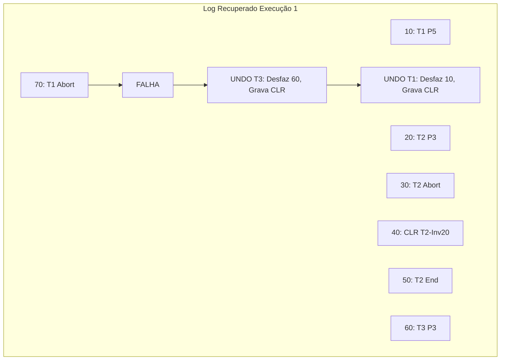

Com base nos arquivos fornecidos do seu repositório `RxSaturn/Banco-de-Dados-1`, aqui estão as resoluções para as Listas de Exercícios 7, 8, 10 e 11.

---

# 📝 Lista de Exercícios 7: Visão Geral da Avaliação de Consultas

**Exercício 1: O que é um metadado? Quais os metadados armazenados no catálogo do sistema e quais informações eles representam?**
*   **Metadado** é um dado sobre os dados.
*   O catálogo do sistema (ou dicionário de dados) armazena informações sobre a estrutura e estatísticas do banco.
*   **Informações Armazenadas:**
    *   **Sobre Tabelas:** Nome da tabela, nome do arquivo, estrutura do arquivo, nomes e tipos dos atributos, índices e restrições de integridade.
    *   **Sobre Índices:** Nome do índice, estrutura e atributos da chave de pesquisa.
    *   **Estatísticas (para o otimizador):**
        *   *Cardinalidade:* Número de tuplas.
        *   *Tamanho:* Número de páginas.
        *   *Índices:* Número de chaves distintas, altura da árvore e faixas de valores (mínimo/máximo).

**Exercício 2: Por quê a grande maioria dos SGBD armazenam o catálogo no formato de tabelas?**
Porque isso permite que o próprio SGBD utilize as mesmas ferramentas e linguagens de consulta (como SQL) usadas para dados comuns para consultar e gerenciar os metadados do sistema.

**Exercício 3: Explique as três técnicas mais comumente usadas para avaliação dos operadores relacionais.**
1.  **Indexação:** Uso de índices para recuperar apenas as tuplas que satisfazem uma condição específica (evitando varredura completa).
2.  **Iteração:** Varredura sequencial de todas as tuplas de uma tabela ou de todas as entradas de um índice.
3.  **Particionamento:** Decomposição das operações em partes menores e mais simples, operando sobre subconjuntos de dados (comum em ordenação e hashing).

**Exercício 4: O quê é um caminho de acesso? Explique como a seletividade pode afetar o desempenho da avaliação de consultas.**
*   **Caminho de acesso** é o método utilizado para recuperar tuplas (ex: varredura de arquivo, índice hash, índice árvore B+).
*   **Seletividade:** Refere-se à porcentagem de páginas/tuplas recuperadas. Um caminho altamente seletivo recupera poucas páginas.
*   **Impacto:** Se a seletividade for alta (poucos registros retornados), o uso de índices é muito eficiente. Se a seletividade for baixa (muitos registros retornados), o custo de acessar o índice mais o custo de buscar os dados pode superar o custo de simplesmente varrer a tabela inteira (Table Scan).

**Exercício 5: Descreva quais as principais estratégias para avaliação de seleções e projeções.**
*   **Seleção:** Se houver índice e for seletivo, usa-se o índice. Caso contrário, varre-se a tabela inteira.
*   **Projeção:** O desafio é eliminar duplicatas (`DISTINCT`). As estratégias principais são:
    *   *Ordenação:* Ordenar os dados para identificar duplicatas adjacentes.
    *   *Hashing:* Criar partições hash para identificar duplicatas.
    *   *Indexação:* Se o índice cobrir todos os campos da projeção, usa-se apenas o índice (Index Only Scan).

**Exercício 6: Como funciona o otimizador de consultas de um SGBD?**
1.  O analisador recebe a consulta SQL.
2.  O otimizador gera planos de execução alternativos (árvores de operadores).
3.  Utiliza estatísticas do catálogo para estimar o custo de cada plano (E/S, CPU).
4.  Escolhe o plano com o menor custo estimado para ser executado pelo avaliador.

**Exercício 7: Quais os benefícios das avaliações encadeadas (pipeline)?**
A avaliação *pipeline* permite que o resultado de um operador seja passado diretamente para o próximo operador assim que é processado, sem a necessidade de gravar o resultado intermediário em disco (materialização). Isso economiza operações de E/S e tempo de armazenamento temporário.

**Exercício 8: Análise de Custo e Estratégias**
*Dados: 5.000.000 registros, 10 reg/pág = 500.000 páginas. Arquivo ordenado por `a`.*

*   **(a) $\sigma_{a<50000}(R)$**:
    *   **Melhor:** (2) Índice Árvore B+ agrupado ou (1) Acesso direto ao arquivo (pois está ordenado).
    *   *Motivo:* Como é uma busca por intervalo em um arquivo ordenado, o índice B+ encontra o início rapidamente e varre sequencialmente. O hash não serve para intervalos.
*   **(b) $\sigma_{a=50000}(R)$**:
    *   **Melhor:** (3) Índice Hash Linear.
    *   *Motivo:* Hash é $O(1)$ para igualdades (custo ~1.2 E/S), sendo mais rápido que buscar na árvore B+ (custo logarítmico).
*   **(c) $\sigma_{50000 \le a \le 50010}(R)$**:
    *   **Melhor:** (2) Índice Árvore B+ agrupado.
    *   *Motivo:* Buscas por intervalo pequeno são ideais para Árvore B+. Hash não suporta intervalos.
*   **(d) $\sigma_{a \neq 50000}(R)$**:
    *   **Melhor:** (1) Acesso ao arquivo ordenado (Varredura).
    *   *Motivo:* A condição "diferente de" implica ler quase todo o banco de dados. Índices seriam ineficientes pois teriam que acessar quase todos os ponteiros.

**Exercício 9: Atributos examinados**
*   **(a) SELECT * FROM funcionarios:** Todos os atributos de `funcionarios`.
*   **(b) SELECT * FROM funcionarios, departamentos:** Todos os atributos de ambas (Produto Cartesiano).
*   **(c) ... WHERE f.departamento_id = d.id:** Todos os atributos de ambas, mas `f.departamento_id` e `d.id` são usados especificamente para a junção.
*   **(d) SELECT f.id, f.departamento_id, d.nome ...:** Apenas `f.id`, `f.departamento_id` e `d.nome` precisam ser retornados, mas `d.id` também precisa ser lido para processar a junção.

---

# 📝 Lista de Exercícios 8: Ordenação Externa

**Exercício 1: Quais operações de bancos de dados que utilizam ordenação?**
*   Cláusulas `ORDER BY`.
*   Operações `GROUP BY`.
*   Eliminação de duplicatas (`DISTINCT`).
*   Algoritmos de junção *Sort-Merge*.
*   Criação de índices (Bulk Loading).

**Exercício 2: Como o algoritmo merge-sort externo melhora o algoritmo merge-sort de duas vias?**
O merge-sort externo utiliza $B$ páginas de memória (buffer), permitindo criar séries ordenadas iniciais maiores e realizar uma intercalação (*merge*) de $B-1$ vias em cada passagem. Isso reduz drasticamente a altura da árvore de merge e, consequentemente, o número total de passagens (leituras/escritas) necessárias em comparação com a intercalação de apenas 2 vias.

**Exercício 3: Explique como melhorar o merge-sort externo para lidar com a E/S bloqueada.**
Em vez de ler uma página por vez de cada série durante a intercalação, o algoritmo pode ler blocos de $b$ páginas consecutivas. Isso reduz o tempo de busca (*seek time*) do disco, tornando a E/S mais eficiente, embora reduza o número de vias de intercalação (fan-in) possível, podendo aumentar levemente o número de passagens.

**Exercício 4: Como funciona a bufferização dupla? Qual a motivação para usá-la?**
*   **Funcionamento:** Divide-se a memória disponível em dois conjuntos de buffers. Enquanto a CPU processa os dados de um conjunto (ordenando ou intercalando), o sistema de E/S carrega os dados para o segundo conjunto em segundo plano.
*   **Motivação:** Mascarar a latência de disco, permitindo que CPU e E/S trabalhem em paralelo, reduzindo o tempo total de execução.

**Exercício 5: Explique quando usar e quando não usar um índice de árvore B+ na ordenação.**
*   **Usar:** Quando o índice é **agrupado** (clustered). As folhas já estão na ordem física correta, bastando varrer as folhas sequencialmente. Custo muito baixo.
*   **Não usar:** Quando o índice é **não agrupado** (unclustered). Seguir os ponteiros das folhas para os dados causará um acesso aleatório ao disco para quase cada registro, tornando o processo muito mais lento do que ordenar o arquivo do zero.

---

# 📝 Lista de Exercícios 10: Gerenciamento de Transações

**Exercício 1: Cite e explique as propriedades ACID.**
*   **Atomicidade:** "Tudo ou nada". A transação é indivisível; se falhar, nada é gravado.
*   **Consistência:** A transação deve levar o banco de um estado válido para outro estado válido, respeitando regras de integridade.
*   **Isolamento:** A execução de uma transação não deve sofrer interferência de outras transações concorrentes.
*   **Durabilidade:** Após o *commit*, as alterações são permanentes e sobrevivem a falhas do sistema.

**Exercício 2: Definições de planos de execução:**
*   **a) Completo:** Contém todas as operações das transações listadas, incluindo o término (Commit ou Abort).
*   **b) Serial:** As transações são executadas uma após a outra, sem intercalação de operações.
*   **c) Serializável:** Um plano que, mesmo intercalado, produz o mesmo resultado final que algum plano serial das mesmas transações.

**Exercício 3: Quais os possíveis conflitos entre as operações de transações?**
*   **WR (Leitura Suja):** Ler um dado escrito por uma transação não finalizada.
*   **RW (Leitura Não Repetível):** Ler um dado, e depois outra transação alterá-lo antes que a primeira termine.
*   **WW (Sobrescrita):** Duas transações escrevem no mesmo dado simultaneamente (perda de atualização).

**Exercício 4: Explique quando ocorrem os seguintes problemas:**
*   **a) Leitura suja:** T2 lê um dado alterado por T1 antes de T1 fazer commit. Se T1 fizer rollback, T2 leu algo inválido.
*   **b) Leitura não repetível:** T1 lê X. T2 altera X e commita. T1 lê X novamente e encontra valor diferente.
*   **c) Gravações cegas:** Uma transação escreve em um dado sem lê-lo antes. Pode sobrescrever atualizações de transações concorrentes de forma perigosa.
*   **d) Leituras fantasmas:** T1 lê um conjunto de linhas que satisfazem uma condição. T2 insere/remove uma linha que satisfaz essa condição. T1 executa a mesma consulta e obtém um número diferente de linhas.

**Exercício 5: Defina plano de execução recuperável.**
É um plano onde, se T2 lê dados escritos por T1, T1 deve fazer commit *antes* de T2 fazer commit.
*   **Importância:** Garante que, se T1 falhar (abortar), T2 também possa ser abortada (evita que T2 faça commit baseada em dados inválidos de T1).

**Exercício 6: Descreva como funciona o protocolo de bloqueio Strict 2PL.**
1.  Se uma transação quer ler um objeto, solicita bloqueio Compartilhado (S).
2.  Se quer escrever, solicita bloqueio Exclusivo (X).
3.  **Regra Strict:** Todos os bloqueios (S e X) são mantidos até o fim da transação (Commit ou Abort). Isso evita leitura suja e garante recuperabilidade.

**Exercício 7: Níveis de isolamento e problemas evitados:**

| Nível | Leitura Suja | Leitura Não Repetível | Fantasma |
| :--- | :---: | :---: | :---: |
| **Read Uncommitted** | Possível | Possível | Possível |
| **Read Committed** | Evita | Possível | Possível |
| **Repeatable Read** | Evita | Evita | Possível |
| **Serializable** | Evita | Evita | Evita |

---

# 📝 Lista de Exercícios 11: Recuperação de Falhas

**Exercício 1: Garantia de Atomicidade e Durabilidade**
*   **Atomicidade:** O SGBD usa o **Log** para desfazer (UNDO) operações de transações que não completaram.
*   **Durabilidade:** O SGBD usa o **Log** e o protocolo **WAL** (Write-Ahead Logging) para refazer (REDO) operações de transações commitadas que podem não ter sido persistidas no disco de dados antes da falha.

**Exercício 2: Três fases de reinício (ARIES)**
1.  **Análise:** Identifica quais transações estavam ativas e quais páginas estavam sujas (na memória) no momento da falha.
2.  **Refazer (Redo):** Repassa o log para frente, reaplicando todas as atualizações para deixar o estado do banco exatamente como estava no instante da falha (incluindo transações não commitadas).
3.  **Desfazer (Undo):** Percorre o log para trás, desfazendo as alterações das transações que não comitaram ("perdedoras").

**Exercício 3: Princípios fundamentais do ARIES**
1.  **WAL (Write-Ahead Logging):** Nenhuma página de dados vai para o disco antes do registro de log correspondente.
2.  **Repeating History (Repetição do Histórico):** No restart, refaz tudo (inclusive as que falharam) para restaurar o estado exato.
3.  **Logging Updates During Undo:** Quando desfaz uma operação (Undo), gera um novo log (CLR - Compensation Log Record) para garantir que o desfazimento não precise ser desfeito em falhas repetidas.

**Exercício 4: Log e tipos de registros**
*   **Log:** Histórico sequencial de operações em disco.
*   **Tipos de registros:**
    *   *Atualização:* Modificação de dados (contém imagem antes/depois).
    *   *Commit/Abort:* Fim de transação.
    *   *Checkpoint:* Ponto de verificação do sistema.
    *   *CLR (Compensation Log Record):* Registro indicando que uma operação foi desfeita.
    *   *End:* Fim definitivo do processo de transação.

**Exercício 5: Tabelas de Transações e Páginas Sujas**
*   **Tabela de Transações:** Rastreia transações ativas e seu estado (`últimoNSL`).
*   **Tabela de Páginas Sujas:** Rastreia quais páginas na memória foram modificadas mas ainda não gravadas no disco (`recLSN`). Essencial para saber onde começar o REDO.

**Exercício 6: Como funciona o protocolo WAL?**
O WAL exige que os registros de log (descrevendo as mudanças) sejam gravados em armazenamento estável *antes* que a página de dados modificada seja escrita no disco. Isso garante que, se houver falha durante a escrita de dados, o log tem a informação necessária para recuperar.

**Exercício 7: O que são e para que servem os pontos de verificação (checkpoints)?**
São "snapshots" periódicos onde o SGBD grava o estado das tabelas de transação e páginas sujas no log e força a escrita do log em disco. Servem para reduzir o tempo de recuperação, pois o SGBD não precisa ler o log desde o início, apenas a partir do último checkpoint.

**Exercício 8: Explique o funcionamento do algoritmo da fase desfazer.**
1.  Identifica as transações "perdedoras" (ativas na falha).
2.  Pega o maior `LSN` (Número de Sequência de Log) dentre as perdedoras.
3.  Se for uma atualização, desfaz a mudança, grava um CLR e volta para o registro anterior (`prevLSN`).
4.  Se for um CLR, pula para o `UndoNextLSN` (evitando desfazer o que já foi desfeito).
5.  Repete até desfazer todas as ações das perdedoras.

**Exercício 9: Execução ARIES**

Para ilustrar o processamento do ARIES, utilizaremos diagramas para mostrar o fluxo do log e a recuperação.

### Execução 1 (Figura 1)

**Log Original:**
*   10: T1 grava P5
*   20: T2 grava P3
*   30: T2 cancelada (Abort)
*   40: CLR (desfaz 20)
*   50: T2 End
*   60: T3 grava P3
*   70: T1 cancelada (Abort)
*   **X FALHA**

**Recuperação:**
1.  **Análise:** Identifica T1 e T3 como perdedoras (ativas). T2 já terminou.
2.  **Redo:** Refaz histórico (10, 20, 40, 60). Estado reconstruído.
3.  **Undo:** Precisa desfazer T1 e T3.
    *   Maior LSN ativo: 70 (Abort T1). Próximo passo de T1 é desfazer 10.
    *   Maior LSN ativo: 60 (T3 grava P3). Desfaz 60 -> Grava CLR para T3.
    *   Próximo LSN a desfazer: 10 (T1 grava P5). Desfaz 10 -> Grava CLR para T1.



### Execução 2 (Figura 2)

**Log Original:**
*   10: T1 grava P1
*   20: T2 grava P2
*   30: T2 grava P3
*   40: T2 Commit
*   50: T3 grava P2
*   60: T2 End
*   70: T1 grava P5
*   80: T3 Abort
*   **X FALHA**

**Recuperação:**
1.  **Análise:** T1 e T3 ativas (perdedoras). T2 comitada.
2.  **Redo:** Refaz 10, 20, 30, 50, 70. (Garante durabilidade de T2 e estado para undo).
3.  **Undo:** Desfazer T1 e T3.
    *   Pilha de Undo: {70 (T1), 80 (T3)}.
    *   Processa 80 (Abort T3). T3 tem que desfazer 50.
    *   Processa 70 (T1 grava P5). Desfaz 70, grava CLR. T1 tem que desfazer 10.
    *   Processa 50 (T3 grava P2). Desfaz 50, grava CLR. T3 fim.
    *   Processa 10 (T1 grava P1). Desfaz 10, grava CLR. T1 fim.

```mermaid
graph TD
    subgraph "Log Recuperado Execução 2"
    L10[10: T1 P1]
    L40[... 40: T2 Commit]
    L50[50: T3 P2]
    L70[70: T1 P5]
    L80[80: T3 Abort]
    F[FALHA]
    U1[UNDO 70 (T1) -> CLR]
    U2[UNDO 50 (T3) -> CLR]
    U3[UNDO 10 (T1) -> CLR]
    end
    L80 --> F
    F --> U1
    U1 --> U2
    U2 --> U3
```
