# 🎓 Apresentação: Sharding e Particionamento em Bancos de Dados Distribuídos

> **Disciplina:** Banco de Dados II  
> **Integrantes:** Henrique Augusto, Henrique Evangelista, Rayssa Mendes  
> **Diagramas:** Ver pasta `img/`

---

## 📑 Estrutura da Apresentação

| # | Slide | Duração Sugerida |
|---|-------|------------------|
| 1 | Capa | 1 min |
| 2 | Introdução: O Que é Sharding? | 3 min |
| 3 | Distinções Críticas | 3 min |
| 4 | Arquitetura: Monolítico vs Sharded | 3 min |
| 5 | Estratégias de Particionamento | 4 min |
| 6 | Consistent Hashing e Virtual Nodes | 5 min |
| 7 | Desafios: CAP e Roteamento | 4 min |
| 8 | Estudo de Caso: Instagram | 4 min |
| 9 | Conclusão | 3 min |

**Tempo Total Estimado:** ~30 minutos

---

## 📊 SLIDE 1: Capa

### Título do Slide
**Sharding e Particionamento em Bancos de Dados Distribuídos**

### Tópicos (Bullet Points)
- Banco de Dados II
- Trabalho Técnico-Acadêmico
- Integrantes: Henrique Augusto, Henrique Evangelista, Rayssa Mendes
- [Logo da Instituição]

### Elemento Visual
**Sugestão:** Usar uma imagem de fundo com representação visual de dados distribuídos ou rede de servidores.

### Nota do Orador
> "Boa tarde a todos. Hoje vamos apresentar um tema fundamental para sistemas de larga escala: como dividir e distribuir dados entre múltiplos servidores para alcançar escalabilidade horizontal. Este é o conceito de Sharding."

---

## 📊 SLIDE 2: Introdução - O Que é Sharding?

### Título do Slide
**O Problema da Escala: Vertical vs. Horizontal**

### Tópicos (Bullet Points)
- **Sharding:** Técnica de escalabilidade horizontal
- Divide banco de dados em fragmentos menores (**shards**)
- Cada shard opera em servidor independente
- Todos os shards juntos = dataset completo
- **Conceito-chave:** Distribuir carga, não centralizar recursos

### Elemento Visual

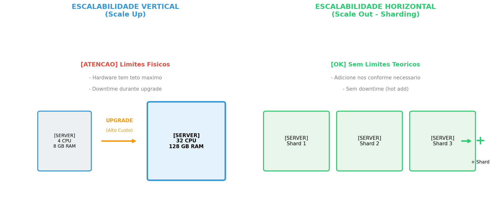

**Código Mermaid alternativo:**

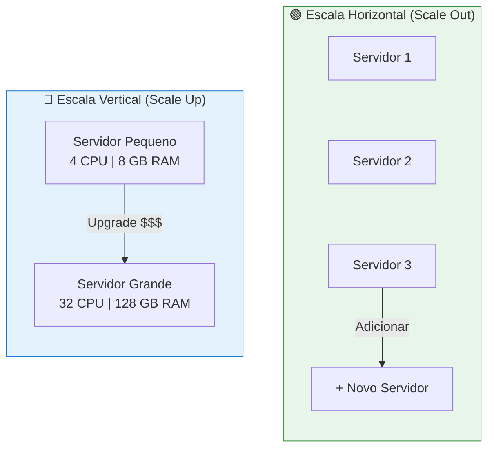

### Nota do Orador
> "Quando uma aplicação cresce, enfrentamos um dilema: aumentar a capacidade do servidor existente (escala vertical) ou adicionar mais servidores (escala horizontal). A escala vertical tem limites físicos - existe um teto máximo de CPU e memória. Além disso, upgrades causam downtime.

> O Sharding implementa a escala horizontal: dividimos os dados entre múltiplos servidores independentes. Cada servidor, chamado de shard, é responsável por uma parte dos dados. Isso elimina o gargalo de um único ponto e permite escalar quase linearmente."

---

## 📊 SLIDE 3: Distinções Críticas

### Título do Slide
**Sharding vs. Particionamento vs. Replicação**

### Tópicos (Bullet Points)
- **Particionamento:** Divide dados dentro do MESMO servidor
- **Sharding:** Distribui dados entre DIFERENTES servidores
- **Replicação:** COPIA dados idênticos para múltiplos servidores
- ⚠️ Conceitos frequentemente confundidos!
- Cada um resolve um problema diferente

### Elemento Visual

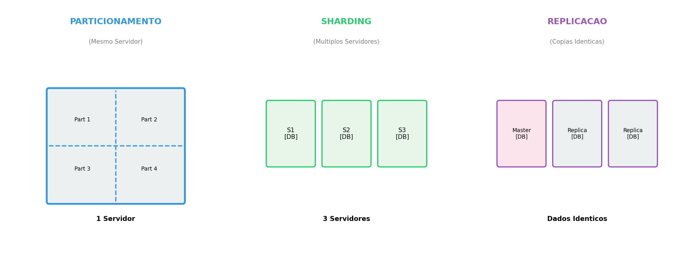

**Tabela Comparativa (para projeção):**

| Característica | Particionamento | Sharding | Replicação |
|----------------|-----------------|----------|------------|
| **Localização** | Mesmo servidor | Servidores diferentes | Múltiplos servidores |
| **Objetivo** | Performance local | Escalabilidade horizontal | Alta disponibilidade |
| **Dados** | Subconjuntos | Subconjuntos únicos | Cópias idênticas |
| **Complexidade** | Moderada | Alta | Moderada |

**Código Mermaid:**

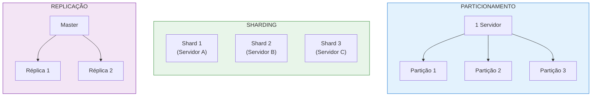

### Nota do Orador
> "É crucial entender a diferença entre esses três conceitos. O Particionamento divide uma tabela em partes menores, mas todas permanecem no mesmo servidor físico - útil para gerenciar tabelas muito grandes.

> O Sharding vai além: cada fragmento fica em um servidor separado. Isso permite que a carga de trabalho seja distribuída entre múltiplas máquinas.

> Já a Replicação cria cópias idênticas dos dados em diferentes servidores. O objetivo não é dividir dados, mas garantir disponibilidade e tolerância a falhas. Frequentemente, sistemas usam sharding E replicação juntos."

---

## 📊 SLIDE 4: Arquitetura - Monolítico vs. Sharded

### Título do Slide
**Arquitetura: Do Monolítico ao Distribuído**

### Tópicos (Bullet Points)
- **Monolítico:** Aplicação → Banco Único (todos os dados)
- **Sharded:** Aplicação → Router → Shards Distribuídos
- Componentes essenciais: Query Router + Config Server + Shards
- Arquitetura **Shared-Nothing:** nós independentes
- Escalabilidade linear: mais nós = mais capacidade

### Elemento Visual

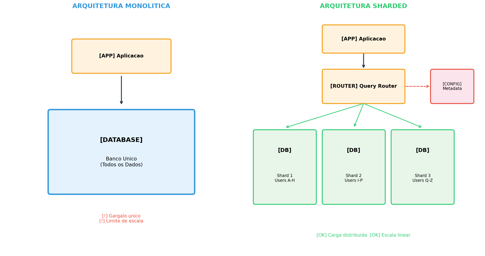

**Código Mermaid:**

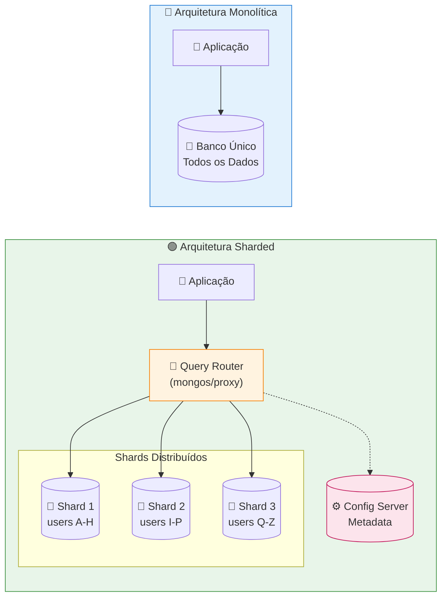

### Nota do Orador
> "Observem a diferença arquitetural. Na arquitetura monolítica, tudo passa por um único banco de dados. Qualquer crescimento de tráfego cria gargalos.

> Na arquitetura sharded, introduzimos um novo componente: o Query Router. Ele é responsável por saber qual shard contém os dados solicitados. O Config Server armazena os metadados - o mapeamento de quais dados estão em quais shards.

> Quando uma query chega, o router consulta o config server, identifica o shard correto, e direciona a requisição. Isso é transparente para a aplicação na maioria dos casos."

---

## 📊 SLIDE 5: Estratégias de Particionamento

### Título do Slide
**Estratégias de Particionamento: Hash vs. Range vs. Directory**

### Tópicos (Bullet Points)
- **Hash-Based:** `shard = hash(key) % N` - distribuição uniforme
- **Range-Based:** Faixas contíguas de valores - bom para ranges
- **Directory-Based:** Tabela de lookup centralizada - máxima flexibilidade
- **Escolha da Shard Key:** Decisão crítica e irreversível!
- Trade-offs em cada abordagem

### Elemento Visual

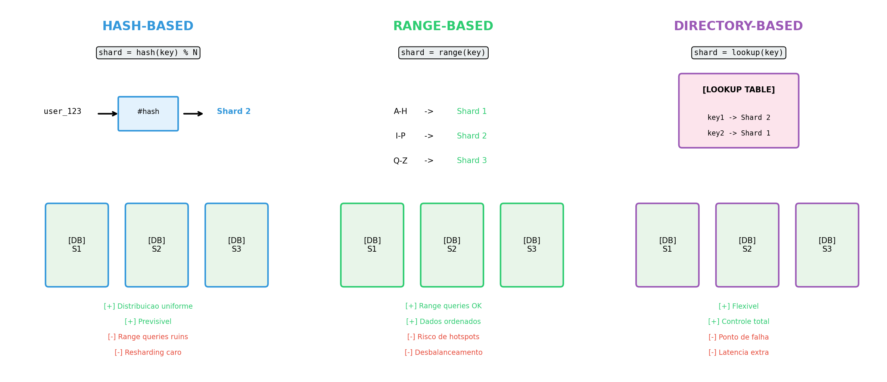

**Código Mermaid:**

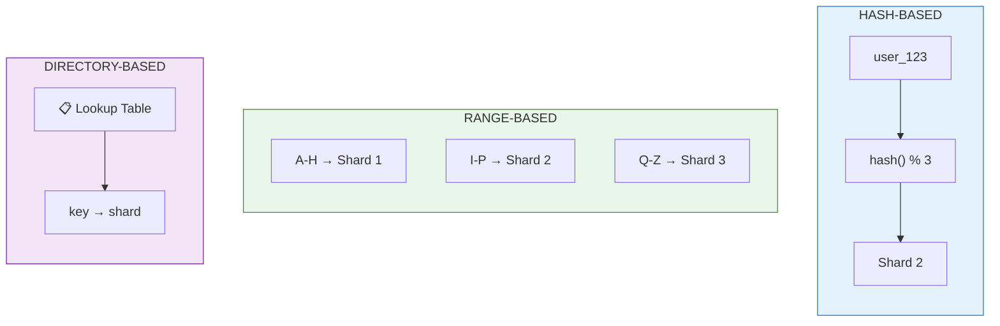

**Tabela de Trade-offs:**

| Estratégia | Prós | Contras |
|------------|------|---------|
| **Hash** | Distribuição uniforme, previsível | Range queries ineficientes, resharding caro |
| **Range** | Range queries eficientes, dados ordenados | Risco de hotspots, desbalanceamento |
| **Directory** | Flexibilidade total, controle fino | Ponto único de falha, latência adicional |

### Nota do Orador
> "A escolha da estratégia de particionamento depende do padrão de acesso aos dados.

> Hash-Based é o mais comum: aplicamos uma função hash na shard key e usamos módulo para determinar o shard. Garante boa distribuição, mas consultas por range ficam espalhadas.

> Range-Based mantém dados contíguos no mesmo shard - ótimo para consultas do tipo 'pedidos de janeiro a março'. Porém, se muitas escritas acontecem no mesmo range, criamos um hotspot.

> Directory-Based oferece controle total: uma tabela central mapeia cada chave ao seu shard. Flexível, mas essa tabela vira ponto crítico do sistema.

> A escolha da shard key é IRREVERSÍVEL na prática - mudar depois exige migração completa."

---

## 📊 SLIDE 6: Consistent Hashing e Virtual Nodes

### Título do Slide
**O Algoritmo de Ouro: Consistent Hashing**

### Tópicos (Bullet Points)
- **Problema:** Hash simples redistribui TUDO quando nós entram/saem
- **Solução:** Hash Ring - chaves e nós no mesmo espaço circular
- Cada chave vai para o próximo nó no sentido horário
- **Virtual Nodes (VNodes):** Melhora distribuição
- Resultado: Apenas K/N chaves movem quando topologia muda

### Elemento Visual


**Código Mermaid:**

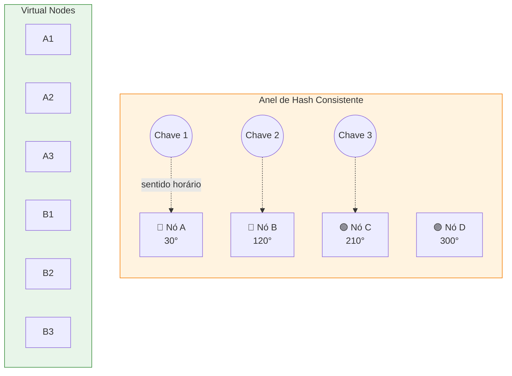

**Fórmula Chave:**
```
Chaves Movidas = K / N
Onde: K = total de chaves, N = número de nós
```

### Nota do Orador
> "Este é um dos algoritmos mais elegantes de sistemas distribuídos. No hash simples, ao adicionar ou remover um nó, praticamente TODAS as chaves precisam ser redistribuídas - catastrófico em produção.

> O Consistent Hashing resolve isso mapeando tanto as chaves quanto os nós para um espaço circular - o hash ring. Cada chave é atribuída ao primeiro nó encontrado no sentido horário.

> Quando um nó entra ou sai, apenas as chaves entre ele e seu predecessor são afetadas. Em vez de mover todas as K chaves, movemos apenas K/N em média.

> Virtual Nodes levam isso além: cada servidor físico representa múltiplos pontos no anel. Isso melhora a distribuição e permite que servidores mais potentes tenham mais VNodes, assumindo mais carga."

---

## 📊 SLIDE 7: Desafios de Engenharia

### Título do Slide
**Desafios: Teorema CAP e Roteamento de Queries**

### Tópicos (Bullet Points)
- **CAP Theorem:** Escolha 2 de 3 (Consistência, Disponibilidade, Tolerância a Partição)
- Sistemas CP: MongoDB, HBase - preferem consistência
- Sistemas AP: Cassandra, DynamoDB - preferem disponibilidade
- **Roteamento:** Client-side vs. Server-side (proxy)
- **Cross-shard operations:** Transações distribuídas são caras!

### Elemento Visual

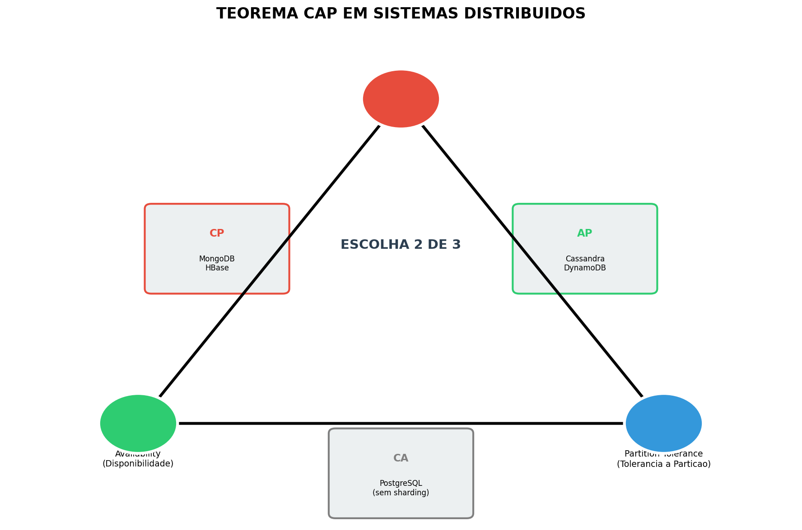
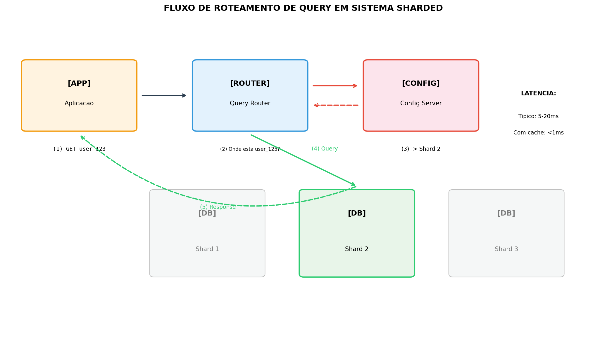

**Código Mermaid - CAP:**

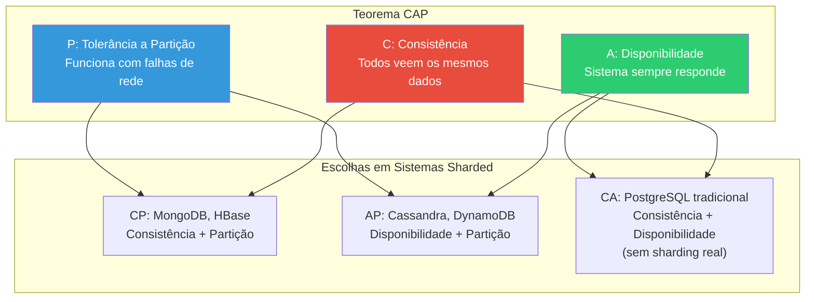

**Código Mermaid - Roteamento:**

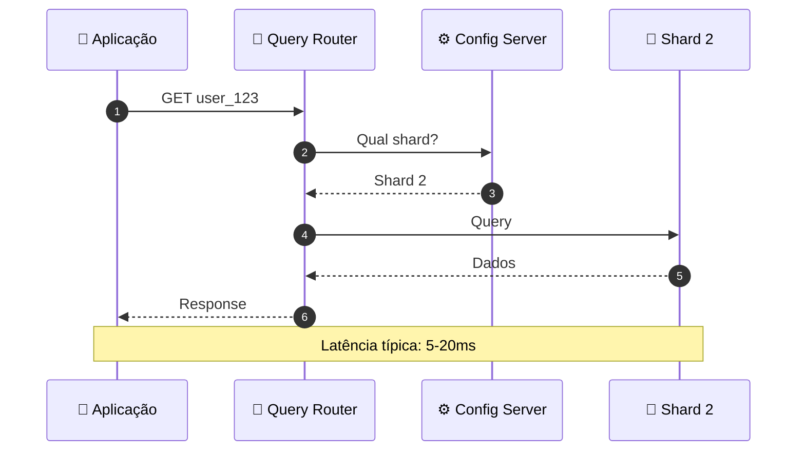

### Nota do Orador
> "O Teorema CAP é fundamental para entender sistemas distribuídos. Em caso de partição de rede - que SEMPRE pode acontecer - você DEVE escolher entre consistência e disponibilidade. Não dá para ter os três.

> MongoDB e HBase são sistemas CP: durante uma partição, podem recusar escritas para manter consistência. Cassandra e DynamoDB são AP: aceitam escritas mesmo sem garantia de propagação imediata.

> Quanto ao roteamento, temos duas abordagens: client-side, onde a aplicação conhece a lógica de sharding, ou server-side, com um proxy intermediário. O proxy adiciona latência mas centraliza a lógica e facilita mudanças de topologia."

---

## 📊 SLIDE 8: Estudo de Caso - Instagram

### Título do Slide
**Instagram: Sharding PostgreSQL e Geração de IDs**

### Tópicos (Bullet Points)
- Centenas de milhões de usuários → PostgreSQL não escala sozinho
- Solução: Shards físicos + shards lógicos (schemas)
- **Desafio crítico:** IDs únicos sem coordenação central
- **Solução:** ID de 64 bits inspirado no Snowflake
- Estrutura: 41 bits timestamp + 13 bits shard + 10 bits sequence

### Elemento Visual

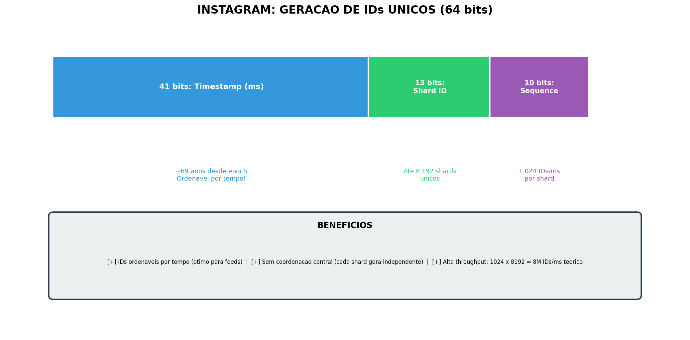

**Estrutura do ID Instagram:**

```
┌─────────────────────────────────────────────────────────────────┐
│ 41 bits: Timestamp (ms)  │ 13 bits: Shard │ 10 bits: Sequence  │
│    desde epoch           │      ID        │    (0-1023)        │
└─────────────────────────────────────────────────────────────────┘

Capacidade:
- 41 bits → ~69 anos de timestamps
- 13 bits → 8.192 shards possíveis
- 10 bits → 1.024 IDs por milissegundo por shard
- Total: 8M+ IDs/ms teórico
```

**Código SQL (função de geração):**

```sql
CREATE OR REPLACE FUNCTION insta_next_id(OUT result BIGINT) AS $$
DECLARE
    our_epoch BIGINT := 1314220021721;  -- Epoch customizado
    seq_id BIGINT;
    now_millis BIGINT;
    shard_id INT := 5;  -- ID deste shard
BEGIN
    SELECT nextval('table_id_seq') % 1024 INTO seq_id;
    SELECT FLOOR(EXTRACT(EPOCH FROM clock_timestamp()) * 1000) INTO now_millis;
    
    -- [41 bits: timestamp] [13 bits: shard_id] [10 bits: sequence]
    result := (now_millis - our_epoch) << 23;
    result := result | (shard_id << 10);
    result := result | (seq_id);
END;
$$ LANGUAGE plpgsql;
```

### Nota do Orador
> "O Instagram enfrentou um desafio clássico: precisavam de IDs únicos globais, ordenáveis por tempo, sem um serviço central de geração que viraria gargalo.

> A solução foi brilhante: um ID de 64 bits composto por três partes. Os 41 bits mais significativos são o timestamp - isso garante que IDs são ordenáveis cronologicamente, perfeito para feeds. Os próximos 13 bits identificam o shard, permitindo até 8192 shards. Os últimos 10 bits são um contador sequencial, permitindo 1024 IDs por milissegundo por shard.

> Cada shard gera seus próprios IDs independentemente. Não há coordenação central, não há gargalo, e ainda assim garantimos unicidade global. Esse padrão é amplamente usado hoje, inspirado no Snowflake do Twitter."

---

## 📊 SLIDE 9: Conclusão

### Título do Slide
**Resumo: Trade-offs e Melhores Práticas**

### Tópicos (Bullet Points)
1. **Shard Key é CRÍTICA** - má escolha = hotspots irreversíveis
2. **Consistent Hashing + VNodes** - minimiza reorganização
3. **CAP Theorem** - force escolhas conscientes entre C e A
4. **Cross-shard = caro** - design para localidade de dados
5. **Casos reais validam** - Instagram, Uber, Discord provam a teoria

### Elemento Visual

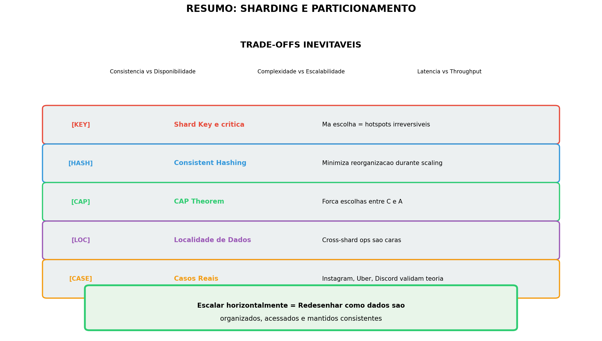

**Diagrama de Trade-offs:**

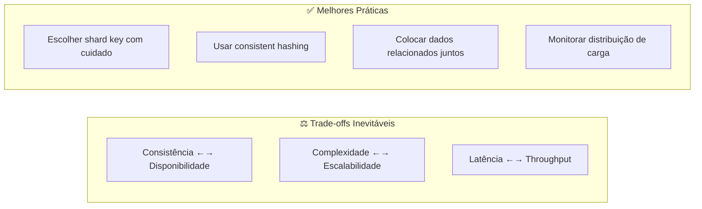

### Nota do Orador
> "Para concluir, sharding não é bala de prata - é uma troca. Ganhamos escalabilidade, mas pagamos com complexidade operacional.

> Os pontos principais a lembrar são: a escolha da shard key é possivelmente a decisão mais importante e difícil de reverter. Consistent hashing com virtual nodes é o padrão de ouro para distribuição. O teorema CAP não é opcional - você SERÁ forçado a escolher durante partições de rede.

> Projete para localidade de dados: operações cross-shard são ordens de magnitude mais caras. E finalmente, empresas como Instagram, Uber e Discord não apenas validam esses conceitos, mas contribuíram com inovações que usamos hoje.

> Escalar horizontalmente não é apenas adicionar servidores - é fundamentalmente redesenhar como dados são organizados, acessados e mantidos consistentes em um ambiente distribuído."

---

## 📁 Arquivos Gerados

### Diagramas PNG (Alta Resolução)

Os seguintes arquivos ficam na pasta `img/`:

| Arquivo | Slide | Descrição |
|---------|-------|-----------|
| `01_escala_vertical_vs_horizontal.png` | 2 | Comparação de escalabilidade |
| `02_sharding_vs_particionamento_vs_replicacao.png` | 3 | Distinções entre conceitos |
| `03_arquitetura_monolitica_vs_sharded.png` | 4 | Arquiteturas comparadas |
| `04_estrategias_particionamento.png` | 5 | Hash vs Range vs Directory |
| `05_consistent_hashing.png` | 6 | Anel de hash e virtual nodes |
| `06_teorema_cap.png` | 7 | Triângulo CAP |
| `07_query_routing.png` | 7 | Fluxo de roteamento |
| `08_instagram_id_structure.png` | 8 | Estrutura do ID do Instagram |
| `09_conclusao_resumo.png` | 9 | Resumo visual |

### Script de Geração

Para regenerar os diagramas, execute:

```bash
cd banco_de_dados_II/apresentacao-sharding/scripts/
python3 generate_diagrams.py
```

**Requisitos:**
- Python 3.x
- matplotlib
- numpy

---

## 📚 Referências

1. MongoDB Sharding Documentation: https://www.mongodb.com/docs/manual/sharding/
2. Instagram Engineering - Sharding & IDs: https://instagram-engineering.tumblr.com/post/10853187575/sharding-ids-at-instagram
3. Discord - How Discord Stores Trillions of Messages: https://discord.com/blog/how-discord-stores-trillions-of-messages
4. Uber Engineering - Schemaless: https://www.uber.com/blog/schemaless-part-one-mysql-datastore/
5. Kleppmann, M. (2017). *Designing Data-Intensive Applications*. O'Reilly Media.
6. Karger, D., et al. (1997). "Consistent Hashing and Random Trees". ACM STOC.

---

*Apresentação preparada por: Henrique Augusto, Henrique Evangelista, Rayssa Mendes*  
*Baseado no documento técnico: `Sharding_e_Particionamento_em_Bancos_de_Dados_Distribuidos.md`*
