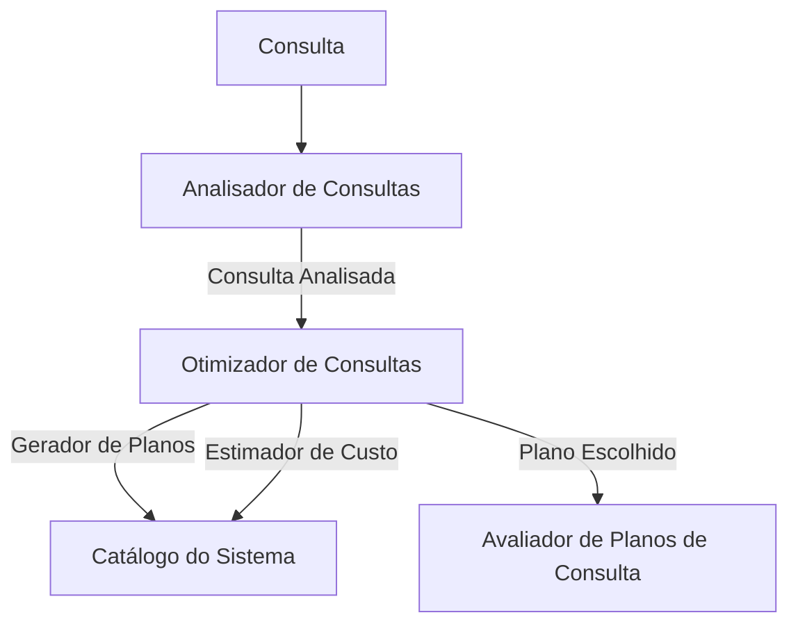
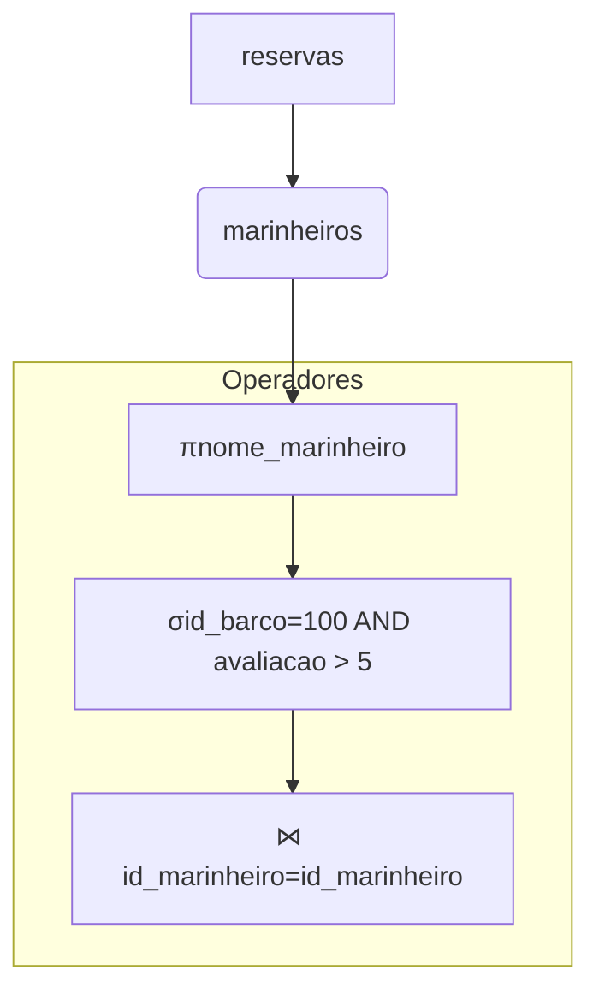
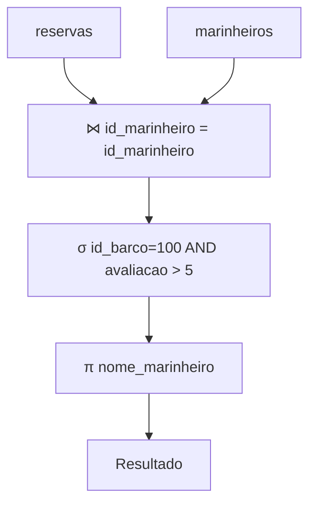
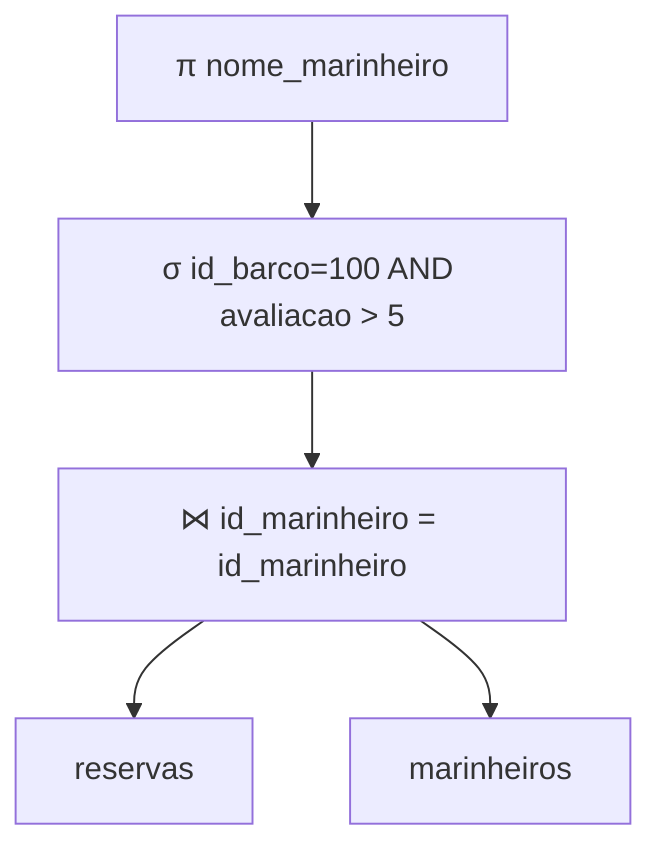
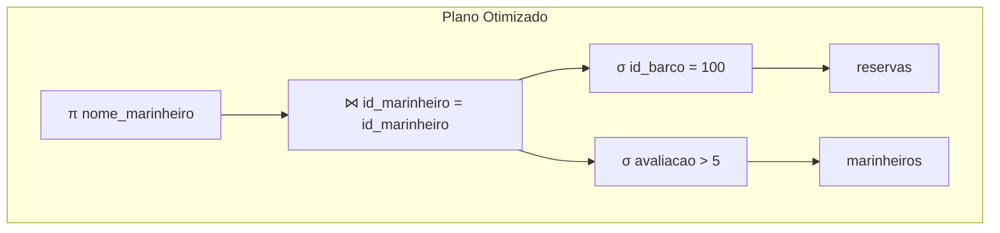
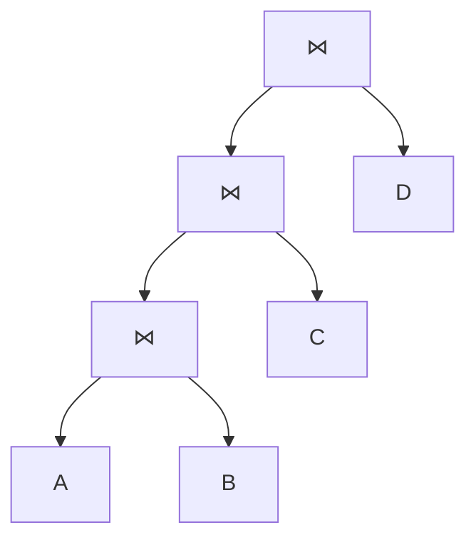
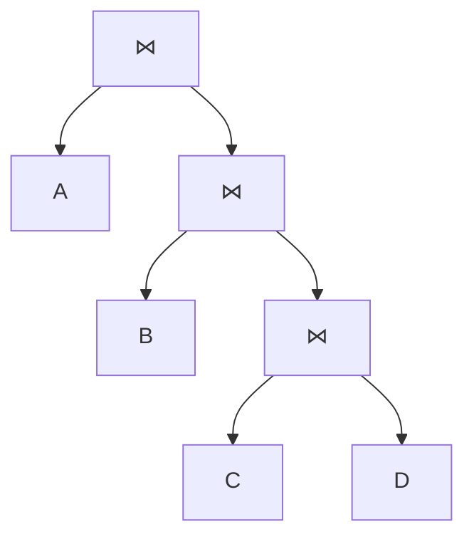
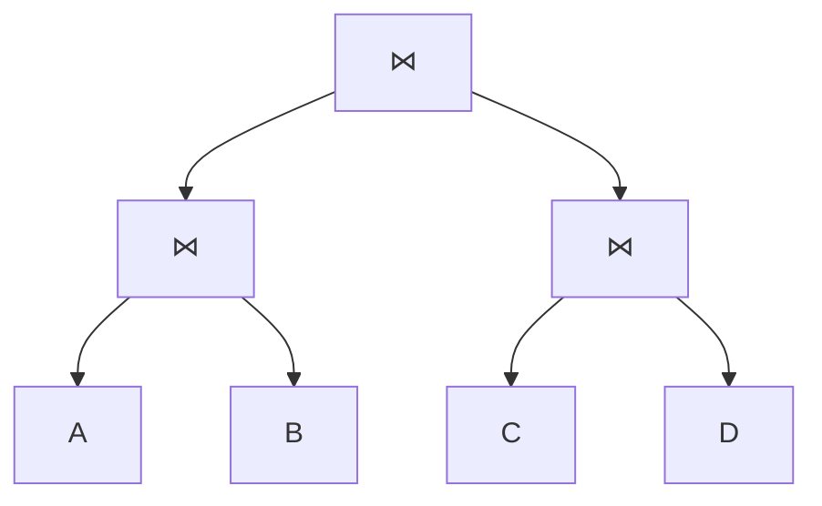
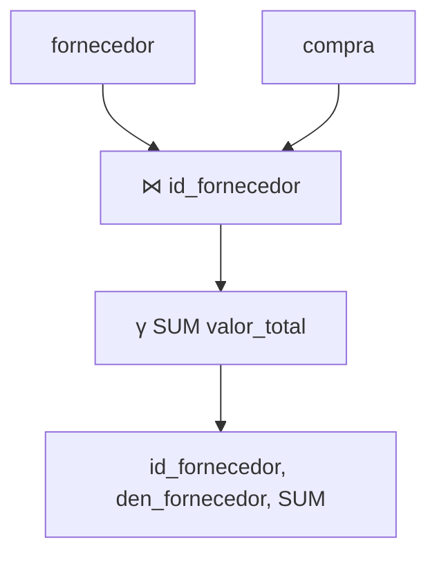
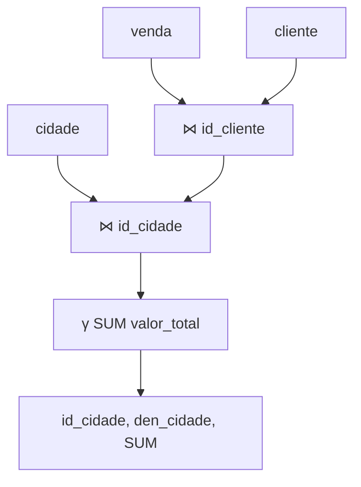

# Banco de dados II

## 7 – Visão geral da avaliação de consultas

**Autor:** Marcos Roberto Ribeiro

**Instituição:** Instituto Federal Minas Gerais (IFMG) - Campus Bambuí  
**Departamento:** Departamento de Engenharia e Computação (DEC)  
**Curso:** Engenharia de Computação  
**Ano:** 2024

---

# Introdução

* Para avaliar uma consulta, os SGBD traduzem o código SQL para planos de execução/avaliação
* Os planos são representados na forma de árvores onde os nós são operadores da álgebra relacional
* Além dos operadores, os planos contém informações sobre qual algoritmo usar para avaliar cada operador
* O SGBD usa um processo de otimização de consulta para encontrar um bom plano de execução

---


# Tabelas consideradas nos exemplos

## Tabela marinheiros

marinheiros (id_marinheiro: integer, nome_marinheiro: string,
avaliacao: integer, nascimento: date)

*   Registros de 50 bytes
*   500 páginas com 80 registros cada

## Tabela reservas

reservas(id_marinheiro: integer, id_barco: integer,
dia: date, nome_responsavel: string)

*   Registros de 40 bytes
*   1000 páginas com 100 registros cada

---


# Catálogo do sistema

*   Tabelas especiais que armazenam metadados sobre os bancos de dados
*   Também conhecido como dicionário de dados
*   Dados sobre tabelas: nome da tabela, nome do arquivo, estrutura do arquivo, nomes e tipos dos atributos, índices da tabela, restrições de integridade
*   Dados sobre índices: nome do índice, estrutura, atributos da chave de pesquisa
*   Os catálogos são armazenados em forma de tabela. Por quê?

---


# Estatísticas do catálogo do sistema

*   Estatísticas (atualizadas periodicamente):
    *   Cardinalidade: Número de registros/tuplas (*NTuplas*) de cada tabela
    *   Tamanho: Número de páginas (*NPaginas*) de cada tabela
    *   Cardinalidade do Índice: Número de chaves distintas (*NChaves*) de cada índice
    *   Tamanho do Índice: Número de páginas (*INPaginas*) de cada índice
    *   Altura do Índice: Número de níveis (*IAltura*) não folha de cada índice do tipo árvore
    *   Faixa de Índice: Valores mínimo (*IBaixo*) e máximo (*IAlto*) da chave de pesquisa de cada índice

---


# Introdução à avaliação de operadores

*   Cada operador pode possuir diversos algoritmos para avaliação
*   Nenhum algoritmo é universalmente superior
*   Alguns fatores que influenciam tais algoritmos
    *   Tamanho das tabelas
    *   Índices e ordenações existentes
    *   Quantidade de buffers disponíveis
    *   Política de substituição de buffers

---


# Técnicas comumente usadas no processamento de operadores

**Indexação:** Uso de índice para obter apenas às tuplas que atendem à uma determinada condição

**Iteração:** Varrer as tuplas de uma tabela ou as entradas de um índice

**Particionamento:** Decomposição de uma operação em outras operações mais simples sobre partições de dados

---


# Caminhos de acesso

*   Um caminho de acesso é uma forma de recuperar as tuplas de uma tabela
*   Esses caminho podem afetar significativamente o custo do operador
*   Exemplo: seleção usando índice
*   A **seletividade** de um caminho de acesso é o número de páginas recuperadas usando tal caminho
*   É melhor usar o caminho mais seletivo (que recupera o menor número de páginas)

---


# Algoritmos para operações relacionais – Seleção

- Pesquisa por um registro que atenda a certas condições
- Se houver índice:
    - Verifique se é viável usar o índice
- Senão, varra a tabela

---


# Algoritmos para operações relacionais – Projeção

*   A maior dificuldade está na eliminação de duplicatas (DISTINCT)
*   Algumas estratégias para esta situação:
    *   Ordenar primeiro os dados
    *   Avaliação somente de índice (se todos os campos estiverem na chave do índice)

---


# Algoritmos para operações relacionais - junção I

*   Operações caras e comuns (existem diversos algoritmos)
*   Exemplo: reservas ⋈ id_marinheiro=id_marinheiro marinheiros

## Junção de loops aninhados indexados

*   Supondo que haja um índice hash sobre marinheiros.id_marinheiro
*   Para cada tupla de reservas, use o índice para verificar a correspondência
*   Custo:
    *   Varredura de reservas: 100 × 1.000 = 100.000
    *   Obtenção da correspondência em marinheiros: 1,2 E/S (média de um índice hash) + 1 página de marinheiros
    *   Total: 1.000 + 100.000 × (1 + 1,2) = 221.000

---


# Algoritmos para operações relacionais - junção II

## Junção sort-merge

*   Supondo que não hajam índices
*   Ordenamos as tabelas sobre o atributo de junção e depois varremos para fazer a junção
*   Custo:
    *   Ordenação em duas passagens considerado apenas o custo de E/S e leitura/gravação em cada passagem:
        *   reservas: 2 × 2 × 1.000 = 4.000
        *   marinheiros: 2 × 2 × 500 = 2.000
    *   Consideramos mais uma varredura nas tabelas ordenadas
    *   Total: 4.000 + 2.000 + 1.000 + 500 = 7.500

---


# Introdução à otimização de consultas

*   Uma das tarefas mais importantes do SGBD
*   Uma consulta pode ser avaliada de várias formas e custo destas avaliações pode ser muito diferente
*   É muito difícil encontrar o plano ideal, mas podemos encontrar um bom plano



## Tarefas do Otimizador

*   Gerar de planos alternativos (não considera todos, o número é muito grande)
*   Avaliar o custo de cada plano alternativo
*   Escolher o plano com menor custo

---


# Planos de avaliação de consultas

*   Um plano é uma árvore de operadores relacionais
*   Contém informações adicionais sobre método de acesso e algoritmos

## Consulta

```sql
SELECT m.nome_marinheiro
FROM reservas r, marinheiros m
WHERE r.id_marinheiro = m.id_marinheiro
AND r.id_barco = 100
AND m.avaliacao > 5;
```

## Plano



---


# Plano de execução completo



> **Representação Visual:** Árvore de avaliação de consulta onde as tabelas `reservas` e `marinheiros` são unidas por junção (⋈), seguida de seleção (σ) e projeção (π) do nome do marinheiro.

---


# Avaliação pipeline

*   O resultado de um operador pode ser encaminhado para outro operador sem a utilização de tabelas temporárias
*   Economia de gravar os dados e lê-los de volta
*   Quando se usa tabelas temporárias, dizemos que as tuplas são **materializadas**
*   A avaliação encadeada (*pipeline*) é escolhida sempre que possível
*   Quando um operador usa a avaliação encadeada, dizemos que tal operador é aplicado **durante a execução**

---


# A interface iteradora

*   Normalmente a implementação dos operadores possui uma interface iteradora uniforme
*   Esta interface esconde os detalhes de implementação e possui as seguintes funções
    *   open(): inicializa o operador
    *   get_next(): processa a(s) tupla(s) de entrada
    *   close(): finaliza o operador desalocando recursos usados
*   A interface iteradora suporta pipeline naturalmente
*   A decisão de materializar fica dentro do operador

---


# Planos alternativos - exemplo de motivação



> **Nota:** Diagrama de plano com avaliação durante execução usando laços aninhados simples e varredura de arquivo.

*   Varredura e junção com loops aninhados
*   Para cada página de reservas, leia todas as páginas de marinheiros fazendo a junção
*   Custo: 1.000 × 500 = 500.000 E/S

---


# Exemplo de motivação (empurrando seleções)



> **Representação Visual:** Plano de execução com seleções empurradas antes da junção (sort-merge), onde T1 representa reservas filtradas e T2 representa marinheiros filtrados.

*   Varredura/seleção de reservas: 1.000
*   Gravação de T1 (supondo distribuição uniforme de reservas): 1.000 reservas / 100 barcos = 10
*   Varredura/seleção de marinheiros: 500
*   Gravação de T2 (supondo distribuição uniforme de avaliações entre 1 e 10): 50% de 500 = 250

*   Ordenação em duas passagens de T1 e T2: 2 × 2 × 10 = 40 + 2 × 2 × 250 = 1.000
*   Junção de T1 e T2: 10 × 250 = 2.500
*   Custo final: 1.000+10+500+250+1.000+2.500 = 5.260

---


# Tarefas de um otimizador típico

*   Usa equivalências da álgebra relacional para identificar obter expressões algébricas alternativas
*   Para cada expressão algébrica equivalente, considera as implementações disponíveis para os operadores para gerar planos
*   Avalia os custos dos planos e seleciona aquele com menor custo
*   Expressões algébricas são consideradas equivalentes se produzirem o mesmo resultado

**Exemplos:**
*   Seleções e produtos cartesianos podem ser combinados em junções
*   Junções podem ser reordenadas extensivamente
*   Seleções e junções podem ser empurradas para frente das junções

---


# Planos de profundidade à esquerda

## Árvore 1 (Tabela Externa)



## Árvore 2 (Tabela Interna)



## Árvore 3 (Árvore Bushy)



**Árvores Lineares:** Pelo menos um filho de junção é tabela  
**Árvore de Profundidade à Esquerda:** O filho direito da junção sempre é uma tabela

---


# Planos de profundidade à esquerda (continuação)

*   Os otimizadores usam *programação dinâmica* para pesquisar os planos de profundidade à esquerda
*   A medida que o número de junções aumenta, o número de planos alternativos pode crescer muito
*   É necessário podar o espaço de planos alternativos
*   Árvores de profundidade à esquerda permite generalizar os planos *integralmente encadeados* (pipeline em todas as junções)

---


# Avaliação de consultas no PostgreSQL

*   Podemos visualizar informações sobre avaliação de consultas no PostgreSQL utilizando a palavra chave **EXPLAIN** antes da consulta
*   Observe os próximos exemplos e identifique diferenças na avaliação das consultas

---


# Exemplo 1 - Valor total comprado de cada fornecedor

## Consulta

```sql
EXPLAIN
SELECT f.den_fornecedor,
       SUM(c.valor_total)
FROM fornecedor AS f,
     compra AS c
WHERE f.id_fornecedor =
      c.id_fornecedor
GROUP BY f.id_fornecedor,
         f.den_fornecedor;
```

## Plano



---


# Exemplo 1 - Valor total comprado de cada fornecedor (Avaliação)

## Plano de Execução (QUERY PLAN)

```
HashAggregate (cost=2.68..2.73 rows=4 width=72)
    Group Key: f.id_fornecedor
        -> Hash Join (cost=1.09..2.52 rows=33 width=56)
            Hash Cond: (c.id_fornecedor = f.id_fornecedor)
                -> Seq Scan on compra c (cost=0.00..1.33 rows=33 width=24)
                -> Hash (cost=1.04..1.04 rows=4 width=40)
                    -> Seq Scan on fornecedor f (cost=0.00..1.04 rows=4 width=40)
```

---


# Exemplo 2 - Valor total vendido para cada cidade

## Consulta

```sql
EXPLAIN
SELECT c.den_cidade,
       SUM(v.valor_total)
FROM cidade AS c,
     cliente AS cl,
     venda AS v
WHERE c.id_cidade = cl.id_cidade
AND cl.id_cliente = v.id_cliente
GROUP BY c.id_cidade,
         c.den_cidade;
```

## Plano



---


# Exemplo 2 - Valor total vendido para cada cidade (Avaliação)

## Plano de Execução (QUERY PLAN)

```
HashAggregate (cost=31.57..36.52 rows=396 width=49)
Group Key: c.id_cidade
-> Hash Join (cost=17.18..29.59 rows=396 width=23)
    Hash Cond: (v.id_cliente = cl.id_cliente)
    -> Seq Scan on venda v (cost=0.00..6.96 rows=396 width=14)
    -> Hash (cost=15.71..15.71 rows=118 width=25)
        -> Nested Loop (cost=0.29..15.71 rows=118 width=25)
            -> Seq Scan on cliente cl (cost=0.00..2.18 rows=118 width=12)
            -> Memoize (cost=0.29..2.14 rows=1 width=17)
                Cache Key: cl.id_cidade
                Cache Mode: logical
                -> Index Scan using cidade_pk on cidade c (cost=0.28..2.13 rows=1 width=17)
                    Index Cond: (id_cidade = cl.id_cidade)
```

---


# Referências

DATE, C. J. Introdução a sistemas de bancos de dados. Rio de Janeiro: Elsevier, 2004.

ELMASRI, R.; NAVATHE, S. B. Sistemas de banco de dados. 7. ed. São Paulo: Pearson Addison Wesley, 2018.

RAMAKRISHNAN, R.; GEHRKE, J. Sistemas de gerenciamento de banco de dados. 3. ed. São Paulo: McGrawHill, 2008.

SILBERSCHATZ, A.; KORTH, H. F.; SUDARSHAN, S. Sistema de bancos de dados. 3. ed. São Paulo: Campus, 2007.