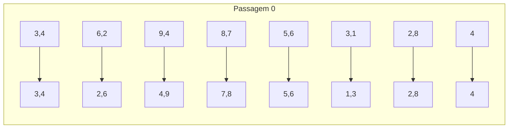
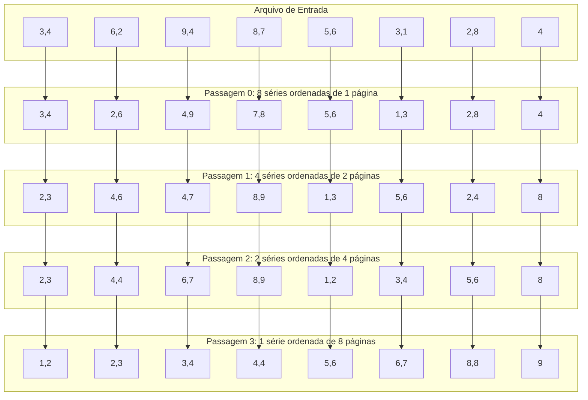
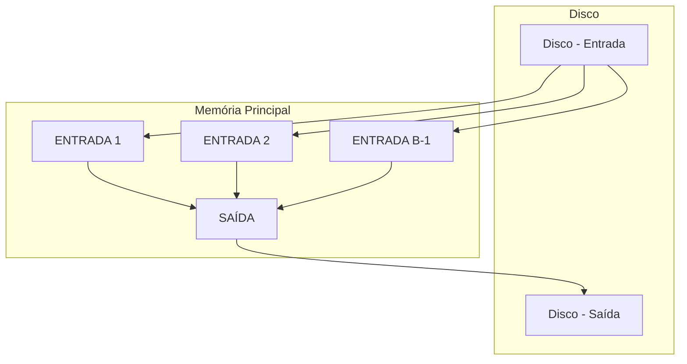
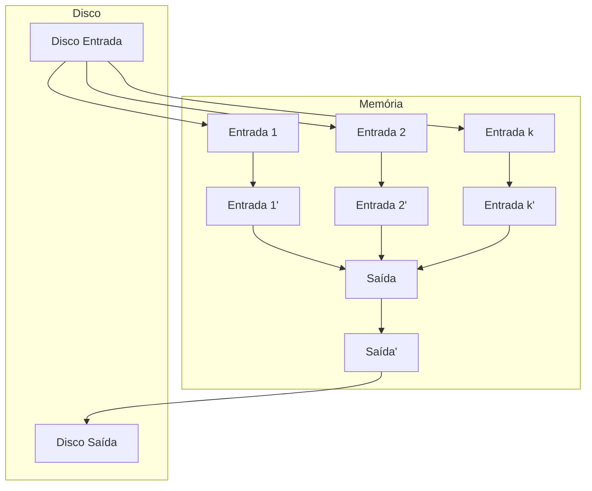
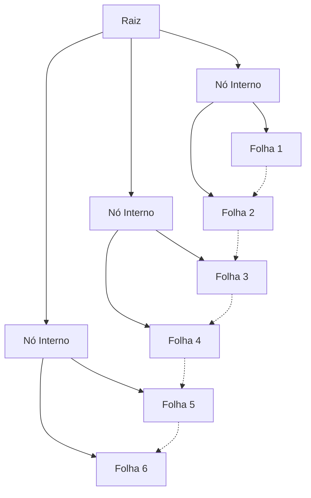
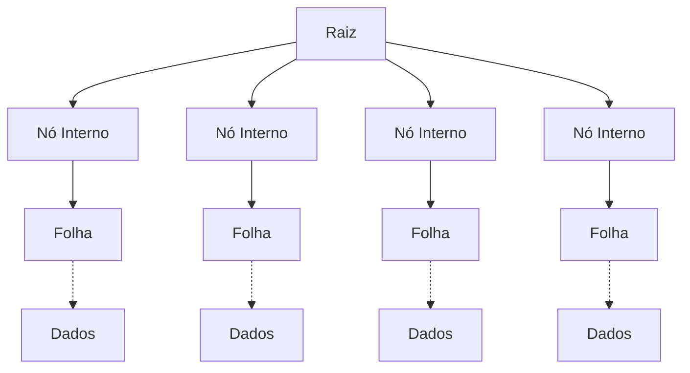

# Banco de dados II

## 8 – Ordenação externa

**Autor:** Marcos Roberto Ribeiro

**Instituição:** Instituto Federal Minas Gerais (IFMG) - Campus Bambuí  
**Departamento:** Departamento de Engenharia e Computação (DEC)  
**Curso:** Engenharia de Computação  
**Ano:** 2024

---

# Quando ordenar dados?

*   O usuário pode precisar do resultado em alguma ordem (ex.: data de nascimento)
*   Carregamento em massa para criação de índices
*   Eliminação de duplicadas
*   Alguns algoritmos de junção

## Ordenação Externa

Ordenação de dados que não cabem na memória principal

---

# Merge-sort de duas vias simples

> **Representação Visual do Algoritmo:**
> 
> O merge-sort de duas vias simples é ilustrado através de passagens sucessivas:
> - **Arquivo de Entrada:** 8 séries de 1 página cada
> - **Passagem 0:** 8 séries ordenadas de 1 página (ordenação interna)
> - **Passagem 1:** 4 séries ordenadas de 2 páginas (intercalação de pares)
> - **Passagem 2:** 2 séries ordenadas de 4 páginas (intercalação de pares)
> - **Passagem 3:** 1 série ordenada de 8 páginas (resultado final)

---

# Merge-sort de duas vias simples (Exemplo Completo)

---

# Merge-sort de duas vias simples (Análise de Complexidade)

*   Nessa versão, o algoritmo usa apenas 3 páginas (sub-arquivos chamados de séries)
*   Se o arquivo de entrada possui $2^N$ páginas:
    *   A passagem 0 produz $2^N$ séries ordenadas de 1 página
    *   A passagem 1 produz $2^{N-1}$ séries ordenadas de 2 páginas
    *   A passagem 2 produz $2^{N-2}$ séries ordenadas de 4 páginas
    *   ...
    *   A passagem $N$ produz uma série ordenadas de $2^N$ páginas
*   Em cada passagem, as páginas são lidas, ordenadas e gravadas (2 E/S por página por passagem)
*   Se o arquivo possui $N$ páginas, são feitas $\lceil \log_2 N \rceil + 1$ passagens
*   O custo total será de $2N(\lceil \log_2 N \rceil + 1)$ E/S

---

# Merge-sort externo

*   O algoritmo anterior não aproveita todo o espaço em memória disponível
*   Considerando um arquivo de N páginas e B páginas disponíveis em memória, o *merge-sort externo* funciona da seguinte maneira

**Passagem 0:** Leia B páginas por vez, ordene-as internamente e grave ⌈N/B⌉ séries de B páginas

**Demais Passagens:** Use B-1 páginas de entrada e uma de saída. Ordene as entradas por intercalação e grave na saída

---

# Merge-sort externo (continuação)

*   Com a intercalação em $B-1$ vias o número de passagens cai para $\lceil \log_{B-1} N \rceil + 1$ (contra $\lceil \log_2 N \rceil + 1$ do algoritmo anterior)
*   Normalmente $B$ é grande e o desempenho aumenta consideravelmente

## Exemplo: arquivo de 108 páginas com 5 em memória

Passagem 0: $\lceil 108/5 \rceil = 22$ séries ordenadas de 5 páginas

Passagem 1: $\lceil 108/5 \rceil = 6$ séries ordenadas de 20 páginas

Passagem 2: $\lceil 6/4 \rceil = 2$ séries ordenadas de 80 páginas

Passagem 3: Arquivo ordenado

---

# Redução do número de passagens com o aumento de B

<table>
  <thead>
    <tr>
      <th>N</th>
      <th>B=3</th>
      <th>B=5</th>
      <th>B=9</th>
      <th>B=17</th>
      <th>B=129</th>
      <th>B=257</th>
    </tr>
  </thead>
  <tbody>
    <tr>
      <td>100</td>
      <td>7</td>
      <td>4</td>
      <td>3</td>
      <td>2</td>
      <td>1</td>
      <td>1</td>
    </tr>
    <tr>
      <td>1.000</td>
      <td>10</td>
      <td>5</td>
      <td>4</td>
      <td>3</td>
      <td>2</td>
      <td>2</td>
    </tr>
    <tr>
      <td>10.000</td>
      <td>13</td>
      <td>7</td>
      <td>5</td>
      <td>4</td>
      <td>2</td>
      <td>2</td>
    </tr>
    <tr>
      <td>100.000</td>
      <td>17</td>
      <td>9</td>
      <td>6</td>
      <td>5</td>
      <td>3</td>
      <td>3</td>
    </tr>
    <tr>
      <td>1.000.000</td>
      <td>20</td>
      <td>10</td>
      <td>7</td>
      <td>5</td>
      <td>3</td>
      <td>3</td>
    </tr>
    <tr>
      <td>10.000.000</td>
      <td>23</td>
      <td>12</td>
      <td>8</td>
      <td>6</td>
      <td>4</td>
      <td>3</td>
    </tr>
    <tr>
      <td>100.000.000</td>
      <td>26</td>
      <td>14</td>
      <td>9</td>
      <td>7</td>
      <td>4</td>
      <td>4</td>
    </tr>
    <tr>
      <td>1.000.000.000</td>
      <td>30</td>
      <td>15</td>
      <td>10</td>
      <td>8</td>
      <td>5</td>
      <td>4</td>
    </tr>
  </tbody>
</table>

---

# Custo de E/S x número de E/S

*   É importante reduzir o número de E/S
*   Porém, existe o problema da *E/S bloqueada* (operações de E/S independentes são mais caras do que E/S em bloco)
*   Podemos reduzir a E/S bloqueada com operações sobre grupos de *b* (*b* < *B*) páginas de uma vez
*   O número de passagens aumenta, mas há um equilíbrio entre o número de passagens e o custo da E/S bloqueada

---

# Número de passagens considerando b = 32

<table>
<thead>
<tr>
<th>N</th>
<th>B=1.000</th>
<th>B=5.000</th>
<th>B=10.000</th>
<th>B=50.000</th>
</tr>
</thead>
<tbody>
<tr>
<td>100</td>
<td>1</td>
<td>1</td>
<td>1</td>
<td>1</td>
</tr>
<tr>
<td>1.000</td>
<td>1</td>
<td>1</td>
<td>1</td>
<td>1</td>
</tr>
<tr>
<td>10.000</td>
<td>2</td>
<td>2</td>
<td>1</td>
<td>1</td>
</tr>
<tr>
<td>100.000</td>
<td>3</td>
<td>2</td>
<td>2</td>
<td>2</td>
</tr>
<tr>
<td>1.000.000</td>
<td>3</td>
<td>2</td>
<td>2</td>
<td>2</td>
</tr>
<tr>
<td>10.000.000</td>
<td>4</td>
<td>3</td>
<td>3</td>
<td>2</td>
</tr>
<tr>
<td>100.000.000</td>
<td>5</td>
<td>3</td>
<td>3</td>
<td>2</td>
</tr>
<tr>
<td>1.000.000.000</td>
<td>5</td>
<td>4</td>
<td>3</td>
<td>3</td>
</tr>
</tbody>
</table>

---

# Bufferização dupla

*   No caso da ordenação, o custo de CPU também é importante
*   Seria interessante manter a CPU ocupada enquanto realizados operações de E/S

> **Representação Visual:** A bufferização dupla mantém buffers alternativos (1 e 1', 2 e 2', etc.) para permitir E/S assíncrona enquanto a CPU processa dados.

---

# Usando árvores B+ para ordenação - índice agrupado

> **Representação Visual:** Árvore B+ com índice agrupado onde as folhas estão encadeadas sequencialmente, permitindo varredura ordenada eficiente.

- Muito eficiente, os dados já estão ordenados pelas folhas da árvore

---

# Usando árvores B+ para ordenação - índice não agrupado

> **Representação Visual:** Árvore B+ com índice não agrupado onde as folhas apontam para páginas de dados dispersas no disco.

*   Pode ser menos eficiente do que varrer as páginas de dados dos arquivos. Por quê?

---

# Referências

DATE, C. J. Introdução a sistemas de bancos de dados. Rio de Janeiro: Elsevier, 2004.

ELMASRI, R.; NAVATHE, S. B. Sistemas de banco de dados. 7. ed. São Paulo: Pearson Addison Wesley, 2018.

RAMAKRISHNAN, R.; GEHRKE, J. Sistemas de gerenciamento de banco de dados. 3. ed. São Paulo: McGrawHill, 2008.

SILBERSCHATZ, A.; KORTH, H. F.; SUDARSHAN, S. Sistema de bancos de dados. 3. ed. São Paulo: Campus, 2007.