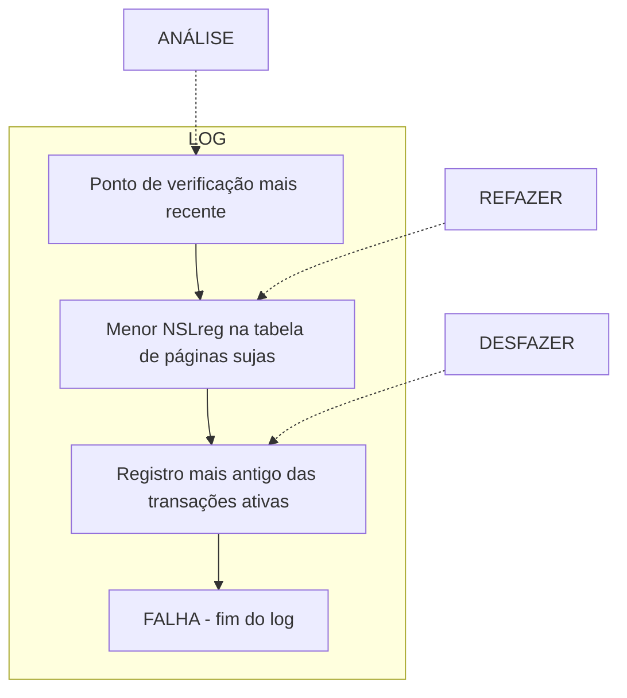

# Banco de dados II

## 11 – Recuperação após Falhas

**Autor:** Marcos Roberto Ribeiro

**Instituição:** Instituto Federal Minas Gerais (IFMG) - Campus Bambuí  
**Departamento:** Departamento de Engenharia e Computação (DEC)  
**Curso:** Engenharia de Computação  
**Ano:** 2023

---

# Introdução – Gerenciador de Recuperação

*   Deve garantir atomicidade e durabilidade
    *   **Atomicidade:** desfazer as ações de transações não efetivadas
    *   **Durabilidade:** garantir que todas as ações efetivadas sobrevivam a falhas de sistema
*   Um dos componentes mais complexos do SGBD pelo fato de ser acionado durante as falhas

---

# ARIES

**Algorithms for Recovery and Isolation Exploiting Semantics (ARIES)**

* Quando o gerenciador de recuperação é acionado, o reinício acontece em três fases:
    * **Análise:** identifica páginas sujas e transações ativas durante a falha
    * **Refazer:** repete as ações do log para restaurar o estado do banco de dados no momento da falha
    * **Desfazer:** desfaz ações de transações não efetivadas para que o banco possua apenas alterações de transações efetivadas

---

# Exemplo de log

## NSL* Log

> *NSL: Número de Sequência de Log*

<table>
  <tr>
    <td>10:</td>
    <td>atualização: T1 grava P5</td>
  </tr>
  <tr>
    <td>20:</td>
    <td>atualização: T2 grava P3</td>
  </tr>
  <tr>
    <td>30:</td>
    <td>T2 é efetivada</td>
  </tr>
  <tr>
    <td>40:</td>
    <td>T2 termina</td>
  </tr>
  <tr>
    <td>50:</td>
    <td>atualização: T3 grava P1</td>
  </tr>
  <tr>
    <td>60:</td>
    <td>atualização: T3 grava P3</td>
  </tr>
</table>

**FALHA, REINÍCIO**

*Número de sequência de log*

## Considerando o log

*   T1 e T3 estavam ativas e precisam ser desfeitas
*   T2 foi efetivada, todas as suas ações precisam ser gravadas em disco
*   P1, P3 e P5 são páginas possivelmente sujas
*   O SGBD refaz todas as ações de todas as transações (T1, T2 e T3)
*   As ações das transações não efetivadas (T1 e T3) são desfeitas

---

# Princípios fundamentais do ARIES

**Gravação antecipada do log (Write-Ahead Logging - WAL):** Qualquer alteração no banco de dados deve ser gravada primeiro no log

**Repetição do histórico durante a fase Refazer:** O ARIES refaz todas as ações antes da falha e, em seguida, desfaz as ações das transações não efetivadas

**Registro de alterações da fase Desfazer:** As alterações desfeitas no banco de dados são registradas para que esse processo não se repita em caso de reinício

---

# O log

*   O log também pode ser chamado de trilha ou periódico
*   Para maior segurança, podem ser mantidas várias cópias do log em discos diferentes
*   A parte mais recente do log (cauda do log) fica em memória e é gravada em disco periodicamente
*   Cada página do banco de dados armazena o NSL do registro mais recente que alterou a página, chamado de NSLPágina

---

# Registros de log

*   Um registro de log é gravado para cada uma das seguintes ações:
    *   **Atualização de página:** Um registro de atualização é anexado à cauda do log e o NSL Página da página modificada recebe o NSL desse registro
    *   **Efetivar:** Um registro de efetivação é anexado à cauda do log, em seguida, ocorre uma gravação imposta da cauda do log. Isso é, a cauda do log é gravada em disco e só então a transação é considerada efetivada
    *   **Cancelar:** Um registro cancelamento é anexado ao log e a transação é desfeita
    *   **Final:** Após a efetivação ou cancelamento, são necessárias ações adicionais. Depois dessas ações, um registro do tipo final com o id da transação é anexado ao log
    *   **Desfazer uma atualização:** Quando uma atualização é desfeita, um registro de log de compensação (RLC) é gravado
*   Todo registro tem os campos: **NSLant** (NSL anterior da transação), **idTrans** (id da transação) e **tipo**

---

# Registros de log de atualização

* Além dos campos NSLant, idTrans e tipo, os registros de log de atualização possuem os seguintes campos:
    * idPágina: id da página modificada
    * comprimento: a quantidade de bytes alterados
    * deslocamento: deslocamento dos bytes alterados em relação ao início da página
    * imagem-antes: valor dos bytes antes da alteração
    * imagem-depois: valor dos bytes depois da alteração

---

# Registros de log de compensação

* Antes de desfazer a alteração de um registro U, é gravado um **registro de log de compensação (RLC) C**
* Um RLC descreve como a alteração foi desfeita
* Todo RLC possui o campo **desfazerPróximoNSL** que indica o próximo registro de log a ser desfeito.
* Se for criado um RLC C para desfazer um registro de atualização U, então C.desfazerPróximoNSL = U.NSLant
* Os RLC são importantes para situações com falha no reinício
* Nesses casos, o algoritmo considera os RLC já criados e não é necessário desfazer a mesma atualização novamente

---

# Outras estruturas relacionadas à recuperação

## Tabela de transações

*   Contém uma entrada para cada transação ativa
*   Contém o id da transação, o status e o o registro mais recente da transação (últimoNSL)
*   Após certas tarefas de limpeza, as transações efetivadas e canceladas são removidas da tabela

## Tabela de páginas sujas

*   Contém uma entrada para cada página suja
*   As entradas possuem o NSL do primeiro registro que “sujou” a página (NSLreg)

---

# Exemplo de Tabelas de Recuperação

## idPáginaNSLreg

<table>
  <thead>
    <tr>
      <th>P500</th>
      <th>P600</th>
      <th>P505</th>
    </tr>
  </thead>
  <tbody>
    <tr>
      <td></td>
      <td></td>
      <td></td>
    </tr>
  </tbody>
</table>

TABELA DE PÁGINAS SUJAS

## TABELA DE TRANSAÇÕES

<table>
  <thead>
    <tr>
      <th>idTrans</th>
      <th>tipo</th>
      <th>idPágina comp.</th>
      <th>desloc.</th>
      <th>i-antes</th>
      <th>i-depois</th>
      <th>NSLant</th>
    </tr>
  </thead>
  <tbody>
    <tr>
      <td>T1000</td>
      <td>atualização</td>
      <td>P500</td>
      <td>3</td>
      <td>21</td>
      <td>ABC</td>
      <td>DEF</td>
    </tr>
    <tr>
      <td>T2000</td>
      <td>atualização</td>
      <td>P600</td>
      <td>3</td>
      <td>41</td>
      <td>HIJ</td>
      <td>KLM</td>
    </tr>
    <tr>
      <td>T2000</td>
      <td>atualização</td>
      <td>P500</td>
      <td>3</td>
      <td>20</td>
      <td>GDE</td>
      <td>QRS</td>
    </tr>
    <tr>
      <td>T1000</td>
      <td>atualização</td>
      <td>P505</td>
      <td>3</td>
      <td>41</td>
      <td>TUV</td>
      <td>WXY</td>
    </tr>
  </tbody>
</table>

idTrans últimoNSL

TABELA DE PÁGINAS SUJAS

TABELA DE TRANSACOES

---

# O protocolo Write-Ahead Log (WAL)

* Antes de uma página ser gravada em disco, todo o log de atualização desta página precisa estar em armazenamento estável
* O WAL garante que todas as alterações no banco de dados estejam disponíveis durante a recuperação de uma falha
* A definição correta de uma *transação efetivada* é uma transação cujos registros de log foram todos gravados em armazenamento estável

---

# Pontos de verificação

*   Os pontos de verificação (ou checkpoints) funcionam como fotografias do banco de dados
*   Eles reduzem a quantidade de trabalho a ser feito durante o reinício
*   O uso de pontos de verificação no ARIES precisa de dois registros especiais:
    *   Gravação de um registro de início-ponto-verificação para indicar o começo do checkpoint
    *   Construção de um registro de fim-de-ponto-verificação contendo o conteúdo da tabela de transações e da tabela de páginas sujas
*   Enquanto o registro de fim-de-ponto-verificação não for gravado, o SGBD continua executando transações a gravando no log
*   Quando o sistema reiniciar, após uma falha, o processo de reinício começa localizando o ponto de verificação mais recente

---

# Recuperando de uma falha de sistema

---

# Fase de análise: tarefas principais

1.  Determinar o ponto do log em que a fazer *Refazer* deve começar
2.  Determinar o conjunto de páginas sujas no momento da falha
3.  Identificar as transações ativas no momento da falha que precisarão ser desfeitas

---

# Fase de análise

*   A fase de análise começa restaurando a tabela de páginas sujas e a tabela de transações salvas no último ponto de verificação
*   Em seguida, percorre todos os registros após o ponto de verificação e faz o seguinte:
    *   Se for encontrado um log final para uma transação T, T é removida da tabela de transações
    *   Para qualquer outro log de T, o algoritmo acrescenta ou modifica a entrada T na tabela de transações. O campo **últimoNSL** da transação é configurado com o **NSL** desse registro
    *   Se for encontrado um log a ser refeito que afete uma página P e P não está na tabela de páginas sujas, inserimos P na tabela com **NSLreg** igual ao **NSL** do log. Essa é a alteração mais antiga que afeta a página
*   No final da fase de análise, a tabela de transações contém todas as transações que estavam ativas e a tabela de páginas sujas contém todas as páginas que estavam sujas no momento da falha

---

# Fase Refazer

*   A fase Refazer replica as atualizações de todas as transações
*   Essa fase inicia no menor NSLreg dentre todas as páginas na tabela de páginas sujas (construída na fase de Análise)
*   Esse registro contém a atualização mais antiga que pode não ter sido gravada em disco
*   Todas as ações a partir desse registro são feitas, **exceto** quando:
    *   A página afetada não está na tabela de páginas sujas
    *   A página afetada está na tabela de páginas sujas, mas o NSLreg da página é maior do que o registro verificado
*   Quando a ação é refeita, O NSLPágina da página é configurado com o NSL do registro refeito (nenhum registro de log adicional é gravado)

---

# Fase Desfazer

- A fase Desfazer retrocede a partir do último registro de log
- O objetivo é desfazer as ações de todas as transações ativas no momento da falha
- Essas transações podem então ser removidas da tabela de transações

---

# O algoritmo da fase Desfazer

*   As transações ativas no momento da falha são chamadas de *perdedoras* e suas ações precisam ser desfeitas na ordem inversa em que aparecem no log
*   O algoritmo inicia o conjunto ADesfazer com os últimoNSL de todas as transações perdedoras
*   Em seguida, o algoritmo processa repetidamente o registro com maior NSL do conjunto ADesfazer até que o mesmo fique vazio
*   O processamento dos registro é feito da seguinte maneira:
    1.  Se for um registro RLC:
        a. Se o campo desfazerPróximoNSL não for nulo, seu valor é adicionado ao ADesfazer
        b. Se desfazerPróximoNSL for nulo, a transação está completamente desfeita
    2.  Se for um registro de atualização, um RLC é gravado e a ação correspondente é desfeita. O valor de NSLant do registro é adicionado ao ADesfazer

---

# Falhas durante o reinício

## Exemplo de log

*   00, 05 Ponto de verificação
*   10 atualização: T1 grava P5
*   20 atualização: T2 grava P3
*   30 T1 é cancelada
*   40, 45 RLC: desfazer T1 NSL 10, T1 termina
*   50 atualização: T3 grava P1
*   60 atualização: T2 grava P5
*   X FALHA, REINÍCIO
*   70 RLC: desfazer T2 NSL 60
*   80, 85 RLC: desfazer T3 NSL 50, T3 termina
*   X FALHA, REINÍCIO
*   90, 95 RLC: desfazer T2 NSL 20, T2 termina

## Funcionamento do algoritmo

*   O registro 30 indica que T1 é cancelada
*   O sistema desfaz o registro 10 e cria o RLC 40
*   O registro 45 indica que T1 foi efetivamente cancelada
*   Após a primeira falha, a fase Análise identifica as páginas sujas P1, P3 e P5
*   A tabela de transações possui T2 e T3 como ativas
*   A fazer Refazer refaz todas as ações até o registro 60

---

# Falhas durante o reinício (continuação - Parte 2)

## Funcionamento do algoritmo (Fase Desfazer)

*   O conjunto ADesfazer consiste dos NSL 50 e 60
*   A fase desfazer inicia com o processamento do registro 60
*   A atualização é desfeita e o RLC 70 (com desfazerPróximoNSL igual a 20) é gravado no log
*   Agora ADesfazer = {50, 20}
*   A atualização do registro 50 é desfeita
*   O algoritmo cria RLC 80 (com desfazerPróximoNSL igual a nulo) é gravado no log
*   O registro 85 indica que T3 foi efetivamente cancelada
*   Então, ocorre a segunda falha

---

# Falhas durante o reinício (continuação - Parte 3)

## Funcionamento do algoritmo (Após segunda falha)

*   Após a segunda falha, a fase Análise determina que T2 era a única transação ativa e as páginas sujas são P1, P3 e P5
*   Durante a fase Refazer, os registros de 10 a 85 são processados novamente
*   A fase Refazer considera ADesfazer = {70}
*   Ao processar o RLC 70, o desfazerPróximoNSL=20 é adicionado ao ADesfazer
*   Em seguida, a atualização do registro 20 é desfeita e o RLC 90 (com desfazerPróximoNSL=nulo) é gravado no log
*   Agora a recuperação está concluída

---

# Referências

DATE, C. J. Introdução a sistemas de bancos de dados. Rio de Janeiro: Elsevier, 2004.

ELMASRI, R.; NAVATHE, S. B. Sistemas de banco de dados. 7. ed. São Paulo: Pearson Addison Wesley, 2018.

RAMAKRISHNAN, R.; GEHRKE, J. Sistemas de gerenciamento de banco de dados. 3. ed. São Paulo: McGrawHill, 2008.

SILBERSCHATZ, A.; KORTH, H. F.; SUDARSHAN, S. Sistema de bancos de dados. 3. ed. São Paulo: Campus, 2007.