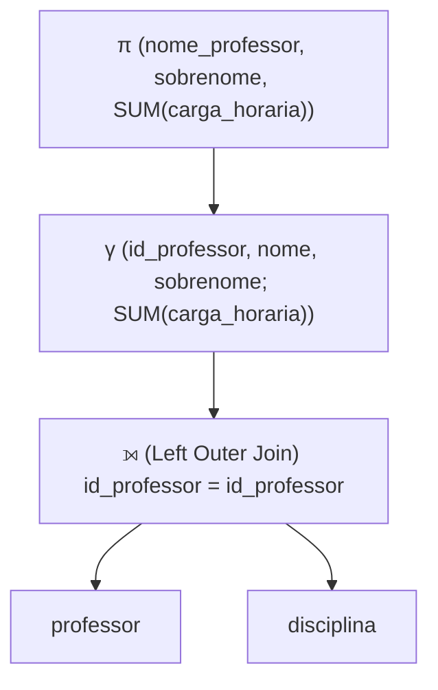
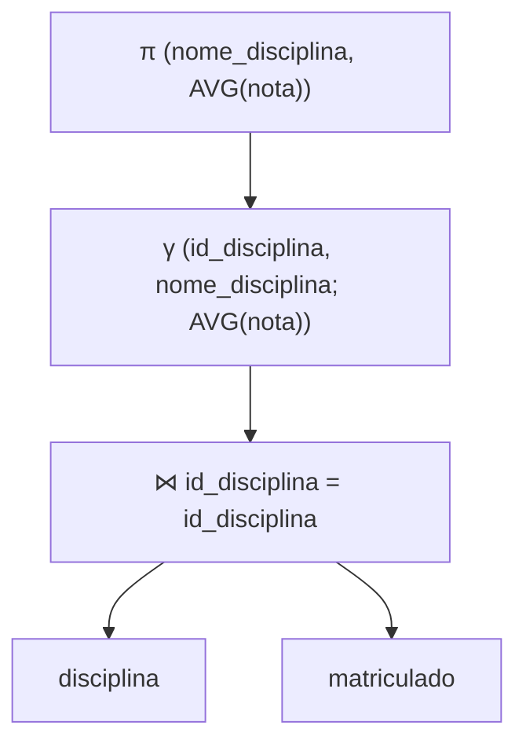
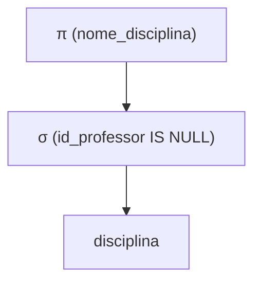
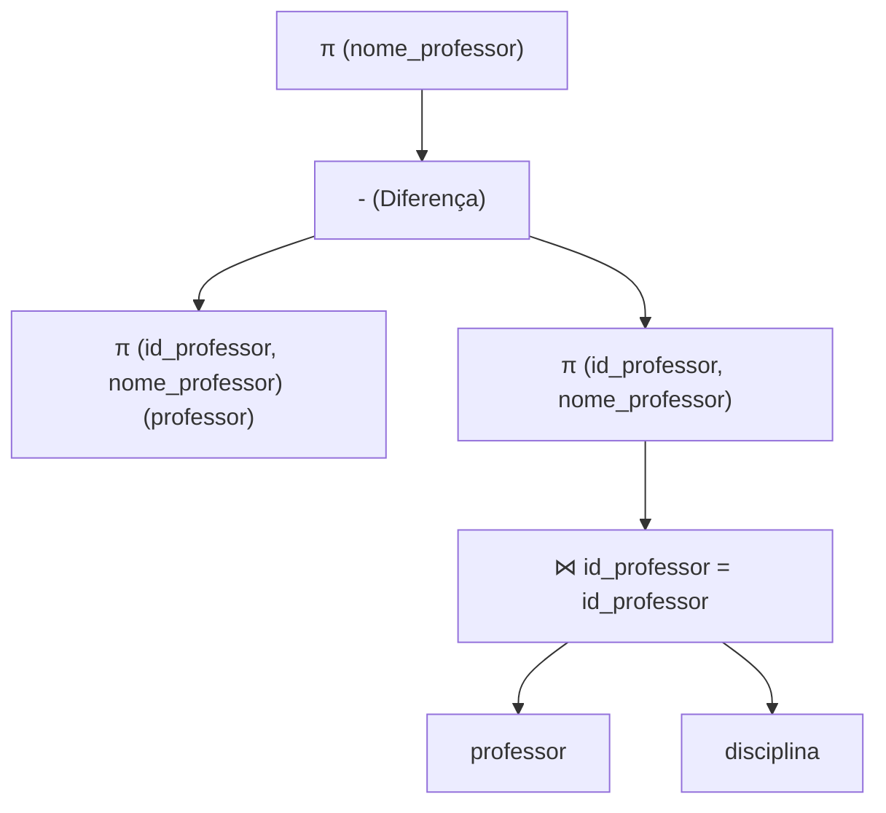
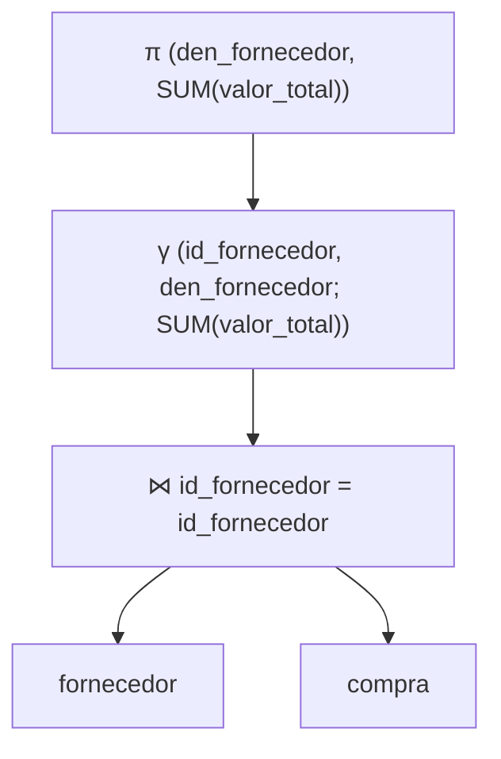
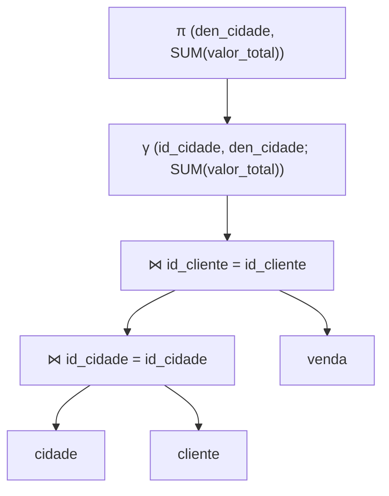
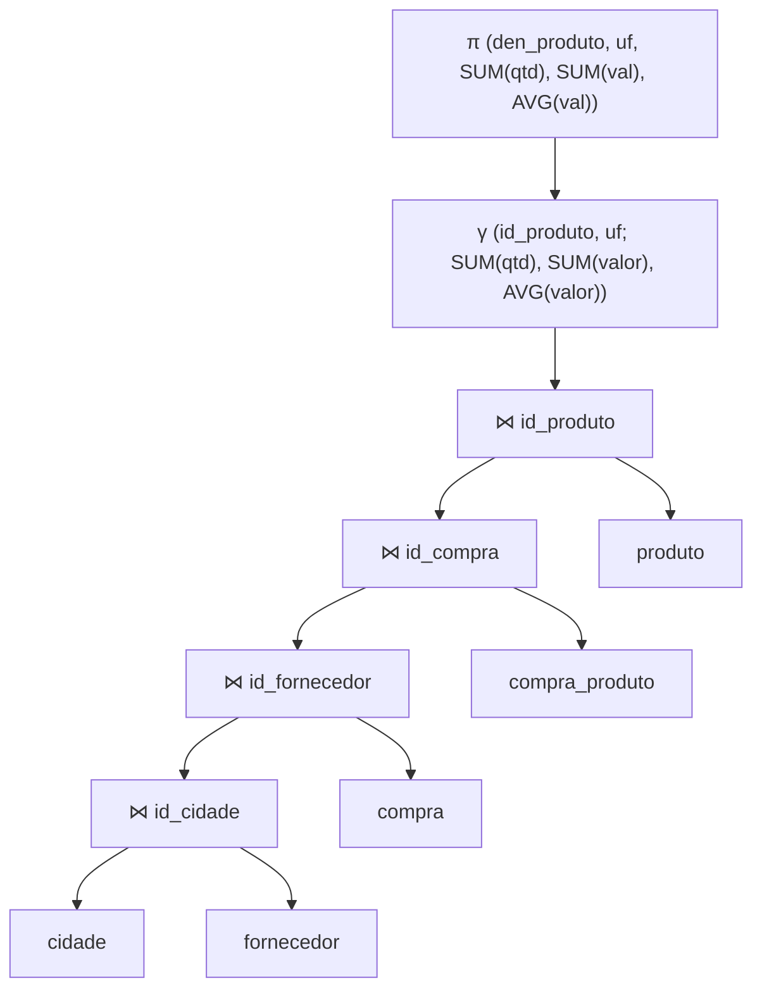

Com base nos documentos fornecidos do seu repositório `RxSaturn/Banco-de-Dados-1`, aqui estão as resoluções detalhadas para a **Lista de Exercícios 9** e a **Lista de Exercícios 6**.

---

# 📝 Lista de Exercícios 9: Avaliação de Operadores Relacionais

Esta lista foca nas estratégias e algoritmos utilizados pelo SGBD para executar consultas de forma eficiente.

### Exercício 1
**Considere uma seleção com apenas uma condição simples. Como tal operação é avaliada se a condição não envolve índices? E se a condição envolver índices, devemos sempre usá-los?**

*   **Sem índices:** Se não há índices na condição, o SGBD deve realizar uma **varredura completa (table scan)** na tabela, lendo todas as páginas e verificando a condição registro a registro.
*   **Com índices:** Se houver índice, **não necessariamente** devemos usá-lo sempre. A decisão depende do tipo de índice e da seletividade:
    *   Se for um **índice hash** e a busca for por igualdade, deve-se usá-lo (custo muito baixo).
    *   Se for um **índice B+ agrupado (clustered)**, geralmente é vantajoso usá-lo.
    *   Se for um **índice B+ não agrupado** e a consulta retornar muitas tuplas (baixa seletividade, ex: > 10% da tabela), pode ser mais custoso acessar o índice e depois fazer saltos aleatórios no disco para buscar os dados do que varrer a tabela inteira sequencialmente.

### Exercício 2
**Explique os dois métodos de seleção sem disjunção (apenas AND). E no caso das seleções com disjunção (OR), o que pode acontecer?**

*   **Seleção sem disjunção (Conjunção/AND):**
    1.  **Caminho mais seletivo:** O otimizador escolhe o índice que filtra mais linhas (o mais seletivo). Recupera as tuplas usando esse índice e aplica as demais condições nos resultados recuperados.
    2.  **Interseção de RIDs:** Se houver índices para várias condições, o SGBD obtém os identificadores (RIDs) de cada índice separadamente e faz a interseção desses conjuntos de RIDs em memória. Só depois busca os dados finais no disco.
*   **Seleção com disjunção (OR):**
    *   Se uma das condições do `OR` **não tiver índice**, o SGBD geralmente é forçado a fazer uma **varredura completa** na tabela (pois não há como garantir que encontrou tudo apenas olhando o índice da outra condição).
    *   Se todas as condições tiverem índices, o SGBD pode recuperar os RIDs de cada índice e fazer a **união** dos resultados.

### Exercício 3
**Explique as duas técnicas de avaliação de projeção (com eliminação de duplicatas) existentes. Qual das duas se sobressai? Podemos usar índices para avaliar tal operação?**

*   **Técnicas:**
    1.  **Baseada em Ordenação:** O SGBD cria uma tabela temporária apenas com as colunas desejadas, ordena essa tabela (custo $M \log M$) e depois varre linearmente removendo linhas adjacentes duplicadas.
    2.  **Baseada em Hash:** O SGBD particiona a tabela usando uma função hash $h$. Duplicatas cairão na mesma partição. Depois, lê cada partição, constrói uma tabela hash em memória (com $h'$) para eliminar duplicatas. Custo aproximado de $3M$.
*   **Qual se sobressai:** A **Ordenação** geralmente é preferida pelos SGBDs, pois lida melhor com muitas duplicatas (reduzindo o tamanho durante a ordenação) e entrega o resultado já ordenado, o que é útil se houver um `ORDER BY` ou outra operação subsequente.
*   **Uso de Índices:** Sim. Se existir um índice que contenha **todos** os atributos projetados (índice *covering*), o SGBD pode executar a projeção lendo apenas o arquivo de índice (que é muito menor que a tabela), sem acessar os dados principais.

### Exercício 4
**É possível avaliar uma operação de junção usando uma equivalência com os operadores de produto cartesiano, seleção e projeção? Isso é recomendável?**

*   **Possível:** Sim, a junção ($R \bowtie S$) é logicamente equivalente a fazer o produto cartesiano ($R \times S$) seguido de uma seleção ($\sigma$) para filtrar as linhas correspondentes.
*   **Recomendável:** **Não**. O produto cartesiano gera um volume de dados gigantesco ($N \times M$ tuplas). Processar isso para depois filtrar é extremamente ineficiente. Os algoritmos de junção nativos (Hash, Merge, Nested Loops) são projetados para combinar e filtrar simultaneamente, evitando a explosão de dados intermediários.

### Exercício 5
**Explique como funcionam e compare o custo dos seguintes algoritmos de avaliação de junção:**
*(Legenda: M = páginas de R, N = páginas de S, B = buffers)*

*   **(a) Junção de loops aninhados (Simple Nested Loops):** Para cada tupla de R, varre todas as páginas de S. Muito custoso e ineficiente se as tabelas não couberem na memória.
    *   *Custo:* $M + (Tuplas\_em\_R \times N)$.
*   **(b) Junção de loops aninhados de bloco (Block Nested Loops):** Lê um bloco de páginas de R para a memória, depois varre S uma vez comparando com todo esse bloco. Maximiza o uso do buffer.
    *   *Custo:* $M + N \times \lceil M / (B-2) \rceil$.
*   **(c) Junção de loops aninhados indexados:** Usa R como tabela externa e, para cada tupla, usa um índice existente em S para buscar a correspondência. Ótimo se S for grande e R pequeno.
    *   *Custo:* $M + (Tuplas\_em\_R \times Custo\_Busca\_Indice)$.
*   **(d) Junção Sort-Merge:** Ordena ambas as tabelas pelo atributo de junção e depois varre as duas simultaneamente (estilo "zipper"), encontrando as correspondências. Excelente para igualdades.
    *   *Custo:* Custo de ordenar R + Custo de ordenar S + $(M + N)$.
*   **(e) Junção por Hashing:** Particiona R e S usando a mesma função hash. Tuplas que casam estarão na mesma partição. Depois, faz a junção de cada par de partições em memória.
    *   *Custo:* $3(M + N)$. Geralmente muito eficiente para junções de igualdade em tabelas grandes não ordenadas.

### Exercício 6
**Descreva como as operações de conjunto podem ser avaliadas.**

As operações de União ($R \cup S$), Interseção ($R \cap S$) e Diferença ($R - S$) requerem que as duplicatas sejam tratadas (a menos que seja `UNION ALL`).
1.  **Via Ordenação:** Ordena-se ambas as relações. Percorre-se ambas em paralelo. Para união, mesclam-se os resultados. Para interseção, mantêm-se apenas os iguais. Para diferença, mantêm-se os de R que não aparecem em S.
2.  **Via Hash:** Particiona-se ambas as relações com a mesma função hash. Processa-se partição por partição (ex: para interseção, verifica-se se tuplas da partição $Ri$ existem na tabela hash da partição $Si$).

### Exercício 7
**Explique os métodos para avaliar as operações de agregação.**

Operações como `SUM`, `AVG`, `COUNT`, `MIN`, `MAX` com `GROUP BY`:
1.  **Ordenação:** Ordena a tabela pelo atributo do `GROUP BY`. Varre o resultado ordenado acumulando os valores (soma, contagem, etc.) e emitindo o resultado quando a chave do grupo muda.
2.  **Hashing:** Cria uma tabela hash em memória onde a chave é o atributo do `GROUP BY` e o valor é o acumulador (ex: soma atual). Varre a tabela original, atualizando a entrada correspondente na tabela hash.
3.  **Índices:** Se houver índice na chave de agrupamento (para ordenação) ou na coluna agregada (ex: `MIN/MAX` em árvore B+), o SGBD pode responder olhando apenas o índice, sem varrer a tabela (aggregação "Index Only").

---

# 📝 Lista de Exercícios 6: SQL para Álgebra Relacional

Aqui traduzimos as consultas SQL dos exercícios anteriores para a notação de **Árvore de Álgebra Relacional**.

> **Nota:** Como os enunciados originais (Lista 5) pediam o SQL, assumi as queries padrão para gerar os planos lógicos abaixo.

### 1(a) Nomes completos de todos os professores com carga horária total
*Consulta:* Junção externa (Left Join) de professor com disciplina e agregação.

### 1(b) Obter a nota média para cada disciplina
*Consulta:* Agregação simples na tabela matriculado juntando com disciplina para pegar o nome.

### 1(c) Obter as disciplinas sem professor
*Consulta:* Seleção onde a chave estrangeira é nula.

### 1(d) Obter os professores sem disciplina
*Consulta:* Diferença de conjuntos ou Left Join filtrando nulos. (Usando diferença para variar):

### 2(a) Valor total comprado de cada fornecedor
*Consulta:* Junção de fornecedor e compra, agrupado por fornecedor.

### 2(b) Valor total vendido para cada cidade
*Consulta:* Junção de cidade -> cliente -> venda.

### 2(c) Qtd, valor total e médio de produto comprado por estado (UF)
*Consulta:* Junção longa: estado (cidade) -> fornecedor -> compra -> compra_produto -> produto.

