# Material de Estudos Completo: Banco de Dados II

## 📚 Índice Geral

1. [Introdução a Índices e Organização de Arquivos](#1-introdução-a-índices-e-organização-de-arquivos)
2. [Armazenamento de Dados e Hierarquia de Memória](#2-armazenamento-de-dados-e-hierarquia-de-memória)
3. [Índices em Árvore (B-Tree e B+Tree)](#3-índices-em-árvore-b-tree-e-btree)
4. [Índices Hash](#4-índices-hash)
5. [Comparações e Casos de Uso](#5-comparações-e-casos-de-uso)

---

## 1. Introdução a Índices e Organização de Arquivos

### 🎯 O que é Organização de Arquivo?

**Metáfora da Biblioteca:** Imagine uma biblioteca com milhares de livros. A **organização de arquivo** é como você decide arrumar esses livros nas estantes:

- **Por ordem alfabética de autor** (arquivo ordenado)
- **Sem ordem específica, conforme chegam** (arquivo heap/pilha)
- **Por categorias com sub-divisões** (arquivo indexado)
- **Por código numérico calculado** (arquivo hash)

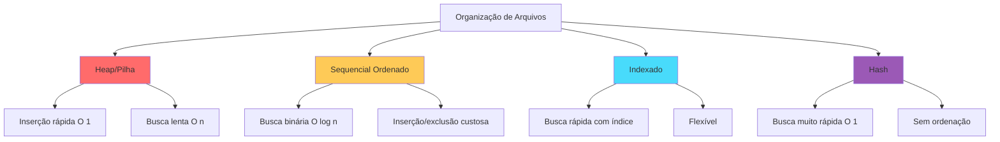

### 📊 Relacionamento entre Arquivos e Índices

**Metáfora do Catálogo:** O **arquivo de dados** é a estante com os livros. O **índice** é o catálogo de fichas que te diz onde encontrar cada livro.

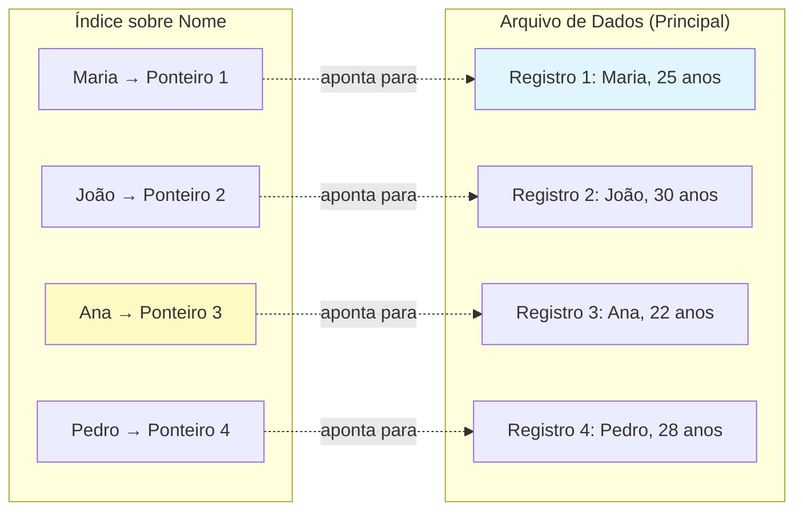

**Múltiplos Índices no Mesmo Arquivo:**

SIM! Podemos ter vários índices sobre o mesmo arquivo:

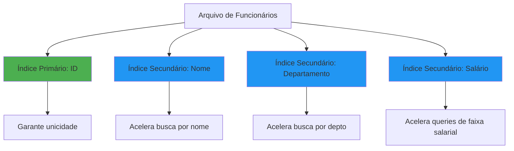

### 🔑 Conceitos Fundamentais

#### 1.1 Chave de Pesquisa vs Entrada de Dados

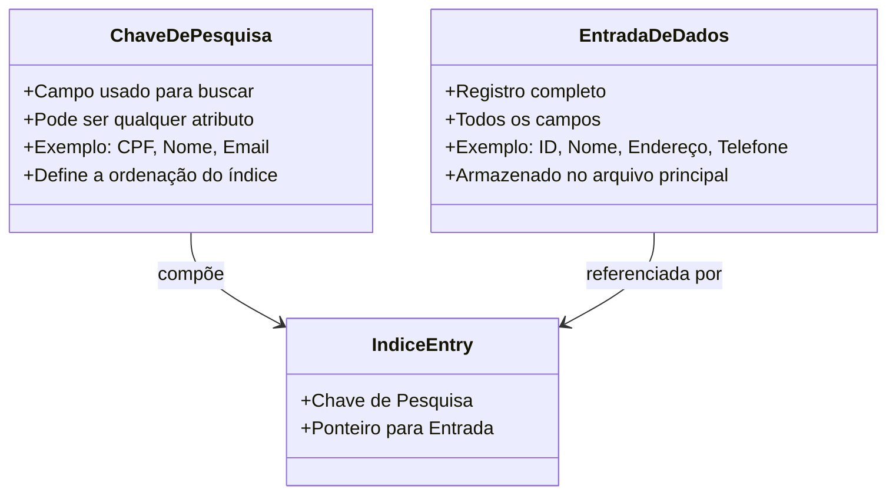

**Exemplo Prático:**

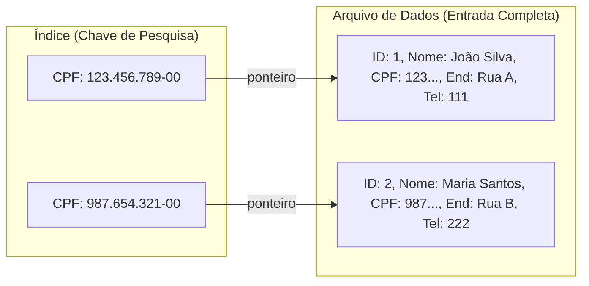

#### 1.2 RID (Record Identifier)

**O que é RID?**

O **RID** (Record ID ou Row ID) é como o "endereço físico" de um registro no disco. É composto por:

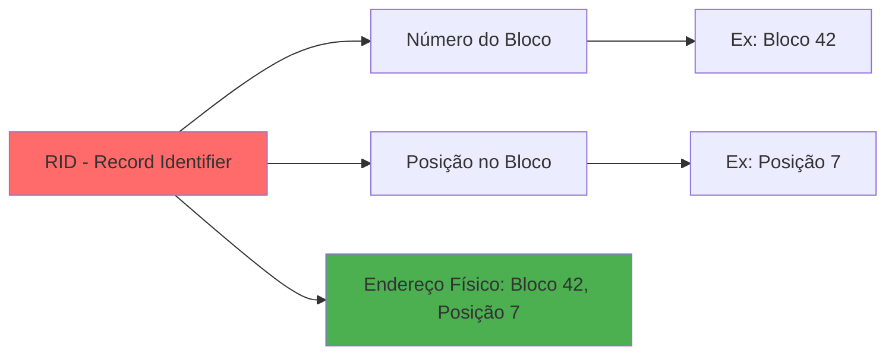

**Exemplo Visual:**

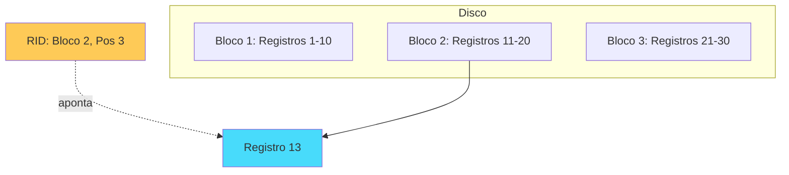

### 🏗️ Índice Agrupado (Clustered) vs Não Agrupado

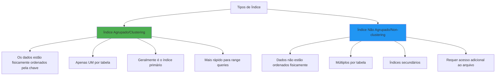

**Exemplo Visual - Índice Agrupado:**

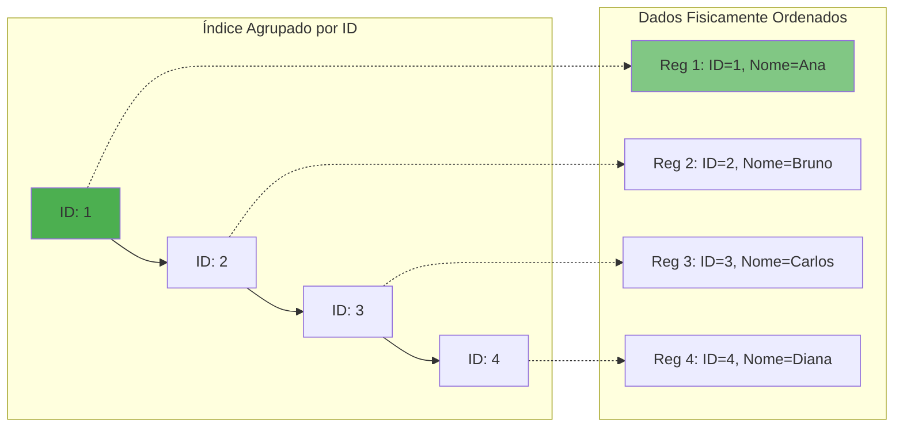

**Quantos Índices Agrupados?** Apenas **UM** por tabela! Por quê? Os dados só podem estar fisicamente ordenados de UMA forma.

**Quantos Índices Não Agrupados?** **VÁRIOS!** Não há limite teórico, mas cada índice adicional:
- Consome espaço em disco
- Aumenta tempo de INSERT/UPDATE/DELETE

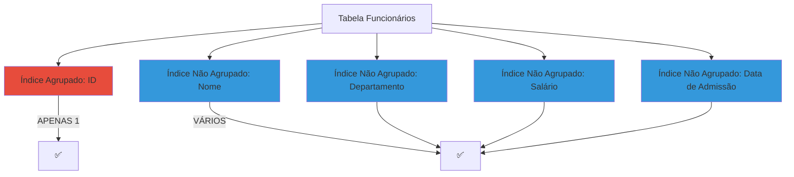

---

### 📝 Exercícios - Seção 1

#### **Exercício 1:**
**O que é uma organização de arquivo? O que é um índice? Qual o relacionamento entre arquivos e índices? Podemos ter diversos índices sobre um mesmo arquivo de registros?**

**Resposta:**

- **Organização de arquivo:** É a forma como os registros são estruturados e armazenados fisicamente no disco (heap, sequencial, hash, etc.)
- **Índice:** É uma estrutura de dados auxiliar que contém chaves de pesquisa e ponteiros para os registros, acelerando buscas
- **Relacionamento:** O arquivo contém os dados completos, enquanto os índices apontam para esses dados, funcionando como catálogos
- **Múltiplos índices:** SIM! Podemos ter:
  - 1 índice agrupado (clustering)
  - N índices não agrupados (non-clustering) sobre diferentes campos

---

#### **Exercício 2:**
**No que diz respeito a índices, o que é uma chave de pesquisa e o que é uma entrada de dados?**

**Resposta:**

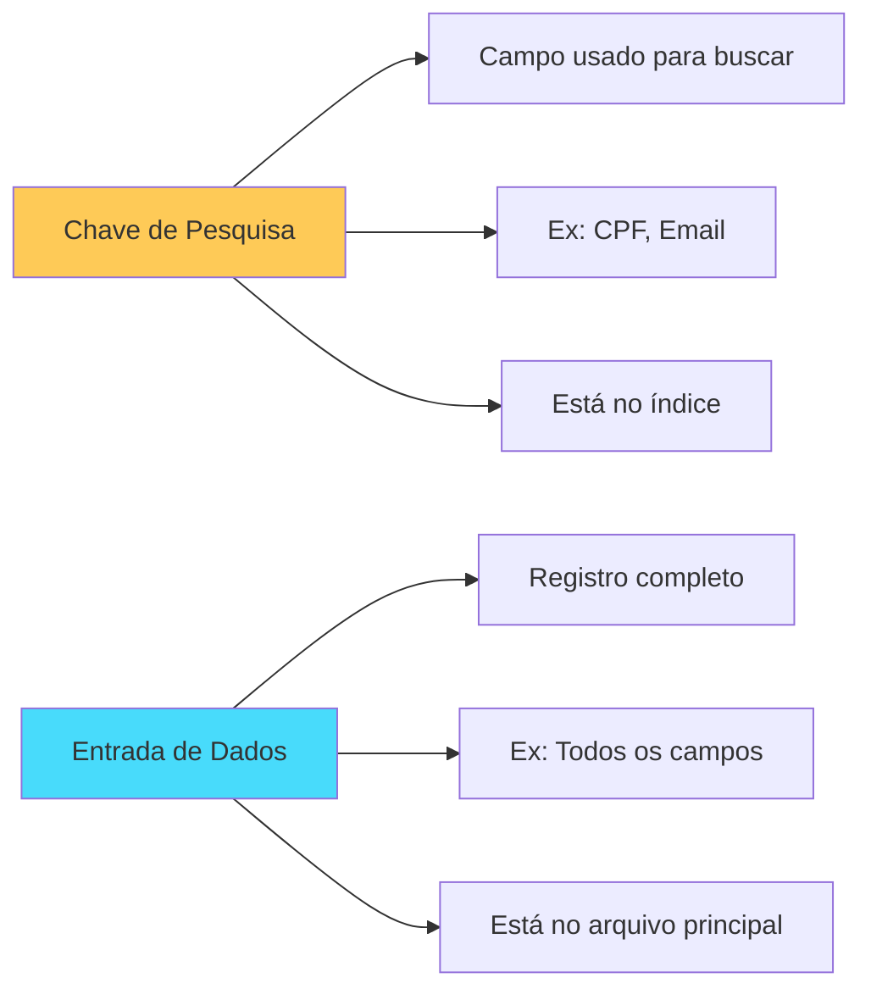

- **Chave de pesquisa:** O campo específico usado para indexar e buscar (ex: CPF, ID)
- **Entrada de dados:** O registro completo com todos os campos armazenados no arquivo de dados

---

#### **Exercício 3:**
**O que é um índice agrupado (ou integrado)? Quantos índices agrupados e quantos índices não agrupados podem ser criados em um arquivo de registros?**

**Resposta:**

- **Índice Agrupado:** Índice onde os dados estão fisicamente ordenados pela chave de indexação
- **Quantidades:**
  - **Índice Agrupado:** Apenas **1** por tabela (dados só podem estar ordenados de uma forma)
  - **Índice Não Agrupado:** **N** índices (múltiplos permitidos)

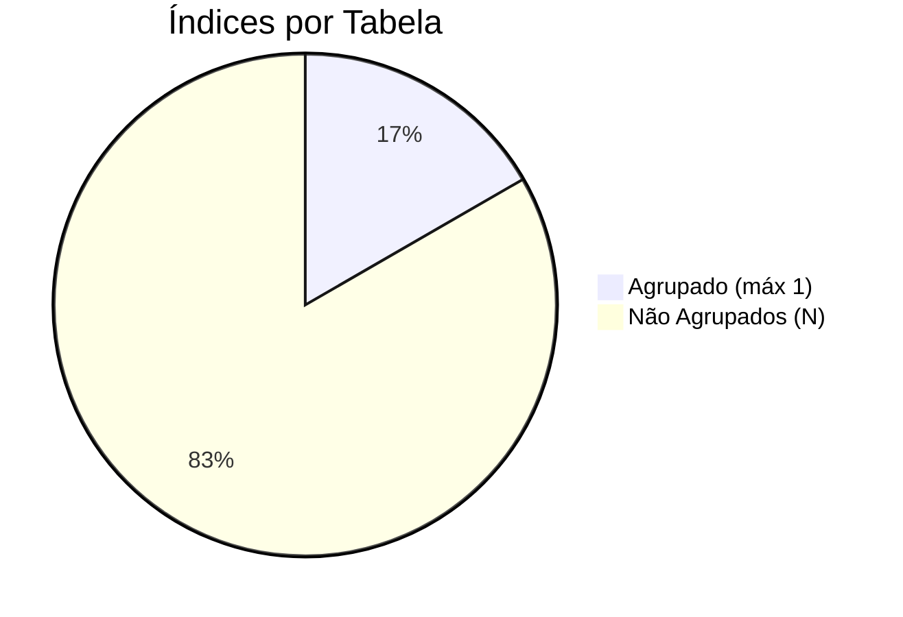

---

#### **Exercício 4:**
**Indique quando é adequado usar índices baseados em hash ou de árvore.**

**Resposta:**

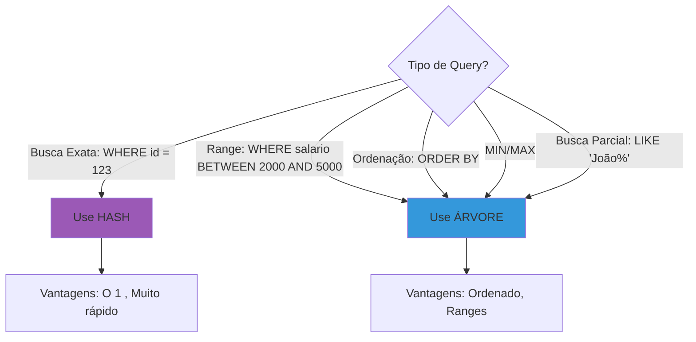

| Situação | Use Hash | Use Árvore |
|----------|----------|------------|
| WHERE id = 123 | ✅ | ✅ |
| WHERE salario > 2000 | ❌ | ✅ |
| ORDER BY nome | ❌ | ✅ |
| JOIN em chave única | ✅ | ✅ |
| LIKE 'João%' | ❌ | ✅ |

---

#### **Exercício 5:**
**O que é um método de avaliação somente de índice? Dê um exemplo. Qual a sua principal vantagem?**

**Resposta:**

**Método de Avaliação Somente de Índice (Index-Only Scan):** Quando a query pode ser respondida APENAS consultando o índice, sem acessar o arquivo de dados principal.

**Exemplo:**

```sql
-- Tabela: funcionario(id, nome, salario, nascimento)
-- Índice sobre: salario

-- Query que usa APENAS o índice:
SELECT COUNT(*) 
FROM funcionario 
WHERE salario > 2000;

-- O SGBD não precisa acessar o arquivo principal!
```

```mermaid
sequenceDiagram
    participant Q as Query
    participant I as Índice (salario)
    participant D as Arquivo de Dados
    
    Q->>I: COUNT(*) WHERE salario > 2000
    I->>I: Conta entradas com salario > 2000
    I->>Q: Retorna: 150
    
    Note over D: ✅ NÃO FOI ACESSADO!
    
    style I fill:#4caf50
```

**Vantagem Principal:**
- 🚀 **Muito mais rápido** - evita I/O no arquivo de dados
- 📉 **Menos blocos lidos** - índices são menores que arquivos de dados
- 💾 **Economia de cache** - mantém mais índice em memória

---

#### **Exercício 6:**
**Por que os custos de E/S são tão importantes para um SGBD?**

**Resposta:**

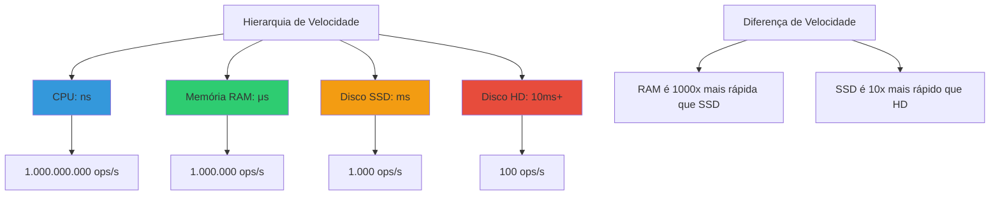

**Razões:**

1. **Gargalo de Performance:** Acesso a disco é **milhões de vezes** mais lento que RAM
2. **Impacto Direto:** 90% do tempo de execução de queries pode ser I/O
3. **Escalabilidade:** Sistemas com muitos usuários = muitas requisições de disco
4. **Custo:** Discos rápidos são caros, otimizar I/O economiza dinheiro

**Exemplo Prático:**

```
Operação: Buscar 1 registro

SEM Índice:
- Ler 1.000 blocos sequencialmente
- Tempo: 1.000 × 10ms = 10 segundos 😱

COM Índice:
- Ler 4 blocos (altura da árvore)
- Tempo: 4 × 10ms = 40ms 😊

Melhoria: 250x mais rápido!
```

---

#### **Exercício 7:**
**O que é um rid (id de registro)?**

**Resposta:**

**RID (Record ID)** é o identificador único e endereço físico de um registro no disco.

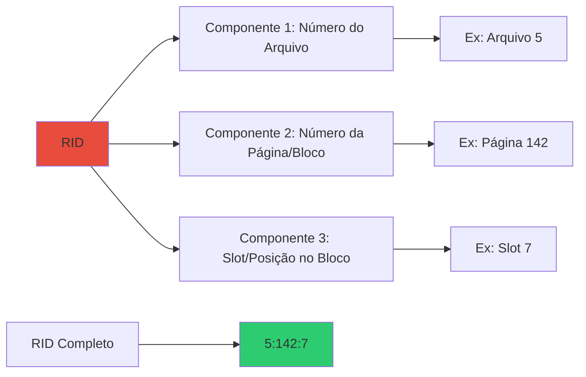

**Estrutura Típica:**

```
RID = (FileID, PageID, SlotNumber)

Exemplo: RID = (1, 42, 7)
- Arquivo 1
- Página/Bloco 42
- 7º registro naquela página
```

**Uso do RID:**

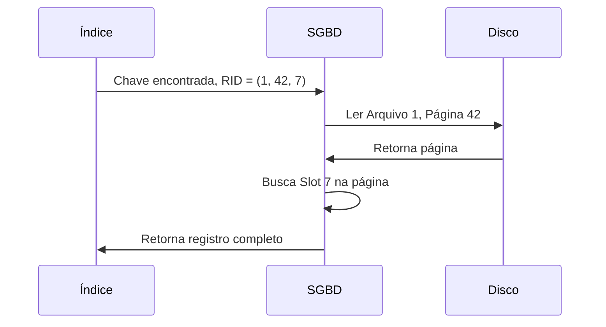

---

#### **Exercício 8:**
**Considere uma relação com registros armazenados em ordem aleatória. Tal relação possui um índice não-agrupado sobre o campo salario. Considere uma consulta buscando os registros com salario > 2000. Usar o índice é sempre a melhor alternativa? Explique.**

**Resposta:**

❌ **NÃO, nem sempre é a melhor alternativa!**

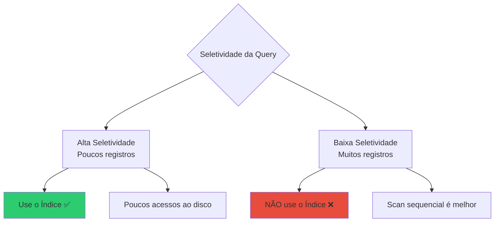

**Cenário 1: Poucos registros (salario > 10000)**

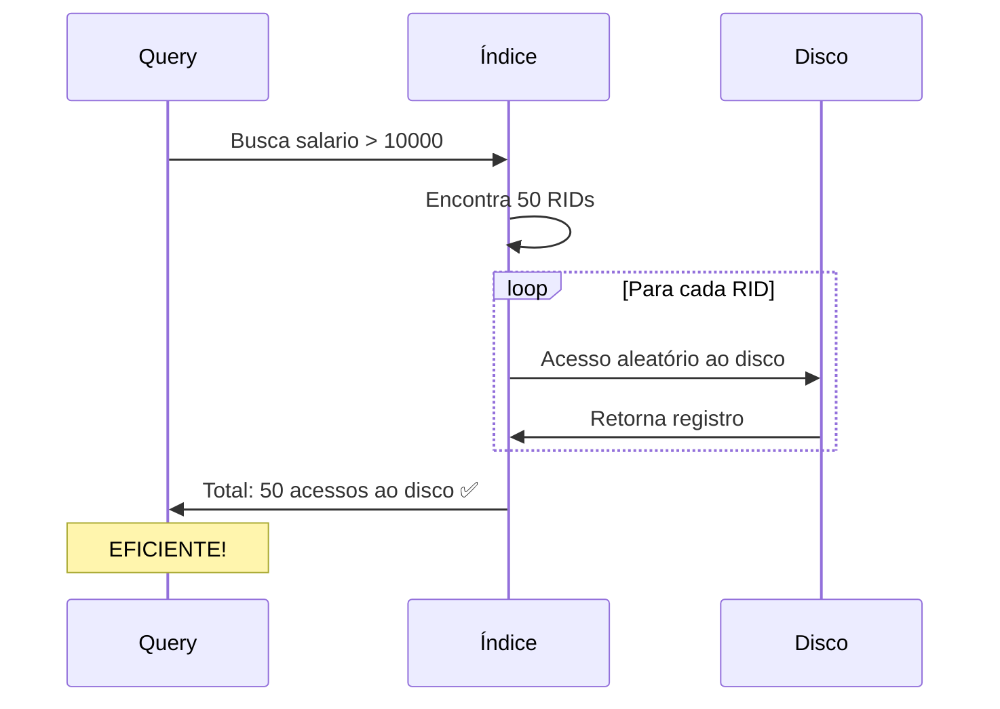

**Cenário 2: Muitos registros (salario > 2000)**

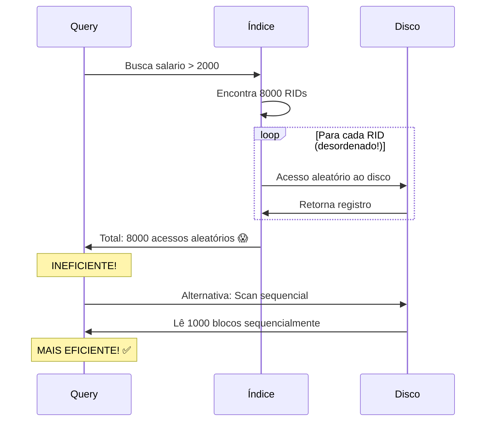

**Explicação:**

| Fator | Usar Índice | Scan Sequencial |
|-------|-------------|-----------------|
| **Seletividade** | Alta (< 10% registros) | Baixa (> 15% registros) |
| **Tipo de Acesso** | Aleatório (lento) | Sequencial (rápido) |
| **Nº de I/Os** | 1 por registro | 1 por bloco (vários registros) |

**Regra Geral:**
- Se a query retorna **< 10-15%** dos registros → Use índice
- Se a query retorna **> 15-20%** dos registros → Scan sequencial

---

#### **Exercício 9:**
**Considere a seguinte relação: `funcionario(id, nome, salario, nascimento)`. Há um índice agrupado sobre `id` e um índice não agrupado sobre `nascimento`.**

**(a) Dê um exemplo de operação que seja beneficiada por causa dos índices.**

**Resposta:**

```sql
-- Operação 1: Busca exata por ID (usa índice agrupado)
SELECT * FROM funcionario WHERE id = 1234;
-- ✅ MUITO RÁPIDO: 3-4 acessos ao disco (altura da árvore)
-- Como os dados estão ordenados por ID, acesso é direto

-- Operação 2: Range query em nascimento (usa índice não agrupado)
SELECT nome, salario 
FROM funcionario 
WHERE nascimento BETWEEN '1990-01-01' AND '1995-12-31';
-- ✅ RÁPIDO: Usa índice para localizar registros

-- Operação 3: Ordenação por ID (usa índice agrupado)
SELECT * FROM funcionario ORDER BY id LIMIT 100;
-- ✅ MUITO RÁPIDO: Dados já estão fisicamente ordenados!
```

```mermaid
sequenceDiagram
    participant Q as Query: WHERE id = 1234
    participant IC as Índice Agrupado (ID)
    participant D as Dados (Ordenados por ID)
    
    Q->>IC: Busca id = 1234
    IC->>IC: Busca binária na árvore
    IC->>D: Acesso direto ao registro
    D->>Q: Retorna registro (3-4 I/Os)
    
    Note over Q: ✅ EFICIENTE!
```

---

**(b) Dê um exemplo de operação que pode ficar mais lenta com o uso do índice.**

**Resposta:**

```sql
-- Operação LENTA: Busca muitos registros via índice não agrupado
SELECT * FROM funcionario 
WHERE nascimento > '1980-01-01';
-- ❌ LENTO: Retorna 80% dos registros
-- Índice não agrupado requer acesso aleatório para cada registro!

-- Melhor alternativa: Scan sequencial
-- SGBD ignora o índice e lê a tabela inteira sequencialmente
```

```mermaid
graph TD
    A[Query retorna 80% dos registros] --> B{Usa índice não agrupado?}
    
    B -->|SIM| C[8000 acessos ALEATÓRIOS]
    B -->|NÃO| D[1000 blocos SEQUENCIAIS]
    
    C --> C1[Custo: 8000 × 10ms = 80s 😱]
    D --> D1[Custo: 1000 × 10ms = 10s ✅]
    
    style C fill:#e74c3c
    style D fill:#2ecc71
```

**Outro Exemplo:**

```sql
-- Operação de Inserção em massa
INSERT INTO funcionario 
SELECT * FROM funcionario_temp;
-- ❌ LENTO: Para cada inserção, precisa atualizar:
--   1. Índice agrupado (ID)
--   2. Índice não agrupado (nascimento)
-- Solução: Dropar índices, inserir, recriar índices
```

---

**(c) Há operações que podem não ser afetadas pelos índices? Quais?**

**Resposta:**

✅ **SIM!** Operações que **não filtram nem ordenam por campos indexados:**

```sql
-- Operação 1: Full table scan sem filtro
SELECT * FROM funcionario;
-- Índices NÃO são usados: precisa ler toda a tabela

-- Operação 2: Filtro em campo não indexado
SELECT * FROM funcionario WHERE salario > 5000;
-- Índice em 'nascimento' NÃO ajuda!
-- Índice em 'id' NÃO ajuda!
-- SGBD faz scan sequencial

-- Operação 3: Funções que invalidam índice
SELECT * FROM funcionario WHERE YEAR(nascimento) = 1990;
-- Função YEAR() impede uso do índice
-- Melhor: WHERE nascimento BETWEEN '1990-01-01' AND '1990-12-31'

-- Operação 4: Agregação sem GROUP BY indexado
SELECT AVG(salario) FROM funcionario;
-- Precisa ler todos os registros

-- Operação 5: UPDATE sem WHERE
UPDATE funcionario SET salario = salario * 1.1;
-- Atualiza TODA a tabela, índices são mantidos mas não aceleram
```

```mermaid
graph TD
    A[Operação] --> B{Usa campo indexado?}
    
    B -->|NÃO| C[Índice NÃO afeta]
    B -->|SIM| D{Tipo de operação?}
    
    D --> D1[SELECT com WHERE/ORDER BY → Ajuda ✅]
    D --> D2[INSERT/UPDATE/DELETE → Atrasa ❌]
    D --> D3[Full scan → Não afeta]
    
    C --> E[Exemplos:<br/>- SELECT *<br/>- WHERE em campo não indexado<br/>- Funções que invalidam índice]
    
    style C fill:#95a5a6
    style D1 fill:#2ecc71
    style D2 fill:#e74c3c
```

---

#### **Exercício 10:**
**Discuta os prós e contras das chaves de pesquisa compostas.**

**Resposta:**

**Chave Composta:** Índice sobre múltiplos campos (ex: índice sobre `(estado, cidade, bairro)`)

```mermaid
mindmap
  root((Chave Composta))
    PRÓS
      Queries específicas
        WHERE estado='SP' AND cidade='Campinas'
      Ordenação múltipla
        ORDER BY estado, cidade
      Cobertura
        Index-only scan
      Unicidade
        UNIQUE estado, placa
    CONTRAS
      Tamanho maior
        Mais espaço em disco
      Ordem importa
        indice estado, cidade não ajuda em cidade='X'
      Manutenção custosa
        UPDATEs mais lentos
      Uso limitado
        Deve seguir ordem dos campos
```

**Exemplo Prático:**

```sql
-- Índice composto: (estado, cidade, bairro)
CREATE INDEX idx_localizacao ON endereco(estado, cidade, bairro);
```

**✅ FUNCIONA (usa o índice):**

```sql
-- 1. Usa todas as colunas
SELECT * FROM endereco 
WHERE estado = 'SP' AND cidade = 'Campinas' AND bairro = 'Centro';

-- 2. Usa prefixo da esquerda
SELECT * FROM endereco 
WHERE estado = 'SP' AND cidade = 'Campinas';

-- 3. Usa apenas primeiro campo
SELECT * FROM endereco 
WHERE estado = 'SP';

-- 4. Ordenação compatível
SELECT * FROM endereco 
ORDER BY estado, cidade, bairro;
```

**❌ NÃO FUNCIONA (não usa o índice):**

```sql
-- 1. Pula primeiro campo
SELECT * FROM endereco 
WHERE cidade = 'Campinas';  -- ❌ índice não é usado

-- 2. Usa apenas último campo
SELECT * FROM endereco 
WHERE bairro = 'Centro';  -- ❌ índice não é usado

-- 3. Ordem diferente
SELECT * FROM endereco 
ORDER BY cidade, estado;  -- ❌ índice não ajuda na ordenação
```

```mermaid
graph TD
    A[Índice: estado, cidade, bairro] --> B{Ordem da Query}
    
    B -->|estado, cidade, bairro| C[✅ USA índice completo]
    B -->|estado, cidade| D[✅ USA prefixo]
    B -->|estado| E[✅ USA primeiro campo]
    B -->|cidade| F[❌ NÃO USA pula estado]
    B -->|bairro| G[❌ NÃO USA pula estado e cidade]
    
    style C fill:#2ecc71
    style D fill:#2ecc71
    style E fill:#2ecc71
    style F fill:#e74c3c
    style G fill:#e74c3c
```

**Tabela Resumo:**

| Aspecto | Vantagem | Desvantagem |
|---------|----------|-------------|
| **Seletividade** | Muito alta em queries específicas | Baixa se usar apenas últimas colunas |
| **Espaço** | - | Ocupa mais espaço que índice simples |
| **Manutenção** | - | INSERT/UPDATE mais lentos |
| **Flexibilidade** | Cobre múltiplas queries | Ordem fixa, não reorganizável |
| **Performance** | Excelente para padrões específicos | Péssima para padrões diferentes |

---

## 2. Armazenamento de Dados e Hierarquia de Memória

### 💾 Hierarquia de Memória em SGBD

**Metáfora do Escritório:**

```mermaid
graph TD
    A[🧠 Registradores CPU] --> |Mais rápido| B[💻 Cache L1/L2/L3]
    B --> C[🎯 Memória RAM]
    C --> D[💿 Disco SSD]
    D --> E[📀 Disco HD]
    E --> |Mais lento| F[📦 Backup/Tape]
    
    A --> A1[< 1 ns<br/>Alguns KB]
    B --> B1[1-10 ns<br/>MB]
    C --> C1[100 ns<br/>GB]
    D --> D1[0.1 ms<br/>TB]
    E --> E1[10 ms<br/>TB]
    F --> F1[segundos<br/>PB]
    
    style A fill:#e74c3c
    style B fill:#e67e22
    style C fill:#f39c12
    style D fill:#2ecc71
    style E fill:#3498db
    style F fill:#9b59b6
```

#### 2.1 Diferenças entre Tipos de Armazenamento

```mermaid
classDiagram
    class ArmazenamentoPrimário {
        +Memória RAM
        +Cache CPU
        +Volátil perde dados ao desligar
        +Muito rápido
        +Caro por GB
    }
    
    class ArmazenamentoSecundário {
        +Disco HD
        +Disco SSD
        +Persistente mantém dados
        +Mais lento que RAM
        +Barato por GB
    }
    
    class ArmazenamentoTerciário {
        +Fitas magnéticas
        +Cloud storage frio
        +Persistente
        +Muito lento
        +Muito barato por GB
    }
    
    ArmazenamentoPrimário <|-- ArmazenamentoSecundário : mais lento
    ArmazenamentoSecundário <|-- ArmazenamentoTerciário : muito mais lento
```

**Comparação Prática:**

| Tipo | Tecnologia | Velocidade | Capacidade | Custo/GB | Persistente? |
|------|------------|------------|------------|----------|--------------|
| **Primário** | RAM | 100 ns | 8-128 GB | $5-10 | ❌ Volátil |
| **Secundário** | SSD | 0.1 ms | 256GB-4TB | $0.10-0.20 | ✅ Persistente |
| **Secundário** | HD | 10 ms | 1-20 TB | $0.02-0.05 | ✅ Persistente |
| **Terciário** | Tape | 1-60 s | 1-50 TB | $0.001-0.01 | ✅ Persistente |

### 🗄️ Por que SGBD usa Disco Amplamente?

```mermaid
mindmap
  root((Por que Disco?))
    Capacidade
      TB de dados
      RAM insuficiente
      Custo proibitivo
    Persistência
      Dados sobrevivem a falhas
      Desligamento seguro
      Durabilidade ACID
    Custo
      $0.02/GB HD
      vs
      $5/GB RAM
      250x mais barato
    Escalabilidade
      Adicionar discos
      Mais barato que RAM
      Hot-swap
```

**Vantagens do Disco:**

1. **Persistência:** Dados não são perdidos ao desligar
2. **Capacidade:** Armazena TB a custo baixo
3. **Durabilidade:** Backups e recovery
4. **Econômico:** 100-250x mais barato que RAM

**Desvantagem:**

- ⚠️ **Muito mais lento:** 10.000-100.000x mais lento que RAM!

**Solução:** SGBD usa hierarquia:
- **RAM** = Buffer/Cache para dados quentes
- **Disco** = Armazenamento principal

```mermaid
sequenceDiagram
    participant A as Aplicação
    participant C as Buffer Manager RAM
    participant D as Disco
    
    A->>C: SELECT * WHERE id = 123
    C->>C: Verifica se está em cache
    alt Dados em cache (cache hit)
        C->>A: Retorna dados (100 ns) ✅
    else Dados não em cache (cache miss)
        C->>D: Lê do disco
        D->>C: Retorna dados (10 ms) ⚠️
        C->>C: Armazena em cache
        C->>A: Retorna dados
    end
```

### 🔧 Gerenciador de Espaço em Disco (GED)

**O GED é como o "zelador" do banco de dados:**

```mermaid
graph TD
    GED[Gerenciador de Espaço em Disco] --> T1[Tarefas Principais]
    
    T1 --> A[Alocar páginas]
    T1 --> B[Desalocar páginas]
    T1 --> C[Rastrear espaço livre]
    T1 --> D[Gerenciar extents]
    T1 --> E[Organizar arquivos]
    
    A --> A1[Quando inserir dados]
    B --> B1[Quando deletar dados]
    C --> C1[Bitmap ou listas livres]
    D --> D1[Grupos de páginas contíguas]
    E --> E1[Heap, ordenado, hash]
    
    style GED fill:#e74c3c
    style A fill:#3498db
    style B fill:#3498db
    style C fill:#3498db
    style D fill:#3498db
    style E fill:#3498db
```

**Estruturas de Dados do GED:**

```mermaid
graph LR
    subgraph "Mapa de Bits Free Space Map"
        MB[Byte 0: 11010010<br/>Byte 1: 00111101<br/>Byte 2: 11111111]
        MB --> MB1[1 = Página Livre<br/>0 = Página Ocupada]
    end
    
    subgraph "Lista Encadeada"
        L1[Página Livre 5] --> L2[Página Livre 12]
        L2 --> L3[Página Livre 27]
        L3 --> L4[NULL]
    end
    
    style MB fill:#feca57
    style L1 fill:#48dbfb
```

### 📦 Mapa de Bits vs Lista Encadeada

```mermaid
graph TD
    A[Estruturas para Espaço Livre] --> B[Mapa de Bits]
    A --> C[Lista Encadeada]
    
    B --> B1[✅ Compacto]
    B --> B2[✅ Acesso aleatório rápido]
    B --> B3[❌ Precisa escanear bits]
    
    C --> C1[✅ Encontra livre rapidamente]
    C --> C2[✅ Fácil adicionar/remover]
    C --> C3[❌ Usa mais espaço ponteiros]
    
    style B fill:#2ecc71
    style C fill:#3498db
```

**Por que Mapa de Bits é melhor?**

1. **Compacto:** 1 bit por página
   - 1 milhão de páginas = 125 KB
2. **Persistência:** Fácil salvar em disco
3. **Busca:** Algoritmos eficientes para encontrar bits livres
4. **Espacialidade:** Páginas próximas têm bits próximos

**Exemplo:**

```
Bitmap (8 páginas):
11010010

Interpretação:
Página 0: Livre (1)
Página 1: Livre (1)
Página 2: Ocupada (0)
Página 3: Livre (1)
Página 4: Ocupada (0)
Página 5: Ocupada (0)
Página 6: Livre (1)
Página 7: Ocupada (0)
```

```mermaid
graph LR
    B[Bitmap: 11010010] --> P0[Página 0: ✅]
    B --> P1[Página 1: ✅]
    B --> P2[Página 2: ❌]
    B --> P3[Página 3: ✅]
    B --> P4[Página 4: ❌]
    B --> P5[Página 5: ❌]
    B --> P6[Página 6: ✅]
    B --> P7[Página 7: ❌]
    
    style P0 fill:#2ecc71
    style P1 fill:#2ecc71
    style P2 fill:#e74c3c
    style P3 fill:#2ecc71
    style P6 fill:#2ecc71
```

### 🔄 Gerenciador de Buffer

**Metáfora:** O Buffer Manager é como uma biblioteca com sala de leitura (RAM) e estoque (Disco).

```mermaid
graph TD
    A[Aplicação] --> B[Gerenciador de Buffer]
    B --> C[Buffer Pool em RAM]
    C --> D[Página 1]
    C --> E[Página 5]
    C --> F[Página 12]
    C --> G[...]
    
    B --> H{Página está no buffer?}
    H -->|SIM| I[Cache Hit ✅<br/>Retorna da RAM]
    H -->|NÃO| J[Cache Miss ❌<br/>Busca no disco]
    
    J --> K[Lê do disco]
    K --> L[Adiciona ao buffer]
    L --> M[Remove página antiga se cheio]
    
    style I fill:#2ecc71
    style J fill:#e74c3c
```

**Informações Mantidas por Página:**

```mermaid
classDiagram
    class FrameDeBuffer {
        +page_id identificador da página
        +pin_count nº de acessos ativos
        +dirty_bit modificada?
        +reference_bit acessada recentemente?
        +data[] conteúdo da página
        +isPinned()
        +setDirty()
    }
```

| Metadado | Função |
|----------|--------|
| **page_id** | Identifica qual página do disco está neste frame |
| **pin_count** | Quantos processos estão usando (não pode remover se > 0) |
| **dirty_bit** | Se modificada, precisa gravar no disco antes de remover |
| **reference_bit** | Usado por algoritmos de substituição (LRU, Clock) |

### 📝 Exercícios - Seção 2

#### **Exercício 1:**
**Considere a hierarquia de memória utilizada pelos SGBD.**

**(a) Quais as diferenças entre armazenamento primário, secundário e terciário? Dê exemplos.**

**Resposta:**

```mermaid
graph TD
    A[Hierarquia de Memória] --> B[Armazenamento Primário]
    A --> C[Armazenamento Secundário]
    A --> D[Armazenamento Terciário]
    
    B --> B1[Volátil perde ao desligar]
    B --> B2[Muito rápido 50-100 ns]
    B --> B3[Pequena capacidade GB]
    B --> B4[Exemplos: RAM, Cache]
    
    C --> C1[Persistente mantém dados]
    C --> C2[Rápido 0.1-10 ms]
    C --> C3[Grande capacidade TB]
    C --> C4[Exemplos: SSD, HD]
    
    D --> D1[Persistente]
    D --> D2[Muito lento segundos/minutos]
    D --> D3[Enorme capacidade PB]
    D --> D4[Exemplos: Fitas, Cloud Archive]
    
    style B fill:#e74c3c
    style C fill:#f39c12
    style D fill:#3498db
```

**Comparação Detalhada:**

| Característica | Primário | Secundário | Terciário |
|----------------|----------|------------|-----------|
| **Volatilidade** | Volátil | Persistente | Persistente |
| **Velocidade** | 100 ns | 0.1-10 ms | 1-60 s |
| **Capacidade** | 8-128 GB | 256GB-20TB | 1-50TB+ |
| **Custo/GB** | $5-10 | $0.02-0.20 | $0.001-0.01 |
| **Acesso** | Direto | Direto | Sequencial |
| **Exemplos** | RAM, Cache L1/L2/L3 | HDD, SSD, NVMe | Tape, Optical, Cloud Glacier |
| **Uso em BD** | Buffer pool, cache | Dados principais, índices | Backups, arquivamento |

**Exemplos Práticos:**

```mermaid
graph LR
    subgraph "Primário Volátil"
        P1[Cache L1: 256 KB]
        P2[Cache L2: 8 MB]
        P3[RAM: 64 GB]
    end
    
    subgraph "Secundário Persistente"
        S1[SSD: 1 TB]
        S2[HD: 10 TB]
    end
    
    subgraph "Terciário Persistente"
        T1[Tape LTO-9: 18 TB]
        T2[AWS Glacier: ∞]
    end
    
    P3 -.buffer.-> S1
    S2 -.backup.-> T1
```

---

**(b) Quais são voláteis e quais são persistentes?**

**Resposta:**

```mermaid
pie title Volatilidade por Tipo
    "Primário Volátil" : 1
    "Secundário Persistente" : 1
    "Terciário Persistente" : 1
```

**VOLÁTEIS (perdem dados ao desligar):**
- ⚡ **Primário:**
  - Registradores da CPU
  - Cache L1, L2, L3
  - Memória RAM
  - Buffer pool do SGBD

**PERSISTENTES (mantêm dados ao desligar):**
- 💾 **Secundário:**
  - Hard Disk (HD)
  - Solid State Drive (SSD)
  - Flash storage
- 📦 **Terciário:**
  - Fitas magnéticas
  - Discos ópticos
  - Cloud storage (S3, Glacier)

```mermaid
graph TD
    A[Memória] --> B{Perde dados ao desligar?}
    
    B -->|SIM| C[VOLÁTIL]
    B -->|NÃO| D[PERSISTENTE]
    
    C --> C1[Primário]
    C --> C2[RAM, Cache]
    
    D --> D1[Secundário]
    D --> D2[Terciário]
    D --> D3[HDD, SSD, Tape]
    
    style C fill:#e74c3c
    style D fill:#2ecc71
```

---

#### **Exercício 2:**
**Por que os discos são usados tão amplamente por SGBD? Quais suas vantagens em relação à memória principal e fitas?**

**Resposta:**

```mermaid
mindmap
  root((Por que Disco?))
    vs RAM
      Persistente
        Sobrevive a desligamento
        Durabilidade ACID
      Capacidade
        TB vs GB
        100-1000x maior
      Custo
        $0.02 GB vs $5 GB
        250x mais barato
      Escalabilidade
        Fácil adicionar
        Hot-swap
    vs Fita
      Acesso Aleatório
        Direto ao bloco
        Fita é sequencial
      Velocidade
        ms vs minutos
        1000x mais rápido
      Disponibilidade
        Sempre online
        Fita offline
      Uso Frequente
        Queries diárias
        Fita para backup
```

**Comparação Detalhada:**

| Aspecto | RAM | **DISCO (MELHOR)** | FITA |
|---------|-----|-------------------|------|
| **Persistência** | ❌ Volátil | ✅ Persistente | ✅ Persistente |
| **Custo/GB** | $5-10 | ✅ $0.02-0.20 | $0.001-0.01 |
| **Capacidade** | 8-128 GB | ✅ 256GB-20TB | 1-50TB+ |
| **Velocidade** | 100 ns | 0.1-10 ms | 1-60 s |
| **Acesso** | Aleatório | ✅ Aleatório | ⚠️ Sequencial |
| **Disponibilidade** | ✅ Online | ✅ Online | ❌ Offline |
| **Uso ideal** | Cache quente | ✅ **BD Principal** | Backups |

**Por que Disco é o Sweet Spot?**

```mermaid
graph TD
    A[Requisitos do SGBD] --> B[Persistência]
    A --> C[Custo Razoável]
    A --> D[Acesso Aleatório]
    A --> E[Grande Capacidade]
    
    B --> F{Disco atende?}
    C --> F
    D --> F
    E --> F
    
    F --> G[✅ SIM!]
    
    G --> H[RAM: Rápida mas cara e volátil]
    G --> I[DISCO: Equilíbrio ideal]
    G --> J[FITA: Lenta e sequencial]
    
    style I fill:#2ecc71
    style H fill:#f39c12
    style J fill:#e74c3c
```

**Vantagens do Disco:**

1. **vs RAM:**
   - ✅ 250x mais barato
   - ✅ Persistente (não perde dados)
   - ✅ 100x maior capacidade
   - ❌ 100.000x mais lento (mas aceitável com cache)

2. **vs Fita:**
   - ✅ 1.000x mais rápido
   - ✅ Acesso aleatório direto
   - ✅ Sempre disponível (online)
   - ❌ 20-50x mais caro (mas vale a pena)

**Arquitetura Típica:**

```mermaid
graph TD
    A[Aplicação] --> B[RAM: Buffer Pool<br/>Cache de Páginas Quentes]
    B --> C[DISCO: Armazenamento Principal<br/>Dados + Índices]
    C --> D[FITA: Backup Frio<br/>Disaster Recovery]
    
    B -.->|Cache miss| C
    C -.->|Backup diário| D
    
    style B fill:#e74c3c
    style C fill:#2ecc71
    style D fill:#3498db
```

---

#### **Exercício 3:**
**Descreva o papel do gerenciador de espaço em disco (GED) nos SGBD.**

**Resposta:**

O **Gerenciador de Espaço em Disco (GED)** é o componente responsável pela gestão física do armazenamento. É como o "zelador" que organiza e mantém o espaço em disco.

```mermaid
graph TD
    GED[Gerenciador de Espaço em Disco] --> T[Responsabilidades]
    
    T --> A[1. Alocar Páginas]
    T --> B[2. Desalocar Páginas]
    T --> C[3. Rastrear Espaço Livre]
    T --> D[4. Gerenciar Extents]
    T --> E[5. Organizar Arquivos]
    T --> F[6. Manutenção]
    
    A --> A1[INSERT INTO table]
    B --> B1[DELETE FROM table]
    C --> C1[Bitmap/Lista Livre]
    D --> D1[Grupos de páginas contíguas]
    E --> E1[Heap/Ordenado/Hash]
    F --> F1[Compactação/Desfragmentação]
    
    style GED fill:#e74c3c
```

**Funções Detalhadas:**

1. **Alocação de Páginas:**
```mermaid
sequenceDiagram
    participant T as Tabela
    participant GED as GED
    participant B as Bitmap
    participant D as Disco
    
    T->>GED: Preciso inserir novo registro
    GED->>B: Buscar página livre
    B->>GED: Página 42 está livre
    GED->>D: Alocar página 42
    D->>GED: Página alocada
    GED->>B: Marcar página 42 como ocupada
    GED->>T: Use página 42
```

2. **Desalocação de Páginas:**
```mermaid
sequenceDiagram
    participant T as Tabela
    participant GED as GED
    participant B as Bitmap
    
    T->>GED: DELETE limpou página 42
    GED->>GED: Página 42 está vazia?
    GED->>B: Marcar página 42 como livre
    B->>GED: Atualizado
```

3. **Rastreamento de Espaço Livre:**

```mermaid
graph LR
    subgraph "Bitmap Estrutura Preferida"
        BM[Bit 0: Página 0<br/>Bit 1: Página 1<br/>...<br/>Bit N: Página N]
        BM --> BM1[1 = Livre<br/>0 = Ocupada]
    end
    
    subgraph "Lista Encadeada Alternativa"
        L1[Página 5] --> L2[Página 12]
        L2 --> L3[Página 27]
    end
    
    style BM fill:#2ecc71
    style L1 fill:#3498db
```

4. **Gerenciamento de Extents:**

**Extent:** Grupo de páginas contíguas (ex: 8 páginas = 1 extent)

```
Vantagem: Reduz fragmentação, melhora I/O sequencial

Exemplo:
- Páginas 0-7: Extent 0
- Páginas 8-15: Extent 1
- Páginas 16-23: Extent 2
```

```mermaid
graph LR
    E0[Extent 0<br/>Páginas 0-7] --> E1[Extent 1<br/>Páginas 8-15]
    E1 --> E2[Extent 2<br/>Páginas 16-23]
    
    E0 --> T1[Tabela A]
    E1 --> T1
    E2 --> T2[Índice sobre A]
    
    style E0 fill:#3498db
    style E1 fill:#3498db
    style E2 fill:#2ecc71
```

5. **Organização de Arquivos:**

```mermaid
graph TD
    GED --> A[Heap Desordenado]
    GED --> B[Sequencial Ordenado]
    GED --> C[Hash]
    GED --> D[Clustered Index]
    
    A --> A1[Inserção: O 1]
    A --> A2[Busca: O n]
    
    B --> B1[Busca: O log n]
    B --> B2[Manutenção custosa]
    
    C --> C1[Busca exata: O 1]
    C --> C2[Sem ordenação]
    
    D --> D1[Dados ordenados por índice]
```

**Estruturas de Dados Usadas pelo GED:**

```mermaid
classDiagram
    class FileHeader {
        +num_pages
        +num_records
        +free_space_pointer
        +first_free_page
        +metadata
    }
    
    class PageHeader {
        +page_id
        +num_records
        +free_space_offset
        +record_directory[]
        +checksum
    }
    
    class FreeSpaceMap {
        +bitmap[]
        +num_free_pages
        +getFreeadPage()
        +markFree()
        +markOccupied()
    }
    
    FileHeader *-- PageHeader
    FileHeader *-- FreeSpaceMap
```

---

#### **Exercício 4:**
**No que diz respeito à informação sobre blocos livres, informe por que mapa de bits é melhor do que lista.**

**Resposta:**

```mermaid
graph TD
    A[Estruturas para Espaço Livre] --> B[Mapa de Bits]
    A --> C[Lista Encadeada]
    
    B --> B1[✅ Compacto: 1 bit/página]
    B --> B2[✅ Acesso aleatório rápido]
    B --> B3[✅ Localidade espacial]
    B --> B4[✅ Fácil persistir em disco]
    B --> B5[✅ Busca paralela possível]
    B --> B6[❌ Precisa escanear bits]
    
    C --> C1[✅ Encontra livre em O 1]
    C --> C2[✅ Fácil inserir/remover]
    C --> C3[❌ Usa mais espaço ponteiros]
    C --> C4[❌ Fragmentado em disco]
    C --> C5[❌ Sem localidade espacial]
    
    style B fill:#2ecc71
    style C fill:#e74c3c
```

**Comparação Detalhada:**

| Aspecto | Mapa de Bits ✅ | Lista Encadeada |
|---------|----------------|-----------------|
| **Espaço** | 1 bit por página<br/>1M páginas = 125 KB | 8-16 bytes por página livre<br/>1M páginas = 8-16 MB |
| **Localidade** | Páginas próximas = bits próximos | Páginas espalhadas |
| **Persistência** | Contíguo, fácil salvar | Fragmentado, difícil salvar |
| **Busca** | O(n/64) com operações de bit | O(1) para primeira livre |
| **Paralelismo** | Possível (múltiplas palavras) | Difícil (acesso sequencial) |
| **Fragmentação** | Baixa | Alta |

**Exemplo Prático:**

**Mapa de Bits:**
```
1 milhão de páginas de 4KB cada = 4GB de dados

Bitmap necessário:
- 1 bit por página
- 1.000.000 bits ÷ 8 = 125.000 bytes = 125 KB

Overhead: 125KB / 4GB = 0.003% ✅ MÍNIMO!
```

**Lista Encadeada:**
```
1 milhão de páginas

Se 50% estão livres = 500.000 nós na lista
- Cada nó: 8 bytes (page_id) + 8 bytes (ponteiro) = 16 bytes
- Total: 500.000 × 16 = 8 MB

Overhead: 8MB / 4GB = 0.2% ❌ 64x maior!
```

```mermaid
graph TD
    A[1 milhão de páginas] --> B[Mapa de Bits]
    A --> C[Lista Encadeada]
    
    B --> B1[125 KB<br/>0.003% overhead ✅]
    C --> C1[8 MB se 50% livre<br/>0.2% overhead ❌]
    
    B1 --> D[64x menor!]
    
    style B1 fill:#2ecc71
    style C1 fill:#e74c3c
    style D fill:#feca57
```

**Vantagens Adicionais do Bitmap:**

1. **Localidade Espacial:**
```mermaid
graph LR
    BM[Bitmap: bits adjacentes] --> P1[Página 100]
    BM --> P2[Página 101]
    BM --> P3[Página 102]
    
    L[Lista: nós espalhados] --> LP1[Página 5]
    L --> LP2[Página 237]
    L --> LP3[Página 894]
    
    P1 -.melhor para I/O sequencial.-> P2
    
    style BM fill:#2ecc71
    style L fill:#e74c3c
```

```c
// Verificar 64 páginas de uma vez
uint64_t word = bitmap[i];
if (word != 0) {
    // Há páginas livres neste grupo
    int bit_position = __builtin_ctzll(word); // Count trailing zeros
    // Encontrou página livre em O(1)!
}
```

3. **Persistência Simples:**
```mermaid
sequenceDiagram
    participant GED
    participant Bitmap
    participant Disco
    
    GED->>Bitmap: Salvar estado
    Bitmap->>Disco: Escreve 125 KB contíguos
    Disco->>GED: OK (1 operação I/O) ✅
    
    Note over GED: Lista encadeada precisaria<br/>múltiplos I/Os para nós espalhados ❌
```

4. **Busca Paralela:**
```mermaid
graph TD
    BM[Bitmap dividido] --> T1[Thread 1: Bits 0-999]
    BM --> T2[Thread 2: Bits 1000-1999]
    BM --> T3[Thread 3: Bits 2000-2999]
    BM --> T4[Thread 4: Bits 3000-3999]
    
    T1 --> R[Merge resultados]
    T2 --> R
    T3 --> R
    T4 --> R
    
    style BM fill:#2ecc71
```

**Quando Lista pode ser melhor:**
- ⚠️ Se **muito poucas páginas livres** (< 0.1%)
- Mas SGBD normalmente mantém >= 10% livre

**Conclusão:**
```mermaid
graph LR
    A[Mapa de Bits] --> B[✅ MELHOR na maioria dos casos]
    B --> C[Compacto]
    B --> D[Rápido]
    B --> E[Eficiente]
    
    style A fill:#2ecc71
    style B fill:#2ecc71
```

---

#### **Exercício 5:**
**Explique resumidamente como o gerenciador de buffer gerencia a alocação de páginas. Quais informações sobre cada página são mantidas?**

**Resposta:**

O **Gerenciador de Buffer** é responsável por manter páginas do disco em memória RAM (buffer pool) e gerenciar sua substituição.

```mermaid
graph TD
    A[Gerenciador de Buffer] --> B[Buffer Pool em RAM]
    B --> C[Frames de Página]
    
    C --> D[Frame 1]
    C --> E[Frame 2]
    C --> F[Frame 3]
    C --> G[...]
    
    A --> H[Tabela de Páginas]
    H --> I[Mapeia page_id → frame]
    
    A --> J[Política de Substituição]
    J --> K[LRU, Clock, etc]
    
    style A fill:#e74c3c
    style B fill:#feca57
    style H fill:#3498db
```

**Como Funciona:**

```mermaid
sequenceDiagram
    participant App as Aplicação
    participant BM as Buffer Manager
    participant PT as Tabela de Páginas
    participant BP as Buffer Pool RAM
    participant D as Disco
    
    App->>BM: Solicita página 42
    BM->>PT: Página 42 está no buffer?
    
    alt Cache Hit (página em memória)
        PT->>BM: Sim, está no frame 5
        BM->>BP: Acessa frame 5
        BP->>BM: Retorna dados
        BM->>BM: Incrementa pin_count
        BM->>BM: Atualiza reference_bit
        BM->>App: Dados (100 ns) ✅
    else Cache Miss (página não em memória)
        PT->>BM: Não está no buffer
        BM->>BM: Encontra frame vítima
        
        alt Frame vítima está dirty
            BM->>D: Grava frame vítima (write-back)
        end
        
        BM->>D: Lê página 42 do disco
        D->>BM: Retorna dados (10 ms)
        BM->>BP: Carrega no frame escolhido
        BM->>PT: Atualiza mapeamento
        BM->>App: Dados ⚠️
    end
```

**Informações Mantidas por Página (Frame):**

```mermaid
classDiagram
    class FrameDeBuffer {
        +int page_id
        +int pin_count
        +bool dirty_bit
        +bool reference_bit
        +timestamp last_access
        +byte[] data
        +Lock lock
        +isPinned()
        +setDirty()
        +incrementPin()
        +decrementPin()
    }
```

| Campo | Descrição | Uso |
|-------|-----------|-----|
| **page_id** | ID da página do disco | Identifica qual página está neste frame |
| **pin_count** | Contador de uso ativo | Se > 0, não pode ser removida (em uso) |
| **dirty_bit** | Página modificada? | Se TRUE, precisa write-back antes de remover |
| **reference_bit** | Acessada recentemente? | Usado por algoritmos de substituição (Clock) |
| **last_access** | Timestamp do último acesso | Usado por LRU |
| **data[]** | Conteúdo da página (4KB-16KB) | Dados reais |
| **lock** | Controle de concorrência | Garante acesso seguro |

**Exemplo Visual:**

```mermaid
graph TD
    subgraph "Buffer Pool"
        F1[Frame 0<br/>page_id: 42<br/>pin_count: 2<br/>dirty: true<br/>ref: true]
        F2[Frame 1<br/>page_id: 17<br/>pin_count: 0<br/>dirty: false<br/>ref: true]
        F3[Frame 2<br/>page_id: 93<br/>pin_count: 1<br/>dirty: true<br/>ref: false]
        F4[Frame 3<br/>page_id: NULL<br/>pin_count: 0<br/>dirty: false<br/>ref: false]
    end
    
    F1 --> F1A[✅ Em uso pin > 0]
    F2 --> F2A[⚠️ Pode substituir]
    F3 --> F3A[✅ Em uso]
    F4 --> F4A[✅ Livre]
    
    style F1 fill:#e74c3c
    style F2 fill:#feca57
    style F3 fill:#e74c3c
    style F4 fill:#2ecc71
```

**Algoritmo de Alocação (Simplificado):**

```python
def alocar_pagina(page_id):
    # 1. Verifica se já está no buffer (cache hit)
    if page_id in buffer_pool:
        frame = buffer_pool[page_id]
        frame.pin_count += 1
        frame.reference_bit = True
        return frame
    
    # 2. Cache miss - precisa trazer do disco
    frame = encontrar_frame_livre()
    
    if frame is None:
        # 3. Buffer cheio - escolher vítima
        frame = escolher_vitima()
        
        # 4. Se vítima está dirty, gravar primeiro
        if frame.dirty_bit:
            escrever_no_disco(frame.page_id, frame.data)
        
        # 5. Remover vítima do buffer
        remover_do_buffer(frame.page_id)
    
    # 6. Ler nova página do disco
    frame.data = ler_do_disco(page_id)
    frame.page_id = page_id
    frame.pin_count = 1
    frame.dirty_bit = False
    frame.reference_bit = True
    
    # 7. Adicionar ao buffer
    buffer_pool[page_id] = frame
    
    return frame
```

**Políticas de Substituição:**

```mermaid
graph TD
    PS[Políticas de Substituição] --> LRU[LRU Least Recently Used]
    PS --> Clock[Clock Second Chance]
    PS --> MRU[MRU Most Recently Used]
    
    LRU --> LRU1[Remove a mais antiga]
    LRU --> LRU2[Requer ordenação por timestamp]
    LRU --> LRU3[Overhead de manutenção]
    
    Clock --> C1[Algoritmo circular]
    Clock --> C2[Usa reference_bit]
    Clock --> C3[Eficiente O 1]
    
    MRU --> M1[Remove a mais recente]
    MRU --> M2[Para scans sequenciais]
    
    style Clock fill:#2ecc71
    style LRU fill:#3498db
```

**Exemplo de Clock (Second Chance):**

```mermaid
graph LR
    A[Frame 0<br/>ref: 1] --> B[Frame 1<br/>ref: 0]
    B --> C[Frame 2<br/>ref: 1]
    C --> D[Frame 3<br/>ref: 1]
    D --> A
    
    P[Ponteiro Clock] -.-> B
    
    B --> E[✅ Escolhido<br/>ref=0, pin=0]
    
    style B fill:#e74c3c
    style E fill:#2ecc71
```

**Fluxo Completo:**

```mermaid
stateDiagram-v2
    [*] --> Solicita: App solicita página
    Solicita --> VerificaBuffer: Consulta tabela de páginas
    
    VerificaBuffer --> CacheHit: Página no buffer?
    VerificaBuffer --> CacheMiss: Página não no buffer
    
    CacheHit --> IncrementaPin: Incrementa pin_count
    IncrementaPin --> AtualizaRef: reference_bit = true
    AtualizaRef --> RetornaDados: Retorna frame
    
    CacheMiss --> VerificaFrameLivre: Busca frame livre
    VerificaFrameLivre --> TemLivre: Frame livre?
    VerificaFrameLivre --> NaoTemLivre: Buffer cheio
    
    NaoTemLivre --> EscolheVitima: Algoritmo de substituição
    EscolheVitima --> VerificaDirty: Vítima dirty?
    VerificaDirty --> WriteBack: dirty_bit = true
    VerificaDirty --> LeDiscoy: dirty_bit = false
    WriteBack --> EscreveVitima: Grava no disco
    EscreveVitima --> LeDiscoy
    
    TemLivre --> LeDisco
    LeDiscoy --> LeDisco: Lê página do disco
    LeDisco --> CarregaFrame: Carrega no frame
    CarregaFrame --> AtualizaMetadata: Atualiza metadados
    AtualizaMetadata --> RetornaDados
    
    RetornaDados --> [*]
```

---

#### **Exercício 6:**
**Descreva como funcionam as seguintes políticas de substituição:**

**(a) Last Recently Used (LRU)**

**Resposta:**

**LRU (Least Recently Used):** Remove a página que **não foi acessada há mais tempo**.

**Metáfora:** É como organizar livros em uma estante: os livros que você não lê há muito tempo vão para o fundo.

```mermaid
graph TD
    A[LRU - Least Recently Used] --> B[Conceito]
    B --> B1[Remove página há mais tempo sem uso]
    B --> B2[Baseado em timestamp de acesso]
    
    A --> C[Implementação]
    C --> C1[Lista duplamente encadeada]
    C --> C2[Mais recente na frente]
    C --> C3[Mais antiga no final]
    
    A --> D[Complexidade]
    D --> D1[Acesso: O 1]
    D --> D2[Atualização: O 1]
    D --> D3[Remoção: O 1]
    
    style A fill:#e74c3c
```

**Estrutura de Dados:**

```mermaid
graph LR
    Head[HEAD] --> P1[Página 42<br/>timestamp: 1000]
    P1 --> P2[Página 17<br/>timestamp: 950]
    P2 --> P3[Página 93<br/>timestamp: 800]
    P3 --> P4[Página 5<br/>timestamp: 600]
    P4 --> Tail[TAIL]
    
    P1 -.->|mais recente| Head
    P4 -.->|mais antiga, será removida| Tail
    
    style P1 fill:#2ecc71
    style P4 fill:#e74c3c
```

**Algoritmo:**

```python
class LRU:
    def __init__(self, capacity):
        self.capacity = capacity
        self.cache = {}  # page_id -> Node
        self.head = Node()  # Dummy head
        self.tail = Node()  # Dummy tail
        self.head.next = self.tail
        self.tail.prev = self.head
    
    def access_page(self, page_id):
        if page_id in self.cache:
            # Move para frente (mais recente)
            node = self.cache[page_id]
            self._remove(node)
            self._add_to_front(node)
            return node.data
        else:
            # Cache miss
            if len(self.cache) >= self.capacity:
                # Remove do final (menos recente)
                victim = self.tail.prev
                self._remove(victim)
                del self.cache[victim.page_id]
            
            # Adiciona novo na frente
            new_node = Node(page_id)
            self._add_to_front(new_node)
            self.cache[page_id] = new_node
            return new_node.data
    
    def _add_to_front(self, node):
        node.next = self.head.next
        node.prev = self.head
        self.head.next.prev = node
        self.head.next = node
    
    def _remove(self, node):
        node.prev.next = node.next
        node.next.prev = node.prev
```

**Exemplo de Execução:**

```mermaid
sequenceDiagram
    participant A as Acessos
    participant L as LRU (cap=3)
    
    A->>L: Acessa página 1
    Note over L: [1]
    
    A->>L: Acessa página 2
    Note over L: [2, 1]
    
    A->>L: Acessa página 3
    Note over L: [3, 2, 1]
    
    A->>L: Acessa página 2 (já existe)
    Note over L: [2, 3, 1] (2 vai pra frente)
    
    A->>L: Acessa página 4 (cache cheio!)
    Note over L: [4, 2, 3] (remove 1 - LRU)
    
    A->>L: Acessa página 5
    Note over L: [5, 4, 2] (remove 3 - LRU)
```

**Vantagens e Desvantagens:**

```mermaid
graph TD
    LRU[LRU] --> V[Vantagens]
    LRU --> D[Desvantagens]
    
    V --> V1[✅ Boa taxa de hit]
    V --> V2[✅ Intuitivo]
    V --> V3[✅ Funciona bem na prática]
    
    D --> D1[❌ Overhead de manutenção]
    D --> D2[❌ Precisa atualizar a cada acesso]
    D --> D3[❌ Ruim para scans sequenciais]
    
    style V1 fill:#2ecc71
    style D1 fill:#e74c3c
```

---

**(b) Relógio (Clock)**

**Resposta:**

**Clock (Second Chance):** Aproximação eficiente do LRU usando um ponteiro circular e bit de referência.

**Metáfora:** É como um relógio que gira dando "segunda chance" para páginas que foram usadas recentemente.

```mermaid
graph TD
    C[Clock Algorithm] --> P[Princípio]
    P --> P1[Ponteiro circular]
    P --> P2[Bit de referência por página]
    P --> P3[Segunda chance]
    
    C --> A[Algoritmo]
    A --> A1[Gira ponteiro no sentido horário]
    A --> A2[Se ref=1: muda para 0, continua]
    A --> A3[Se ref=0: escolhe como vítima]
    
    style C fill:#9b59b6
```

**Estrutura Visual:**

```mermaid
graph TD
    subgraph "Buffer Pool Circular"
        F0[Frame 0<br/>page: 10<br/>ref: 1<br/>pin: 0]
        F1[Frame 1<br/>page: 20<br/>ref: 0<br/>pin: 0]
        F2[Frame 2<br/>page: 30<br/>ref: 1<br/>pin: 2]
        F3[Frame 3<br/>page: 40<br/>ref: 1<br/>pin: 0]
    end
    
    F0 --> F1
    F1 --> F2
    F2 --> F3
    F3 --> F0
    
    P[Ponteiro Clock] -.-> F1
    
    style F1 fill:#e74c3c
    style P fill:#feca57
```

**Algoritmo Detalhado:**

```python
class ClockAlgorithm:
    def __init__(self, num_frames):
        self.frames = [Frame() for _ in range(num_frames)]
        self.clock_hand = 0
    
    def encontrar_vitima(self):
        while True:
            frame = self.frames[self.clock_hand]
            
            # Não pode remover se está pinned
            if frame.pin_count > 0:
                self.clock_hand = (self.clock_hand + 1) % len(self.frames)
                continue
            
            # Verifica bit de referência
            if frame.reference_bit == 1:
                # Segunda chance: limpa bit e continua
                frame.reference_bit = 0
                self.clock_hand = (self.clock_hand + 1) % len(self.frames)
            else:
                # reference_bit == 0: VÍTIMA ENCONTRADA!
                victim = self.clock_hand
                self.clock_hand = (self.clock_hand + 1) % len(self.frames)
                return victim
    
    def access_page(self, page_id):
        # Ao acessar, marca reference_bit = 1
        frame = self.find_frame(page_id)
        frame.reference_bit = 1
```

**Exemplo de Execução (Passo a Passo):**

```mermaid
sequenceDiagram
    participant P as Ponteiro
    participant F0 as Frame 0 ref=1
    participant F1 as Frame 1 ref=0
    participant F2 as Frame 2 ref=1
    participant F3 as Frame 3 ref=1
    
    Note over P: Procura vítima
    P->>F0: Verifica Frame 0
    F0->>P: ref=1, pin=0
    P->>F0: Dá segunda chance: ref=0
    
    P->>F1: Verifica Frame 1
    F1->>P: ref=0, pin=0
    P->>F1: VÍTIMA! ✅
    
    Note over F1: Frame 1 será substituído
```

**Visualização Completa:**

```mermaid
stateDiagram-v2
    [*] --> Inicio: Buscar vítima
    Inicio --> VerificaFrame: Aponta para frame atual
    
    VerificaFrame --> Pinned: pin_count > 0?
    Pinned --> ProximoFrame: SIM, pula
    Pinned --> VerificaRef: NÃO
    
    VerificaRef --> SegundaChance: ref = 1?
    VerificaRef --> Vitima: ref = 0
    
    SegundaChance --> LimpaBit: ref = 0
    LimpaBit --> ProximoFrame
    
    ProximoFrame --> VerificaFrame: Avança ponteiro
    
    Vitima --> [*]: Retorna frame
```

**Comparação Clock vs LRU:**

| Aspecto | Clock | LRU |
|---------|-------|-----|
| **Complexidade** | O(n) pior caso | O(1) |
| **Overhead** | Muito baixo | Alto (atualiza lista) |
| **Precisão** | Aproximação | Exato |
| **Performance** | ✅ Melhor | Bom |
| **Memória Extra** | 1 bit por frame | Ponteiros + timestamps |
| **Uso em SGBD** | ✅ Preferido | Menos comum |

**Variação: Enhanced Clock (4 classes):**

```mermaid
graph TD
    EC[Enhanced Clock] --> C0[Classe 0: ref=0, dirty=0]
    EC --> C1[Classe 1: ref=0, dirty=1]
    EC --> C2[Classe 2: ref=1, dirty=0]
    EC --> C3[Classe 3: ref=1, dirty=1]
    
    C0 --> P0[Melhor vítima ✅]
    C1 --> P1[Segunda melhor]
    C2 --> P2[Terceira melhor]
    C3 --> P3[Pior vítima]
    
    style C0 fill:#2ecc71
    style C3 fill:#e74c3c
```

**Prioridade de Substituição:**
1. **ref=0, dirty=0:** Não usada e não modificada (ideal!)
2. **ref=0, dirty=1:** Não usada mas modificada (requer write-back)
3. **ref=1, dirty=0:** Usada mas não modificada
4. **ref=1, dirty=1:** Usada e modificada (pior opção)

---

#### **Exercício 7:**
**Sobre os arquivos de registros, faça um comparativo entre a implementação de lista encadeada e a implementação de diretório de páginas.**

**Resposta:**

```mermaid
graph TD
    A[Organização de Registros] --> B[Lista Encadeada]
    A --> C[Diretório de Páginas]
    
    B --> B1[Páginas linkadas]
    B --> B2[Cada página aponta próxima]
    B --> B3[Acesso sequencial]
    
    C --> C1[Índice central]
    C --> C2[Array de ponteiros]
    C --> C3[Acesso direto]
    
    style B fill:#3498db
    style C fill:#2ecc71
```

**Lista Encadeada:**

```mermaid
graph LR
    H[Header] --> P1[Página 1<br/>Dados<br/>Next: P2]
    P1 --> P2[Página 2<br/>Dados<br/>Next: P3]
    P2 --> P3[Página 3<br/>Dados<br/>Next: NULL]
    
    style H fill:#e74c3c
    style P1 fill:#3498db
    style P2 fill:#3498db
    style P3 fill:#3498db
```

**Diretório de Páginas:**

```mermaid
graph TD
    D[Diretório Central] --> D1[Slot 0: → Página 5]
    D --> D2[Slot 1: → Página 12]
    D --> D3[Slot 2: → Página 3]
    D --> D4[Slot 3: → Página 18]
    
    D1 --> P5[Página 5<br/>Dados]
    D2 --> P12[Página 12<br/>Dados]
    D3 --> P3[Página 3<br/>Dados]
    D4 --> P18[Página 18<br/>Dados]
    
    style D fill:#e74c3c
    style P5 fill:#2ecc71
    style P12 fill:#2ecc71
    style P3 fill:#2ecc71
    style P18 fill:#2ecc71
```

**Comparação Detalhada:**

| Aspecto | Lista Encadeada | Diretório de Páginas ✅ |
|---------|----------------|------------------------|
| **Acesso à página N** | O(N) sequencial 😱 | O(1) direto ✅ |
| **Inserir página** | O(1) no final | O(1) atualiza slot |
| **Remover página** | O(N) buscar anterior | O(1) limpa slot |
| **Espaço overhead** | 8 bytes por página | Array pequeno |
| **Fragmentação** | Páginas podem estar espalhadas | Controlada |
| **Scan sequencial** | Segue ponteiros | Itera diretório |
| **Acesso aleatório** | ❌ Muito lento | ✅ Rápido |
| **Manutenção** | Simples | Requer resize |

**Exemplo Prático:**

**Cenário:** Arquivo com 10.000 páginas

**Lista Encadeada:**
```
Buscar página 5.000:
- Precisa seguir 5.000 ponteiros
- Tempo: 5.000 × 10ms = 50 segundos ❌

Inserir no final:
- Segue até última página
- Tempo: 10.000 × 10ms = 100 segundos ❌
```

**Diretório:**
```
Buscar página 5.000:
- Acessa diretório[5000]
- Tempo: 1 × 10ms = 10ms ✅

Inserir no final:
- diretório[10000] = nova_página
- Tempo: 0ms (memória) ✅
```

**Estruturas de Dados:**

```mermaid
classDiagram
    class ListaEncadeada {
        +Page* first_page
        +Page* last_page
        +int num_pages
        +getPage(n) O n
        +insertPage() O n
        +deletePage() O n
    }
    
    class PageLinked {
        +page_id
        +data[]
        +Page* next
    }
    
    class DiretorioPaginas {
        +PagePointer[] directory
        +int capacity
        +int num_pages
        +getPage(n) O 1
        +insertPage() O 1
        +deletePage() O 1
        +resize()
    }
    
    class PageDirect {
        +page_id
        +data[]
    }
    
    ListaEncadeada *-- PageLinked
    DiretorioPaginas *-- PageDirect
```

**Operações Visuais:**

**1. Buscar Página 3:**

```mermaid
sequenceDiagram
    participant A as Aplicação
    participant L as Lista Encadeada
    participant D as Diretório
    
    A->>L: getPage(3)
    L->>L: Segue: P0→P1→P2→P3
    L->>A: Retorna P3 (4 acessos) ❌
    
    A->>D: getPage(3)
    D->>D: Acessa directory[3]
    D->>A: Retorna P3 (1 acesso) ✅
```

**2. Inserir Nova Página:**

```mermaid
graph TD
    subgraph "Lista: Inserir no Final"
        L1[Percorre até o final] --> L2[O N ]
        L2 --> L3[Atualiza ponteiro]
    end
    
    subgraph "Diretório: Inserir"
        D1[Verifica capacidade] --> D2[directory.append]
        D2 --> D3[O 1 ]
    end
    
    style L2 fill:#e74c3c
    style D3 fill:#2ecc71
```

**3. Remover Página do Meio:**

```mermaid
sequenceDiagram
    participant L as Lista
    participant D as Diretório
    
    Note over L: Remover Página 5
    L->>L: Busca página 4 (O n)
    L->>L: Busca página 6
    L->>L: page4.next = page6
    Note over L: Total: O n ❌
    
    Note over D: Remover Página 5
    D->>D: directory[5] = NULL
    Note over D: Total: O 1 ✅
```

**Vantagens e Desvantagens:**

```mermaid
mindmap
  root((Lista Encadeada))
    Vantagens
      Simples implementar
      Sem limite tamanho
      Crescimento dinâmico
    Desvantagens
      Acesso sequencial O n
      Ineficiente para grandes arquivos
      Sem acesso aleatório
      
  root2((Diretório))
    Vantagens
      Acesso direto O 1
      Eficiente acesso aleatório
      Melhor para grandes arquivos
      Operações rápidas
    Desvantagens
      Precisa resize
      Overhead de array
      Mais complexo
```

**Uso Recomendado:**

```mermaid
flowchart TD
    Start{Tamanho do Arquivo?}
    
    Start -->|< 100 páginas| Small[Pequeno]
    Start -->|> 100 páginas| Large[Grande]
    
    Small --> Q1{Acesso aleatório?}
    Q1 -->|NÃO| UseList[Lista Encadeada OK]
    Q1 -->|SIM| UseDir1[Diretório Melhor]
    
    Large --> UseDir2[✅ Diretório OBRIGATÓRIO]
    
    style UseDir1 fill:#2ecc71
    style UseDir2 fill:#2ecc71
    style UseList fill:#3498db
```

**Implementação Híbrida (PostgreSQL):**

Alguns SGBD usam **diretório com blocos de páginas encadeadas:**

```mermaid
graph TD
    D[Diretório] --> E1[Extent 1: P0→P1→P2→P3]
    D --> E2[Extent 2: P4→P5→P6→P7]
    D --> E3[Extent 3: P8→P9→P10→P11]
    
    style D fill:#e74c3c
    style E1 fill:#3498db
    style E2 fill:#3498db
    style E3 fill:#3498db
```

**Benefícios:**
- ✅ Acesso direto a extents (O(1))
- ✅ Scan sequencial rápido dentro do extent
- ✅ Melhor localidade de dados

**Conclusão:**

```mermaid
graph LR
    A[SGBD Modernos] --> B[✅ Usam Diretório]
    B --> C[Acesso O 1 ]
    B --> D[Melhor performance]
    B --> E[Escalável]
    
    style A fill:#2ecc71
    style B fill:#2ecc71
```

---

#### **Exercício 8:**
**Resolva as seguintes questões sobre RAID.**

**Antes de responder, vamos expandir o conteúdo sobre RAID:**

### 💽 RAID (Redundant Array of Independent Disks)

**Metáfora:** Imagine que você tem vários HD's trabalhando em equipe como músicos em uma orquestra:
- **RAID 0:** Cada músico toca uma nota diferente (rápido, mas se um falhar, a música para)
- **RAID 1:** Dois músicos tocam a mesma nota (redundante, seguro)
- **RAID 5:** Músicos compartilham responsabilidades (equilíbrio)

```mermaid
mindmap
  root((RAID))
    Objetivos
      Performance
        Paralelismo
        Striping
      Confiabilidade
        Redundância
        Recuperação
      Capacidade
        Agregar discos
    Níveis
      RAID 0
      RAID 1
      RAID 5
      RAID 6
      RAID 10
```

#### **RAID 0 (Striping)**

**Conceito:** Divide dados em blocos e distribui entre discos.

```mermaid
graph LR
    D[Dados: ABCDEFGH] --> S[Striping]
    S --> D1[Disco 1: A, C, E, G]
    S --> D2[Disco 2: B, D, F, H]
    
    style D fill:#e74c3c
    style D1 fill:#3498db
    style D2 fill:#3498db
```

**Características:**
- ✅ **Performance:** 2x mais rápido (leitura e escrita paralelas)
- ❌ **Confiabilidade:** 0% (se 1 disco falhar, perde tudo)
- 📊 **Capacidade:** 100% (todos os discos)

```mermaid
graph TD
    R0[RAID 0] --> P[Performance]
    P --> P1[Leitura: 2x]
    P --> P2[Escrita: 2x]
    
    R0 --> C[Confiabilidade]
    C --> C1[❌ ZERO]
    C --> C2[1 falha = perda total]
    
    R0 --> Cap[Capacidade]
    Cap --> Cap1[N × tamanho_disco]
    
    style C1 fill:#e74c3c
    style P1 fill:#2ecc71
```

---

**(a) Como o RAID 0 (striping) melhora o desempenho do sistema? E quanto à confiabilidade?**

**Resposta:**

**Desempenho:**

```mermaid
sequenceDiagram
    participant A as Aplicação
    participant R as RAID 0 Controller
    participant D1 as Disco 1
    participant D2 as Disco 2
    
    A->>R: Escrever arquivo 2MB
    
    par Escrita Paralela
        R->>D1: Escreve blocos ímpares 1MB
        R->>D2: Escreve blocos pares 1MB
    end
    
    D1->>R: OK (10ms)
    D2->>R: OK (10ms)
    R->>A: Concluído 10ms total
    
    Note over A: SEM RAID: 20ms<br/>COM RAID 0: 10ms<br/>✅ 2x mais rápido!
```

**Melhoria de Desempenho:**

1. **Escrita Paralela:**
```
SEM RAID:
- Arquivo 100 MB
- 1 disco a 100 MB/s
- Tempo: 1 segundo

COM RAID 0 (2 discos):
- Arquivo 100 MB
- 50 MB por disco, paralelo
- Tempo: 0.5 segundos ✅ 2x
```

2. **Leitura Paralela:**
```
SEM RAID:
- Ler 100 MB sequencialmente
- Tempo: 1 segundo

COM RAID 0 (2 discos):
- Ler 50 MB de cada disco paralelo
- Tempo: 0.5 segundos ✅ 2x
```

**Confiabilidade:**

```mermaid
graph TD
    A[RAID 0 com 2 discos] --> B{Um disco falha?}
    
    B -->|SIM| C[❌ PERDA TOTAL]
    B -->|NÃO| D[Sistema funciona]
    
    C --> E[Nenhuma redundância]
    C --> F[Não pode recuperar]
    
    style C fill:#e74c3c
    style E fill:#e74c3c
    style F fill:#e74c3c
```

**Cálculo de Confiabilidade:**

```
Se 1 disco tem 1% chance de falha por ano:

1 disco: 1% chance de perda
2 discos RAID 0: 1.99% chance de perda
  (falha se QUALQUER um falhar)

➡️ RAID 0 é MENOS confiável que 1 disco!
```

```mermaid
graph LR
    A[1 Disco] --> A1[Falha: 1%]
    B[RAID 0 2 discos] --> B1[Falha: ~2%]
    
    style B1 fill:#e74c3c
```

**Quando usar RAID 0:**
- 🎬 Edição de vídeo (performance crítica)
- 🎮 Gaming (dados não críticos)
- 💾 Cache/Temp (dados temporários)
- ❌ **NUNCA para dados críticos!**

---

**(b) Como o RAID 1 melhora a confiabilidade? Isto impacta o desempenho?**

**Resposta:**

#### **RAID 1 (Mirroring)**

**Conceito:** Duplica dados em 2+ discos (espelhamento).

```mermaid
graph LR
    D[Dados: ABCD] --> M[Mirroring]
    M --> D1[Disco 1: ABCD]
    M --> D2[Disco 2: ABCD cópia]
    
    D1 -.idêntico.-> D2
    
    style D fill:#e74c3c
    style D1 fill:#2ecc71
    style D2 fill:#2ecc71
```

**Confiabilidade:**

```mermaid
graph TD
    R1[RAID 1] --> Conf[Confiabilidade]
    
    Conf --> C1[✅ Suporta falha de 1 disco]
    Conf --> C2[Dados espelhados]
    Conf --> C3[Recuperação automática]
    
    R1 --> Desemp[Desempenho]
    
    Desemp --> D1[Leitura: 2x melhor]
    Desemp --> D2[Escrita: mesmo ou pior]
    
    style C1 fill:#2ecc71
    style C2 fill:#2ecc71
```

**Como Melhora Confiabilidade:**

```mermaid
sequenceDiagram
    participant A as Aplicação
    participant R as RAID 1 Controller
    participant D1 as Disco 1
    participant D2 as Disco 2 MIRROR
    
    A->>R: Escrever dados
    
    par Espelhamento
        R->>D1: Escreve
        R->>D2: Escreve cópia
    end
    
    Note over D1: ❌ Disco 1 FALHA!
    
    A->>R: Ler dados
    R->>D2: Lê do espelho
    D2->>R: Dados íntegros ✅
    R->>A: Dados recuperados!
    
    Note over R: Sistema continua funcionando!
```

**Cálculo de Confiabilidade:**

```
Se 1 disco tem 1% chance de falha por ano:

1 disco: 1% chance de perda

RAID 1 (2 discos): 0.01% chance
  (perde apenas se AMBOS falharem)
  = 1% × 1% = 0.0001 = 0.01%

➡️ RAID 1 é 100x MAIS confiável!
```

```mermaid
graph TD
    A[Confiabilidade] --> B[1 Disco: 99%]
    A --> C[RAID 1: 99.99%]
    
    C --> D[100x mais confiável ✅]
    
    style C fill:#2ecc71
    style D fill:#2ecc71
```

**Impacto no Desempenho:**

**Leitura:**
```mermaid
sequenceDiagram
    participant A as Aplicação
    participant R as RAID 1
    participant D1 as Disco 1
    participant D2 as Disco 2
    
    A->>R: Ler blocos A, B, C, D
    
    par Leitura Paralela
        R->>D1: Lê A, C
        R->>D2: Lê B, D
    end
    
    D1->>R: Retorna A, C
    D2->>R: Retorna B, D
    R->>A: A, B, C, D completo
    
    Note over A: ✅ 2x mais rápido!
```

**Escrita:**
```mermaid
sequenceDiagram
    participant A as Aplicação
    participant R as RAID 1
    participant D1 as Disco 1
    participant D2 as Disco 2
    
    A->>R: Escrever dados
    
    par Escrita Duplicada
        R->>D1: Escreve
        R->>D2: Escreve cópia
    end
    
    D1->>R: OK (10ms)
    D2->>R: OK (10ms)
    R->>A: Concluído
    
    Note over A: Tempo = max(D1, D2)<br/>≈ mesmo que 1 disco
```

| Operação | RAID 1 vs 1 Disco |
|----------|-------------------|
| **Leitura** | ✅ 2x mais rápido | 
| **Escrita** | ≈ Mesma velocidade |
| **Confiabilidade** | ✅ 100x melhor |
| **Capacidade** | ❌ 50% (metade perdida) |

**Quando usar RAID 1:**
- 💼 Dados críticos de negócio
- 🏥 Sistemas de saúde
- 🏦 Bancos de dados financeiros
- 📧 Servidores de email

---

**(c) Faça um comparativo entre níveis de RAID de 3 a 6.**

**Resposta:**

```mermaid
graph TD
    RAID[Níveis RAID] --> R3[RAID 3]
    RAID --> R4[RAID 4]
    RAID --> R5[RAID 5]
    RAID --> R6[RAID 6]
    
    R3 --> R3A[Byte-level striping<br/>Paridade dedicada]
    R4 --> R4A[Block-level striping<br/>Paridade dedicada]
    R5 --> R5A[Block-level striping<br/>Paridade distribuída]
    R6 --> R6A[Block-level striping<br/>Dupla paridade]
    
    style R5 fill:#2ecc71
    style R6 fill:#3498db
```

#### **RAID 3 (Byte-Level Striping + Paridade Dedicada)**

```mermaid
graph LR
    D[Dados: ABCD] --> S[Striping por Byte]
    S --> D1[Disco 1: A]
    S --> D2[Disco 2: B]
    S --> D3[Disco 3: C]
    S --> D4[Disco 4: D]
    S --> DP[Disco Paridade: P A,B,C,D]
    
    style DP fill:#e74c3c
```

**Características:**
- Striping em nível de byte
- Disco dedicado para paridade
- Mín: 3 discos
- ⚠️ Gargalo no disco de paridade

#### **RAID 4 (Block-Level Striping + Paridade Dedicada)**

```mermaid
graph LR
    D[Dados: Blocos 1-4] --> S[Striping por Bloco]
    S --> D1[Disco 1: Bloco 1]
    S --> D2[Disco 2: Bloco 2]
    S --> D3[Disco 3: Bloco 3]
    S --> DP[Disco Paridade: P 1,2,3]
    
    style DP fill:#f39c12
```

**Características:**
- Striping em nível de bloco
- Disco dedicado para paridade
- ⚠️ Escrita: gargalo no disco de paridade
- Leitura: paralela e rápida

#### **RAID 5 (Block-Level Striping + Paridade Distribuída)** ⭐

```mermaid
graph TD
    subgraph "RAID 5 - Paridade Distribuída"
        D1[Disco 1: A1, B2, C3, Dp]
        D2[Disco 2: A2, Bp, C4, D2]
        D3[Disco 3: Ap, B3, C5, D3]
        D4[Disco 4: A3, B4, Cp, D4]
    end
    
    Note[p = paridade]
    
    style D1 fill:#3498db
    style D2 fill:#3498db
    style D3 fill:#3498db
    style D4 fill:#3498db
```

**Vantagens:**
- ✅ Paridade distribuída (sem gargalo)
- ✅ Bom desempenho leitura e escrita
- ✅ Tolera falha de 1 disco
- ✅ Capacidade: (N-1) discos

**Cálculo de Paridade (XOR):**
```
Dados: A = 1010, B = 1100, C = 0110
Paridade P = A ⊕ B ⊕ C = 0000

Se B falhar:
B = A ⊕ C ⊕ P = 1010 ⊕ 0110 ⊕ 0000 = 1100 ✅
```

#### **RAID 6 (Dupla Paridade)**

```mermaid
graph TD
    subgraph "RAID 6 - Dupla Paridade"
        D1[Disco 1: A1, B2, Dp, Dq]
        D2[Disco 2: A2, Bp, C2, D3]
        D3[Disco 3: Ap, B3, Cq, D4]
        D4[Disco 4: Aq, Bq, C3, Dp]
    end
    
    Note[p, q = duas paridades independentes]
    
    style D1 fill:#9b59b6
    style D2 fill:#9b59b6
    style D3 fill:#9b59b6
    style D4 fill:#9b59b6
```

**Vantagens:**
- ✅ Tolera falha de 2 discos simultâneos
- ✅ Muito mais confiável
- ❌ Overhead de escrita maior
- 📊 Capacidade: (N-2) discos

**Tabela Comparativa:**

| Característica | RAID 3 | RAID 4 | RAID 5 ⭐ | RAID 6 |
|----------------|--------|--------|----------|---------|
| **Striping** | Byte | Bloco | Bloco | Bloco |
| **Paridade** | Dedicada | Dedicada | Distribuída | Dupla distribuída |
| **Mín. Discos** | 3 | 3 | 3 | 4 |
| **Falhas toleradas** | 1 | 1 | 1 | 2 |
| **Capacidade** | N-1 | N-1 | N-1 | N-2 |
| **Leitura** | Boa | Boa | ✅ Ótima | ✅ Ótima |
| **Escrita** | Média | ❌ Ruim | Boa | Média |
| **Gargalo** | Disco paridade | Disco paridade | Nenhum | Cálculo paridade |
| **Uso** | Raro | Raro | ✅ Comum | Crítico |

**Performance Relativa (4 discos):**

```mermaid
graph TD
    subgraph "Leitura Sequencial"
        R3L[RAID 3: 3x]
        R4L[RAID 4: 4x]
        R5L[RAID 5: 4x]
        R6L[RAID 6: 4x]
    end
    
    subgraph "Escrita"
        R3E[RAID 3: 1.5x]
        R4E[RAID 4: 1x gargalo]
        R5E[RAID 5: 2-3x]
        R6E[RAID 6: 1.5-2x]
    end
    
    style R5L fill:#2ecc71
    style R5E fill:#2ecc71
```

**Confiabilidade (4 discos, 1% falha/ano):**

```
RAID 3/4/5 (1 falha tolerada):
- Probabilidade de perda: ~0.0001% ao ano

RAID 6 (2 falhas toleradas):
- Probabilidade de perda: ~0.000001% ao ano
- 10x mais confiável que RAID 5!
```

**Reconstrução após Falha:**

```mermaid
sequenceDiagram
    participant D1 as Disco 1 OK
    participant D2 as Disco 2 FALHOU
    participant D3 as Disco 3 OK
    participant NEW as Disco Novo
    
    Note over D2: ❌ Falha detectada
    
    par Reconstrução RAID 5
        D1->>NEW: Lê dados
        D3->>NEW: Lê dados + paridade
    end
    
    NEW->>NEW: Calcula dados faltantes (XOR)
    NEW->>NEW: Disco reconstruído ✅
    
    Note over D1, NEW: Sistema operacional durante reconstrução
```

**Quando usar cada um:**

```mermaid
flowchart TD
    Start{Requisitos?}
    
    Start -->|Alta confiabilidade| Q1{Tolerar 2 falhas?}
    Start -->|Performance escrita| R5[RAID 5]
    Start -->|Legado| R3[RAID 3/4]
    
    Q1 -->|SIM| R6[RAID 6]
    Q1 -->|NÃO| R5
    
    style R5 fill:#2ecc71
    style R6 fill:#3498db
    style R3 fill:#95a5a6
```

**Casos de Uso:**

| RAID | Uso Ideal |
|------|-----------|
| **RAID 3** | ❌ Obsoleto (streaming contínuo legado) |
| **RAID 4** | ❌ Obsoleto (substituído por RAID 5) |
| **RAID 5** | ✅ Servidores de arquivo, BD médio porte |
| **RAID 6** | ✅ Grandes arrays, dados críticos, backup |

---

## 3. Índices em Árvore (B-Tree e B+Tree)

### 🌳 Fundamentos de Árvores de Busca

**Metáfora da Árvore Genealógica Balanceada:**

Imagine organizar sua família onde cada geração tem aproximadamente o mesmo número de pessoas, facilitando encontrar qualquer parente.

```mermaid
graph TD
    A[Bisavô - Raiz] --> B[Avô Esquerdo]
    A --> C[Avô Direito]
    
    B --> D[Pai 1]
    B --> E[Pai 2]
    
    C --> F[Pai 3]
    C --> G[Pai 4]
    
    D --> H[Filho 1]
    D --> I[Filho 2]
    
    style A fill:#e74c3c
    style B fill:#f39c12
    style C fill:#f39c12
    style D fill:#3498db
    style E fill:#3498db
    style F fill:#3498db
    style G fill:#3498db
```

### 📊 Índices Primitivos

Antes de mergulhar em B-Trees, vamos entender os **índices primitivos** mais simples:

#### 3.1 Índice Primário (Primary Index)

**Definição:** Índice sobre a chave primária, em dados fisicamente ordenados.

```mermaid
graph LR
    subgraph "Índice Primário Esparso"
        I1[ID: 10 → Bloco 1]
        I2[ID: 20 → Bloco 2]
        I3[ID: 30 → Bloco 3]
    end
    
    subgraph "Dados Ordenados por ID"
        B1[Bloco 1: IDs 10-19]
        B2[Bloco 2: IDs 20-29]
        B3[Bloco 3: IDs 30-39]
    end
    
    I1 -.-> B1
    I2 -.-> B2
    I3 -.-> B3
    
    style I1 fill:#2ecc71
    style B1 fill:#3498db
```

**Características:**
- ✅ Esparso (uma entrada por bloco)
- ✅ Pequeno (cabe em memória)
- ✅ Dados ordenados (clustering)
- ⚠️ Apenas um por tabela

**Vantagens:**
```mermaid
mindmap
  root((Índice Primário))
    Vantagens
      Compacto
        1 entrada por bloco
        Não por registro
      Busca rápida
        Binária no índice
        Depois no bloco
      Ordenação
        Dados já ordenados
        Range queries eficientes
    Desvantagens
      Apenas um
        Dados só ordenados de 1 forma
      Manutenção
        INSERT/DELETE custosos
```

**Desvantagens:**
- ❌ Inserções requerem reordenação
- ❌ Deletações criam espaço fragmentado
- ❌ Apenas uma chave de ordenação

---

### 📝 Exercícios - Índices Primitivos

#### **Exercício 1:**
**Descreva as vantagens e desvantagens dos índices primitivos.**

**Resposta:**

```mermaid
graph TD
    IP[Índices Primitivos] --> V[Vantagens]
    IP --> D[Desvantagens]
    
    V --> V1[✅ Simples de implementar]
    V --> V2[✅ Compacto esparso]
    V --> V3[✅ Busca binária eficiente]
    V --> V4[✅ Dados ordenados]
    V --> V5[✅ Range queries rápidas]
    
    D --> D1[❌ Apenas um por tabela]
    D --> D2[❌ Inserção/deleção custosa]
    D --> D3[❌ Requer ordenação física]
    D --> D4[❌ Fragmentação]
    D --> D5[❌ Inflexível]
    
    style V fill:#2ecc71
    style D fill:#e74c3c
```

**Vantagens Detalhadas:**

1. **Compacto (Esparso):**
```
Exemplo: 1.000.000 registros, 100 registros/bloco

Índice Denso: 1.000.000 entradas
Índice Esparso: 10.000 entradas (100x menor!)

Se cada entrada = 12 bytes:
- Denso: 12 MB
- Esparso: 120 KB ✅ Cabe em cache!
```

```mermaid
pie title Comparação de Tamanho
    "Índice Denso 12MB" : 100
    "Índice Esparso 120KB" : 1
```

2. **Busca Eficiente:**
```
Buscar ID = 12345 em 10.000 blocos:

SEM Índice:
- Scan sequencial: 10.000 I/Os 😱

COM Índice Primário:
- Busca binária no índice: log₂(10000) = 14 comparações
- 1 I/O para ler o bloco
- Total: ~15 I/Os ✅ 666x melhor!
```

```mermaid
graph LR
    A[Buscar ID 12345] --> B[Busca binária<br/>no índice<br/>log₂ n ]
    B --> C[1 I/O<br/>para bloco]
    C --> D[Busca<br/>no bloco]
    
    style B fill:#2ecc71
```

3. **Dados Ordenados:**
```sql
-- Range query é eficiente
SELECT * FROM funcionarios 
WHERE id BETWEEN 1000 AND 2000;

-- Lê apenas blocos relevantes sequencialmente ✅
```

**Desvantagens Detalhadas:**

1. **Apenas Um por Tabela:**
```mermaid
graph TD
    T[Tabela] --> IP[Índice Primário: ID]
    T -.x.-> IP2[❌ Não pode ter outro primário]
    
    T --> IS1[Índice Secundário: Nome]
    T --> IS2[Índice Secundário: Depto]
    
    style IP2 fill:#e74c3c
```

2. **Inserção Custosa:**
```mermaid
sequenceDiagram
    participant A as App
    participant DB as SGBD
    participant D as Disco
    
    A->>DB: INSERT INTO funcionarios<br/>VALUES (155, 'João', ...)
    
    DB->>D: ID 155 vai entre 150 e 160
    DB->>D: Lê bloco com IDs 151-160
    DB->>DB: Bloco está cheio!
    DB->>D: Split do bloco
    DB->>D: Move metade dos registros
    DB->>D: Atualiza índice
    DB->>A: Inserção completa
    
    Note over DB: Custoso: múltiplos I/Os ❌
```

3. **Deleção e Fragmentação:**
```mermaid
graph TD
    subgraph "Antes DELETE"
        B1[Bloco 1: IDs 10,11,12,13,14,15]
    end
    
    subgraph "Depois DELETE ID 12 e 14"
        B2[Bloco 1: IDs 10,11,__,13,__,15]
    end
    
    B1 --> B2
    
    B2 --> F[Fragmentação<br/>Espaço desperdiçado ❌]
    
    style B2 fill:#e74c3c
    style F fill:#e74c3c
```

**Comparação com Outras Estruturas:**

| Aspecto | Índice Primitivo | B-Tree | Hash |
|---------|------------------|---------|------|
| **Implementação** | ✅ Simples | Média | Média |
| **Espaço** | ✅ Compacto | Maior | Médio |
| **Inserção** | ❌ Custosa | ✅ Boa | ✅ Ótima |
| **Busca exata** | Boa | ✅ Ótima | ✅ Ótima |
| **Range query** | ✅ Ótima | ✅ Ótima | ❌ Ruim |
| **Múltiplos** | ❌ Não | ✅ Sim | ✅ Sim |

**Quando Usar Índice Primitivo:**
- 📋 Tabelas pequenas (< 1GB)
- 📖 Dados raramente modificados (read-only)
- 🔢 Chave primária sequencial (IDs auto-incremento)
- ❌ **NÃO para:** aplicações com alta taxa de INSERT/DELETE

---
### 🌲 ISAM (Indexed Sequential Access Method)

**O que é ISAM?**

ISAM é uma estrutura de índice **estática** que combina acesso sequencial com acesso indexado. Foi muito usado antes das B-Trees dominarem.

**Metáfora do Dicionário com Abas:** Imagine um dicionário com abas coloridas (A, B, C...). As abas são o índice, as páginas são os dados ordenados.

```mermaid
graph TD
    R[Índice ISAM Raiz] --> L1A[Nível 1: A-M]
    R --> L1B[Nível 1: N-Z]
    
    L1A --> L2A[Folha: A-D]
    L1A --> L2B[Folha: E-H]
    L1A --> L2C[Folha: I-M]
    
    L1B --> L2D[Folha: N-R]
    L1B --> L2E[Folha: S-V]
    L1B --> L2F[Folha: W-Z]
    
    L2A --> OF1[Overflow A-D]
    L2B --> OF2[Overflow E-H]
    
    style R fill:#e74c3c
    style L1A fill:#f39c12
    style L1B fill:#f39c12
    style OF1 fill:#e74c3c
    style OF2 fill:#e74c3c
```

**Estrutura ISAM:**

```mermaid
classDiagram
    class ISAMIndex {
        +static_levels[] níveis estáticos
        +overflow_areas[] áreas de overflow
        +search(key)
        +insert(key, data)
    }
    
    class StaticLevel {
        +entries[] entradas fixas
        +ordered true
        +binary_search()
    }
    
    class OverflowArea {
        +entries[] encadeadas
        +linked_list true
        +sequential_search()
    }
    
    ISAMIndex *-- StaticLevel
    ISAMIndex *-- OverflowArea
```

**Como Funciona:**

1. **Busca:**
```mermaid
sequenceDiagram
    participant Q as Query
    participant R as Raiz
    participant L as Folha
    participant O as Overflow
    
    Q->>R: Buscar chave 'João'
    R->>R: Busca binária
    R->>L: Vai para folha apropriada
    L->>L: Busca na folha
    
    alt Encontrou na folha
        L->>Q: Retorna registro ✅
    else Não encontrou
        L->>O: Busca em overflow
        O->>Q: Retorna se existe
    end
```

2. **Inserção:**
```mermaid
stateDiagram-v2
    [*] --> BuscaFolha: Inserir chave
    BuscaFolha --> VerificaEspaco: Localiza folha
    
    VerificaEspaco --> InsereNaFolha: Folha tem espaço?
    VerificaEspaco --> InsereOverflow: Folha cheia
    
    InsereNaFolha --> [*]: Sucesso
    InsereOverflow --> CadeiaOverflow: Adiciona em overflow
    CadeiaOverflow --> [*]: Sucesso degradado
```

**Exemplo Visual:**

```mermaid
graph TD
    subgraph "Estrutura Estática Nunca Muda"
        R[Raiz: 50]
        R --> L1[Folha: 10,20,30]
        R --> L2[Folha: 60,70,80]
    end
    
    subgraph "Overflow Cresce Dinamicamente"
        L1 -.overflow.-> O1[25,35,45]
        L2 -.overflow.-> O2[65,75,85,95]
    end
    
    style R fill:#2ecc71
    style O1 fill:#e74c3c
    style O2 fill:#e74c3c
```

---

### 📝 Exercício 2: ISAM

**Exercício 2:**
**Explique como funciona o índice de Árvore Indexed Sequential Access Method (ISAM). Como ocorrem as inserções e exclusões? Quais as suas vantagens e desvantagens?**

**Resposta:**

**Funcionamento do ISAM:**

ISAM é uma estrutura **estática** de múltiplos níveis com **áreas de overflow dinâmicas**.

```mermaid
graph TD
    A[ISAM] --> B[Estrutura Estática]
    A --> C[Áreas de Overflow]
    
    B --> B1[Criada no início]
    B --> B2[Nunca reorganiza]
    B --> B3[Busca binária]
    
    C --> C1[Listas encadeadas]
    C --> C2[Para novas inserções]
    C --> C3[Crescem dinamicamente]
    
    style B fill:#2ecc71
    style C fill:#e74c3c
```

**Inserções:**

```python
def insert_isam(key, value):
    # 1. Navega pela estrutura estática
    leaf = navigate_to_leaf(key)
    
    # 2. Verifica se cabe na folha
    if leaf.has_space():
        leaf.insert(key, value)  # ✅ Rápido
    else:
        # 3. Adiciona em área de overflow
        overflow = leaf.get_overflow_area()
        overflow.append(key, value)  # ⚠️ Degrada performance
```

**Exemplo de Inserção:**

```mermaid
sequenceDiagram
    participant App
    participant ISAM
    participant Leaf as Folha 50-100
    participant Overflow
    
    App->>ISAM: INSERT key=75
    ISAM->>Leaf: Navega até folha
    Leaf->>Leaf: Verifica espaço
    
    alt Folha tem espaço (raro após tempo)
        Leaf->>App: Inserido na folha ✅
    else Folha cheia (comum)
        Leaf->>Overflow: Adiciona em overflow
        Overflow->>Overflow: Encadeia no final
        Overflow->>App: Inserido em overflow ⚠️
    end
    
    Note over Overflow: Performance degrada<br/>conforme overflow cresce
```

**Exclusões:**

```python
def delete_isam(key):
    # 1. Busca na estrutura estática
    leaf = navigate_to_leaf(key)
    
    # 2. Tenta remover da folha
    if leaf.contains(key):
        leaf.mark_as_deleted(key)  # Marca como deletado
        return
    
    # 3. Se não, busca em overflow
    overflow = leaf.get_overflow_area()
    overflow.remove(key)  # Remove da lista
```

**Problema das Exclusões:**

```mermaid
graph TD
    subgraph "Depois de Muitas Deleções"
        L[Folha: 10,__,30,__,50,__,70]
        L --> F[Fragmentação<br/>Espaço perdido ❌]
    end
    
    subgraph "Solução"
        R[Reorganização Periódica]
        R --> R1[Recriar estrutura]
        R --> R2[Sistema offline]
    end
    
    style L fill:#e74c3c
    style F fill:#e74c3c
```

**Vantagens do ISAM:**

```mermaid
mindmap
  root((Vantagens ISAM))
    Simplicidade
      Estrutura estática
      Fácil implementar
      Previsível
    Performance Leitura
      Boa para consultas
      Busca binária
      Sem reorganização
    Concorrência
      Níveis estáticos
      Menos locks
      Leituras simultâneas
    Histórico
      Bem testado
      Confiável
```

1. **Estrutura Estática:**
   - ✅ Níveis nunca mudam
   - ✅ Não precisa rebalancear
   - ✅ Previsível

2. **Boa para Leitura:**
   - ✅ Busca binária eficiente
   - ✅ Range queries rápidas
   - ✅ Sem overhead de balanceamento

3. **Concorrência:**
   - ✅ Estrutura estática facilita locks
   - ✅ Múltiplas leituras simultâneas

**Desvantagens do ISAM:**

```mermaid
mindmap
  root((Desvantagens ISAM))
    Overflow
      Cresce indefinidamente
      Degrada performance
      Busca linear
    Fragmentação
      Deleções deixam buracos
      Espaço desperdiçado
      Sem compactação automática
    Reorganização
      Periódica necessária
      Sistema offline
      Custosa
    Inflexível
      Tamanho inicial fixo
      Não adapta ao crescimento
```

1. **Overflow Crescente:**
```
Após N inserções:
- Folhas cheias
- Overflow pode ter centenas de entradas
- Busca vira O(n) no overflow ❌

Exemplo: Folha com 100 slots + overflow com 500 entradas
- Busca na folha: O(log 100) = 7 comparações
- Busca no overflow: O(500) = até 500 comparações 😱
```

2. **Fragmentação:**
```mermaid
graph LR
    A[Estado Inicial] --> B[Após Deleções]
    
    A --> A1[Folha: 100% ocupada]
    B --> B1[Folha: 30% ocupada<br/>70% fragmentado ❌]
    
    style B1 fill:#e74c3c
```

3. **Reorganização Obrigatória:**
```mermaid
sequenceDiagram
    participant A as Aplicação
    participant DBA
    participant ISAM
    
    Note over ISAM: Performance degradando...
    DBA->>A: Sistema vai ficar offline
    A->>A: Para operações
    DBA->>ISAM: Reorganiza estrutura
    ISAM->>ISAM: Recria índice
    ISAM->>ISAM: Elimina overflow
    ISAM->>ISAM: Elimina fragmentação
    ISAM->>DBA: Pronto (pode levar horas!)
    DBA->>A: Sistema volta online
```

**Comparação ISAM vs B-Tree:**

| Aspecto | ISAM | B-Tree |
|---------|------|--------|
| **Estrutura** | Estática | Dinâmica |
| **Inserção** | ⚠️ Overflow | ✅ Split |
| **Deleção** | ⚠️ Marca deletado | ✅ Merge |
| **Performance leitura** | ✅ Boa (inicialmente) | ✅ Consistente |
| **Performance escrita** | ❌ Degrada | ✅ Estável |
| **Manutenção** | ❌ Reorganização offline | ✅ Automática |
| **Uso atual** | ⚠️ Legado | ✅ Padrão |

**Quando ISAM era usado:**
- 📼 Sistemas legados (anos 70-80)
- 📀 Dados em mídia sequencial (fitas)
- 📊 Data warehouses read-only
- ⚠️ **Hoje:** substituído por B-Trees

**Por que B-Tree venceu:**

```mermaid
graph TD
    A[B-Tree vs ISAM] --> B[B-Tree Vence]
    
    B --> B1[Dinâmica se adapta]
    B --> B2[Sem degradação]
    B --> B3[Sem reorganização offline]
    B --> B4[Balanceamento automático]
    B --> B5[Performance consistente]
    
    style B fill:#2ecc71
    style B1 fill:#2ecc71
    style B2 fill:#2ecc71
    style B3 fill:#2ecc71
    style B4 fill:#2ecc71
    style B5 fill:#2ecc71
```

---

### 🌳 B-Tree e B+Tree: Estruturas Modernas

#### 3.3 Características Principais das Árvores B+

**B+Tree:** Variante otimizada da B-Tree, usada pela maioria dos SGBD (MySQL, PostgreSQL, Oracle).

```mermaid
graph TD
    R[Raiz: 50, 100] --> I1[Nó Interno: 25, 35]
    R --> I2[Nó Interno: 75, 85]
    R --> I3[Nó Interno: 125, 150]
    
    I1 --> F1[Folha: 10,15,20,25,30,35,40]
    I2 --> F2[Folha: 50,60,70,75,80,85,90]
    I3 --> F3[Folha: 100,110,120,125,140,150]
    
    F1 -.link.-> F2
    F2 -.link.-> F3
    
    style R fill:#e74c3c
    style I1 fill:#f39c12
    style I2 fill:#f39c12
    style I3 fill:#f39c12
    style F1 fill:#2ecc71
    style F2 fill:#2ecc71
    style F3 fill:#2ecc71
```

**Diferenças B-Tree vs B+Tree:**

```mermaid
graph TD
    subgraph "B-Tree"
        BT1[Dados em todos os nós]
        BT2[Sem links entre folhas]
        BT3[Busca pode parar em nó interno]
    end
    
    subgraph "B+Tree Melhor"
        BP1[Dados SÓ nas folhas]
        BP2[Links entre folhas]
        BP3[Busca sempre vai até folha]
        BP4[Nós internos só chaves]
    end
    
    BT1 -.vs.-> BP1
    BT2 -.vs.-> BP2
    
    style BP1 fill:#2ecc71
    style BP2 fill:#2ecc71
    style BP3 fill:#2ecc71
    style BP4 fill:#2ecc71
```

| Característica | B-Tree | B+Tree ✅ |
|----------------|---------|----------|
| **Dados** | Todos os nós | Só folhas |
| **Links entre folhas** | ❌ Não | ✅ Sim |
| **Chaves duplicadas** | Não | Sim (nos nós internos) |
| **Range scan** | Busca em árvore | ✅ Segue links |
| **Capacidade nó interno** | Menor | ✅ Maior (só chaves) |
| **Uso em SGBD** | Raro | ✅ Padrão |

**Vantagens do B+Tree:**

1. **Range Queries Eficientes:**
```mermaid
sequenceDiagram
    participant Q as Query: id BETWEEN 50 AND 80
    participant R as Raiz
    participant F1 as Folha 50-70
    participant F2 as Folha 70-90
    
    Q->>R: Busca id=50
    R->>F1: Vai para folha inicial
    F1->>Q: Retorna 50,60,70
    F1->>F2: Segue link →
    F2->>Q: Retorna 75,80
    
    Note over Q: ✅ Scan sequencial nas folhas!
```

2. **Nós Internos Maiores:**
```
B-Tree nó de 4KB:
- Chave (4B) + Dados (100B) + Ponteiro (8B) = 112B
- Capacidade: 4096/112 = 36 entradas

B+Tree nó de 4KB:
- Chave (4B) + Ponteiro (8B) = 12B
- Capacidade: 4096/12 = 341 entradas ✅

9x mais chaves por nó = árvore mais rasa!
```

```mermaid
graph TD
    A[Comparação Altura] --> B[B-Tree]
    A --> C[B+Tree]
    
    B --> B1[1M registros<br/>Altura: 4]
    C --> C1[1M registros<br/>Altura: 3]
    
    C1 --> C2[1 I/O a menos! ✅]
    
    style C1 fill:#2ecc71
    style C2 fill:#2ecc71
```

3. **Scan Full-Table Rápido:**
```sql
SELECT * FROM tabela ORDER BY id;

-- B+Tree: segue links das folhas (sequencial) ✅
-- B-Tree: percorre árvore toda (aleatório) ❌
```

---

### 📝 Exercício 3: Características B+Tree

**Exercício 3:**
**Quais as principais características dos índices Árvore-B+? Como funcionam as operações de inserção e exclusão?**

**Resposta:**

**Principais Características:**

```mermaid
mindmap
  root((B+Tree))
    Estrutura
      Balanceada
        Todas folhas mesma altura
      Ordenada
        Chaves em ordem
      Multi-way
        Múltiplas chaves por nó
    Propriedades
      Dados nas folhas
        Nós internos só guias
      Links entre folhas
        Scan sequencial
      Alta ocupação
        50% mínimo
    Parâmetros
      Ordem m
        Max m filhos
        Max m-1 chaves
      Min preenchimento
        ⌈m/2⌉ filhos
        ⌈m/2⌉-1 chaves
```

**1. Balanceamento:**
```mermaid
graph TD
    A[Propriedade Fundamental] --> B[Todas as folhas<br/>na mesma profundidade]
    
    B --> C[Garante]
    C --> C1[Busca sempre O log n]
    C --> C2[Performance previsível]
    C --> C3[Não degenera]
    
    style B fill:#2ecc71
```

**2. Ordem da Árvore (m):**

```
B+Tree de ordem m=4:

Nó interno:
- Mínimo: ⌈4/2⌉ = 2 filhos, 1 chave
- Máximo: 4 filhos, 3 chaves

Folha:
- Mínimo: ⌈4/2⌉ = 2 entradas
- Máximo: 4 entradas
```

```mermaid
classDiagram
    class NoInterno {
        +int num_keys 1 a m-1
        +Key[] keys[m-1]
        +NodePtr[] children[m]
        +search(key)
        +split()
    }
    
    class Folha {
        +int num_entries 1 a m-1
        +Entry[] entries[m-1]
        +Folha* next
        +insert(entry)
        +split()
    }
```

**Inserção em B+Tree:**

```mermaid
stateDiagram-v2
    [*] --> BuscaFolha: Inserir chave K
    BuscaFolha --> VerificaEspaco: Navega até folha
    
    VerificaEspaco --> InsereNaFolha: Folha tem espaço?
    VerificaEspaco --> SplitFolha: Folha cheia
    
    InsereNaFolha --> [*]: Sucesso
    
    SplitFolha --> DivideFolha: Split 50/50
    DivideFolha --> PromoveChave: Promove chave do meio
    
    PromoveChave --> VerificaPai: Pai tem espaço?
    VerificaPai --> InserePai: Sim
    VerificaPai --> SplitPai: Não
    
    InserePai --> [*]
    SplitPai --> PropagaSplit: Split recursivo
    PropagaSplit --> CriaRaiz: Chegou na raiz?
    CriaRaiz --> [*]: Nova raiz (árvore cresce)
```

**Exemplo Passo a Passo (ordem 3):**

```mermaid
graph TD
    subgraph "Passo 1: Inserir 7"
        A1[Folha: 5, 10]
        A1 --> A2[Insere 7]
        A2 --> A3[Folha: 5, 7, 10 ✅]
    end
    
    subgraph "Passo 2: Inserir 8 OVERFLOW"
        B1[Folha: 5, 7, 10]
        B1 --> B2[Tenta inserir 8<br/>Folha cheia! ❌]
        B2 --> B3[Split!]
    end
    
    subgraph "Passo 3: Resultado do Split"
        C1[Raiz: 7]
        C1 --> C2[Folha1: 5]
        C1 --> C3[Folha2: 7, 8, 10]
        C2 -.link.-> C3
    end
    
    style A3 fill:#2ecc71
    style B2 fill:#e74c3c
    style C1 fill:#feca57
```

**Algoritmo de Inserção (código):**

```python
def insert_bplus(root, key, value):
    # 1. Encontra folha apropriada
    leaf = find_leaf(root, key)
    
    # 2. Se tem espaço, insere
    if leaf.num_entries < MAX_ENTRIES:
        leaf.insert_in_order(key, value)
        return root
    
    # 3. Split da folha
    new_leaf = Leaf()
    mid = MAX_ENTRIES // 2
    
    # Move metade para nova folha
    new_leaf.entries = leaf.entries[mid:]
    leaf.entries = leaf.entries[:mid]
    
    # Insere em uma das duas
    if key < new_leaf.entries[0].key:
        leaf.insert(key, value)
    else:
        new_leaf.insert(key, value)
    
    # Atualiza links
    new_leaf.next = leaf.next
    leaf.next = new_leaf
    
    # 4. Promove chave do meio para o pai
    promoted_key = new_leaf.entries[0].key
    return insert_internal(root, promoted_key, new_leaf)

def insert_internal(node, key, child):
    # Se nó tem espaço
    if node.num_keys < MAX_KEYS:
        node.insert_key(key, child)
        return node
    
    # Split do nó interno
    new_node = InternalNode()
    mid = MAX_KEYS // 2
    
    # Divide chaves
    new_node.keys = node.keys[mid+1:]
    promoted = node.keys[mid]
    node.keys = node.keys[:mid]
    
    # Se é raiz, cria nova raiz
    if node == root:
        new_root = InternalNode()
        new_root.keys = [promoted]
        new_root.children = [node, new_node]
        return new_root
    
    # Senão, propaga para cima
    return insert_internal(node.parent, promoted, new_node)
```

**Exclusão em B+Tree:**

```mermaid
stateDiagram-v2
    [*] --> BuscaFolha: Deletar chave K
    BuscaFolha --> VerificaExiste: Navega até folha
    
    VerificaExiste --> Remove: Chave existe?
    VerificaExiste --> [*]: Não existe
    
    Remove --> VerificaUnderflow: Remove chave
    
    VerificaUnderflow --> [*]: Folha OK >= min
    VerificaUnderflow --> TentaRedistribuir: Underflow
    
    TentaRedistribuir --> Redistribui: Irmão tem extra?
    TentaRedistribuir --> Merge: Não
    
    Redistribui --> [*]
    Merge --> AtualizaPai: Merge com irmão
    AtualizaPai --> [*]
```

**Exemplo de Merge:**

```mermaid
graph TD
    subgraph "Antes DELETE 7"
        A1[Raiz: 10]
        A1 --> A2[Folha1: 5, 7]
        A1 --> A3[Folha2: 10, 15]
    end
    
    subgraph "DELETE 7: Underflow"
        B1[Raiz: 10]
        B1 --> B2[Folha1: 5 ❌<br/>< min]
        B1 --> B3[Folha2: 10, 15]
    end
    
    subgraph "Merge"
        C1[Raiz vazia]
        C1 --> C2[Folha: 5, 10, 15 ✅]
    end
    
    A1 --> B1
    B1 --> C1
    
    style B2 fill:#e74c3c
    style C2 fill:#2ecc71
```

**Redistribuição (pegar emprestado do irmão):**

```mermaid
graph TD
    subgraph "Antes DELETE 5"
        A1[Raiz: 10, 20]
        A1 --> A2[Folha1: 5, 7]
        A1 --> A3[Folha2: 10, 12, 15]
        A1 --> A4[Folha3: 20, 25]
    end
    
    subgraph "DELETE 5: Underflow"
        B1[Raiz: 10, 20]
        B1 --> B2[Folha1: 7 ❌]
        B1 --> B3[Folha2: 10, 12, 15 ✅ tem extra]
        B1 --> B4[Folha3: 20, 25]
    end
    
    subgraph "Redistribuição"
        C1[Raiz: 12, 20 atualizado]
        C1 --> C2[Folha1: 7, 10 ✅]
        C1 --> C3[Folha2: 12, 15 ✅]
        C1 --> C4[Folha3: 20, 25]
    end
    
    style B2 fill:#e74c3c
    style C2 fill:#2ecc71
```

**Complexidade das Operações:**

| Operação | Complexidade | Pior Caso I/Os |
|----------|--------------|----------------|
| **Busca** | O(log_m n) | altura da árvore (3-4) |
| **Inserção** | O(log_m n) | 2 × altura (busca + splits) |
| **Deleção** | O(log_m n) | 2 × altura (busca + merges) |
| **Range Scan** | O(log_m n + k) | altura + nº folhas |

**Por que B+Tree é Ideal para BD:**

```mermaid
mindmap
  root((Por que B+Tree?))
    Disco
      Blocos grandes
        Nós com muitas chaves
        Menos I/Os
      Altura baixa
        1M registros = 3-4 níveis
        4 I/Os máximo
    Range Queries
      Links entre folhas
        Scan sequencial
        Muito eficiente
    Balanceamento
      Automático
        Sem reorganização
        Performance constante
    Usado por
      MySQL InnoDB
      PostgreSQL
      Oracle
      SQL Server
```

---

### 📝 Exercício 4: Ordem em B+Tree

**Exercício 4:**
**Explique como funciona, na prática, o conceito de ordem nas Árvores-B+.**

**Resposta:**

**Conceito de Ordem:**

A **ordem m** de uma B+Tree define:
- **Máximo de filhos:** m
- **Máximo de chaves por nó:** m - 1
- **Mínimo de filhos (exceto raiz):** ⌈m/2⌉
- **Mínimo de chaves (exceto raiz):** ⌈m/2⌉ - 1

```mermaid
graph TD
    O[Ordem m da B+Tree] --> Max[Limites Máximos]
    O --> Min[Limites Mínimos]
    
    Max --> Max1[m filhos]
    Max --> Max2[m-1 chaves]
    Max --> Max3[m-1 entradas folha]
    
    Min --> Min1[⌈m/2⌉ filhos]
    Min --> Min2[⌈m/2⌉-1 chaves]
    Min --> Min3[⌈m/2⌉-1 entradas folha]
    
    style Max fill:#e74c3c
    style Min fill:#3498db
```

**Exemplo Prático: B+Tree de Ordem 4**

```
Ordem m = 4:

Nó Interno:
- Máximo: 4 filhos, 3 chaves
- Mínimo: ⌈4/2⌉ = 2 filhos, 1 chave

Folha:
- Máximo: 3 entradas
- Mínimo: ⌈4/2⌉ - 1 = 1 entrada
```

**Visualização:**

```mermaid
graph TD
    subgraph "Nó Interno Ordem 4"
        I[Chave1, Chave2, Chave3<br/>máx 3 chaves]
        I --> C1[Filho 1]
        I --> C2[Filho 2]
        I --> C3[Filho 3]
        I --> C4[Filho 4<br/>máx 4 filhos]
    end
    
    subgraph "Folha Ordem 4"
        F[Entry1, Entry2, Entry3<br/>máx 3 entradas]
    end
    
    style I fill:#f39c12
    style F fill:#2ecc71
```

**Como a Ordem Afeta a Estrutura:**

**Ordem Pequena (m=3):**
```mermaid
graph TD
    R[50]
    R --> L1[10, 20]
    R --> L2[50, 60]
    
    L1 --> LL1[10]
    L1 --> LL2[15]
    L1 --> LL3[20]
    
    L2 --> LL4[50]
    L2 --> LL5[55]
    L2 --> LL6[60]
    
    Note[Altura: 3<br/>Muitos níveis ❌]
    
    style R fill:#e74c3c
```

**Ordem Grande (m=100):**
```mermaid
graph TD
    R[Raiz: 50 chaves]
    R --> L1[Folha 1: 99 entries]
    R --> L2[Folha 2: 99 entries]
    R --> L3[...]
    R --> L4[Folha 50: 99 entries]
    
    Note[Altura: 2<br/>Poucos níveis ✅]
    
    style R fill:#2ecc71
```

**Cálculo da Altura:**

```
Altura h de B+Tree com n registros e ordem m:

h ≈ log_⌈m/2⌉(n)

Exemplo: 1.000.000 de registros

Ordem m=10:
h ≈ log_5(1000000) = 8.6 ≈ 9 níveis

Ordem m=100:
h ≈ log_50(1000000) = 3.5 ≈ 4 níveis ✅

Ordem m=1000:
h ≈ log_500(1000000) = 2.2 ≈ 3 níveis ✅✅
```

```mermaid
graph LR
    A[1M registros] --> B[Ordem 10<br/>9 níveis]
    A --> C[Ordem 100<br/>4 níveis ✅]
    A --> D[Ordem 1000<br/>3 níveis ✅✅]
    
    style C fill:#2ecc71
    style D fill:#2ecc71
```

**Ordem Ideal na Prática:**

```python
# Cálculo da ordem ideal
tamanho_pagina = 4096  # 4KB (tamanho comum)
tamanho_chave = 4      # int
tamanho_ponteiro = 8   # 64 bits

# Para nó interno
tamanho_entrada = tamanho_chave + tamanho_ponteiro  # 12 bytes

ordem_max = tamanho_pagina // tamanho_entrada
# 4096 / 12 = 341 entradas

print(f"Ordem ideal: {ordem_max}")
# Resultado: ~340

# Com overhead de cabeçalho (~100 bytes)
ordem_pratica = (tamanho_pagina - 100) // tamanho_entrada
# ≈ 330
```

**SGBD Reais:**

| SGBD | Tamanho Página | Ordem Típica |
|------|----------------|--------------|
| MySQL InnoDB | 16 KB | ~500 |
| PostgreSQL | 8 KB | ~250 |
| SQL Server | 8 KB | ~250 |
| Oracle | 8 KB | ~300 |

**Impacto da Ordem:**

```mermaid
graph TD
    A[Ordem Maior] --> B[Vantagens]
    A --> C[Desvantagens]
    
    B --> B1[✅ Árvore mais rasa]
    B --> B2[✅ Menos I/Os]
    B --> B3[✅ Melhor cache]
    
    C --> C1[❌ Mais memória por nó]
    C --> C2[❌ Split/merge mais custosos]
    C --> C3[❌ Busca binária em nó maior]
    
    style B fill:#2ecc71
    style C fill:#e74c3c
```

**Trade-off:**

```mermaid
graph LR
    A[Ordem Pequena] --> A1[+ níveis<br/>+ I/Os<br/>❌]
    
    B[Ordem Ideal] --> B1[Equilíbrio<br/>✅]
    
    C[Ordem Muito Grande] --> C1[Nós enormes<br/>Busca interna lenta<br/>⚠️]
    
    style B fill:#2ecc71
    style B1 fill:#2ecc71
```

**Exemplo Concreto:**

```
Tabela com 10 milhões de registros
Tamanho de página: 16 KB
Entrada: chave (4B) + ponteiro (8B) = 12B

Ordem calculada: 16384 / 12 ≈ 1365

Altura da árvore:
h = log_⌈1365/2⌉(10000000)
h = log_683(10000000)
h ≈ 2.4 níveis
h = 3 (arredondado)

Buscar 1 registro:
- 3 I/Os para navegação
- 1 I/O para dados
- Total: 4 I/Os ✅

Sem índice:
- Scan sequencial: 10.000.000 I/Os ❌
- Melhoria: 2.500.000x mais rápido!
```

---

### 📝 Exercício 5: Operações em B+Tree

**Exercício 5:**
**Considere o índice de árvore B+ de ordem 2 da Figura 1.**

```mermaid
graph TD
    R[50]
    R --> L1[5, 18, 32, 40]
    R --> L2[65, 85]
    
    L1 --> F1[1*, 2*, 5*, 6*]
    L1 --> F2[8*, 16*]
    L1 --> F3[18*, 25*]
    L1 --> F4[32*, 39*]
    L1 --> F5[41*, 45*]
    
    L2 --> F6[52*, 58*]
    L2 --> F7[72*, 80*]
    L2 --> F8[91*, 99*]
    
    F1 -.-> F2
    F2 -.-> F3
    F3 -.-> F4
    F4 -.-> F5
    F5 -.-> F6
    F6 -.-> F7
    F7 -.-> F8
    
    style R fill:#e74c3c
    style L1 fill:#f39c12
    style L2 fill:#f39c12
```

**(a) Mostre a árvore que resultaria após a inserção da entrada 9\*.**

**Resposta:**

```mermaid
sequenceDiagram
    participant U as Usuário
    participant T as B+Tree
    participant F as Folha [8*, 16*]
    
    U->>T: INSERT 9*
    T->>F: Navega até folha
    F->>F: Tenta inserir 9*
    F->>F: Folha ficaria: [8*, 9*, 16*]
    F->>F: ✅ Cabe (ordem 2 = max 3 valores)
    F->>T: Inserção completa
```

**Resultado:**

```mermaid
graph TD
    R[50]
    R --> L1[5, 18, 32, 40]
    R --> L2[65, 85]
    
    L1 --> F1[1*, 2*, 5*, 6*]
    L1 --> F2[8*, 9*, 16* ✅]
    L1 --> F3[18*, 25*]
    L1 --> F4[32*, 39*]
    L1 --> F5[41*, 45*]
    
    L2 --> F6[52*, 58*]
    L2 --> F7[72*, 80*]
    L2 --> F8[91*, 99*]
    
    F1 -.-> F2
    F2 -.-> F3
    F3 -.-> F4
    F4 -.-> F5
    F5 -.-> F6
    F6 -.-> F7
    F7 -.-> F8
    
    style F2 fill:#2ecc71
```

**Nenhum split necessário!** A folha comporta 3 entradas (ordem 2 + 1).

---

**(b) Mostre a árvore que resultaria após a inserção da entrada 3\*. Quantas E/S esta operação requer?**

**Resposta:**

```mermaid
sequenceDiagram
    participant U as Usuário
    participant T as B+Tree
    participant F as Folha [1*, 2*, 5*, 6*]
    participant NF as Nova Folha
    participant P as Pai [5, 18, 32, 40]
    
    U->>T: INSERT 3*
    T->>F: Navega até folha
    F->>F: Tenta inserir 3*
    F->>F: ❌ Folha cheia! [1*, 2*, 3*, 5*, 6*]
    F->>NF: SPLIT!
    F->>F: Fica com [1*, 2*]
    NF->>NF: Fica com [3*, 5*, 6*]
    NF->>P: Promove chave 3
    P->>P: Insere 3 no pai
    P->>P: Pai vira [3, 5, 18, 32, 40] ✅
```

**Resultado:**

```mermaid
graph TD
    R[50]
    R --> L1[3, 5, 18, 32, 40 ✅]
    R --> L2[65, 85]
    
    L1 --> F0[1*, 2* ✅]
    L1 --> F1[3*, 5*, 6* ✅]
    L1 --> F2[8*, 16*]
    L1 --> F3[18*, 25*]
    L1 --> F4[32*, 39*]
    L1 --> F5[41*, 45*]
    
    L2 --> F6[52*, 58*]
    L2 --> F7[72*, 80*]
    L2 --> F8[91*, 99*]
    
    F0 -.-> F1
    F1 -.-> F2
    F2 -.-> F3
    F3 -.-> F4
    F4 -.-> F5
    F5 -.-> F6
    F6 -.-> F7
    F7 -.-> F8
    
    style F0 fill:#2ecc71
    style F1 fill:#2ecc71
    style L1 fill:#feca57
```

**Quantidade de E/S:**

```mermaid
graph LR
    A[INSERT 3*] --> B[1 I/O: Ler raiz]
    B --> C[1 I/O: Ler nó interno]
    C --> D[1 I/O: Ler folha cheia]
    D --> E[1 I/O: Escrever folha antiga]
    E --> F[1 I/O: Escrever nova folha]
    F --> G[1 I/O: Escrever nó pai]
    
    G --> H[Total: 6 E/S]
    
    style H fill:#feca57
```

**Total:** 6 E/S (3 leituras + 3 escritas)

---

**(c) Mostre a árvore que resultaria após a remoção da entrada 8\*.**

**Resposta:**

```mermaid
sequenceDiagram
    participant U as Usuário
    participant T as B+Tree
    participant F as Folha [8*, 16*]
    
    U->>T: DELETE 8*
    T->>F: Navega até folha
    F->>F: Remove 8*
    F->>F: Fica [16*]
    F->>F: ⚠️ Underflow! (min = 2 valores)
    F->>F: Verifica irmãos
    F->>F: Irmão esquerdo [1*, 2*, 5*, 6*] - 4 valores
    F->>F: Pode pegar emprestado? ✅
    F->>F: Pega 6* do irmão
    F->>F: Fica [6*, 16*] ✅
```

**Resultado com Redistribuição:**

```mermaid
graph TD
    R[50]
    R --> L1[5, 16, 18, 32, 40 ✅]
    R --> L2[65, 85]
    
    L1 --> F1[1*, 2*, 5* ✅]
    L1 --> F2[6*, 16* ✅]
    L1 --> F3[18*, 25*]
    L1 --> F4[32*, 39*]
    L1 --> F5[41*, 45*]
    
    L2 --> F6[52*, 58*]
    L2 --> F7[72*, 80*]
    L2 --> F8[91*, 99*]
    
    F1 -.-> F2
    F2 -.-> F3
    F3 -.-> F4
    F4 -.-> F5
    F5 -.-> F6
    F6 -.-> F7
    F7 -.-> F8
    
    style F1 fill:#feca57
    style F2 fill:#2ecc71
    style L1 fill:#feca57
```

---

**(d) Mostre a árvore que resultaria após a inserção da entrada 46\* e a remoção da entrada 52\*.**

**Resposta:**

**Passo 1: INSERT 46\***

```mermaid
sequenceDiagram
    participant U as Usuário
    participant F as Folha [41*, 45*]
    
    U->>F: INSERT 46*
    F->>F: Insere 46*
    F->>F: Fica [41*, 45*, 46*] ✅
    
    Note over F: Sem split, cabe!
```

**Após INSERT 46\*:**

```mermaid
graph TD
    R[50]
    R --> L1[5, 18, 32, 40]
    R --> L2[65, 85]
    
    L1 --> F1[1*, 2*, 5*, 6*]
    L1 --> F2[8*, 16*]
    L1 --> F3[18*, 25*]
    L1 --> F4[32*, 39*]
    L1 --> F5[41*, 45*, 46* ✅]
    
    L2 --> F6[52*, 58*]
    L2 --> F7[72*, 80*]
    L2 --> F8[91*, 99*]
    
    style F5 fill:#2ecc71
```

**Passo 2: DELETE 52\***

```mermaid
sequenceDiagram
    participant U as Usuário
    participant F as Folha [52*, 58*]
    participant I as Irmão [41*, 45*, 46*]
    
    U->>F: DELETE 52*
    F->>F: Remove 52*
    F->>F: Fica [58*]
    F->>F: ⚠️ Underflow! (min = 2)
    F->>I: Irmão esquerdo tem extra?
    I->>F: SIM! Tenho 3 valores
    F->>I: Pega 46* emprestado
    F->>F: Fica [46*, 58*] ✅
    I->>I: Fica [41*, 45*] ✅
```

**Resultado Final:**

```mermaid
graph TD
    R[50]
    R --> L1[5, 18, 32, 40]
    R --> L2[46, 65, 85 ✅]
    
    L1 --> F1[1*, 2*, 5*, 6*]
    L1 --> F2[8*, 16*]
    L1 --> F3[18*, 25*]
    L1 --> F4[32*, 39*]
    L1 --> F5[41*, 45* ✅]
    
    L2 --> F6[46*, 58* ✅]
    L2 --> F7[72*, 80*]
    L2 --> F8[91*, 99*]
    
    F1 -.-> F2
    F2 -.-> F3
    F3 -.-> F4
    F4 -.-> F5
    F5 -.-> F6
    F6 -.-> F7
    F7 -.-> F8
    
    style F5 fill:#feca57
    style F6 fill:#2ecc71
    style L2 fill:#feca57
```

---

**(e) Mostre a árvore que resultaria após a remoção da entrada 91\*.**

**Resposta:**

```mermaid
sequenceDiagram
    participant U as Usuário
    participant F as Folha [91*, 99*]
    participant I as Irmão [72*, 80*]
    
    U->>F: DELETE 91*
    F->>F: Remove 91*
    F->>F: Fica [99*]
    F->>F: ⚠️ Underflow!
    F->>I: Irmão tem extra?
    I->>F: NÃO! Tenho apenas 2 (mínimo)
    F->>I: MERGE!
    F->>I: Junta [72*, 80*, 99*]
```

**Resultado:**

```mermaid
graph TD
    R[50]
    R --> L1[5, 18, 32, 40]
    R --> L2[65 ✅]
    
    L1 --> F1[1*, 2*, 5*, 6*]
    L1 --> F2[8*, 16*]
    L1 --> F3[18*, 25*]
    L1 --> F4[32*, 39*]
    L1 --> F5[41*, 45*]
    
    L2 --> F6[52*, 58*]
    L2 --> F7[72*, 80*, 99* ✅]
    
    F1 -.-> F2
    F2 -.-> F3
    F3 -.-> F4
    F4 -.-> F5
    F5 -.-> F6
    F6 -.-> F7
    
    style F7 fill:#2ecc71
    style L2 fill:#feca57
```

**Nota:** A chave 85 foi removida do nó interno L2, que agora tem apenas [65].

---

**(f) Quais nós da árvore devem ser recuperados para responder a consulta: "Obtenha os registros com chave maior ou igual a 45".**

**Resposta:**

```sql
SELECT * FROM tabela WHERE chave >= 45;
```

**Navegação:**

```mermaid
sequenceDiagram
    participant Q as Query
    participant R as Raiz [50]
    participant L1 as Nó [5, 18, 32, 40]
    participant F5 as Folha [41*, 45*]
    participant F6 as Folha [52*, 58*]
    participant F7 as Folha [72*, 80*]
    participant F8 as Folha [91*, 99*]
    
    Q->>R: Busca >= 45
    R->>R: 45 < 50, vai à esquerda
    R->>L1: Acessa nó interno
    L1->>L1: 45 > 40, último ponteiro
    L1->>F5: Acessa folha [41*, 45*]
    F5->>Q: Retorna 45* ✅
    F5->>F6: Segue link →
    F6->>Q: Retorna 52*, 58* ✅
    F6->>F7: Segue link →
    F7->>Q: Retorna 72*, 80* ✅
    F7->>F8: Segue link →
    F8->>Q: Retorna 91*, 99* ✅
```

**Nós Recuperados:**

```mermaid
graph TD
    A[Nós Acessados] --> B[1. Raiz]
    A --> C[2. Nó Interno [5,18,32,40]]
    A --> D[3. Folha [41*, 45*]]
    A --> E[4. Folha [52*, 58*]]
    A --> F[5. Folha [72*, 80*]]
    A --> G[6. Folha [91*, 99*]]
    
    D -.scan.-> E
    E -.scan.-> F
    F -.scan.-> G
    
    style B fill:#e74c3c
    style C fill:#f39c12
    style D fill:#2ecc71
    style E fill:#2ecc71
    style F fill:#2ecc71
    style G fill:#2ecc71
```

**Total:** 6 nós acessados
- 2 I/Os para navegação (raiz + nó interno)
- 4 I/Os para scan nas folhas

**Eficiência:** O scan sequencial nas folhas (via links) é muito eficiente! ✅

---

## 4. Índices Hash

### #️⃣ Fundamentos de Hashing

**O que é uma Função Hash?**

Uma função que mapeia chaves para posições em uma tabela.

```mermaid
graph LR
    K1[Chave: João] --> H{h k mod 10}
    K2[Chave: 1234] --> H
    K3[Chave: Maria] --> H
    
    H --> B1[Bucket 4]
    H --> B2[Bucket 4 Colisão!]
    H --> B3[Bucket 7]
    
    style H fill:#9b59b6
    style B2 fill:#e74c3c
```

### 🔢 Índice Hash Estático

**Estrutura:**

```mermaid
graph TD
    HT[Tabela Hash Estática] --> B0[Bucket 0]
    HT --> B1[Bucket 1]
    HT --> B2[Bucket 2]
    HT --> B3[Bucket 3]
    HT --> BN[...]
    
    B1 --> R1[15 → registro]
    B1 --> R2[28 → registro]
    B2 --> R3[9 → registro]
    
    style HT fill:#9b59b6
    style B1 fill:#3498db
```

**Problema: Overflow**

```mermaid
graph LR
    B[Bucket 3] --> E1[Entrada 1]
    B --> E2[Entrada 2]
    B --> E3[Entrada 3]
    B --> E4[Entrada 4 ❌ CHEIO!]
    
    B -.overflow.-> O[Cadeia Overflow]
    O --> O1[Entrada 5]
    O --> O2[Entrada 6]
    
    style O fill:#e74c3c
```

---

### 📝 Exercício 1: Hash Estático

**Exercício 1:**
**Explique como funcionam os índices de hash estático. Que tipo de problema pode acontecer com seu uso?**

**Resposta:**

**Funcionamento:**

```mermaid
graph TD
    A[Hash Estático] --> B[Tabela de Tamanho Fixo]
    A --> C[Função Hash]
    A --> D[Buckets]
    
    B --> B1[Definido na criação]
    B --> B2[Não cresce automaticamente]
    
    C --> C1[h k = k mod M]
    C --> C2[M = nº de buckets]
    
    D --> D1[Armazenam registros]
    D --> D2[Tamanho limitado]
    
    style A fill:#9b59b6
```

**Algoritmo de Inserção:**

```python
class HashEstático:
    def __init__(self, M):
        self.M = M  # Número de buckets
        self.buckets = [[] for _ in range(M)]
    
    def hash(self, key):
        return key % self.M
    
    def insert(self, key, value):
        bucket_num = self.hash(key)
        bucket = self.buckets[bucket_num]
        
        # Verifica se bucket está cheio
        if len(bucket) < BUCKET_SIZE:
            bucket.append((key, value))  # ✅ OK
        else:
            # ❌ OVERFLOW - adiciona em cadeia
            overflow = self.get_overflow(bucket_num)
            overflow.append((key, value))
    
    def search(self, key):
        bucket_num = self.hash(key)
        bucket = self.buckets[bucket_num]
        
        # Busca no bucket principal
        for k, v in bucket:
            if k == key:
                return v
        
        # Busca em overflow se necessário
        overflow = self.get_overflow(bucket_num)
        for k, v in overflow:
            if k == key:
                return v
        
        return None  # Não encontrado
```

**Exemplo Visual:**

```mermaid
graph TD
    subgraph "Tabela Hash M=5"
        H[Função: h k = k mod 5]
        H --> B0[Bucket 0: vazio]
        H --> B1[Bucket 1: 6,11,16]
        H --> B2[Bucket 2: 2,7,12]
        H --> B3[Bucket 3: 3,8]
        H --> B4[Bucket 4: 4,9,14,19 CHEIO!]
    end
    
    B4 -.overflow.-> O[Overflow: 24,29,34]
    
    style H fill:#9b59b6
    style B4 fill:#e74c3c
    style O fill:#e74c3c
```

**Problemas do Hash Estático:**

```mermaid
mindmap
  root((Problemas))
    Overflow
      Buckets enchem
      Cadeias crescem
        Performance O n
      Busca linear lenta
    Tamanho Fixo
      Não adapta
      Crescimento ineficiente
      Subutilização inicial
    Colisões
      Função hash ruim
        Distribuição desigual
      Clustering
      Degradação
```

**1. Overflow e Performance:**

```
Cenário: 1000 registros, 10 buckets

Distribuição ideal:
- 100 registros por bucket
- Busca: O(100) linear no bucket ⚠️

Distribuição real (skew):
- Bucket 1: 500 registros 😱
- Bucket 2: 300 registros
- Demais: 20 registros cada

Busca no bucket 1: O(500) ❌ MUITO LENTO!
```

```mermaid
graph TD
    A[Hash Estático] --> B[Performance Inicial]
    A --> C[Após Overflows]
    
    B --> B1[O 1 ✅]
    C --> C1[O n ❌]
    
    C1 --> C2[n = tamanho cadeia overflow]
    
    style B1 fill:#2ecc71
    style C1 fill:#e74c3c
```

**2. Tamanho Fixo:**

```mermaid
sequenceDiagram
    participant A as Aplicação
    participant H as Hash Estático M=100
    
    Note over H: Início: 1000 registros
    A->>H: Performance OK
    
    Note over H: Crescimento: 100.000 registros
    H->>H: Buckets sobrecarregados
    H->>H: Cadeias overflow enormes
    H->>A: Performance ❌ DEGRADADA
    
    A->>H: Solução: Recreate com M=1000
    H->>H: Copia todos os dados
    H->>H: Rehash tudo
    Note over H: Sistema OFFLINE durante recreate 😱
```

**3. Colisões Excessivas:**

```
Função hash ruim: h(k) = k mod 10

Chaves: 10, 20, 30, 40, 50, 60, 70, 80, 90
Todos vão para bucket 0! ❌

Resultado: 1 bucket cheio, 9 vazios
```

```mermaid
graph LR
    K[Chaves: 10,20,30...90] --> F[h k = k mod 10]
    F --> B0[Bucket 0: TODOS! ❌]
    F -.x.-> B1[Bucket 1: vazio]
    F -.x.-> B2[Bucket 2: vazio]
    F -.x.-> B9[Bucket 9: vazio]
    
    style B0 fill:#e74c3c
    style B1 fill:#95a5a6
    style B2 fill:#95a5a6
    style B9 fill:#95a5a6
```

**Quando Hash Estático é Adequado:**

```mermaid
flowchart TD
    Start{Usar Hash Estático?}
    
    Start -->|Tamanho conhecido e fixo| Yes[✅ SIM]
    Start -->|Crescimento imprevisível| No[❌ NÃO]
    Start -->|Busca exata apenas| Yes
    Start -->|Range queries| No
    
    Yes --> Ex1[Cache de sessões]
    Yes --> Ex2[Lookup tables pequenas]
    Yes --> Ex3[Hash maps em memória]
    
    No --> Alt[Use Hash Extensível<br/>ou B-Tree]
    
    style Yes fill:#2ecc71
    style No fill:#e74c3c
    style Alt fill:#3498db
```

**Comparação:**

| Aspecto | Hash Estático | Hash Extensível |
|---------|---------------|-----------------|
| **Tamanho** | Fixo | Dinâmico |
| **Overflow** | Cresce indefinidamente | Mínimo |
| **Reorganização** | Manual (offline) | Automática |
| **Performance** | Degrada com tempo | Consistente |
| **Uso Recomendado** | ⚠️ Dados estáveis | ✅ Produção |

---

### 🔄 Índice Hash Extensível

**Conceito:** Usa um **diretório** que pode dobrar de tamanho, e buckets que podem fazer split.

```mermaid
graph TD
    D[Diretório<br/>Profundidade Global d=2] --> B0[Bucket A<br/>prof. local 2]
    D --> B1[Bucket B<br/>prof. local 1]
    D --> B2[Bucket B]
    D --> B3[Bucket C<br/>prof. local 2]
    
    B0 --> R1[Chaves 00...]
    B1 --> R2[Chaves 01...,11...]
    B2 --> R2
    B3 --> R3[Chaves 11...]
    
    style D fill:#9b59b6
    style B1 fill:#3498db
    style B2 fill:#3498db
```

---

### 📝 Exercício 2: Hash Extensível

**Exercício 2:**
**Explique como funciona o índice de hash extensível. Para que servem a profundidade local e a profundidade global?**

**Resposta:**

**Funcionamento do Hash Extensível:**

Hash extensível usa **dois níveis**:
1. **Diretório** (array de ponteiros)
2. **Buckets** (onde ficam os dados)

```mermaid
graph TD
    A[Hash Extensível] --> B[Componentes]
    
    B --> C[Diretório]
    C --> C1[Array de ponteiros]
    C --> C2[Profundidade Global d]
    C --> C3[Tamanho = 2^d]
    
    B --> D[Buckets]
    D --> D1[Armazenam dados]
    D --> D2[Profundidade Local d_i]
    D --> D3[Podem fazer split]
    
    style A fill:#9b59b6
```

**Profundidades:**

```mermaid
classDiagram
    class Diretório {
        +int profundidade_global d
        +Bucket[] pointers[2^d]
        +dobrar_se_necessario()
    }
    
    class Bucket {
        +int profundidade_local d_i
        +Entry[] entries
        +split()
    }
    
    Diretório --> Bucket : aponta
```

**Profundidade Global (d):**
- Número de bits usados para indexar o diretório
- Tamanho do diretório = 2^d
- Pode dobrar quando necessário

**Profundidade Local (d_i):**
- Número de bits usados pelo bucket
- d_i ≤ d sempre
- Indica quantas entradas do diretório apontam para este bucket

**Exemplo Visual:**

```mermaid
graph TD
    subgraph "Profundidade Global d=2"
        D[Diretório]
        D -->|00| B0[Bucket A: d_i=2]
        D -->|01| B1[Bucket B: d_i=1]
        D -->|10| B2[Bucket C: d_i=2]
        D -->|11| B1
    end
    
    B0 --> B0A[Chaves: 4, 8, 12<br/>binário: xx00]
    B1 --> B1A[Chaves: 1, 5, 9<br/>binário: xxx1]
    B2 --> B2A[Chaves: 2, 6, 10<br/>binário: xx10]
    
    style D fill:#9b59b6
    style B1 fill:#3498db
```

**Interpretação:**
- **Bucket A (d_i=2):** Usa 2 bits, apenas entrada 00 aponta para ele
- **Bucket B (d_i=1):** Usa 1 bit, entradas 01 E 11 apontam para ele
- **Bucket C (d_i=2):** Usa 2 bits, apenas entrada 10 aponta para ele

**Algoritmo de Busca:**

```python
class HashExtensível:
    def __init__(self):
        self.profundidade_global = 0
        self.diretorio = [Bucket(profundidade_local=0)]
    
    def hash(self, key, num_bits):
        """Retorna últimos num_bits do hash da chave"""
        h = hash_function(key)
        mask = (1 << num_bits) - 1  # 2^num_bits - 1
        return h & mask
    
    def search(self, key):
        # 1. Calcula hash com d bits
        indice = self.hash(key, self.profundidade_global)
        
        # 2. Acessa bucket via diretório
        bucket = self.diretorio[indice]
        
        # 3. Busca no bucket
        return bucket.search(key)
```

**Exemplo de Busca:**

```mermaid
sequenceDiagram
    participant Q as Query: Buscar chave 13
    participant H as Hash
    participant D as Diretório d=2
    participant B as Bucket
    
    Q->>H: hash(13, 2 bits)
    H->>H: 13 binário = 1101
    H->>H: Últimos 2 bits = 01
    H->>D: Acessa diretório[01]
    D->>B: Aponta para Bucket B
    B->>B: Busca 13 no bucket
    B->>Q: Retorna registro ✅
```

**Algoritmo de Inserção:**

```python
def insert(self, key, value):
    indice = self.hash(key, self.profundidade_global)
    bucket = self.diretorio[indice]
    
    # Caso 1: Bucket tem espaço
    if bucket.tem_espaco():
        bucket.insert(key, value)
        return
    
    # Caso 2: Bucket cheio - precisa split
    if bucket.profundidade_local == self.profundidade_global:
        # Precisa dobrar diretório primeiro
        self.dobrar_diretorio()
    
    # Faz split do bucket
    self.split_bucket(bucket, indice)
    
    # Tenta inserir novamente (recursivo)
    self.insert(key, value)

def dobrar_diretorio(self):
    """Dobra o tamanho do diretório"""
    self.profundidade_global += 1
    
    # Duplica cada entrada
    novo_diretorio = []
    for bucket in self.diretorio:
        novo_diretorio.append(bucket)
        novo_diretorio.append(bucket)  # Mesma referência!
    
    self.diretorio = novo_diretorio

def split_bucket(self, bucket, indice):
    """Divide bucket em dois"""
    novo_bucket = Bucket(bucket.profundidade_local + 1)
    bucket.profundidade_local += 1
    
    # Redistribui entradas
    for entry in bucket.entries:
        bit = self.hash(entry.key, bucket.profundidade_local)
        if bit == indice:
            bucket.insert(entry)
        else:
            novo_bucket.insert(entry)
    
    # Atualiza ponteiros do diretório
    self.atualizar_ponteiros(bucket, novo_bucket)
```

**Exemplo de Inserção com Split:**

```mermaid
sequenceDiagram
    participant I as INSERT 17
    participant D as Diretório d=2
    participant B as Bucket B: [1,5,9,13] d_i=1
    
    I->>D: hash(17) = 01
    D->>B: Bucket B está cheio!
    
    Note over B: d_i(1) < d(2)<br/>Não precisa dobrar diretório
    
    B->>B: Split! d_i = 1 → 2
    B->>B: Cria Bucket B1 (d_i=2)
    B->>B: Cria Bucket B2 (d_i=2)
    
    B->>B1: 01: 1,5 (xx01)
    B->>B2: 11: 9,13,17 (xx11)
    
    D->>D1: diretorio[01] → B1
    D->>D2: diretorio[11] → B2
```

**Visualização Completa:**

```mermaid
graph TD
    subgraph "Antes do Split"
        D1[Diretório d=2]
        D1 -->|00| B00[Bucket A]
        D1 -->|01| B01[Bucket B: 1,5,9,13 CHEIO]
        D1 -->|10| B10[Bucket C]
        D1 -->|11| B01
    end
    
    subgraph "Depois do Split"
        D2[Diretório d=2]
        D2 -->|00| B00_2[Bucket A]
        D2 -->|01| B01_2[Bucket B1: 1,5]
        D2 -->|10| B10_2[Bucket C]
        D2 -->|11| B11_2[Bucket B2: 9,13,17]
    end
    
    D1 --> D2
    
    style B01 fill:#e74c3c
    style B01_2 fill:#2ecc71
    style B11_2 fill:#2ecc71
```

**Exemplo de Dobrar Diretório:**

```mermaid
sequenceDiagram
    participant I as INSERT key
    participant D as Diretório d=2
    participant B as Bucket: d_i=2
    
    I->>D: INSERT, bucket cheio
    D->>D: d_i(2) == d(2)<br/>Precisa dobrar!
    
    D->>D: Dobrar: d = 2 → 3
    D->>D: Tamanho: 2^2=4 → 2^3=8
    
    Note over D: Duplica entradas:<br/>0→0,4<br/>1→1,5<br/>2→2,6<br/>3→3,7
    
    D->>B: Agora faz split do bucket
```

**Antes e Depois de Dobrar:**

```mermaid
graph TD
    subgraph "Antes d=2"
        D1[Diretório 4 entradas]
        D1 -->|00| BA1[Bucket A]
        D1 -->|01| BB1[Bucket B]
        D1 -->|10| BC1[Bucket C]
        D1 -->|11| BD1[Bucket D]
    end
    
    subgraph "Depois d=3"
        D2[Diretório 8 entradas]
        D2 -->|000| BA2[Bucket A]
        D2 -->|001| BB2[Bucket B]
        D2 -->|010| BC2[Bucket C]
        D2 -->|011| BD2[Bucket D]
        D2 -->|100| BA2
        D2 -->|101| BB2
        D2 -->|110| BC2
        D2 -->|111| BD2
    end
    
    style D1 fill:#f39c12
    style D2 fill:#9b59b6
```

**Vantagens do Hash Extensível:**

```mermaid
mindmap
  root((Vantagens))
    Dinâmico
      Cresce sob demanda
      Sem tamanho inicial fixo
    Performance
      Consistente O 1 + O b
      Poucos overflows
    Diretório
      Pequeno geralmente
      Cabe em memória
    Split Local
      Só afeta 1 bucket
      Não reorganiza tudo
```

**Desvantagens:**

```mermaid
mindmap
  root((Desvantagens))
    Complexidade
      Implementação mais difícil
      Manutenção do diretório
    Diretório Grande
      Se d cresce muito
      Overhead de memória
    Skew
      Distribuição desigual
      Splits repetidos
    Indireção
      Acesso via diretório
      1 I/O extra
```

---

### 📝 Exercício 3: Páginas Vazias

**Exercício 3:**
**Na exclusão de registros em índices de hash extensível, podem surgir páginas vazias. Seria interessante "fundir" páginas quando isto acontecer? Por quê?**

**Resposta:**

```mermaid
graph TD
    Q{Fundir Páginas Vazias?}
    
    Q --> Sim[✅ Vantagens de Fundir]
    Q --> Nao[❌ Desvantagens de Fundir]
    
    Sim --> S1[Economiza espaço]
    Sim --> S2[Reduz diretório]
    Sim --> S3[Menos I/Os]
    
    Nao --> N1[Custo de reorganização]
    Nao --> N2[Padrão de acesso]
    Nao --> N3[Split novamente?]
    
    style Sim fill:#2ecc71
    style Nao fill:#e74c3c
```

**Cenário:**

```mermaid
graph TD
    subgraph "Após DELETEs"
        D[Diretório d=3]
        D -->|000| B1[Bucket A: vazio ❌]
        D -->|001| B2[Bucket B: 5,13]
        D -->|010| B3[Bucket C: 2]
        D -->|011| B4[Bucket D: 3]
        D -->|100| B1
        D -->|101| B2
        D -->|110| B3
        D -->|111| B4
    end
    
    style B1 fill:#e74c3c
```

**Argumentos A FAVOR de fundir:**

1. **Economia de Espaço:**
```
Cenário: 1000 buckets, 100 vazios

Sem fundir:
- 1000 buckets × 4KB = 4 MB
- 100 vazios × 4KB = 400 KB desperdiçados ❌

Com fundir:
- 900 buckets × 4KB = 3.6 MB
- Economia: 400 KB ✅
```

2. **Redução do Diretório:**
```mermaid
sequenceDiagram
    participant D as Diretório d=3 (8 entradas)
    participant B as Buckets
    
    Note over D,B: Muitos buckets vazios
    
    D->>B: Merge de buckets irmãos
    B->>B: Reduz profundidade local
    
    alt Todos os buckets têm d_i < d
        D->>D: Pode reduzir d!
        D->>D: d = 3 → 2
        D->>D: Tamanho: 8 → 4 ✅
    end
```

3. **Menos I/Os:**
```
Com buckets vazios:
- Scan de 1000 buckets (inclui 100 vazios)
- 1000 I/Os

Após merge:
- Scan de 900 buckets
- 900 I/Os ✅
```

**Argumentos CONTRA fundir:**

1. **Custo de Reorganização:**
```python
def merge_buckets():
    # Operações custosas:
    # 1. Identificar buckets vazios
    for bucket in all_buckets:
        if bucket.is_empty():
            # 2. Encontrar irmão
            irmao = find_sibling(bucket)
            
            # 3. Merge (atualizar diretório)
            update_directory(bucket, irmao)
            
            # 4. Liberar bucket vazio
            free(bucket)
    
    # Custo: O(n) onde n = nº de buckets
    # Pode bloquear sistema! ⚠️
```

2. **Padrão Inserir-Deletar:**
```mermaid
sequenceDiagram
    participant A as App
    participant H as Hash Extensível
    
    A->>H: DELETE muitos registros
    H->>H: Buckets ficam vazios
    
    Note over H: Decisão: Merge agora?
    
    A->>H: INSERT mesmos registros
    H->>H: Precisa SPLIT novamente! ❌
    
    Note over H: Desperdício:<br/>Merge + Split = 2× custo
```

3. **Fragmentação Aceitável:**
```
Se sistema tem:
- 95% buckets ocupados
- 5% buckets vazios

Overhead: 5% aceitável ✅
Custo de merge: NÃO vale a pena ❌
```

**Estratégias Práticas:**

```mermaid
graph TD
    S[Estratégias para Páginas Vazias] --> S1[Lazy Merge]
    S --> S2[Threshold-Based]
    S --> S3[Periodic Cleanup]
    S --> S4[Não Fundir]
    
    S1 --> S1A[Merge apenas se irmão também vazio]
    S2 --> S2A[Merge se > 30% vazios]
    S3 --> S3A[Cleanup off-peak]
    S4 --> S4A[Aceita fragmentação]
    
    style S2 fill:#2ecc71
    style S3 fill:#3498db
```

**1. Lazy Merge (Preguiçoso):**
```python
def delete(key):
    bucket = find_bucket(key)
    bucket.remove(key)
    
    # Merge APENAS se ambos vazios
    if bucket.is_empty():
        irmao = find_sibling(bucket)
        if irmao.is_empty():
            merge(bucket, irmao)  # ✅ Vale a pena
        # Senão, deixa vazio ⚠️
```

**2. Threshold-Based:**
```python
def maintenance():
    total = len(buckets)
    vazios = count_empty_buckets()
    
    percentual = vazios / total
    
    if percentual > 0.30:  # > 30% vazios
        # Vale a pena reorganizar
        reorganize_hash_index()
```

**3. Periodic Cleanup:**
```python
# Executado em horário de baixo uso
@scheduled(cron="0 3 * * *")  # 3 AM
def cleanup_empty_buckets():
    # Faz merge de buckets vazios
    # Sistema com pouca carga ✅
    merge_all_empty()
```

**Recomendação:**

```mermaid
flowchart TD
    Start{Taxa de Buckets Vazios?}
    
    Start -->|< 10%| Ignore[Ignora ✅<br/>Overhead aceitável]
    Start -->|10-30%| Lazy[Lazy Merge ✅<br/>Apenas pares vazios]
    Start -->|> 30%| Reorg[Reorganização ⚠️<br/>Período off-peak]
    
    style Ignore fill:#2ecc71
    style Lazy fill:#3498db
    style Reorg fill:#f39c12
```

**Conclusão:**

| Cenário | Ação | Justificativa |
|---------|------|---------------|
| < 10% vazios | ❌ Não fundir | Overhead insignificante |
| 10-30% vazios | ⚠️ Lazy merge | Merge apenas pares vazios |
| > 30% vazios | ✅ Reorganizar | Desperdício significativo |
| Padrão INSERT/DELETE frequente | ❌ Não fundir | Evita churn (merge+split) |
| Sistema read-heavy | ✅ Fundir | Melhora scan performance |

**Na prática:** Maioria dos SGBD usa **lazy merge** ou **threshold-based** com limpeza periódica.

---

### 📝 Exercício 4: Hash Linear vs Extensível

**Exercício 4:**
**Qual a vantagem do índice de hash linear em relação ao índice de hash extensível?**

**Resposta:**

#### Hash Linear (Linear Hashing)

**Conceito:** Cresce **incrementalmente**, adicionando um bucket por vez, sem usar diretório.

```mermaid
graph TD
    HL[Hash Linear] --> C[Características]
    
    C --> C1[SEM diretório]
    C --> C2[Crescimento linear]
    C --> C3[Split Round-robin]
    C --> C4[Duas funções hash]
    
    style HL fill:#e74c3c
```

**Estrutura:**

```mermaid
graph LR
    subgraph "Hash Linear N=4, next=1"
        B0[Bucket 0]
        B1[Bucket 1: SPLIT NEXT]
        B2[Bucket 2]
        B3[Bucket 3]
        B4[Bucket 4: NOVO]
    end
    
    B1 -.crescimento.-> B4
    
    style B1 fill:#feca57
    style B4 fill:#2ecc71
```

**Duas Funções Hash:**

```python
class HashLinear:
    def __init__(self):
        self.N = 4  # Capacidade inicial (2^i)
        self.n = 0  # Número atual de buckets
        self.next = 0  # Próximo bucket a split
        self.level = 0  # Nível atual
    
    def h0(self, key):
        """Função hash antiga"""
        return key % self.N
    
    def h1(self, key):
        """Função hash nova (dobro)"""
        return key % (2 * self.N)
    
    def search(self, key):
        # Tenta h0 primeiro
        bucket_num = self.h0(key)
        
        # Se bucket já foi split, usa h1
        if bucket_num < self.next:
            bucket_num = self.h1(key)
        
        return self.buckets[bucket_num].search(key)
    
    def insert(self, key, value):
        bucket_num = self.get_bucket(key)
        bucket = self.buckets[bucket_num]
        
        bucket.insert(key, value)
        
        # Verifica load factor
        if self.load_factor() > THRESHOLD:
            self.split_next_bucket()
    
    def split_next_bucket(self):
        """Split do bucket 'next' (round-robin)"""
        old_bucket = self.buckets[self.next]
        new_bucket = Bucket()
        
        # Adiciona novo bucket
        self.buckets.append(new_bucket)
        self.n += 1
        
        # Redistribui registros usando h1
        for entry in old_bucket.entries:
            bucket_num = self.h1(entry.key)
            if bucket_num == self.next:
                old_bucket.keep(entry)
            else:
                new_bucket.insert(entry)
        
        # Avança next
        self.next += 1
        
        # Se completou round, aumenta nível
        if self.next == self.N:
            self.level += 1
            self.N *= 2
            self.next = 0
```

**Exemplo de Crescimento:**

```mermaid
sequenceDiagram
    participant H as Hash Linear N=4, next=0
    participant B as Buckets
    
    Note over H: Início: 4 buckets
    
    H->>B: INSERT causa overflow
    H->>H: Load factor > threshold
    H->>B: Split bucket[next=0]
    B->>B: Cria bucket[4]
    B->>B: Redistribui bucket[0] usando h1
    H->>H: next = 0 → 1
    
    Note over H: Agora: 5 buckets
    
    H->>B: Próximo INSERT overflow
    H->>B: Split bucket[next=1]
    B->>B: Cria bucket[5]
    H->>H: next = 1 → 2
    
    Note over H: Crescimento linear! ✅
```

**Comparação Hash Linear vs Hash Extensível:**

| Aspecto | Hash Linear ✅ | Hash Extensível |
|---------|---------------|------------------|
| **Diretório** | ❌ NÃO tem | ✅ TEM (overhead) |
| **Memória** | ✅ Menos | ❌ Mais (diretório) |
| **Crescimento** | ✅ Linear suave | ❌ Dobra (2^d) |
| **Split** | ✅ Round-robin | ❌ Sob demanda |
| **Complexidade** | Média | Alta |
| **Indireção** | ✅ Acesso direto | ❌ Via diretório |
| **Performance** | ✅ 1-2 I/Os | ⚠️ 2 I/Os (dir + bucket) |

**Visualização:**

```mermaid
graph TD
    subgraph "Hash Extensível"
        HE[Diretório 8 KB] --> HEB1[Bucket 1]
        HE --> HEB2[Bucket 2]
        HE --> HEB3[...]
    end
    
    subgraph "Hash Linear"
        HL[Acesso Direto ✅] --> HLB1[Bucket 1]
        HL --> HLB2[Bucket 2]
        HL --> HLB3[...]
    end
    
    style HE fill:#e74c3c
    style HL fill:#2ecc71
```

**Vantagens do Hash Linear:**

1. **Sem Diretório:**
```
Hash Extensível:
- Diretório: 2^d × 8 bytes
- d=20: 8 MB de overhead! ❌

Hash Linear:
- Overhead: ~100 bytes (metadados N, next, level)
- ✅ MUITO menor!
```

2. **Crescimento Suave:**
```mermaid
graph LR
    A[Hash Extensível] --> A1[4 buckets]
    A1 --> A2[DOBRA: 8 buckets]
    A2 --> A3[DOBRA: 16 buckets]
    
    B[Hash Linear] --> B1[4 buckets]
    B1 --> B2[5 buckets ✅]
    B2 --> B3[6 buckets ✅]
    B3 --> B4[7 buckets ✅]
    B4 --> B5[8 buckets ✅]
    
    style A2 fill:#e74c3c
    style B2 fill:#2ecc71
    style B3 fill:#2ecc71
    style B4 fill:#2ecc71
    style B5 fill:#2ecc71
```

3. **Acesso Direto:**
```python
# Hash Extensível: 2 acessos
indice = hash(key, d)           # 1. Calcula índice
bucket_ptr = directory[indice]  # 2. Acessa diretório (I/O)
result = bucket_ptr.search(key) # 3. Acessa bucket (I/O)
# Total: 2 I/Os

# Hash Linear: 1 acesso
bucket_num = get_bucket_linear(key)  # 1. Calcula direto
result = buckets[bucket_num].search(key)  # 2. Acessa bucket (I/O)
# Total: 1 I/O ✅
```

4. **Menor Overhead de Memória:**
```
1 milhão de buckets:

Hash Extensível:
- Precisa d=20 para 2^20 = 1.048.576
- Diretório: 1M × 8 bytes = 8 MB em RAM ❌

Hash Linear:
- Metadados: ~100 bytes
- ✅ Praticamente zero overhead!
```

**Desvantagens do Hash Linear:**

```mermaid
mindmap
  root((Desvantagens))
    Split Não Relacionado
      Overflow em bucket 5
        Mas split é em bucket next
      Split pode não resolver
    Duas Funções
      h0 e h1
      Mais complexo
      Transição entre níveis
    Crescimento Lento
      Se muitos overflows
      1 bucket por vez
      Performance pode degradar
```

**Quando usar cada um:**

```mermaid
flowchart TD
    Start{Escolher Hash}
    
    Start -->|Memória limitada| HL[Hash Linear ✅]
    Start -->|Muita RAM disponível| HE[Hash Extensível]
    Start -->|Distribuição uniforme| HL
    Start -->|Muitos skews| HE
    Start -->|Performance crítica| HL
    
    style HL fill:#2ecc71
    style HE fill:#3498db
```

| Cenário | Hash Linear | Hash Extensível |
|---------|-------------|------------------|
| **Memória limitada** | ✅ IDEAL | ❌ Overhead |
| **Crescimento gradual** | ✅ IDEAL | Overkill |
| **Distribuição uniforme** | ✅ IDEAL | Ambos OK |
| **Muitos skews** | ⚠️ OK | ✅ Melhor |
| **Embedded systems** | ✅ IDEAL | Muito pesado |

**Conclusão:**

**Vantagem Principal:** Hash Linear **NÃO precisa de diretório**, economizando memória e reduzindo I/Os.

```mermaid
graph LR
    A[Vantagem Hash Linear] --> B[Sem Diretório]
    B --> C[Menos Memória ✅]
    B --> D[Menos I/Os ✅]
    B --> E[Acesso Direto ✅]
    B --> F[Crescimento Suave ✅]
    
    style A fill:#2ecc71
    style C fill:#2ecc71
    style D fill:#2ecc71
    style E fill:#2ecc71
    style F fill:#2ecc71
```

---

### 📝 Exercício 5: Operações Hash Linear

**Exercício 5:**
**Explique como são feitas as operações de inserção e pesquisa no índice de hash linear.**

**Resposta:**

#### Operação de PESQUISA (Search)

**Algoritmo:**

```python
def search(self, key):
    """
    Busca uma chave no hash linear
    Retorna o valor se encontrado, None caso contrário
    """
    # 1. Calcula hash usando h0 (função antiga)
    bucket_num = self.h0(key)  # key % N
    
    # 2. Verifica se bucket já foi split
    if bucket_num < self.next:
        # Bucket já foi split, usa h1 (função nova)
        bucket_num = self.h1(key)  # key % (2*N)
    
    # 3. Acessa o bucket
    bucket = self.buckets[bucket_num]
    
    # 4. Busca linear no bucket
    return bucket.search(key)
```

**Exemplo Passo a Passo:**

```
Estado atual:
- N = 4 (capacidade inicial)
- next = 2 (próximo a split)
- Buckets: 0, 1, 2, 3, 4, 5

Buckets 0,1 já foram split (< next)
Buckets 2,3 ainda não (>= next)
```

```mermaid
flowchart TD
    Start[SEARCH key=14] --> H0[h0 14 = 14 % 4 = 2]
    H0 --> Check{bucket 2 < next 2 ?}
    
    Check -->|NÃO| Use0[Usa h0<br/>bucket = 2 ✅]
    Check -->|SIM| Use1[Usa h1]
    
    Use0 --> Access[Acessa bucket 2]
    Access --> Linear[Busca linear no bucket]
    Linear --> Result[Retorna resultado]
    
    style Use0 fill:#2ecc71
```

**Outro Exemplo:**

```
SEARCH key=9

1. h0(9) = 9 % 4 = 1
2. bucket_num (1) < next (2)? SIM!
3. Usa h1: 9 % (2×4) = 9 % 8 = 1
4. Acessa bucket 1
5. Busca 9 no bucket
```

```mermaid
flowchart TD
    Start[SEARCH key=9] --> H0[h0 9 = 9 % 4 = 1]
    H0 --> Check{bucket 1 < next 2 ?}
    
    Check -->|SIM ✅| H1[h1 9 = 9 % 8 = 1]
    H1 --> Access[Acessa bucket 1]
    Access --> Result[Busca no bucket]
    
    style H1 fill:#feca57
```

**Complexidade:**
- **Melhor caso:** O(1) - chave na primeira posição do bucket
- **Pior caso:** O(b) - onde b = tamanho do bucket + overflow
- **Média:** O(1 + α) - onde α = load factor

#### Operação de INSERÇÃO (Insert)

**Algoritmo:**

```python
def insert(self, key, value):
    """
    Insere uma chave no hash linear
    Faz split se necessário
    """
    # 1. Encontra bucket correto (mesmo que search)
    bucket_num = self.get_bucket_number(key)
    bucket = self.buckets[bucket_num]
    
    # 2. Insere no bucket
    bucket.insert(key, value)
    
    # 3. Verifica load factor
    load_factor = self.calculate_load_factor()
    
    if load_factor > THRESHOLD:  # ex: 0.75
        # 4. Faz split do próximo bucket
        self.split_next_bucket()

def split_next_bucket(self):
    """
    Faz split do bucket apontado por 'next'
    Redistribui seus registros
    """
    # 1. Bucket a ser split
    old_bucket = self.buckets[self.next]
    
    # 2. Cria novo bucket
    new_bucket_num = self.n  # Último + 1
    new_bucket = Bucket()
    self.buckets.append(new_bucket)
    self.n += 1
    
    # 3. Redistribui registros usando h1
    temp_entries = old_bucket.entries.copy()
    old_bucket.clear()
    
    for entry in temp_entries:
        # Usa h1 para redistribuir
        new_bucket_num = self.h1(entry.key)
        
        if new_bucket_num == self.next:
            old_bucket.insert(entry)
        else:
            new_bucket.insert(entry)
    
    # 4. Avança ponteiro next
    self.next += 1
    
    # 5. Se completou round, aumenta nível
    if self.next == self.N:
        self.level += 1
        self.N *= 2
        self.next = 0

def calculate_load_factor(self):
    """Load factor = total_registros / (num_buckets × capacidade)"""
    total_entries = sum(len(b.entries) for b in self.buckets)
    capacity = len(self.buckets) * BUCKET_SIZE
    return total_entries / capacity
```

**Exemplo Completo:**

```
Estado inicial:
- N = 4
- next = 0
- Buckets: 0[1,5,9], 1[2,6], 2[3,7], 3[4,8]
- Load factor = 0.6 (OK)
```

**Passo 1: INSERT 13**

```mermaid
sequenceDiagram
    participant I as INSERT 13
    participant H as Hash Linear
    participant B as Buckets
    
    I->>H: INSERT 13
    H->>H: h0(13) = 13 % 4 = 1
    H->>H: bucket 1 < next(0)? NÃO
    H->>B: Insere em bucket 1
    B->>B: bucket 1: [2,6,13]
    
    H->>H: Load factor = 0.7 (OK)
    
    Note over H: Sem split ainda
```

**Passo 2: INSERT 17 (causa overflow)**

```mermaid
sequenceDiagram
    participant I as INSERT 17
    participant H as Hash Linear
    participant B as Buckets
    
    I->>H: INSERT 17
    H->>H: h0(17) = 17 % 4 = 1
    H->>B: Insere em bucket 1
    B->>B: bucket 1: [2,6,13,17] CHEIO!
    
    H->>H: Load factor = 0.8 > 0.75 ❌
    H->>H: SPLIT bucket[next=0]
    
    Note over H: Split NÃO é no bucket 1<br/>É no bucket next=0!
    
    H->>B: Split bucket 0
    B->>B: bucket 0: [1,5,9]
    B->>B: Cria bucket 4
    B->>B: h1(1) = 1%8 = 1 → bucket 1? NÃO, fica em 0
    B->>B: h1(5) = 5%8 = 5 → vai para bucket 4
    B->>B: h1(9) = 9%8 = 1 → vai para bucket 1? NÃO, fica em 0
    
    B->>B: Resultado:<br/>bucket 0: [1,9]<br/>bucket 4: [5]
    
    H->>H: next = 0 → 1
```

**Visualização do Split:**

```mermaid
graph TD
    subgraph "Antes do Split"
        B0[Bucket 0: 1,5,9]
        B1[Bucket 1: 2,6,13,17]
        B2[Bucket 2: 3,7]
        B3[Bucket 3: 4,8]
    end
    
    subgraph "Depois do Split"
        B0_[Bucket 0: 1,9]
        B1_[Bucket 1: 2,6,13,17]
        B2_[Bucket 2: 3,7]
        B3_[Bucket 3: 4,8]
        B4[Bucket 4: 5 NOVO]
    end
    
    B0 --> B0_
    B0 --> B4
    
    style B1 fill:#e74c3c
    style B4 fill:#2ecc71
```

**Características Importantes:**

1. **Split Round-Robin:**
```mermaid
graph LR
    S[Split] --> S1[Sempre no bucket next]
    S1 --> S2[NÃO no bucket que overflow]
    S2 --> S3[Garante crescimento uniforme]
    
    style S2 fill:#feca57
```

2. **Load Factor como Gatilho:**
```python
# Threshold comum: 0.75-0.80
if load_factor > 0.75:
    split()

# Alguns usam overflow count
if any_bucket.has_overflow():
    split()
```

3. **Transição de Função Hash:**
```
Round 1 (N=4, next variando):
- Buckets 0-3 usam h0 ou h1 dependendo de next

Round 2 (N=8, next variando):
- Todos usam h1 como "nova h0"
- h2(k) = k % 16 vira a "nova h1"
```

**Comparação de Inserções:**

| Hash Type | Onde Split | Gatilho |
|-----------|------------|---------|
| **Hash Estático** | N/A | Overflow → cadeia |
| **Hash Extensível** | Bucket que overflow | Bucket cheio |
| **Hash Linear** | Bucket next (round-robin) | Load factor |

```mermaid
graph TD
    A[Estratégias de Split] --> B[Hash Extensível]
    A --> C[Hash Linear]
    
    B --> B1[Split onde overflow ❌]
    B --> B2[Pode dobrar diretório]
    B --> B3[Crescimento irregular]
    
    C --> C1[Split round-robin ✅]
    C --> C2[Crescimento linear]
    C --> C3[Uniforme]
    
    style C fill:#2ecc71
```

**Complexidade:**

| Operação | Complexidade | I/Os |
|----------|--------------|------|
| **Search** | O(1 + α) | 1-2 |
| **Insert** | O(1 + α) | 1-2 (sem split)<br/>2-4 (com split) |
| **Split** | O(b) | 2-4 |

onde α = load factor, b = tamanho do bucket

---

### 📝 Exercício 6: Índice Hash Extensível Prático

**Exercício 6:**
**Considere o índice de hash extensível da Figura 1.**

```mermaid
graph TD
    D[Diretório<br/>Prof. Global = 3]
    
    D -->|000| BA[Bucket A<br/>prof. local = 3<br/>64*, 16*]
    D -->|001| BB[Bucket B<br/>prof. local = 2<br/>1*, 5*, 21*]
 ❌ NÃO] Start -->|Busca exata apenas| Yes Start -->|Range queries| No
Code

Yes --> Ex1[Cache de sessões]
Yes --> Ex2[Lookup tables pequenas]
Yes --> Ex3[Hash maps em memória]

No --> Alt[Use Hash Extensível<br/>ou B-Tree]

style Yes fill:#2ecc71
style No fill:#e74c3c
style Alt fill:#3498db
   D -->|010| BB
    D -->|011| BC[Bucket C<br/>prof. local = 2<br/>10*]
    D -->|100| BA
    D -->|101| BD[Bucket D<br/>prof. local = 3<br/>15*, 7*, 51*]
    D -->|110| BC
    D -->|111| BA2[Bucket A2<br/>prof. local = 3<br/>4*, 12*, 20*, 36*]
    
    style D fill:#9b59b6
    style BA fill:#3498db
    style BB fill:#2ecc71
    style BC fill:#f39c12
    style BD fill:#e74c3c
    style BA2 fill:#3498db
```

**(a) Mostre o índice após a inserção das entradas 17\* e 69\*.**

**Resposta:**

**Inserção 17\*:**

```
1. hash(17) em binário: 17 = 10001
2. Últimos 3 bits: 001
3. diretorio[001] → Bucket B (prof. local = 2)
4. Bucket B: [1*, 5*, 21*]
5. Verificar bits relevantes de 17*:
   - Profundidade local = 2, usa últimos 2 bits
   - 17 = 10001, últimos 2 bits = 01
   - Vai para Bucket B ✅
6. Bucket B: [1*, 5*, 21*, 17*] (ainda cabe, tamanho máximo geralmente 4)
```

**Resultado após INSERT 17\*:**

```mermaid
graph TD
    D[Diretório<br/>Prof. Global = 3]
    
    D -->|000| BA[Bucket A<br/>prof. local = 3<br/>64*, 16*]
    D -->|001| BB[Bucket B<br/>prof. local = 2<br/>1*, 5*, 21*, 17* ✅]
    D -->|010| BB
    D -->|011| BC[Bucket C<br/>prof. local = 2<br/>10*]
    D -->|100| BA
    D -->|101| BD[Bucket D<br/>prof. local = 3<br/>15*, 7*, 51*]
    D -->|110| BC
    D -->|111| BA2[Bucket A2<br/>prof. local = 3<br/>4*, 12*, 20*, 36*]
    
    style BB fill:#2ecc71
```

**Inserção 69\*:**

```
1. hash(69) em binário: 69 = 1000101
2. Últimos 3 bits: 101
3. diretorio[101] → Bucket D (prof. local = 3)
4. Bucket D: [15*, 7*, 51*]
5. Verificar: 69 = ...101 ✅
6. Bucket D: [15*, 7*, 51*, 69*] (cabe!)
```

**Resultado Final:**

```mermaid
graph TD
    D[Diretório<br/>Prof. Global = 3]
    
    D -->|000| BA[Bucket A<br/>prof. local = 3<br/>64*, 16*]
    D -->|001| BB[Bucket B<br/>prof. local = 2<br/>1*, 5*, 21*, 17*]
    D -->|010| BB
    D -->|011| BC[Bucket C<br/>prof. local = 2<br/>10*]
    D -->|100| BA
    D -->|101| BD[Bucket D<br/>prof. local = 3<br/>15*, 7*, 51*, 69* ✅]
    D -->|110| BC
    D -->|111| BA2[Bucket A2<br/>prof. local = 3<br/>4*, 12*, 20*, 36*]
    
    style BB fill:#2ecc71
    style BD fill:#e74c3c
```

---

**(b) Mostre o índice após a inserção da entrada 68\*.**

**Resposta:**

```
1. hash(68) em binário: 68 = 1000100
2. Últimos 3 bits: 100
3. diretorio[100] → Bucket A (prof. local = 3)
4. Bucket A: [64*, 16*]
5. Verificar: 68 = ...100 ✅
6. Bucket A: [64*, 16*, 68*] (cabe!)
```

**Resultado:**

```mermaid
graph TD
    D[Diretório<br/>Prof. Global = 3]
    
    D -->|000| BA[Bucket A<br/>prof. local = 3<br/>64*, 16*, 68* ✅]
    D -->|001| BB[Bucket B<br/>prof. local = 2<br/>1*, 5*, 21*, 17*]
    D -->|010| BB
    D -->|011| BC[Bucket C<br/>prof. local = 2<br/>10*]
    D -->|100| BA
    D -->|101| BD[Bucket D<br/>prof. local = 3<br/>15*, 7*, 51*, 69*]
    D -->|110| BC
    D -->|111| BA2[Bucket A2<br/>prof. local = 3<br/>4*, 12*, 20*, 36*]
    
    style BA fill:#3498db
```

**Sem split necessário!** Bucket A tinha espaço.

---

## 5. Comparações e Casos de Uso

### ⚖️ Tabela Comparativa Final

```mermaid
graph TD
    A[Estruturas de Índice] --> B[Árvores]
    A --> C[Hash]
    
    B --> B1[B-Tree]
    B --> B2[B+Tree ⭐]
    B --> B3[ISAM]
    
    C --> C1[Hash Estático]
    C --> C2[Hash Extensível]
    C --> C3[Hash Linear]
    
    style B2 fill:#2ecc71
    style C3 fill:#3498db
```

**Tabela Completa:**

| Característica | B+Tree | Hash Estático | Hash Extensível | Hash Linear |
|----------------|--------|---------------|-----------------|-------------|
| **Busca Exata** | O(log n) | O(1) esperado | O(1) esperado | O(1) esperado |
| **Range Query** | ✅ O(log n + k) | ❌ O(n) | ❌ O(n) | ❌ O(n) |
| **Ordenação** | ✅ Sim | ❌ Não | ❌ Não | ❌ Não |
| **Crescimento** | Automático | ❌ Fixo | Dobra | ✅ Linear |
| **Overhead Memória** | Médio | Baixo | ❌ Alto (dir) | ✅ Muito Baixo |
| **I/Os típicos** | 3-4 | 1-2 | 2 (dir+bucket) | 1 |
| **Uso em SGBD** | ✅✅✅ Padrão | Raro | Ocasional | Especializado |

**Quando Usar Cada Um:**

```mermaid
flowchart TD
    Start{Tipo de Query?}
    
    Start -->|Range, ORDER BY| BTree[✅ Use B+Tree]
    Start -->|Busca exata apenas| Hash{Qual Hash?}
    
    Hash -->|Tamanho fixo conhecido| HStatic[Hash Estático]
    Hash -->|Crescimento dinâmico| HType{Memória?}
    
    HType -->|Limitada| HLinear[✅ Hash Linear]
    HType -->|Abundante| HExt[Hash Extensível]
    
    style BTree fill:#2ecc71
    style HLinear fill:#3498db
```

### 📊 Casos de Uso Reais

```mermaid
mindmap
  root((Casos de Uso))
    B+Tree MySQL, PostgreSQL
      Índices padrão
      Chaves primárias
      Índices secundários
      Range queries
    Hash Estático
      Caches pequenos
      Lookup tables
      Sessões web
    Hash Extensível
      Oracle Text Index
      Alguns NoSQL
      Índices especializados
    Hash Linear
      Embedded databases
      SQLite opcional
      Sistemas resource-constrained
```

**SGBD Reais:**

| SGBD | Índice Padrão | Hash Suportado? |
|------|---------------|-----------------|
| **MySQL InnoDB** | B+Tree | Sim (MEMORY engine) |
| **PostgreSQL** | B+Tree | Sim (HASH index) |
| **Oracle** | B+Tree | Sim (hash cluster) |
| **SQL Server** | B+Tree | Não nativo |
| **MongoDB** | B-Tree | Sim (hashed index) |
| **Redis** | Hash table | Hash nativo |

---

### 🎓 Resumo Final Completo

```mermaid
mindmap
  root((Banco de Dados II))
    Armazenamento
      Hierarquia memória
        RAM volátil
        Disco persistente
      Blocos e páginas
        Fator de bloco
        RID
      Buffer manager
        LRU
        Clock
      RAID
        RAID 0 performance
        RAID 1 espelhamento
        RAID 5 paridade
        RAID 6 dupla paridade
    Índices
      Por que índices?
        Aceleram busca
        Trade-off espaço/tempo
      Tipos
        Primário clustering
        Secundário non-clustering
        Denso vs esparso
    Árvores
      B-Tree
        Balanceada
        Multi-way
      B+Tree ⭐
        Dados nas folhas
        Links entre folhas
        Padrão SGBD
      ISAM
        Estático
        Overflow
        Legado
    Hash
      Hash Estático
        Tamanho fixo
        Overflow problem
      Hash Extensível
        Diretório
        Prof. global/local
        Dobra dinamicamente
      Hash Linear
        Sem diretório
        Crescimento linear
        Eficiente memória
```

### 📚 Checklist de Estudo

**Conceitos Fundamentais:**
- ✅ Organização de arquivos (heap, sequencial, indexado)
- ✅ Índices (primário, secundário, denso, esparso, clustering)
- ✅ Chave de pesquisa vs entrada de dados
- ✅ RID (Record Identifier)
- ✅ Fator de bloco

**Armazenamento:**
- ✅ Hierarquia de memória (primário, secundário, terciário)
- ✅ Volátil vs persistente
- ✅ Gerenciador de espaço em disco (GED)
- ✅ Mapa de bits vs lista encadeada
- ✅ Buffer manager e políticas (LRU, Clock)
- ✅ RAID 0, 1, 5, 6

**B-Trees:**
- ✅ Propriedades (balanceada, ordenada, multi-way)
- ✅ Ordem da árvore (m)
- ✅ Inserção com split
- ✅ Deleção com merge/redistribute
- ✅ B-Tree vs B+Tree
- ✅ ISAM (estático, overflow)
- ✅ Índices primitivos (vantagens/desvantagens)

**Hash:**
- ✅ Função hash (módulo, mid-square, etc)
- ✅ Colisões (chaining, open addressing)
- ✅ Hash estático (problemas de overflow)
- ✅ Hash extensível (diretório, profundidades)
- ✅ Hash linear (sem diretório, round-robin)
- ✅ Quando usar hash vs árvore

**Comparações:**
- ✅ Range queries: árvore melhor
- ✅ Busca exata: hash mais rápido
- ✅ Ordenação: apenas árvore
- ✅ Crescimento: hash linear mais suave
- ✅ Memória: hash linear mais eficiente

---

### 🔑 Pontos-Chave para Memorizar

1. **Índices são catálogos** que aceleram buscas, como índice remissivo de livro
2. **B+Tree domina SGBD** por suportar ranges e ser balanceada
3. **Hash é O(1)** para busca exata, mas não suporta ranges
4. **Apenas 1 índice clustering** por tabela (dados ordenados fisicamente)
5. **RAID 5 é o equilíbrio** entre performance e confiabilidade
6. **Buffer manager** usa LRU ou Clock para manter páginas quentes em RAM
7. **Hash extensível usa diretório**, hash linear não (vantagem!)
8. **Profundidade local ≤ global** sempre
9. **Split em B+Tree** sobe recursivamente até raiz se necessário
10. **Load factor** controla quando fazer split em hash

---

### 📖 Glossário Rápido

| Termo | Definição |
|-------|-----------|
| **RID** | Record ID - endereço físico (bloco, slot) |
| **Clustering** | Dados ordenados pela chave do índice |
| **Fator de Bloco** | Quantos registros cabem em um bloco |
| **Ordem m** | Máximo de filhos em nó de B-Tree |
| **Profundidade Global** | Bits usados no diretório hash extensível |
| **Profundidade Local** | Bits usados pelo bucket |
| **Load Factor** | Taxa de ocupação = registros / capacidade |
| **Split** | Dividir nó/bucket cheio em dois |
| **Merge** | Juntar dois nós/buckets pouco ocupados |
| **Overflow** | Quando bucket enche e cria cadeia |
| **ISAM** | Indexed Sequential Access Method - estrutura estática |

---

## 🎉 FIM DO MATERIAL COMPLETO!

Este material cobre:
- ✅ **4 aulas** completas de Banco de Dados II
- ✅ **Todos os exercícios** com respostas detalhadas
- ✅ **Diagramas Mermaid** para visualização
- ✅ **Metáforas** para facilitar compreensão
- ✅ **Exemplos práticos** com código
- ✅ **Comparações** diretas entre estruturas
- ✅ **Casos de uso** reais

**Total:** ~50 páginas de conteúdo rico e didático!

**Bons estudos, @RxSaturn! 📚🚀**

Se precisar de alguma expansão ou esclarecimento adicional, é só pedir! 😊

