## 4. Índices Hash

### #️⃣ Fundamentos de Hashing

**O que é uma Função Hash?**

Uma função que mapeia chaves para posições em uma tabela.

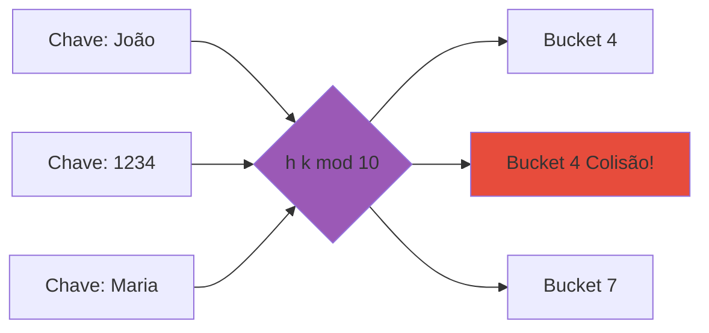

### 🔢 Índice Hash Estático

**Estrutura:**

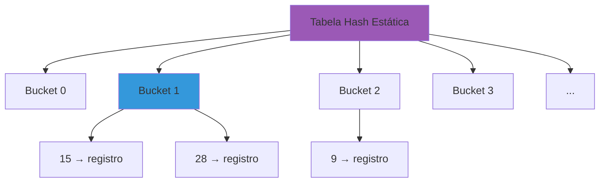

**Problema: Overflow**

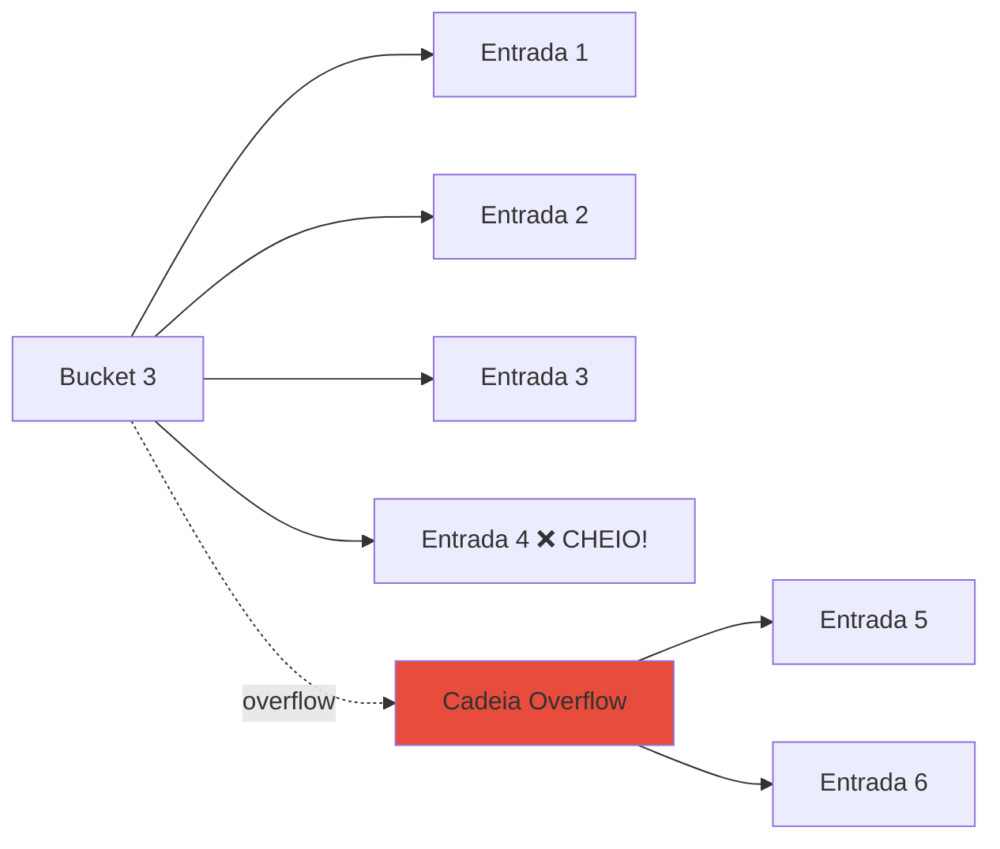

---

### 📝 Exercício 1: Hash Estático

**Exercício 1:**
**Explique como funcionam os índices de hash estático. Que tipo de problema pode acontecer com seu uso?**

**Resposta:**

**Funcionamento:**

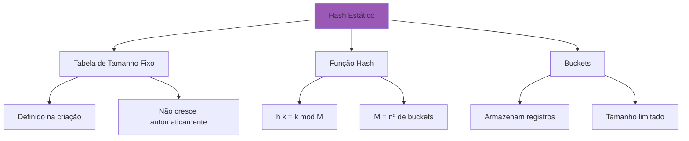

**Algoritmo de Inserção:**

```python
class HashEstático:
    def __init__(self, M):
        self.M = M  # Número de buckets
        self.buckets = [[] for _ in range(M)]
    
    def hash(self, key):
        return key % self.M
    
    def insert(self, key, value):
        bucket_num = self.hash(key)
        bucket = self.buckets[bucket_num]
        
        # Verifica se bucket está cheio
        if len(bucket) < BUCKET_SIZE:
            bucket.append((key, value))  # ✅ OK
        else:
            # ❌ OVERFLOW - adiciona em cadeia
            overflow = self.get_overflow(bucket_num)
            overflow.append((key, value))
    
    def search(self, key):
        bucket_num = self.hash(key)
        bucket = self.buckets[bucket_num]
        
        # Busca no bucket principal
        for k, v in bucket:
            if k == key:
                return v
        
        # Busca em overflow se necessário
        overflow = self.get_overflow(bucket_num)
        for k, v in overflow:
            if k == key:
                return v
        
        return None  # Não encontrado
```

**Exemplo Visual:**

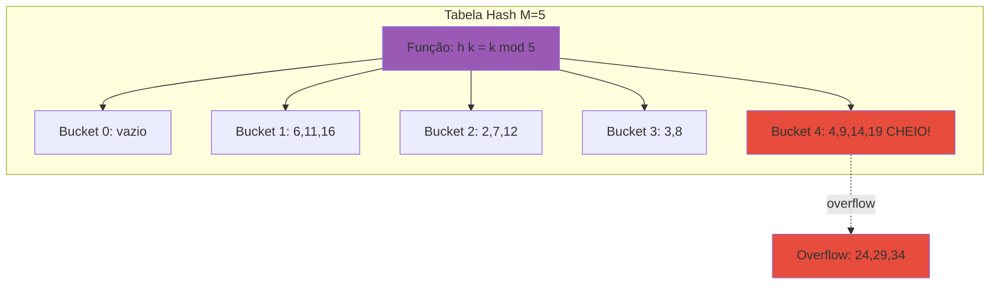

**Problemas do Hash Estático:**

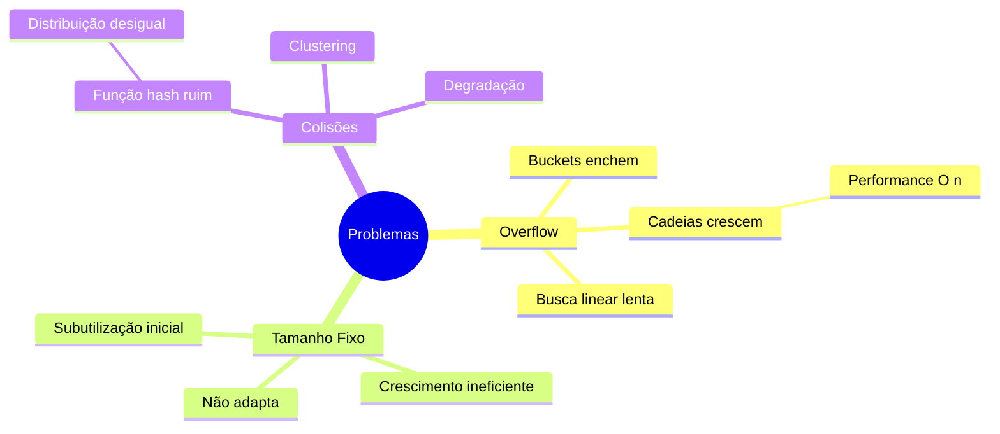

**1. Overflow e Performance:**

```
Cenário: 1000 registros, 10 buckets

Distribuição ideal:
- 100 registros por bucket
- Busca: O(100) linear no bucket ⚠️

Distribuição real (skew):
- Bucket 1: 500 registros 😱
- Bucket 2: 300 registros
- Demais: 20 registros cada

Busca no bucket 1: O(500) ❌ MUITO LENTO!
```

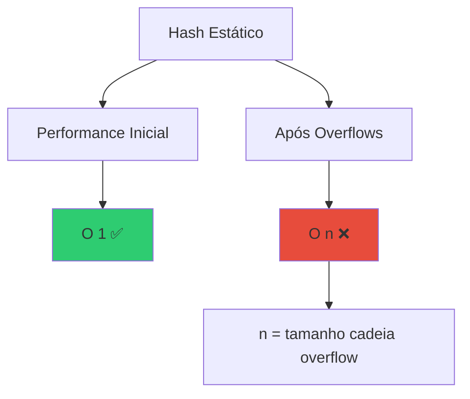

**2. Tamanho Fixo:**

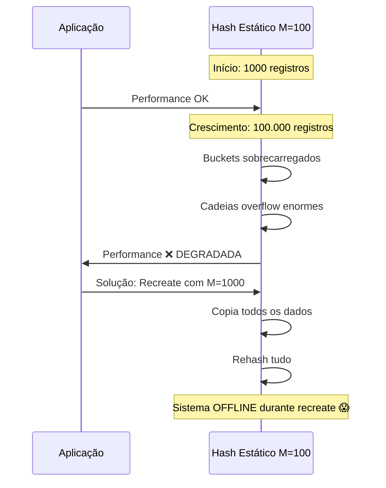

**3. Colisões Excessivas:**

```
Função hash ruim: h(k) = k mod 10

Chaves: 10, 20, 30, 40, 50, 60, 70, 80, 90
Todos vão para bucket 0! ❌

Resultado: 1 bucket cheio, 9 vazios
```

```mermaid
graph LR
    K[Chaves: 10,20,30...90] --> F[h k = k mod 10]
    F --> B0[Bucket 0: TODOS! ❌]
    F -.x.-> B1[Bucket 1: vazio]
    F -.x.-> B2[Bucket 2: vazio]
    F -.x.-> B9[Bucket 9: vazio]
    
    style B0 fill:#e74c3c
    style B1 fill:#95a5a6
    style B2 fill:#95a5a6
    style B9 fill:#95a5a6
```

**Quando Hash Estático é Adequado:**

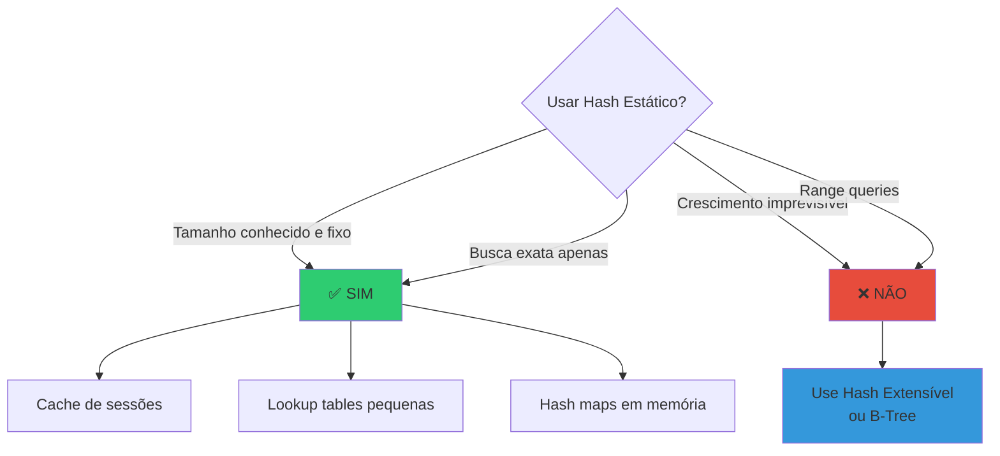

**Comparação:**

| Aspecto | Hash Estático | Hash Extensível |
|---------|---------------|-----------------|
| **Tamanho** | Fixo | Dinâmico |
| **Overflow** | Cresce indefinidamente | Mínimo |
| **Reorganização** | Manual (offline) | Automática |
| **Performance** | Degrada com tempo | Consistente |
| **Uso Recomendado** | ⚠️ Dados estáveis | ✅ Produção |

---

### 🔄 Índice Hash Extensível

**Conceito:** Usa um **diretório** que pode dobrar de tamanho, e buckets que podem fazer split.

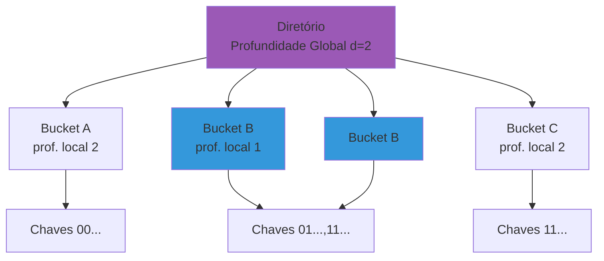

---

### 📝 Exercício 2: Hash Extensível

**Exercício 2:**
**Explique como funciona o índice de hash extensível. Para que servem a profundidade local e a profundidade global?**

**Resposta:**

**Funcionamento do Hash Extensível:**

Hash extensível usa **dois níveis**:
1. **Diretório** (array de ponteiros)
2. **Buckets** (onde ficam os dados)

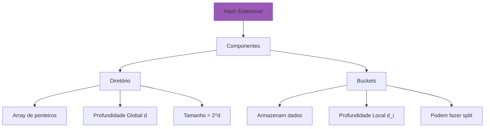

**Profundidades:**

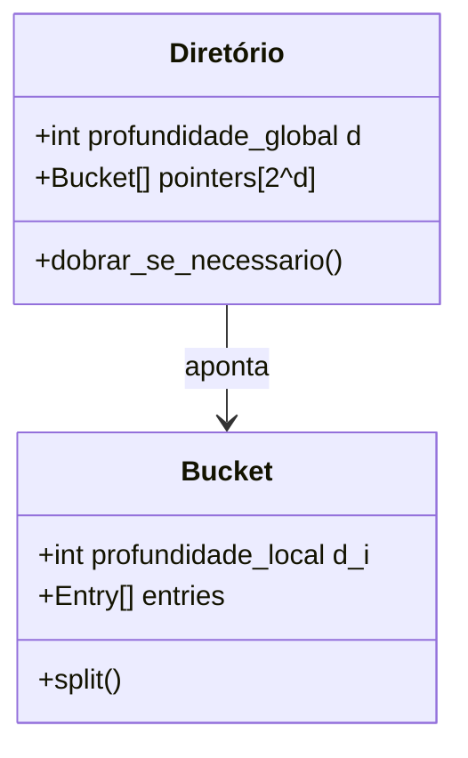

**Profundidade Global (d):**
- Número de bits usados para indexar o diretório
- Tamanho do diretório = 2^d
- Pode dobrar quando necessário

**Profundidade Local (d_i):**
- Número de bits usados pelo bucket
- d_i ≤ d sempre
- Indica quantas entradas do diretório apontam para este bucket

**Exemplo Visual:**

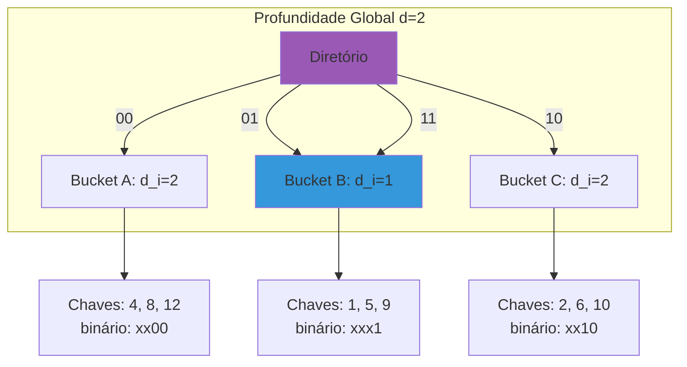

**Interpretação:**
- **Bucket A (d_i=2):** Usa 2 bits, apenas entrada 00 aponta para ele
- **Bucket B (d_i=1):** Usa 1 bit, entradas 01 E 11 apontam para ele
- **Bucket C (d_i=2):** Usa 2 bits, apenas entrada 10 aponta para ele

**Algoritmo de Busca:**

```python
class HashExtensível:
    def __init__(self):
        self.profundidade_global = 0
        self.diretorio = [Bucket(profundidade_local=0)]
    
    def hash(self, key, num_bits):
        """Retorna últimos num_bits do hash da chave"""
        h = hash_function(key)
        mask = (1 << num_bits) - 1  # 2^num_bits - 1
        return h & mask
    
    def search(self, key):
        # 1. Calcula hash com d bits
        indice = self.hash(key, self.profundidade_global)
        
        # 2. Acessa bucket via diretório
        bucket = self.diretorio[indice]
        
        # 3. Busca no bucket
        return bucket.search(key)
```

**Exemplo de Busca:**

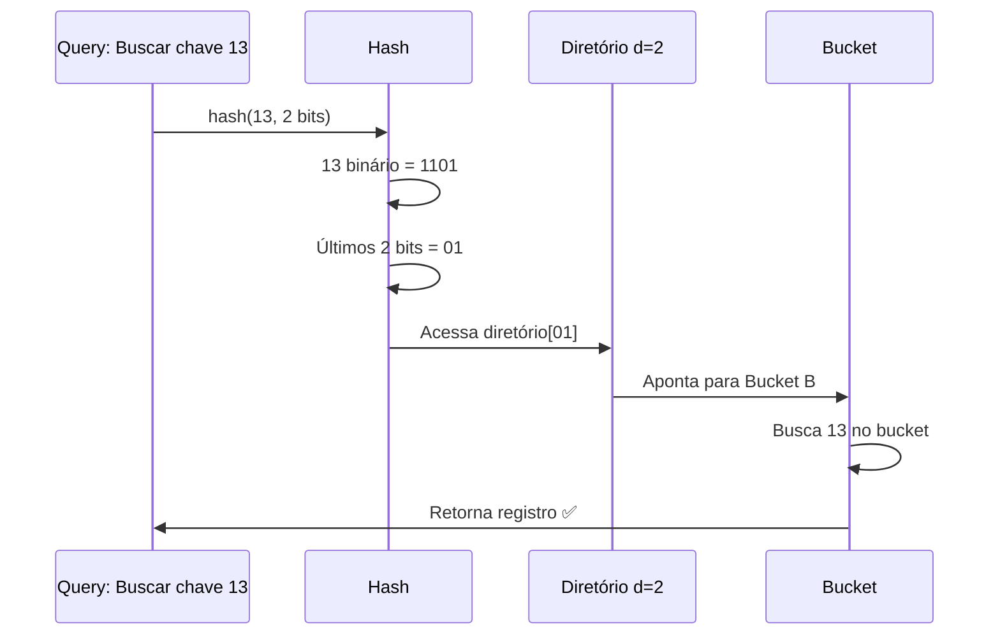

**Algoritmo de Inserção:**

```python
def insert(self, key, value):
    indice = self.hash(key, self.profundidade_global)
    bucket = self.diretorio[indice]
    
    # Caso 1: Bucket tem espaço
    if bucket.tem_espaco():
        bucket.insert(key, value)
        return
    
    # Caso 2: Bucket cheio - precisa split
    if bucket.profundidade_local == self.profundidade_global:
        # Precisa dobrar diretório primeiro
        self.dobrar_diretorio()
    
    # Faz split do bucket
    self.split_bucket(bucket, indice)
    
    # Tenta inserir novamente (recursivo)
    self.insert(key, value)

def dobrar_diretorio(self):
    """Dobra o tamanho do diretório"""
    self.profundidade_global += 1
    
    # Duplica cada entrada
    novo_diretorio = []
    for bucket in self.diretorio:
        novo_diretorio.append(bucket)
        novo_diretorio.append(bucket)  # Mesma referência!
    
    self.diretorio = novo_diretorio

def split_bucket(self, bucket, indice):
    """Divide bucket em dois"""
    novo_bucket = Bucket(bucket.profundidade_local + 1)
    bucket.profundidade_local += 1
    
    # Redistribui entradas
    for entry in bucket.entries:
        bit = self.hash(entry.key, bucket.profundidade_local)
        if bit == indice:
            bucket.insert(entry)
        else:
            novo_bucket.insert(entry)
    
    # Atualiza ponteiros do diretório
    self.atualizar_ponteiros(bucket, novo_bucket)
```

**Exemplo de Inserção com Split:**

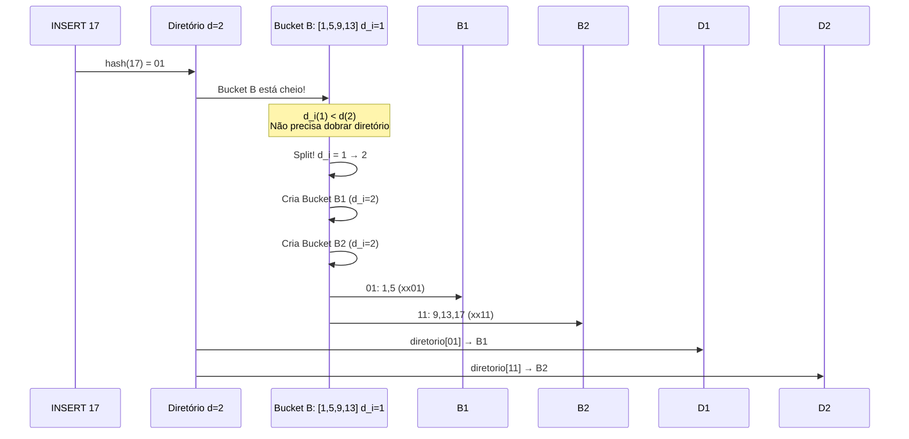

**Visualização Completa:**

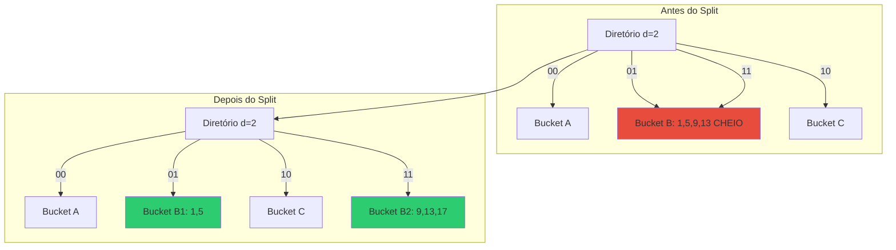

**Exemplo de Dobrar Diretório:**

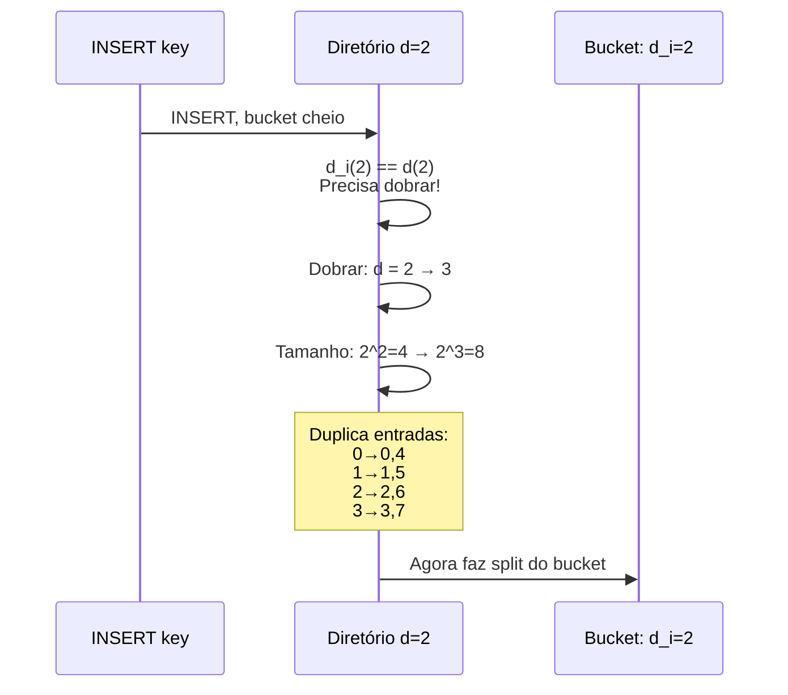

**Antes e Depois de Dobrar:**

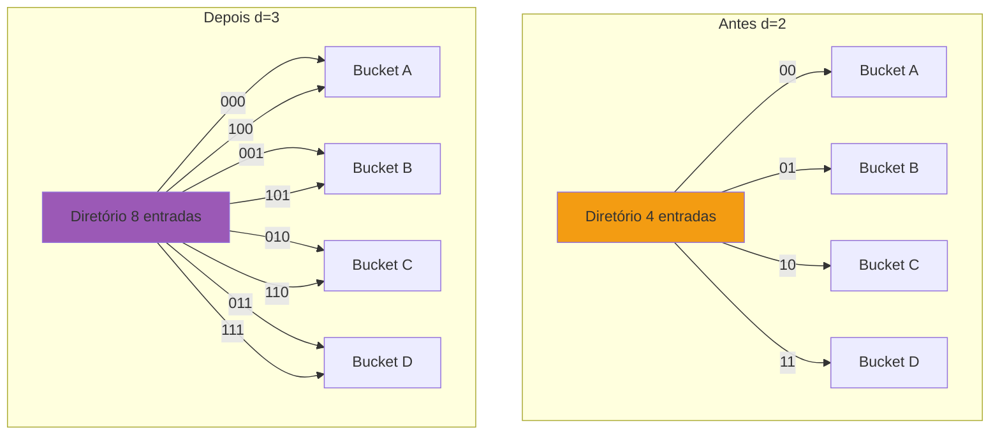

**Vantagens do Hash Extensível:**

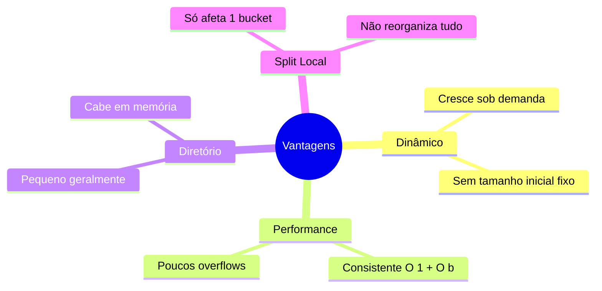

**Desvantagens:**

```mermaid
mindmap
  root((Desvantagens))
    Complexidade
      Implementação mais difícil
      Manutenção do diretório
    Diretório Grande
      Se d cresce muito
      Overhead de memória
    Skew
      Distribuição desigual
      Splits repetidos
    Indireção
      Acesso via diretório
      1 I/O extra
```

---

### 📝 Exercício 3: Páginas Vazias

**Exercício 3:**
**Na exclusão de registros em índices de hash extensível, podem surgir páginas vazias. Seria interessante "fundir" páginas quando isto acontecer? Por quê?**

**Resposta:**

```mermaid
graph TD
    Q{Fundir Páginas Vazias?}
    
    Q --> Sim[✅ Vantagens de Fundir]
    Q --> Nao[❌ Desvantagens de Fundir]
    
    Sim --> S1[Economiza espaço]
    Sim --> S2[Reduz diretório]
    Sim --> S3[Menos I/Os]
    
    Nao --> N1[Custo de reorganização]
    Nao --> N2[Padrão de acesso]
    Nao --> N3[Split novamente?]
    
    style Sim fill:#2ecc71
    style Nao fill:#e74c3c
```

**Cenário:**

```mermaid
graph TD
    subgraph "Após DELETEs"
        D[Diretório d=3]
        D -->|000| B1[Bucket A: vazio ❌]
        D -->|001| B2[Bucket B: 5,13]
        D -->|010| B3[Bucket C: 2]
        D -->|011| B4[Bucket D: 3]
        D -->|100| B1
        D -->|101| B2
        D -->|110| B3
        D -->|111| B4
    end
    
    style B1 fill:#e74c3c
```

**Argumentos A FAVOR de fundir:**

1. **Economia de Espaço:**
```
Cenário: 1000 buckets, 100 vazios

Sem fundir:
- 1000 buckets × 4KB = 4 MB
- 100 vazios × 4KB = 400 KB desperdiçados ❌

Com fundir:
- 900 buckets × 4KB = 3.6 MB
- Economia: 400 KB ✅
```

2. **Redução do Diretório:**
```mermaid
sequenceDiagram
    participant D as Diretório d=3 (8 entradas)
    participant B as Buckets
    
    Note over D,B: Muitos buckets vazios
    
    D->>B: Merge de buckets irmãos
    B->>B: Reduz profundidade local
    
    alt Todos os buckets têm d_i < d
        D->>D: Pode reduzir d!
        D->>D: d = 3 → 2
        D->>D: Tamanho: 8 → 4 ✅
    end
```

3. **Menos I/Os:**
```
Com buckets vazios:
- Scan de 1000 buckets (inclui 100 vazios)
- 1000 I/Os

Após merge:
- Scan de 900 buckets
- 900 I/Os ✅
```

**Argumentos CONTRA fundir:**

1. **Custo de Reorganização:**
```python
def merge_buckets():
    # Operações custosas:
    # 1. Identificar buckets vazios
    for bucket in all_buckets:
        if bucket.is_empty():
            # 2. Encontrar irmão
            irmao = find_sibling(bucket)
            
            # 3. Merge (atualizar diretório)
            update_directory(bucket, irmao)
            
            # 4. Liberar bucket vazio
            free(bucket)
    
    # Custo: O(n) onde n = nº de buckets
    # Pode bloquear sistema! ⚠️
```

2. **Padrão Inserir-Deletar:**
```mermaid
sequenceDiagram
    participant A as App
    participant H as Hash Extensível
    
    A->>H: DELETE muitos registros
    H->>H: Buckets ficam vazios
    
    Note over H: Decisão: Merge agora?
    
    A->>H: INSERT mesmos registros
    H->>H: Precisa SPLIT novamente! ❌
    
    Note over H: Desperdício:<br/>Merge + Split = 2× custo
```

3. **Fragmentação Aceitável:**
```
Se sistema tem:
- 95% buckets ocupados
- 5% buckets vazios

Overhead: 5% aceitável ✅
Custo de merge: NÃO vale a pena ❌
```

**Estratégias Práticas:**

```mermaid
graph TD
    S[Estratégias para Páginas Vazias] --> S1[Lazy Merge]
    S --> S2[Threshold-Based]
    S --> S3[Periodic Cleanup]
    S --> S4[Não Fundir]
    
    S1 --> S1A[Merge apenas se irmão também vazio]
    S2 --> S2A[Merge se > 30% vazios]
    S3 --> S3A[Cleanup off-peak]
    S4 --> S4A[Aceita fragmentação]
    
    style S2 fill:#2ecc71
    style S3 fill:#3498db
```

**1. Lazy Merge (Preguiçoso):**
```python
def delete(key):
    bucket = find_bucket(key)
    bucket.remove(key)
    
    # Merge APENAS se ambos vazios
    if bucket.is_empty():
        irmao = find_sibling(bucket)
        if irmao.is_empty():
            merge(bucket, irmao)  # ✅ Vale a pena
        # Senão, deixa vazio ⚠️
```

**2. Threshold-Based:**
```python
def maintenance():
    total = len(buckets)
    vazios = count_empty_buckets()
    
    percentual = vazios / total
    
    if percentual > 0.30:  # > 30% vazios
        # Vale a pena reorganizar
        reorganize_hash_index()
```

**3. Periodic Cleanup:**
```python
# Executado em horário de baixo uso
@scheduled(cron="0 3 * * *")  # 3 AM
def cleanup_empty_buckets():
    # Faz merge de buckets vazios
    # Sistema com pouca carga ✅
    merge_all_empty()
```

**Recomendação:**

```mermaid
flowchart TD
    Start{Taxa de Buckets Vazios?}
    
    Start -->|< 10%| Ignore[Ignora ✅<br/>Overhead aceitável]
    Start -->|10-30%| Lazy[Lazy Merge ✅<br/>Apenas pares vazios]
    Start -->|> 30%| Reorg[Reorganização ⚠️<br/>Período off-peak]
    
    style Ignore fill:#2ecc71
    style Lazy fill:#3498db
    style Reorg fill:#f39c12
```

**Conclusão:**

| Cenário | Ação | Justificativa |
|---------|------|---------------|
| < 10% vazios | ❌ Não fundir | Overhead insignificante |
| 10-30% vazios | ⚠️ Lazy merge | Merge apenas pares vazios |
| > 30% vazios | ✅ Reorganizar | Desperdício significativo |
| Padrão INSERT/DELETE frequente | ❌ Não fundir | Evita churn (merge+split) |
| Sistema read-heavy | ✅ Fundir | Melhora scan performance |

**Na prática:** Maioria dos SGBD usa **lazy merge** ou **threshold-based** com limpeza periódica.

---

### 📝 Exercício 4: Hash Linear vs Extensível

**Exercício 4:**
**Qual a vantagem do índice de hash linear em relação ao índice de hash extensível?**

**Resposta:**

#### Hash Linear (Linear Hashing)

**Conceito:** Cresce **incrementalmente**, adicionando um bucket por vez, sem usar diretório.

```mermaid
graph TD
    HL[Hash Linear] --> C[Características]
    
    C --> C1[SEM diretório]
    C --> C2[Crescimento linear]
    C --> C3[Split Round-robin]
    C --> C4[Duas funções hash]
    
    style HL fill:#e74c3c
```

**Estrutura:**

```mermaid
graph LR
    subgraph "Hash Linear N=4, next=1"
        B0[Bucket 0]
        B1[Bucket 1: SPLIT NEXT]
        B2[Bucket 2]
        B3[Bucket 3]
        B4[Bucket 4: NOVO]
    end
    
    B1 -.crescimento.-> B4
    
    style B1 fill:#feca57
    style B4 fill:#2ecc71
```

**Duas Funções Hash:**

```python
class HashLinear:
    def __init__(self):
        self.N = 4  # Capacidade inicial (2^i)
        self.n = 0  # Número atual de buckets
        self.next = 0  # Próximo bucket a split
        self.level = 0  # Nível atual
    
    def h0(self, key):
        """Função hash antiga"""
        return key % self.N
    
    def h1(self, key):
        """Função hash nova (dobro)"""
        return key % (2 * self.N)
    
    def search(self, key):
        # Tenta h0 primeiro
        bucket_num = self.h0(key)
        
        # Se bucket já foi split, usa h1
        if bucket_num < self.next:
            bucket_num = self.h1(key)
        
        return self.buckets[bucket_num].search(key)
    
    def insert(self, key, value):
        bucket_num = self.get_bucket(key)
        bucket = self.buckets[bucket_num]
        
        bucket.insert(key, value)
        
        # Verifica load factor
        if self.load_factor() > THRESHOLD:
            self.split_next_bucket()
    
    def split_next_bucket(self):
        """Split do bucket 'next' (round-robin)"""
        old_bucket = self.buckets[self.next]
        new_bucket = Bucket()
        
        # Adiciona novo bucket
        self.buckets.append(new_bucket)
        self.n += 1
        
        # Redistribui registros usando h1
        for entry in old_bucket.entries:
            bucket_num = self.h1(entry.key)
            if bucket_num == self.next:
                old_bucket.keep(entry)
            else:
                new_bucket.insert(entry)
        
        # Avança next
        self.next += 1
        
        # Se completou round, aumenta nível
        if self.next == self.N:
            self.level += 1
            self.N *= 2
            self.next = 0
```

**Exemplo de Crescimento:**

```mermaid
sequenceDiagram
    participant H as Hash Linear N=4, next=0
    participant B as Buckets
    
    Note over H: Início: 4 buckets
    
    H->>B: INSERT causa overflow
    H->>H: Load factor > threshold
    H->>B: Split bucket[next=0]
    B->>B: Cria bucket[4]
    B->>B: Redistribui bucket[0] usando h1
    H->>H: next = 0 → 1
    
    Note over H: Agora: 5 buckets
    
    H->>B: Próximo INSERT overflow
    H->>B: Split bucket[next=1]
    B->>B: Cria bucket[5]
    H->>H: next = 1 → 2
    
    Note over H: Crescimento linear! ✅
```

**Comparação Hash Linear vs Hash Extensível:**

| Aspecto | Hash Linear ✅ | Hash Extensível |
|---------|---------------|------------------|
| **Diretório** | ❌ NÃO tem | ✅ TEM (overhead) |
| **Memória** | ✅ Menos | ❌ Mais (diretório) |
| **Crescimento** | ✅ Linear suave | ❌ Dobra (2^d) |
| **Split** | ✅ Round-robin | ❌ Sob demanda |
| **Complexidade** | Média | Alta |
| **Indireção** | ✅ Acesso direto | ❌ Via diretório |
| **Performance** | ✅ 1-2 I/Os | ⚠️ 2 I/Os (dir + bucket) |

**Visualização:**

```mermaid
graph TD
    subgraph "Hash Extensível"
        HE[Diretório 8 KB] --> HEB1[Bucket 1]
        HE --> HEB2[Bucket 2]
        HE --> HEB3[...]
    end
    
    subgraph "Hash Linear"
        HL[Acesso Direto ✅] --> HLB1[Bucket 1]
        HL --> HLB2[Bucket 2]
        HL --> HLB3[...]
    end
    
    style HE fill:#e74c3c
    style HL fill:#2ecc71
```

**Vantagens do Hash Linear:**

1. **Sem Diretório:**
```
Hash Extensível:
- Diretório: 2^d × 8 bytes
- d=20: 8 MB de overhead! ❌

Hash Linear:
- Overhead: ~100 bytes (metadados N, next, level)
- ✅ MUITO menor!
```

2. **Crescimento Suave:**
```mermaid
graph LR
    A[Hash Extensível] --> A1[4 buckets]
    A1 --> A2[DOBRA: 8 buckets]
    A2 --> A3[DOBRA: 16 buckets]
    
    B[Hash Linear] --> B1[4 buckets]
    B1 --> B2[5 buckets ✅]
    B2 --> B3[6 buckets ✅]
    B3 --> B4[7 buckets ✅]
    B4 --> B5[8 buckets ✅]
    
    style A2 fill:#e74c3c
    style B2 fill:#2ecc71
    style B3 fill:#2ecc71
    style B4 fill:#2ecc71
    style B5 fill:#2ecc71
```

3. **Acesso Direto:**
```python
# Hash Extensível: 2 acessos
indice = hash(key, d)           # 1. Calcula índice
bucket_ptr = directory[indice]  # 2. Acessa diretório (I/O)
result = bucket_ptr.search(key) # 3. Acessa bucket (I/O)
# Total: 2 I/Os

# Hash Linear: 1 acesso
bucket_num = get_bucket_linear(key)  # 1. Calcula direto
result = buckets[bucket_num].search(key)  # 2. Acessa bucket (I/O)
# Total: 1 I/O ✅
```

4. **Menor Overhead de Memória:**
```
1 milhão de buckets:

Hash Extensível:
- Precisa d=20 para 2^20 = 1.048.576
- Diretório: 1M × 8 bytes = 8 MB em RAM ❌

Hash Linear:
- Metadados: ~100 bytes
- ✅ Praticamente zero overhead!
```

**Desvantagens do Hash Linear:**

```mermaid
mindmap
  root((Desvantagens))
    Split Não Relacionado
      Overflow em bucket 5
        Mas split é em bucket next
      Split pode não resolver
    Duas Funções
      h0 e h1
      Mais complexo
      Transição entre níveis
    Crescimento Lento
      Se muitos overflows
      1 bucket por vez
      Performance pode degradar
```

**Quando usar cada um:**

```mermaid
flowchart TD
    Start{Escolher Hash}
    
    Start -->|Memória limitada| HL[Hash Linear ✅]
    Start -->|Muita RAM disponível| HE[Hash Extensível]
    Start -->|Distribuição uniforme| HL
    Start -->|Muitos skews| HE
    Start -->|Performance crítica| HL
    
    style HL fill:#2ecc71
    style HE fill:#3498db
```

| Cenário | Hash Linear | Hash Extensível |
|---------|-------------|------------------|
| **Memória limitada** | ✅ IDEAL | ❌ Overhead |
| **Crescimento gradual** | ✅ IDEAL | Overkill |
| **Distribuição uniforme** | ✅ IDEAL | Ambos OK |
| **Muitos skews** | ⚠️ OK | ✅ Melhor |
| **Embedded systems** | ✅ IDEAL | Muito pesado |

**Conclusão:**

**Vantagem Principal:** Hash Linear **NÃO precisa de diretório**, economizando memória e reduzindo I/Os.

```mermaid
graph LR
    A[Vantagem Hash Linear] --> B[Sem Diretório]
    B --> C[Menos Memória ✅]
    B --> D[Menos I/Os ✅]
    B --> E[Acesso Direto ✅]
    B --> F[Crescimento Suave ✅]
    
    style A fill:#2ecc71
    style C fill:#2ecc71
    style D fill:#2ecc71
    style E fill:#2ecc71
    style F fill:#2ecc71
```

---

### 📝 Exercício 5: Operações Hash Linear

**Exercício 5:**
**Explique como são feitas as operações de inserção e pesquisa no índice de hash linear.**

**Resposta:**

#### Operação de PESQUISA (Search)

**Algoritmo:**

```python
def search(self, key):
    """
    Busca uma chave no hash linear
    Retorna o valor se encontrado, None caso contrário
    """
    # 1. Calcula hash usando h0 (função antiga)
    bucket_num = self.h0(key)  # key % N
    
    # 2. Verifica se bucket já foi split
    if bucket_num < self.next:
        # Bucket já foi split, usa h1 (função nova)
        bucket_num = self.h1(key)  # key % (2*N)
    
    # 3. Acessa o bucket
    bucket = self.buckets[bucket_num]
    
    # 4. Busca linear no bucket
    return bucket.search(key)
```

**Exemplo Passo a Passo:**

```
Estado atual:
- N = 4 (capacidade inicial)
- next = 2 (próximo a split)
- Buckets: 0, 1, 2, 3, 4, 5

Buckets 0,1 já foram split (< next)
Buckets 2,3 ainda não (>= next)
```

```mermaid
flowchart TD
    Start[SEARCH key=14] --> H0[h0 14 = 14 % 4 = 2]
    H0 --> Check{bucket 2 < next 2 ?}
    
    Check -->|NÃO| Use0[Usa h0<br/>bucket = 2 ✅]
    Check -->|SIM| Use1[Usa h1]
    
    Use0 --> Access[Acessa bucket 2]
    Access --> Linear[Busca linear no bucket]
    Linear --> Result[Retorna resultado]
    
    style Use0 fill:#2ecc71
```

**Outro Exemplo:**

```
SEARCH key=9

1. h0(9) = 9 % 4 = 1
2. bucket_num (1) < next (2)? SIM!
3. Usa h1: 9 % (2×4) = 9 % 8 = 1
4. Acessa bucket 1
5. Busca 9 no bucket
```

```mermaid
flowchart TD
    Start[SEARCH key=9] --> H0[h0 9 = 9 % 4 = 1]
    H0 --> Check{bucket 1 < next 2 ?}
    
    Check -->|SIM ✅| H1[h1 9 = 9 % 8 = 1]
    H1 --> Access[Acessa bucket 1]
    Access --> Result[Busca no bucket]
    
    style H1 fill:#feca57
```

**Complexidade:**
- **Melhor caso:** O(1) - chave na primeira posição do bucket
- **Pior caso:** O(b) - onde b = tamanho do bucket + overflow
- **Média:** O(1 + α) - onde α = load factor

#### Operação de INSERÇÃO (Insert)

**Algoritmo:**

```python
def insert(self, key, value):
    """
    Insere uma chave no hash linear
    Faz split se necessário
    """
    # 1. Encontra bucket correto (mesmo que search)
    bucket_num = self.get_bucket_number(key)
    bucket = self.buckets[bucket_num]
    
    # 2. Insere no bucket
    bucket.insert(key, value)
    
    # 3. Verifica load factor
    load_factor = self.calculate_load_factor()
    
    if load_factor > THRESHOLD:  # ex: 0.75
        # 4. Faz split do próximo bucket
        self.split_next_bucket()

def split_next_bucket(self):
    """
    Faz split do bucket apontado por 'next'
    Redistribui seus registros
    """
    # 1. Bucket a ser split
    old_bucket = self.buckets[self.next]
    
    # 2. Cria novo bucket
    new_bucket_num = self.n  # Último + 1
    new_bucket = Bucket()
    self.buckets.append(new_bucket)
    self.n += 1
    
    # 3. Redistribui registros usando h1
    temp_entries = old_bucket.entries.copy()
    old_bucket.clear()
    
    for entry in temp_entries:
        # Usa h1 para redistribuir
        new_bucket_num = self.h1(entry.key)
        
        if new_bucket_num == self.next:
            old_bucket.insert(entry)
        else:
            new_bucket.insert(entry)
    
    # 4. Avança ponteiro next
    self.next += 1
    
    # 5. Se completou round, aumenta nível
    if self.next == self.N:
        self.level += 1
        self.N *= 2
        self.next = 0

def calculate_load_factor(self):
    """Load factor = total_registros / (num_buckets × capacidade)"""
    total_entries = sum(len(b.entries) for b in self.buckets)
    capacity = len(self.buckets) * BUCKET_SIZE
    return total_entries / capacity
```

**Exemplo Completo:**

```
Estado inicial:
- N = 4
- next = 0
- Buckets: 0[1,5,9], 1[2,6], 2[3,7], 3[4,8]
- Load factor = 0.6 (OK)
```

**Passo 1: INSERT 13**

```mermaid
sequenceDiagram
    participant I as INSERT 13
    participant H as Hash Linear
    participant B as Buckets
    
    I->>H: INSERT 13
    H->>H: h0(13) = 13 % 4 = 1
    H->>H: bucket 1 < next(0)? NÃO
    H->>B: Insere em bucket 1
    B->>B: bucket 1: [2,6,13]
    
    H->>H: Load factor = 0.7 (OK)
    
    Note over H: Sem split ainda
```

**Passo 2: INSERT 17 (causa overflow)**

```mermaid
sequenceDiagram
    participant I as INSERT 17
    participant H as Hash Linear
    participant B as Buckets
    
    I->>H: INSERT 17
    H->>H: h0(17) = 17 % 4 = 1
    H->>B: Insere em bucket 1
    B->>B: bucket 1: [2,6,13,17] CHEIO!
    
    H->>H: Load factor = 0.8 > 0.75 ❌
    H->>H: SPLIT bucket[next=0]
    
    Note over H: Split NÃO é no bucket 1<br/>É no bucket next=0!
    
    H->>B: Split bucket 0
    B->>B: bucket 0: [1,5,9]
    B->>B: Cria bucket 4
    B->>B: h1(1) = 1%8 = 1 → bucket 1? NÃO, fica em 0
    B->>B: h1(5) = 5%8 = 5 → vai para bucket 4
    B->>B: h1(9) = 9%8 = 1 → vai para bucket 1? NÃO, fica em 0
    
    B->>B: Resultado:<br/>bucket 0: [1,9]<br/>bucket 4: [5]
    
    H->>H: next = 0 → 1
```

**Visualização do Split:**

```mermaid
graph TD
    subgraph "Antes do Split"
        B0[Bucket 0: 1,5,9]
        B1[Bucket 1: 2,6,13,17]
        B2[Bucket 2: 3,7]
        B3[Bucket 3: 4,8]
    end
    
    subgraph "Depois do Split"
        B0_[Bucket 0: 1,9]
        B1_[Bucket 1: 2,6,13,17]
        B2_[Bucket 2: 3,7]
        B3_[Bucket 3: 4,8]
        B4[Bucket 4: 5 NOVO]
    end
    
    B0 --> B0_
    B0 --> B4
    
    style B1 fill:#e74c3c
    style B4 fill:#2ecc71
```

**Características Importantes:**

1. **Split Round-Robin:**
```mermaid
graph LR
    S[Split] --> S1[Sempre no bucket next]
    S1 --> S2[NÃO no bucket que overflow]
    S2 --> S3[Garante crescimento uniforme]
    
    style S2 fill:#feca57
```

2. **Load Factor como Gatilho:**
```python
# Threshold comum: 0.75-0.80
if load_factor > 0.75:
    split()

# Alguns usam overflow count
if any_bucket.has_overflow():
    split()
```

3. **Transição de Função Hash:**
```
Round 1 (N=4, next variando):
- Buckets 0-3 usam h0 ou h1 dependendo de next

Round 2 (N=8, next variando):
- Todos usam h1 como "nova h0"
- h2(k) = k % 16 vira a "nova h1"
```

**Comparação de Inserções:**

| Hash Type | Onde Split | Gatilho |
|-----------|------------|---------|
| **Hash Estático** | N/A | Overflow → cadeia |
| **Hash Extensível** | Bucket que overflow | Bucket cheio |
| **Hash Linear** | Bucket next (round-robin) | Load factor |

```mermaid
graph TD
    A[Estratégias de Split] --> B[Hash Extensível]
    A --> C[Hash Linear]
    
    B --> B1[Split onde overflow ❌]
    B --> B2[Pode dobrar diretório]
    B --> B3[Crescimento irregular]
    
    C --> C1[Split round-robin ✅]
    C --> C2[Crescimento linear]
    C --> C3[Uniforme]
    
    style C fill:#2ecc71
```

**Complexidade:**

| Operação | Complexidade | I/Os |
|----------|--------------|------|
| **Search** | O(1 + α) | 1-2 |
| **Insert** | O(1 + α) | 1-2 (sem split)<br/>2-4 (com split) |
| **Split** | O(b) | 2-4 |

onde α = load factor, b = tamanho do bucket

---

### 📝 Exercício 6: Índice Hash Extensível Prático

**Exercício 6:**
**Considere o índice de hash extensível da Figura 1.**

```mermaid
graph TD
    D[Diretório<br/>Prof. Global = 3]
    
    D -->|000| BA[Bucket A<br/>prof. local = 3<br/>64*, 16*]
    D -->|001| BB[Bucket B<br/>prof. local = 2<br/>1*, 5*, 21*]
 ❌ NÃO] Start -->|Busca exata apenas| Yes Start -->|Range queries| No
Code

Yes --> Ex1[Cache de sessões]
Yes --> Ex2[Lookup tables pequenas]
Yes --> Ex3[Hash maps em memória]

No --> Alt[Use Hash Extensível<br/>ou B-Tree]

style Yes fill:#2ecc71
style No fill:#e74c3c
style Alt fill:#3498db
   D -->|010| BB
    D -->|011| BC[Bucket C<br/>prof. local = 2<br/>10*]
    D -->|100| BA
    D -->|101| BD[Bucket D<br/>prof. local = 3<br/>15*, 7*, 51*]
    D -->|110| BC
    D -->|111| BA2[Bucket A2<br/>prof. local = 3<br/>4*, 12*, 20*, 36*]
    
    style D fill:#9b59b6
    style BA fill:#3498db
    style BB fill:#2ecc71
    style BC fill:#f39c12
    style BD fill:#e74c3c
    style BA2 fill:#3498db
```

**(a) Mostre o índice após a inserção das entradas 17\* e 69\*.**

**Resposta:**

**Inserção 17\*:**

```
1. hash(17) em binário: 17 = 10001
2. Últimos 3 bits: 001
3. diretorio[001] → Bucket B (prof. local = 2)
4. Bucket B: [1*, 5*, 21*]
5. Verificar bits relevantes de 17*:
   - Profundidade local = 2, usa últimos 2 bits
   - 17 = 10001, últimos 2 bits = 01
   - Vai para Bucket B ✅
6. Bucket B: [1*, 5*, 21*, 17*] (ainda cabe, tamanho máximo geralmente 4)
```

**Resultado após INSERT 17\*:**

```mermaid
graph TD
    D[Diretório<br/>Prof. Global = 3]
    
    D -->|000| BA[Bucket A<br/>prof. local = 3<br/>64*, 16*]
    D -->|001| BB[Bucket B<br/>prof. local = 2<br/>1*, 5*, 21*, 17* ✅]
    D -->|010| BB
    D -->|011| BC[Bucket C<br/>prof. local = 2<br/>10*]
    D -->|100| BA
    D -->|101| BD[Bucket D<br/>prof. local = 3<br/>15*, 7*, 51*]
    D -->|110| BC
    D -->|111| BA2[Bucket A2<br/>prof. local = 3<br/>4*, 12*, 20*, 36*]
    
    style BB fill:#2ecc71
```

**Inserção 69\*:**

```
1. hash(69) em binário: 69 = 1000101
2. Últimos 3 bits: 101
3. diretorio[101] → Bucket D (prof. local = 3)
4. Bucket D: [15*, 7*, 51*]
5. Verificar: 69 = ...101 ✅
6. Bucket D: [15*, 7*, 51*, 69*] (cabe!)
```

**Resultado Final:**

```mermaid
graph TD
    D[Diretório<br/>Prof. Global = 3]
    
    D -->|000| BA[Bucket A<br/>prof. local = 3<br/>64*, 16*]
    D -->|001| BB[Bucket B<br/>prof. local = 2<br/>1*, 5*, 21*, 17*]
    D -->|010| BB
    D -->|011| BC[Bucket C<br/>prof. local = 2<br/>10*]
    D -->|100| BA
    D -->|101| BD[Bucket D<br/>prof. local = 3<br/>15*, 7*, 51*, 69* ✅]
    D -->|110| BC
    D -->|111| BA2[Bucket A2<br/>prof. local = 3<br/>4*, 12*, 20*, 36*]
    
    style BB fill:#2ecc71
    style BD fill:#e74c3c
```

---

**(b) Mostre o índice após a inserção da entrada 68\*.**

**Resposta:**

```
1. hash(68) em binário: 68 = 1000100
2. Últimos 3 bits: 100
3. diretorio[100] → Bucket A (prof. local = 3)
4. Bucket A: [64*, 16*]
5. Verificar: 68 = ...100 ✅
6. Bucket A: [64*, 16*, 68*] (cabe!)
```

**Resultado:**

```mermaid
graph TD
    D[Diretório<br/>Prof. Global = 3]
    
    D -->|000| BA[Bucket A<br/>prof. local = 3<br/>64*, 16*, 68* ✅]
    D -->|001| BB[Bucket B<br/>prof. local = 2<br/>1*, 5*, 21*, 17*]
    D -->|010| BB
    D -->|011| BC[Bucket C<br/>prof. local = 2<br/>10*]
    D -->|100| BA
    D -->|101| BD[Bucket D<br/>prof. local = 3<br/>15*, 7*, 51*, 69*]
    D -->|110| BC
    D -->|111| BA2[Bucket A2<br/>prof. local = 3<br/>4*, 12*, 20*, 36*]
    
    style BA fill:#3498db
```

**Sem split necessário!** Bucket A tinha espaço.

---
