## 3. Índices em Árvore (B-Tree e B+Tree)

### 🌳 Fundamentos de Árvores de Busca

**Metáfora da Árvore Genealógica Balanceada:**

Imagine organizar sua família onde cada geração tem aproximadamente o mesmo número de pessoas, facilitando encontrar qualquer parente.

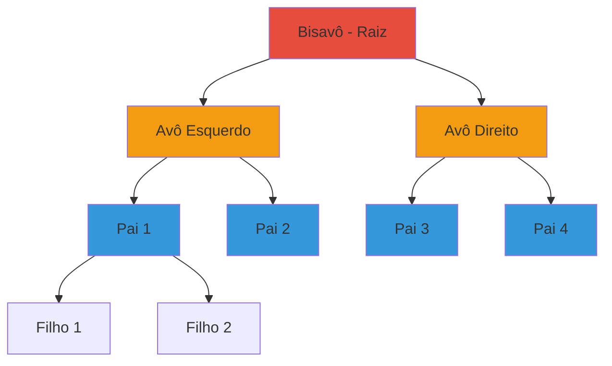

### 📊 Índices Primitivos

Antes de mergulhar em B-Trees, vamos entender os **índices primitivos** mais simples:

#### 3.1 Índice Primário (Primary Index)

**Definição:** Índice sobre a chave primária, em dados fisicamente ordenados.

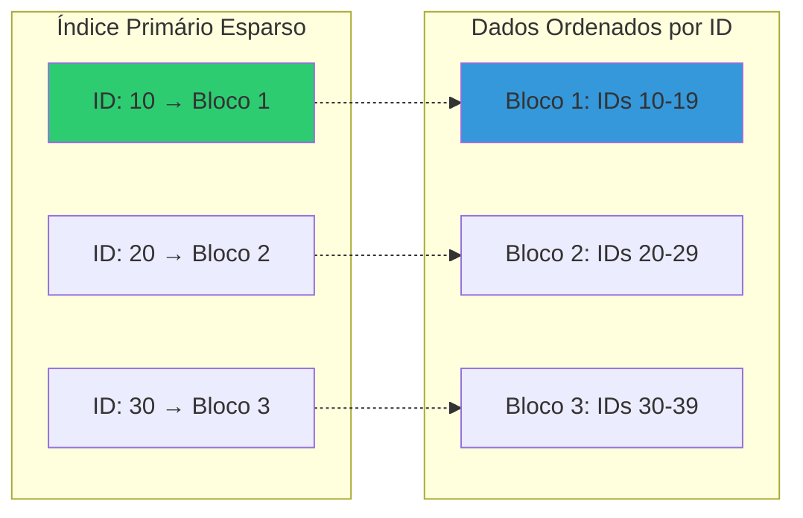

**Características:**
- ✅ Esparso (uma entrada por bloco)
- ✅ Pequeno (cabe em memória)
- ✅ Dados ordenados (clustering)
- ⚠️ Apenas um por tabela

**Vantagens:**
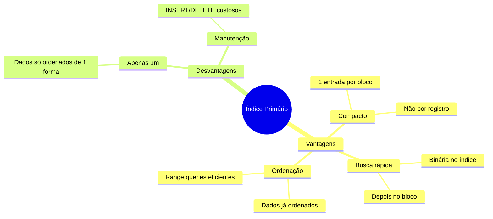

**Desvantagens:**
- ❌ Inserções requerem reordenação
- ❌ Deletações criam espaço fragmentado
- ❌ Apenas uma chave de ordenação

---

### 📝 Exercícios - Índices Primitivos

#### **Exercício 1:**
**Descreva as vantagens e desvantagens dos índices primitivos.**

**Resposta:**

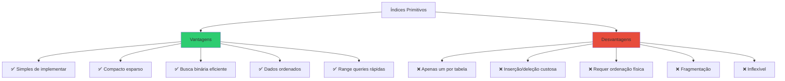

**Vantagens Detalhadas:**

1. **Compacto (Esparso):**
```
Exemplo: 1.000.000 registros, 100 registros/bloco

Índice Denso: 1.000.000 entradas
Índice Esparso: 10.000 entradas (100x menor!)

Se cada entrada = 12 bytes:
- Denso: 12 MB
- Esparso: 120 KB ✅ Cabe em cache!
```

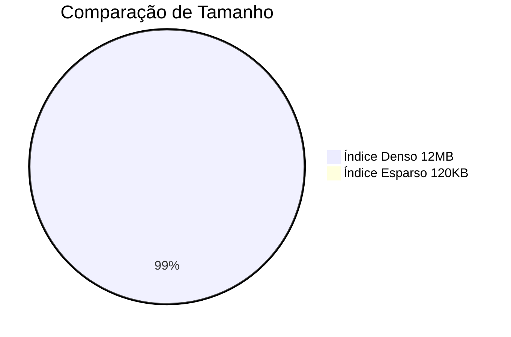

2. **Busca Eficiente:**
```
Buscar ID = 12345 em 10.000 blocos:

SEM Índice:
- Scan sequencial: 10.000 I/Os 😱

COM Índice Primário:
- Busca binária no índice: log₂(10000) = 14 comparações
- 1 I/O para ler o bloco
- Total: ~15 I/Os ✅ 666x melhor!
```

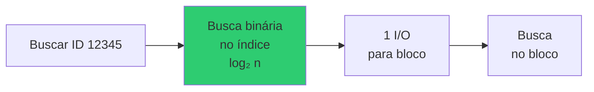

3. **Dados Ordenados:**
```sql
-- Range query é eficiente
SELECT * FROM funcionarios 
WHERE id BETWEEN 1000 AND 2000;

-- Lê apenas blocos relevantes sequencialmente ✅
```

**Desvantagens Detalhadas:**

1. **Apenas Um por Tabela:**
```mermaid
graph TD
    T[Tabela] --> IP[Índice Primário: ID]
    T -.x.-> IP2[❌ Não pode ter outro primário]
    
    T --> IS1[Índice Secundário: Nome]
    T --> IS2[Índice Secundário: Depto]
    
    style IP2 fill:#e74c3c
```

2. **Inserção Custosa:**
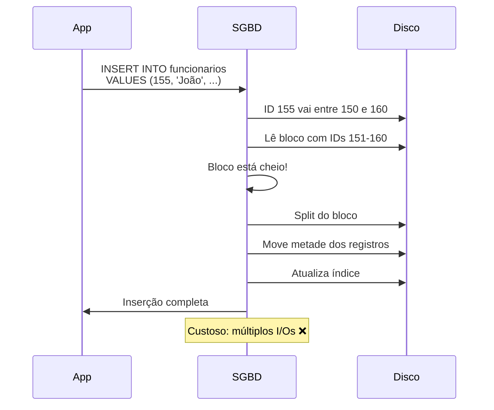

3. **Deleção e Fragmentação:**
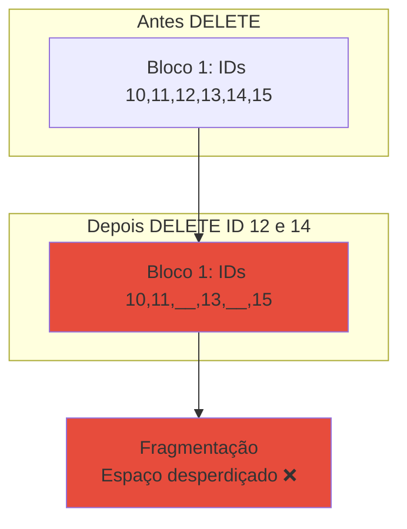

**Comparação com Outras Estruturas:**

| Aspecto | Índice Primitivo | B-Tree | Hash |
|---------|------------------|---------|------|
| **Implementação** | ✅ Simples | Média | Média |
| **Espaço** | ✅ Compacto | Maior | Médio |
| **Inserção** | ❌ Custosa | ✅ Boa | ✅ Ótima |
| **Busca exata** | Boa | ✅ Ótima | ✅ Ótima |
| **Range query** | ✅ Ótima | ✅ Ótima | ❌ Ruim |
| **Múltiplos** | ❌ Não | ✅ Sim | ✅ Sim |

**Quando Usar Índice Primitivo:**
- 📋 Tabelas pequenas (< 1GB)
- 📖 Dados raramente modificados (read-only)
- 🔢 Chave primária sequencial (IDs auto-incremento)
- ❌ **NÃO para:** aplicações com alta taxa de INSERT/DELETE

---
### 🌲 ISAM (Indexed Sequential Access Method)

**O que é ISAM?**

ISAM é uma estrutura de índice **estática** que combina acesso sequencial com acesso indexado. Foi muito usado antes das B-Trees dominarem.

**Metáfora do Dicionário com Abas:** Imagine um dicionário com abas coloridas (A, B, C...). As abas são o índice, as páginas são os dados ordenados.

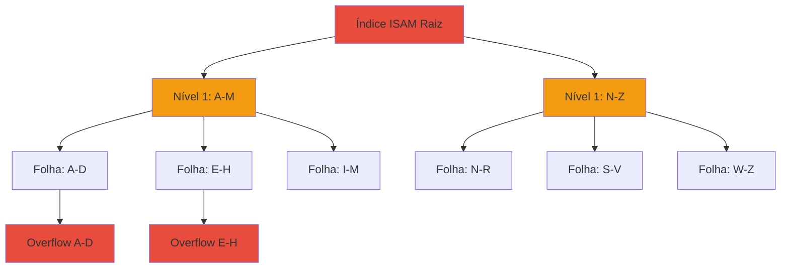

**Estrutura ISAM:**

```mermaid
classDiagram
    class ISAMIndex {
        +static_levels[] níveis estáticos
        +overflow_areas[] áreas de overflow
        +search(key)
        +insert(key, data)
    }
    
    class StaticLevel {
        +entries[] entradas fixas
        +ordered true
        +binary_search()
    }
    
    class OverflowArea {
        +entries[] encadeadas
        +linked_list true
        +sequential_search()
    }
    
    ISAMIndex *-- StaticLevel
    ISAMIndex *-- OverflowArea
```

**Como Funciona:**

1. **Busca:**
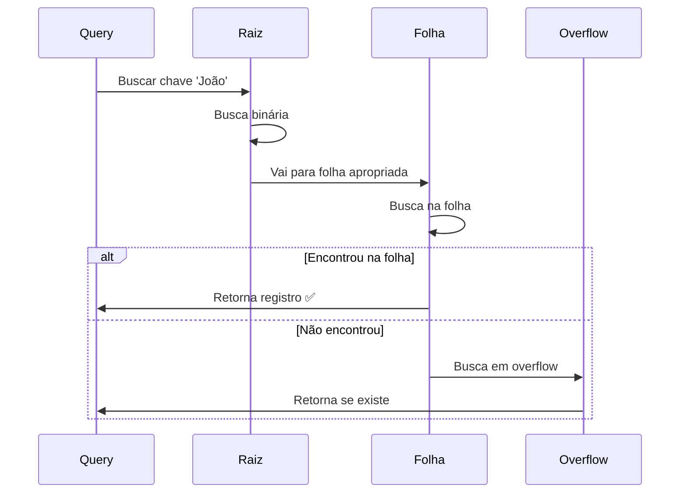

2. **Inserção:**
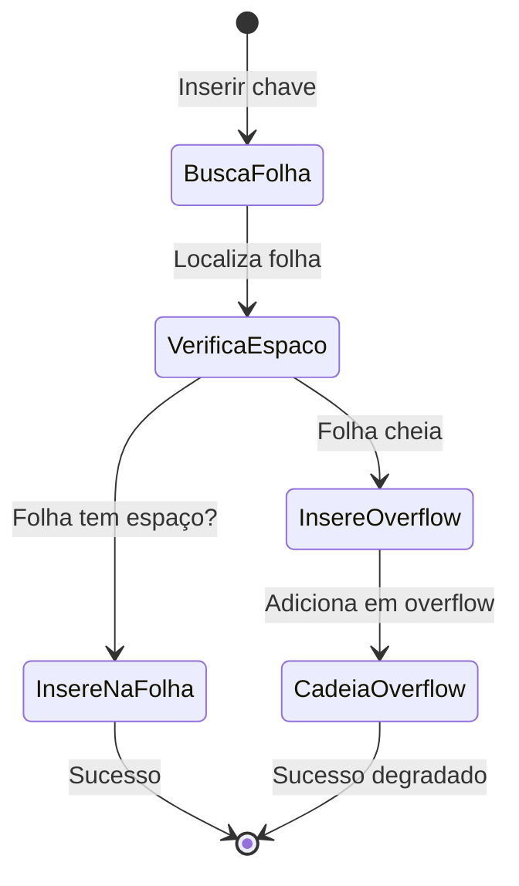

**Exemplo Visual:**

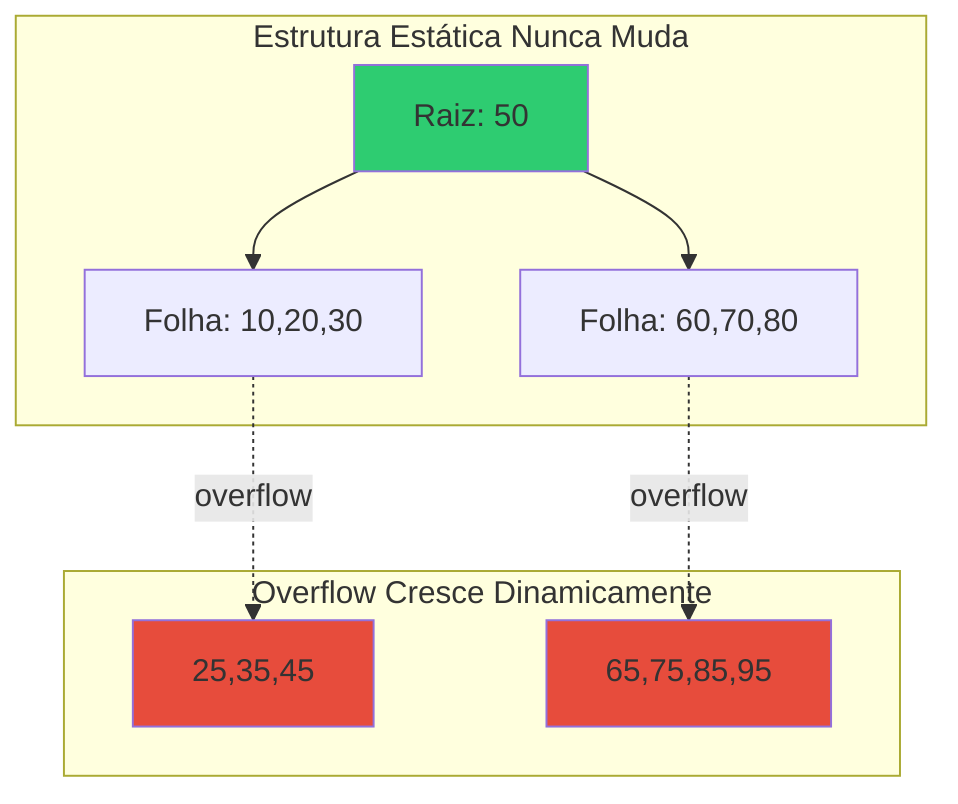

---

### 📝 Exercício 2: ISAM

**Exercício 2:**
**Explique como funciona o índice de Árvore Indexed Sequential Access Method (ISAM). Como ocorrem as inserções e exclusões? Quais as suas vantagens e desvantagens?**

**Resposta:**

**Funcionamento do ISAM:**

ISAM é uma estrutura **estática** de múltiplos níveis com **áreas de overflow dinâmicas**.

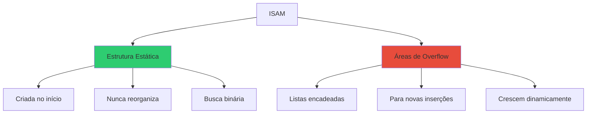

**Inserções:**

```python
def insert_isam(key, value):
    # 1. Navega pela estrutura estática
    leaf = navigate_to_leaf(key)
    
    # 2. Verifica se cabe na folha
    if leaf.has_space():
        leaf.insert(key, value)  # ✅ Rápido
    else:
        # 3. Adiciona em área de overflow
        overflow = leaf.get_overflow_area()
        overflow.append(key, value)  # ⚠️ Degrada performance
```

**Exemplo de Inserção:**

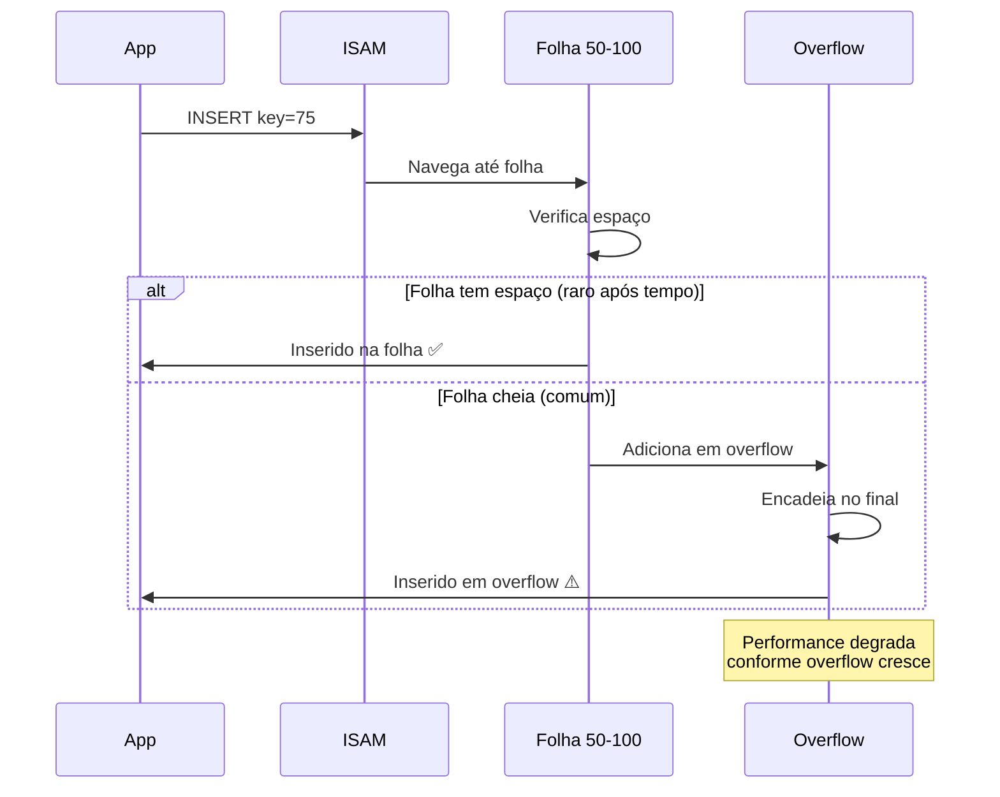

**Exclusões:**

```python
def delete_isam(key):
    # 1. Busca na estrutura estática
    leaf = navigate_to_leaf(key)
    
    # 2. Tenta remover da folha
    if leaf.contains(key):
        leaf.mark_as_deleted(key)  # Marca como deletado
        return
    
    # 3. Se não, busca em overflow
    overflow = leaf.get_overflow_area()
    overflow.remove(key)  # Remove da lista
```

**Problema das Exclusões:**

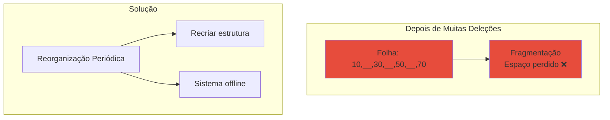

**Vantagens do ISAM:**

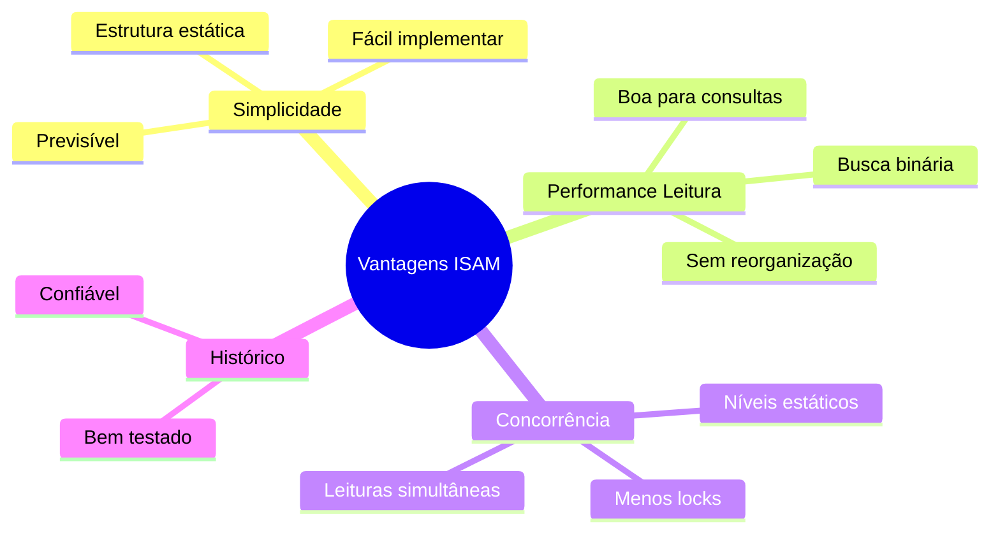

1. **Estrutura Estática:**
   - ✅ Níveis nunca mudam
   - ✅ Não precisa rebalancear
   - ✅ Previsível

2. **Boa para Leitura:**
   - ✅ Busca binária eficiente
   - ✅ Range queries rápidas
   - ✅ Sem overhead de balanceamento

3. **Concorrência:**
   - ✅ Estrutura estática facilita locks
   - ✅ Múltiplas leituras simultâneas

**Desvantagens do ISAM:**

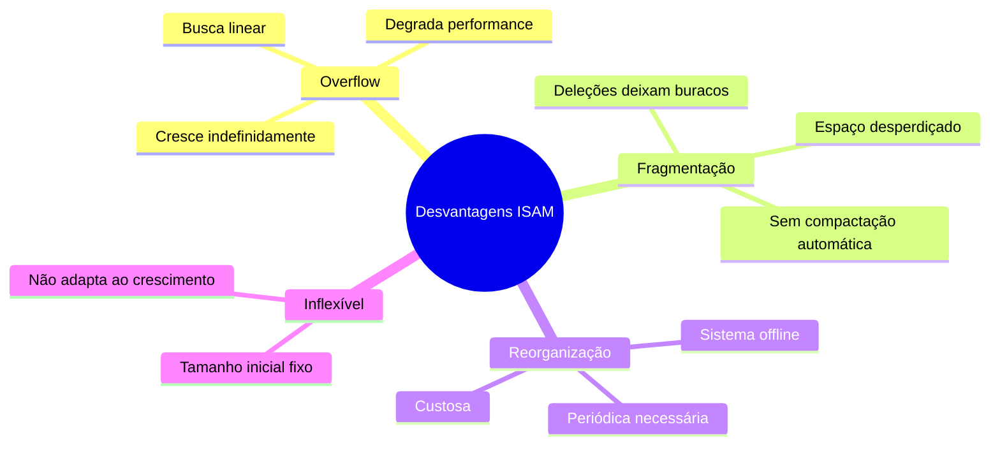

1. **Overflow Crescente:**
```
Após N inserções:
- Folhas cheias
- Overflow pode ter centenas de entradas
- Busca vira O(n) no overflow ❌

Exemplo: Folha com 100 slots + overflow com 500 entradas
- Busca na folha: O(log 100) = 7 comparações
- Busca no overflow: O(500) = até 500 comparações 😱
```

2. **Fragmentação:**
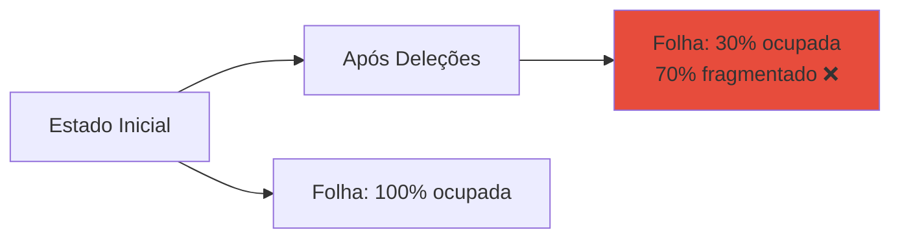

3. **Reorganização Obrigatória:**
```mermaid
sequenceDiagram
    participant A as Aplicação
    participant DBA
    participant ISAM
    
    Note over ISAM: Performance degradando...
    DBA->>A: Sistema vai ficar offline
    A->>A: Para operações
    DBA->>ISAM: Reorganiza estrutura
    ISAM->>ISAM: Recria índice
    ISAM->>ISAM: Elimina overflow
    ISAM->>ISAM: Elimina fragmentação
    ISAM->>DBA: Pronto (pode levar horas!)
    DBA->>A: Sistema volta online
```

**Comparação ISAM vs B-Tree:**

| Aspecto | ISAM | B-Tree |
|---------|------|--------|
| **Estrutura** | Estática | Dinâmica |
| **Inserção** | ⚠️ Overflow | ✅ Split |
| **Deleção** | ⚠️ Marca deletado | ✅ Merge |
| **Performance leitura** | ✅ Boa (inicialmente) | ✅ Consistente |
| **Performance escrita** | ❌ Degrada | ✅ Estável |
| **Manutenção** | ❌ Reorganização offline | ✅ Automática |
| **Uso atual** | ⚠️ Legado | ✅ Padrão |

**Quando ISAM era usado:**
- 📼 Sistemas legados (anos 70-80)
- 📀 Dados em mídia sequencial (fitas)
- 📊 Data warehouses read-only
- ⚠️ **Hoje:** substituído por B-Trees

**Por que B-Tree venceu:**

```mermaid
graph TD
    A[B-Tree vs ISAM] --> B[B-Tree Vence]
    
    B --> B1[Dinâmica se adapta]
    B --> B2[Sem degradação]
    B --> B3[Sem reorganização offline]
    B --> B4[Balanceamento automático]
    B --> B5[Performance consistente]
    
    style B fill:#2ecc71
    style B1 fill:#2ecc71
    style B2 fill:#2ecc71
    style B3 fill:#2ecc71
    style B4 fill:#2ecc71
    style B5 fill:#2ecc71
```

---

### 🌳 B-Tree e B+Tree: Estruturas Modernas

#### 3.3 Características Principais das Árvores B+

**B+Tree:** Variante otimizada da B-Tree, usada pela maioria dos SGBD (MySQL, PostgreSQL, Oracle).

```mermaid
graph TD
    R[Raiz: 50, 100] --> I1[Nó Interno: 25, 35]
    R --> I2[Nó Interno: 75, 85]
    R --> I3[Nó Interno: 125, 150]
    
    I1 --> F1[Folha: 10,15,20,25,30,35,40]
    I2 --> F2[Folha: 50,60,70,75,80,85,90]
    I3 --> F3[Folha: 100,110,120,125,140,150]
    
    F1 -.link.-> F2
    F2 -.link.-> F3
    
    style R fill:#e74c3c
    style I1 fill:#f39c12
    style I2 fill:#f39c12
    style I3 fill:#f39c12
    style F1 fill:#2ecc71
    style F2 fill:#2ecc71
    style F3 fill:#2ecc71
```

**Diferenças B-Tree vs B+Tree:**

```mermaid
graph TD
    subgraph "B-Tree"
        BT1[Dados em todos os nós]
        BT2[Sem links entre folhas]
        BT3[Busca pode parar em nó interno]
    end
    
    subgraph "B+Tree Melhor"
        BP1[Dados SÓ nas folhas]
        BP2[Links entre folhas]
        BP3[Busca sempre vai até folha]
        BP4[Nós internos só chaves]
    end
    
    BT1 -.vs.-> BP1
    BT2 -.vs.-> BP2
    
    style BP1 fill:#2ecc71
    style BP2 fill:#2ecc71
    style BP3 fill:#2ecc71
    style BP4 fill:#2ecc71
```

| Característica | B-Tree | B+Tree ✅ |
|----------------|---------|----------|
| **Dados** | Todos os nós | Só folhas |
| **Links entre folhas** | ❌ Não | ✅ Sim |
| **Chaves duplicadas** | Não | Sim (nos nós internos) |
| **Range scan** | Busca em árvore | ✅ Segue links |
| **Capacidade nó interno** | Menor | ✅ Maior (só chaves) |
| **Uso em SGBD** | Raro | ✅ Padrão |

**Vantagens do B+Tree:**

1. **Range Queries Eficientes:**
```mermaid
sequenceDiagram
    participant Q as Query: id BETWEEN 50 AND 80
    participant R as Raiz
    participant F1 as Folha 50-70
    participant F2 as Folha 70-90
    
    Q->>R: Busca id=50
    R->>F1: Vai para folha inicial
    F1->>Q: Retorna 50,60,70
    F1->>F2: Segue link →
    F2->>Q: Retorna 75,80
    
    Note over Q: ✅ Scan sequencial nas folhas!
```

2. **Nós Internos Maiores:**
```
B-Tree nó de 4KB:
- Chave (4B) + Dados (100B) + Ponteiro (8B) = 112B
- Capacidade: 4096/112 = 36 entradas

B+Tree nó de 4KB:
- Chave (4B) + Ponteiro (8B) = 12B
- Capacidade: 4096/12 = 341 entradas ✅

9x mais chaves por nó = árvore mais rasa!
```

```mermaid
graph TD
    A[Comparação Altura] --> B[B-Tree]
    A --> C[B+Tree]
    
    B --> B1[1M registros<br/>Altura: 4]
    C --> C1[1M registros<br/>Altura: 3]
    
    C1 --> C2[1 I/O a menos! ✅]
    
    style C1 fill:#2ecc71
    style C2 fill:#2ecc71
```

3. **Scan Full-Table Rápido:**
```sql
SELECT * FROM tabela ORDER BY id;

-- B+Tree: segue links das folhas (sequencial) ✅
-- B-Tree: percorre árvore toda (aleatório) ❌
```

---

### 📝 Exercício 3: Características B+Tree

**Exercício 3:**
**Quais as principais características dos índices Árvore-B+? Como funcionam as operações de inserção e exclusão?**

**Resposta:**

**Principais Características:**

```mermaid
mindmap
  root((B+Tree))
    Estrutura
      Balanceada
        Todas folhas mesma altura
      Ordenada
        Chaves em ordem
      Multi-way
        Múltiplas chaves por nó
    Propriedades
      Dados nas folhas
        Nós internos só guias
      Links entre folhas
        Scan sequencial
      Alta ocupação
        50% mínimo
    Parâmetros
      Ordem m
        Max m filhos
        Max m-1 chaves
      Min preenchimento
        ⌈m/2⌉ filhos
        ⌈m/2⌉-1 chaves
```

**1. Balanceamento:**
```mermaid
graph TD
    A[Propriedade Fundamental] --> B[Todas as folhas<br/>na mesma profundidade]
    
    B --> C[Garante]
    C --> C1[Busca sempre O log n]
    C --> C2[Performance previsível]
    C --> C3[Não degenera]
    
    style B fill:#2ecc71
```

**2. Ordem da Árvore (m):**

```
B+Tree de ordem m=4:

Nó interno:
- Mínimo: ⌈4/2⌉ = 2 filhos, 1 chave
- Máximo: 4 filhos, 3 chaves

Folha:
- Mínimo: ⌈4/2⌉ = 2 entradas
- Máximo: 4 entradas
```

```mermaid
classDiagram
    class NoInterno {
        +int num_keys 1 a m-1
        +Key[] keys[m-1]
        +NodePtr[] children[m]
        +search(key)
        +split()
    }
    
    class Folha {
        +int num_entries 1 a m-1
        +Entry[] entries[m-1]
        +Folha* next
        +insert(entry)
        +split()
    }
```

**Inserção em B+Tree:**

```mermaid
stateDiagram-v2
    [*] --> BuscaFolha: Inserir chave K
    BuscaFolha --> VerificaEspaco: Navega até folha
    
    VerificaEspaco --> InsereNaFolha: Folha tem espaço?
    VerificaEspaco --> SplitFolha: Folha cheia
    
    InsereNaFolha --> [*]: Sucesso
    
    SplitFolha --> DivideFolha: Split 50/50
    DivideFolha --> PromoveChave: Promove chave do meio
    
    PromoveChave --> VerificaPai: Pai tem espaço?
    VerificaPai --> InserePai: Sim
    VerificaPai --> SplitPai: Não
    
    InserePai --> [*]
    SplitPai --> PropagaSplit: Split recursivo
    PropagaSplit --> CriaRaiz: Chegou na raiz?
    CriaRaiz --> [*]: Nova raiz (árvore cresce)
```

**Exemplo Passo a Passo (ordem 3):**

```mermaid
graph TD
    subgraph "Passo 1: Inserir 7"
        A1[Folha: 5, 10]
        A1 --> A2[Insere 7]
        A2 --> A3[Folha: 5, 7, 10 ✅]
    end
    
    subgraph "Passo 2: Inserir 8 OVERFLOW"
        B1[Folha: 5, 7, 10]
        B1 --> B2[Tenta inserir 8<br/>Folha cheia! ❌]
        B2 --> B3[Split!]
    end
    
    subgraph "Passo 3: Resultado do Split"
        C1[Raiz: 7]
        C1 --> C2[Folha1: 5]
        C1 --> C3[Folha2: 7, 8, 10]
        C2 -.link.-> C3
    end
    
    style A3 fill:#2ecc71
    style B2 fill:#e74c3c
    style C1 fill:#feca57
```

**Algoritmo de Inserção (código):**

```python
def insert_bplus(root, key, value):
    # 1. Encontra folha apropriada
    leaf = find_leaf(root, key)
    
    # 2. Se tem espaço, insere
    if leaf.num_entries < MAX_ENTRIES:
        leaf.insert_in_order(key, value)
        return root
    
    # 3. Split da folha
    new_leaf = Leaf()
    mid = MAX_ENTRIES // 2
    
    # Move metade para nova folha
    new_leaf.entries = leaf.entries[mid:]
    leaf.entries = leaf.entries[:mid]
    
    # Insere em uma das duas
    if key < new_leaf.entries[0].key:
        leaf.insert(key, value)
    else:
        new_leaf.insert(key, value)
    
    # Atualiza links
    new_leaf.next = leaf.next
    leaf.next = new_leaf
    
    # 4. Promove chave do meio para o pai
    promoted_key = new_leaf.entries[0].key
    return insert_internal(root, promoted_key, new_leaf)

def insert_internal(node, key, child):
    # Se nó tem espaço
    if node.num_keys < MAX_KEYS:
        node.insert_key(key, child)
        return node
    
    # Split do nó interno
    new_node = InternalNode()
    mid = MAX_KEYS // 2
    
    # Divide chaves
    new_node.keys = node.keys[mid+1:]
    promoted = node.keys[mid]
    node.keys = node.keys[:mid]
    
    # Se é raiz, cria nova raiz
    if node == root:
        new_root = InternalNode()
        new_root.keys = [promoted]
        new_root.children = [node, new_node]
        return new_root
    
    # Senão, propaga para cima
    return insert_internal(node.parent, promoted, new_node)
```

**Exclusão em B+Tree:**

```mermaid
stateDiagram-v2
    [*] --> BuscaFolha: Deletar chave K
    BuscaFolha --> VerificaExiste: Navega até folha
    
    VerificaExiste --> Remove: Chave existe?
    VerificaExiste --> [*]: Não existe
    
    Remove --> VerificaUnderflow: Remove chave
    
    VerificaUnderflow --> [*]: Folha OK >= min
    VerificaUnderflow --> TentaRedistribuir: Underflow
    
    TentaRedistribuir --> Redistribui: Irmão tem extra?
    TentaRedistribuir --> Merge: Não
    
    Redistribui --> [*]
    Merge --> AtualizaPai: Merge com irmão
    AtualizaPai --> [*]
```

**Exemplo de Merge:**

```mermaid
graph TD
    subgraph "Antes DELETE 7"
        A1[Raiz: 10]
        A1 --> A2[Folha1: 5, 7]
        A1 --> A3[Folha2: 10, 15]
    end
    
    subgraph "DELETE 7: Underflow"
        B1[Raiz: 10]
        B1 --> B2[Folha1: 5 ❌<br/>< min]
        B1 --> B3[Folha2: 10, 15]
    end
    
    subgraph "Merge"
        C1[Raiz vazia]
        C1 --> C2[Folha: 5, 10, 15 ✅]
    end
    
    A1 --> B1
    B1 --> C1
    
    style B2 fill:#e74c3c
    style C2 fill:#2ecc71
```

**Redistribuição (pegar emprestado do irmão):**

```mermaid
graph TD
    subgraph "Antes DELETE 5"
        A1[Raiz: 10, 20]
        A1 --> A2[Folha1: 5, 7]
        A1 --> A3[Folha2: 10, 12, 15]
        A1 --> A4[Folha3: 20, 25]
    end
    
    subgraph "DELETE 5: Underflow"
        B1[Raiz: 10, 20]
        B1 --> B2[Folha1: 7 ❌]
        B1 --> B3[Folha2: 10, 12, 15 ✅ tem extra]
        B1 --> B4[Folha3: 20, 25]
    end
    
    subgraph "Redistribuição"
        C1[Raiz: 12, 20 atualizado]
        C1 --> C2[Folha1: 7, 10 ✅]
        C1 --> C3[Folha2: 12, 15 ✅]
        C1 --> C4[Folha3: 20, 25]
    end
    
    style B2 fill:#e74c3c
    style C2 fill:#2ecc71
```

**Complexidade das Operações:**

| Operação | Complexidade | Pior Caso I/Os |
|----------|--------------|----------------|
| **Busca** | O(log_m n) | altura da árvore (3-4) |
| **Inserção** | O(log_m n) | 2 × altura (busca + splits) |
| **Deleção** | O(log_m n) | 2 × altura (busca + merges) |
| **Range Scan** | O(log_m n + k) | altura + nº folhas |

**Por que B+Tree é Ideal para BD:**

```mermaid
mindmap
  root((Por que B+Tree?))
    Disco
      Blocos grandes
        Nós com muitas chaves
        Menos I/Os
      Altura baixa
        1M registros = 3-4 níveis
        4 I/Os máximo
    Range Queries
      Links entre folhas
        Scan sequencial
        Muito eficiente
    Balanceamento
      Automático
        Sem reorganização
        Performance constante
    Usado por
      MySQL InnoDB
      PostgreSQL
      Oracle
      SQL Server
```

---

### 📝 Exercício 4: Ordem em B+Tree

**Exercício 4:**
**Explique como funciona, na prática, o conceito de ordem nas Árvores-B+.**

**Resposta:**

**Conceito de Ordem:**

A **ordem m** de uma B+Tree define:
- **Máximo de filhos:** m
- **Máximo de chaves por nó:** m - 1
- **Mínimo de filhos (exceto raiz):** ⌈m/2⌉
- **Mínimo de chaves (exceto raiz):** ⌈m/2⌉ - 1

```mermaid
graph TD
    O[Ordem m da B+Tree] --> Max[Limites Máximos]
    O --> Min[Limites Mínimos]
    
    Max --> Max1[m filhos]
    Max --> Max2[m-1 chaves]
    Max --> Max3[m-1 entradas folha]
    
    Min --> Min1[⌈m/2⌉ filhos]
    Min --> Min2[⌈m/2⌉-1 chaves]
    Min --> Min3[⌈m/2⌉-1 entradas folha]
    
    style Max fill:#e74c3c
    style Min fill:#3498db
```

**Exemplo Prático: B+Tree de Ordem 4**

```
Ordem m = 4:

Nó Interno:
- Máximo: 4 filhos, 3 chaves
- Mínimo: ⌈4/2⌉ = 2 filhos, 1 chave

Folha:
- Máximo: 3 entradas
- Mínimo: ⌈4/2⌉ - 1 = 1 entrada
```

**Visualização:**

```mermaid
graph TD
    subgraph "Nó Interno Ordem 4"
        I[Chave1, Chave2, Chave3<br/>máx 3 chaves]
        I --> C1[Filho 1]
        I --> C2[Filho 2]
        I --> C3[Filho 3]
        I --> C4[Filho 4<br/>máx 4 filhos]
    end
    
    subgraph "Folha Ordem 4"
        F[Entry1, Entry2, Entry3<br/>máx 3 entradas]
    end
    
    style I fill:#f39c12
    style F fill:#2ecc71
```

**Como a Ordem Afeta a Estrutura:**

**Ordem Pequena (m=3):**
```mermaid
graph TD
    R[50]
    R --> L1[10, 20]
    R --> L2[50, 60]
    
    L1 --> LL1[10]
    L1 --> LL2[15]
    L1 --> LL3[20]
    
    L2 --> LL4[50]
    L2 --> LL5[55]
    L2 --> LL6[60]
    
    Note[Altura: 3<br/>Muitos níveis ❌]
    
    style R fill:#e74c3c
```

**Ordem Grande (m=100):**
```mermaid
graph TD
    R[Raiz: 50 chaves]
    R --> L1[Folha 1: 99 entries]
    R --> L2[Folha 2: 99 entries]
    R --> L3[...]
    R --> L4[Folha 50: 99 entries]
    
    Note[Altura: 2<br/>Poucos níveis ✅]
    
    style R fill:#2ecc71
```

**Cálculo da Altura:**

```
Altura h de B+Tree com n registros e ordem m:

h ≈ log_⌈m/2⌉(n)

Exemplo: 1.000.000 de registros

Ordem m=10:
h ≈ log_5(1000000) = 8.6 ≈ 9 níveis

Ordem m=100:
h ≈ log_50(1000000) = 3.5 ≈ 4 níveis ✅

Ordem m=1000:
h ≈ log_500(1000000) = 2.2 ≈ 3 níveis ✅✅
```

```mermaid
graph LR
    A[1M registros] --> B[Ordem 10<br/>9 níveis]
    A --> C[Ordem 100<br/>4 níveis ✅]
    A --> D[Ordem 1000<br/>3 níveis ✅✅]
    
    style C fill:#2ecc71
    style D fill:#2ecc71
```

**Ordem Ideal na Prática:**

```python
# Cálculo da ordem ideal
tamanho_pagina = 4096  # 4KB (tamanho comum)
tamanho_chave = 4      # int
tamanho_ponteiro = 8   # 64 bits

# Para nó interno
tamanho_entrada = tamanho_chave + tamanho_ponteiro  # 12 bytes

ordem_max = tamanho_pagina // tamanho_entrada
# 4096 / 12 = 341 entradas

print(f"Ordem ideal: {ordem_max}")
# Resultado: ~340

# Com overhead de cabeçalho (~100 bytes)
ordem_pratica = (tamanho_pagina - 100) // tamanho_entrada
# ≈ 330
```

**SGBD Reais:**

| SGBD | Tamanho Página | Ordem Típica |
|------|----------------|--------------|
| MySQL InnoDB | 16 KB | ~500 |
| PostgreSQL | 8 KB | ~250 |
| SQL Server | 8 KB | ~250 |
| Oracle | 8 KB | ~300 |

**Impacto da Ordem:**

```mermaid
graph TD
    A[Ordem Maior] --> B[Vantagens]
    A --> C[Desvantagens]
    
    B --> B1[✅ Árvore mais rasa]
    B --> B2[✅ Menos I/Os]
    B --> B3[✅ Melhor cache]
    
    C --> C1[❌ Mais memória por nó]
    C --> C2[❌ Split/merge mais custosos]
    C --> C3[❌ Busca binária em nó maior]
    
    style B fill:#2ecc71
    style C fill:#e74c3c
```

**Trade-off:**

```mermaid
graph LR
    A[Ordem Pequena] --> A1[+ níveis<br/>+ I/Os<br/>❌]
    
    B[Ordem Ideal] --> B1[Equilíbrio<br/>✅]
    
    C[Ordem Muito Grande] --> C1[Nós enormes<br/>Busca interna lenta<br/>⚠️]
    
    style B fill:#2ecc71
    style B1 fill:#2ecc71
```

**Exemplo Concreto:**

```
Tabela com 10 milhões de registros
Tamanho de página: 16 KB
Entrada: chave (4B) + ponteiro (8B) = 12B

Ordem calculada: 16384 / 12 ≈ 1365

Altura da árvore:
h = log_⌈1365/2⌉(10000000)
h = log_683(10000000)
h ≈ 2.4 níveis
h = 3 (arredondado)

Buscar 1 registro:
- 3 I/Os para navegação
- 1 I/O para dados
- Total: 4 I/Os ✅

Sem índice:
- Scan sequencial: 10.000.000 I/Os ❌
- Melhoria: 2.500.000x mais rápido!
```

---

### 📝 Exercício 5: Operações em B+Tree

**Exercício 5:**
**Considere o índice de árvore B+ de ordem 2 da Figura 1.**

```mermaid
graph TD
    R[50]
    R --> L1[5, 18, 32, 40]
    R --> L2[65, 85]
    
    L1 --> F1[1*, 2*, 5*, 6*]
    L1 --> F2[8*, 16*]
    L1 --> F3[18*, 25*]
    L1 --> F4[32*, 39*]
    L1 --> F5[41*, 45*]
    
    L2 --> F6[52*, 58*]
    L2 --> F7[72*, 80*]
    L2 --> F8[91*, 99*]
    
    F1 -.-> F2
    F2 -.-> F3
    F3 -.-> F4
    F4 -.-> F5
    F5 -.-> F6
    F6 -.-> F7
    F7 -.-> F8
    
    style R fill:#e74c3c
    style L1 fill:#f39c12
    style L2 fill:#f39c12
```

**(a) Mostre a árvore que resultaria após a inserção da entrada 9\*.**

**Resposta:**

```mermaid
sequenceDiagram
    participant U as Usuário
    participant T as B+Tree
    participant F as Folha [8*, 16*]
    
    U->>T: INSERT 9*
    T->>F: Navega até folha
    F->>F: Tenta inserir 9*
    F->>F: Folha ficaria: [8*, 9*, 16*]
    F->>F: ✅ Cabe (ordem 2 = max 3 valores)
    F->>T: Inserção completa
```

**Resultado:**

```mermaid
graph TD
    R[50]
    R --> L1[5, 18, 32, 40]
    R --> L2[65, 85]
    
    L1 --> F1[1*, 2*, 5*, 6*]
    L1 --> F2[8*, 9*, 16* ✅]
    L1 --> F3[18*, 25*]
    L1 --> F4[32*, 39*]
    L1 --> F5[41*, 45*]
    
    L2 --> F6[52*, 58*]
    L2 --> F7[72*, 80*]
    L2 --> F8[91*, 99*]
    
    F1 -.-> F2
    F2 -.-> F3
    F3 -.-> F4
    F4 -.-> F5
    F5 -.-> F6
    F6 -.-> F7
    F7 -.-> F8
    
    style F2 fill:#2ecc71
```

**Nenhum split necessário!** A folha comporta 3 entradas (ordem 2 + 1).

---

**(b) Mostre a árvore que resultaria após a inserção da entrada 3\*. Quantas E/S esta operação requer?**

**Resposta:**

```mermaid
sequenceDiagram
    participant U as Usuário
    participant T as B+Tree
    participant F as Folha [1*, 2*, 5*, 6*]
    participant NF as Nova Folha
    participant P as Pai [5, 18, 32, 40]
    
    U->>T: INSERT 3*
    T->>F: Navega até folha
    F->>F: Tenta inserir 3*
    F->>F: ❌ Folha cheia! [1*, 2*, 3*, 5*, 6*]
    F->>NF: SPLIT!
    F->>F: Fica com [1*, 2*]
    NF->>NF: Fica com [3*, 5*, 6*]
    NF->>P: Promove chave 3
    P->>P: Insere 3 no pai
    P->>P: Pai vira [3, 5, 18, 32, 40] ✅
```

**Resultado:**

```mermaid
graph TD
    R[50]
    R --> L1[3, 5, 18, 32, 40 ✅]
    R --> L2[65, 85]
    
    L1 --> F0[1*, 2* ✅]
    L1 --> F1[3*, 5*, 6* ✅]
    L1 --> F2[8*, 16*]
    L1 --> F3[18*, 25*]
    L1 --> F4[32*, 39*]
    L1 --> F5[41*, 45*]
    
    L2 --> F6[52*, 58*]
    L2 --> F7[72*, 80*]
    L2 --> F8[91*, 99*]
    
    F0 -.-> F1
    F1 -.-> F2
    F2 -.-> F3
    F3 -.-> F4
    F4 -.-> F5
    F5 -.-> F6
    F6 -.-> F7
    F7 -.-> F8
    
    style F0 fill:#2ecc71
    style F1 fill:#2ecc71
    style L1 fill:#feca57
```

**Quantidade de E/S:**

```mermaid
graph LR
    A[INSERT 3*] --> B[1 I/O: Ler raiz]
    B --> C[1 I/O: Ler nó interno]
    C --> D[1 I/O: Ler folha cheia]
    D --> E[1 I/O: Escrever folha antiga]
    E --> F[1 I/O: Escrever nova folha]
    F --> G[1 I/O: Escrever nó pai]
    
    G --> H[Total: 6 E/S]
    
    style H fill:#feca57
```

**Total:** 6 E/S (3 leituras + 3 escritas)

---

**(c) Mostre a árvore que resultaria após a remoção da entrada 8\*.**

**Resposta:**

```mermaid
sequenceDiagram
    participant U as Usuário
    participant T as B+Tree
    participant F as Folha [8*, 16*]
    
    U->>T: DELETE 8*
    T->>F: Navega até folha
    F->>F: Remove 8*
    F->>F: Fica [16*]
    F->>F: ⚠️ Underflow! (min = 2 valores)
    F->>F: Verifica irmãos
    F->>F: Irmão esquerdo [1*, 2*, 5*, 6*] - 4 valores
    F->>F: Pode pegar emprestado? ✅
    F->>F: Pega 6* do irmão
    F->>F: Fica [6*, 16*] ✅
```

**Resultado com Redistribuição:**

```mermaid
graph TD
    R[50]
    R --> L1[5, 16, 18, 32, 40 ✅]
    R --> L2[65, 85]
    
    L1 --> F1[1*, 2*, 5* ✅]
    L1 --> F2[6*, 16* ✅]
    L1 --> F3[18*, 25*]
    L1 --> F4[32*, 39*]
    L1 --> F5[41*, 45*]
    
    L2 --> F6[52*, 58*]
    L2 --> F7[72*, 80*]
    L2 --> F8[91*, 99*]
    
    F1 -.-> F2
    F2 -.-> F3
    F3 -.-> F4
    F4 -.-> F5
    F5 -.-> F6
    F6 -.-> F7
    F7 -.-> F8
    
    style F1 fill:#feca57
    style F2 fill:#2ecc71
    style L1 fill:#feca57
```

---

**(d) Mostre a árvore que resultaria após a inserção da entrada 46\* e a remoção da entrada 52\*.**

**Resposta:**

**Passo 1: INSERT 46\***

```mermaid
sequenceDiagram
    participant U as Usuário
    participant F as Folha [41*, 45*]
    
    U->>F: INSERT 46*
    F->>F: Insere 46*
    F->>F: Fica [41*, 45*, 46*] ✅
    
    Note over F: Sem split, cabe!
```

**Após INSERT 46\*:**

```mermaid
graph TD
    R[50]
    R --> L1[5, 18, 32, 40]
    R --> L2[65, 85]
    
    L1 --> F1[1*, 2*, 5*, 6*]
    L1 --> F2[8*, 16*]
    L1 --> F3[18*, 25*]
    L1 --> F4[32*, 39*]
    L1 --> F5[41*, 45*, 46* ✅]
    
    L2 --> F6[52*, 58*]
    L2 --> F7[72*, 80*]
    L2 --> F8[91*, 99*]
    
    style F5 fill:#2ecc71
```

**Passo 2: DELETE 52\***

```mermaid
sequenceDiagram
    participant U as Usuário
    participant F as Folha [52*, 58*]
    participant I as Irmão [41*, 45*, 46*]
    
    U->>F: DELETE 52*
    F->>F: Remove 52*
    F->>F: Fica [58*]
    F->>F: ⚠️ Underflow! (min = 2)
    F->>I: Irmão esquerdo tem extra?
    I->>F: SIM! Tenho 3 valores
    F->>I: Pega 46* emprestado
    F->>F: Fica [46*, 58*] ✅
    I->>I: Fica [41*, 45*] ✅
```

**Resultado Final:**

```mermaid
graph TD
    R[50]
    R --> L1[5, 18, 32, 40]
    R --> L2[46, 65, 85 ✅]
    
    L1 --> F1[1*, 2*, 5*, 6*]
    L1 --> F2[8*, 16*]
    L1 --> F3[18*, 25*]
    L1 --> F4[32*, 39*]
    L1 --> F5[41*, 45* ✅]
    
    L2 --> F6[46*, 58* ✅]
    L2 --> F7[72*, 80*]
    L2 --> F8[91*, 99*]
    
    F1 -.-> F2
    F2 -.-> F3
    F3 -.-> F4
    F4 -.-> F5
    F5 -.-> F6
    F6 -.-> F7
    F7 -.-> F8
    
    style F5 fill:#feca57
    style F6 fill:#2ecc71
    style L2 fill:#feca57
```

---

**(e) Mostre a árvore que resultaria após a remoção da entrada 91\*.**

**Resposta:**

```mermaid
sequenceDiagram
    participant U as Usuário
    participant F as Folha [91*, 99*]
    participant I as Irmão [72*, 80*]
    
    U->>F: DELETE 91*
    F->>F: Remove 91*
    F->>F: Fica [99*]
    F->>F: ⚠️ Underflow!
    F->>I: Irmão tem extra?
    I->>F: NÃO! Tenho apenas 2 (mínimo)
    F->>I: MERGE!
    F->>I: Junta [72*, 80*, 99*]
```

**Resultado:**

```mermaid
graph TD
    R[50]
    R --> L1[5, 18, 32, 40]
    R --> L2[65 ✅]
    
    L1 --> F1[1*, 2*, 5*, 6*]
    L1 --> F2[8*, 16*]
    L1 --> F3[18*, 25*]
    L1 --> F4[32*, 39*]
    L1 --> F5[41*, 45*]
    
    L2 --> F6[52*, 58*]
    L2 --> F7[72*, 80*, 99* ✅]
    
    F1 -.-> F2
    F2 -.-> F3
    F3 -.-> F4
    F4 -.-> F5
    F5 -.-> F6
    F6 -.-> F7
    
    style F7 fill:#2ecc71
    style L2 fill:#feca57
```

**Nota:** A chave 85 foi removida do nó interno L2, que agora tem apenas [65].

---

**(f) Quais nós da árvore devem ser recuperados para responder a consulta: "Obtenha os registros com chave maior ou igual a 45".**

**Resposta:**

```sql
SELECT * FROM tabela WHERE chave >= 45;
```

**Navegação:**

```mermaid
sequenceDiagram
    participant Q as Query
    participant R as Raiz [50]
    participant L1 as Nó [5, 18, 32, 40]
    participant F5 as Folha [41*, 45*]
    participant F6 as Folha [52*, 58*]
    participant F7 as Folha [72*, 80*]
    participant F8 as Folha [91*, 99*]
    
    Q->>R: Busca >= 45
    R->>R: 45 < 50, vai à esquerda
    R->>L1: Acessa nó interno
    L1->>L1: 45 > 40, último ponteiro
    L1->>F5: Acessa folha [41*, 45*]
    F5->>Q: Retorna 45* ✅
    F5->>F6: Segue link →
    F6->>Q: Retorna 52*, 58* ✅
    F6->>F7: Segue link →
    F7->>Q: Retorna 72*, 80* ✅
    F7->>F8: Segue link →
    F8->>Q: Retorna 91*, 99* ✅
```

**Nós Recuperados:**

```mermaid
graph TD
    A[Nós Acessados] --> B[1. Raiz]
    A --> C[2. Nó Interno [5,18,32,40]]
    A --> D[3. Folha [41*, 45*]]
    A --> E[4. Folha [52*, 58*]]
    A --> F[5. Folha [72*, 80*]]
    A --> G[6. Folha [91*, 99*]]
    
    D -.scan.-> E
    E -.scan.-> F
    F -.scan.-> G
    
    style B fill:#e74c3c
    style C fill:#f39c12
    style D fill:#2ecc71
    style E fill:#2ecc71
    style F fill:#2ecc71
    style G fill:#2ecc71
```

**Total:** 6 nós acessados
- 2 I/Os para navegação (raiz + nó interno)
- 4 I/Os para scan nas folhas

**Eficiência:** O scan sequencial nas folhas (via links) é muito eficiente! ✅

---
